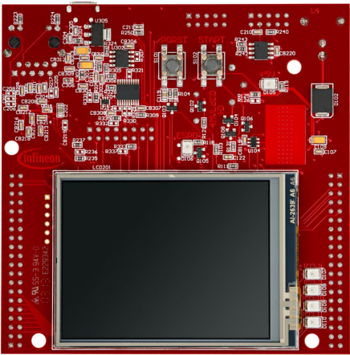
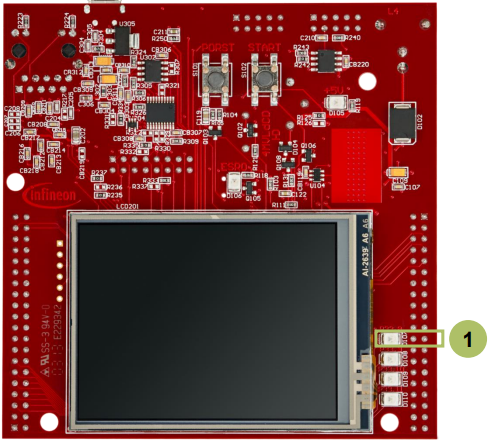

  

# PMS_Power_Down_Sleep_1_KIT_TC397_TFT
The system is set into sleep mode and it is waken up by the System Timer Module (STM) every 2 seconds.

## Device  
The device used in this example is AURIX&trade; TC39xTP_A-Step.

## Board  
The board used for testing is the AURIX&trade; TC397 TFT (KIT_A2G_TC397_5V_TFT).

## Scope of work  
An STM timer generates an interrupt on the CPU0 every two seconds, switching the AURIX&trade; device from run mode to sleep mode and vice versa. A GTM timer, responsible for toggling an LED, is then allowed to go into sleep mode, thus stopping the LED from blinking. Two seconds later, the board is switched back into run mode and the LED blinks again.

## Introduction  
The System Timer (STM) is a free running 64-bit counter which can be used for timing applications requiring both high precision and long period.

Among other features, the STM has the capability to generate interrupts when its counter reaches a predefined compare value.

The Generic Timer Module (GTM) is a modular timer unit designed to accommodate many timer applications.

It has an in-built Timer Output Module (TOM) that can offer 16 independent channels to generate output signals.

Sleep Mode affects the whole system and may be entered as an unanimous decision of all the CPUs or based on a singular decision of a master CPU based on the configuration of the CPUSEL register. The CLCx.EDIS register bit is cleared for all the peripherals intended to be inactive during sleep mode.

## Hardware setup  
This code example has been developed for the board KIT_A2G_TC397_5V_TFT.

 

## Implementation

### Configuration of the GTM timer
Configuration of the GTM timer is done inside the function *initTom()* and consists of several steps:
- Enable the GTM by calling the function *IfxGtm_enable()*
- Initialize an instance of the structure *IfxGtm_Tom_Timer_Config* with its default values through the function *IfxGtm_Tom_Timer_initConfig()*
- The structure *IfxGtm_Tom_Timer_Config* allows the setting of multiple parameters in order to initialize the module, including:
  - *tom*: to define the used timer 
  - *timerChannel*: to define the used channel 
  - *clock*: to define the used CMU clock 
  - *base.frequency*: to set the timer frequency for blinking the LED
  - *base.isrPriority*: to set the Interrupt Service Routine priority
  - *base.isrProvider*: to set the Interrupt Service Routine provider
- Enable the FXU clocks by calling the function *IfxGtm_Cmu_enableClocks()*
- Initialize and activate the TOM with the given configuration through the function *IfxGtm_Tom_Timer_init()*
- Start the TOM with function *IfxGtm_Tom_Timer_run()*

The above functions can be found in the iLLD header *IfxGtm_Tom_Timer.h*.

### Configuration of the STM timer:
Configuration of the STM timer is done inside the function *initStm()* and consists of several steps:
- An instance of the *IfxStm_Timer_Config* structure is initialized with default values through the function *IfxStm_Timer_initConfig()*
- The following parameters of the configuration are modified: 
  - *base.frequency* – to define the frequency at which the interrupts are generated
  - *base.isrPriority* – to define the priority of the interrupt generated by the STM on compare match. It can be a value from 0 to 255, with 0 meaning interrupt is disabled and 255 is the highest priority
  - *base.isrProvider* – to define the service provider responsible for handling the interrupt. This can be any of the available CPUs or the DMA
  - *comparator* – to define the used comparator
- The configuration is applied to the STM via the function *IfxStm_Timer_init()* and the timer is started with the function *IfxStm_Timer_run()*

The above functions can be found in the iLLD header *IfxStm_Timer.h*.

### Function to switch between run mode and sleep mode
The function *switchMode()* enables the microcontroller to switch between run mode and sleep mode every two seconds.

To go into sleep mode, a few steps are required:
- Disable the safety endinit and the endinit protections in order to write in protected registers with *IfxScuWdt_clearSafetyEndinitInline()* and *IfxScuWdt_clearCpuEndinit()* functions from the iLLD header *IfxScuWdt.h*
- Allow the GTM to go into sleep mode and prohibit the STM to go into sleep mode with the EDISbit of the clock control register
- Set the CPU0 as CPU master to trigger a power down mode using the CPUSEL bitfield of the Standby and Wake-up Control Register 1 (PMSWCR1)
- Send a sleep mode request on CPU0 by setting the REQSLP bitfield of the CPU0 Power Management Control and Status Register (PMCSR0) to 0x2 
- Re-enable the safety endinit and the endinit protections in order to prevent writes to the protected registers with *IfxScuWdt_setSafetyEndinitInline()* and *IfxScuWdt_setCpuEndinit()*

The AURIX&trade; device goes into run mode when a generic interrupt is triggered on the CPU master (CPU0 in this training). When the STM timer generates an interrupt, after two seconds the microcontroller goes into run mode automatically.

### Interrupt Service Routines (ISRs) of the GTM and STM timers
The GTM TOM ISR implemented in this example contains the following steps:
- Clear the timer event with the function *IfxGtm_Tom_Timer_acknowledgeTimerIrq()* to allow another event to be generated
- Change the LED state by calling the function *IfxPort_togglePin()*

The STM ISR implemented in this example contains the following steps:
- Re-enable interrupts generation with the function *IfxCpu_enableInterrupts()* as ISR disables it
- Clear the timer event with the function *IfxStm_Timer_acknowledgeTimerIrq()* to allow an other event generation
- Call the *switchMode()* function to switch between run mode and sleep mode

## Compiling and programming  
Before testing this code example:  
- Power the board through the dedicated power connector
- Connect the board to the PC through the USB interface  
- Build the project using the dedicated Build button  or by right-clicking the project name and selecting "Build Project"  
- To flash the device and immediately run the program, click on the dedicated Flash button 

## Run and Test
After code compilation and flashing the device, perform the following steps:
- Check LED D107 (1). This LED is blinking during run mode and stops blinking in sleep mode (the two modes are alternating every two seconds)
- When the AURIX&trade; device goes into sleep mode, the GTM timer responsible for blinking the LED stops and as a result, the LED remains in the last state at which it was in the run mode, either on or off

**Note**: In order to observe the behavior, start all cores.

## References  

AURIX&trade; Development Studio is available online:  
- <https://www.infineon.com/aurixdevelopmentstudio>  
- Use the "Import..." function to get access to more code examples  

More code examples can be found on the GIT repository:  
- <https://github.com/Infineon/AURIX_code_examples>  

For additional trainings, visit our webpage:  
- <https://www.infineon.com/aurix-expert-training>  

For questions and support, use the AURIX&trade; Forum:  
- <https://community.infineon.com/t5/AURIX/bd-p/AURIX>  