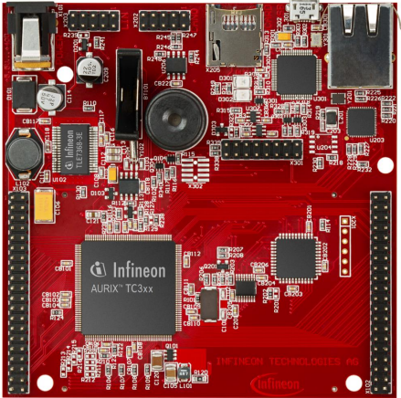
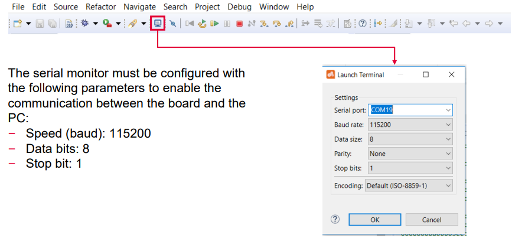
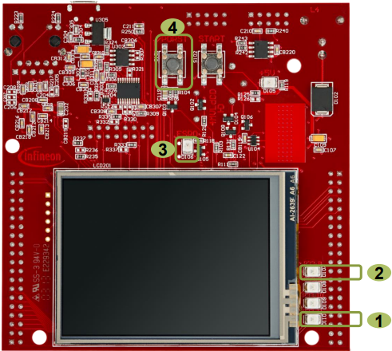
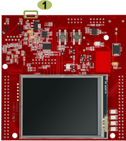
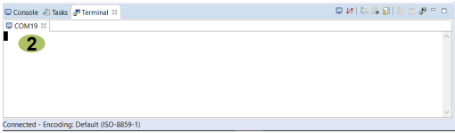

  

# PMS_Power_Down_Standby_1_KIT_TC397_TFT
Set the system to standby mode and use an external trigger signal on PinA to return to active mode.

## Device  
The device used in this example is AURIX&trade; TC39xTP_A-Step.

## Board  
The board used for testing is the AURIX&trade; TC397 TFT (KIT_A2G_TC397_5V_TFT).

## Scope of work  
This example shows how to set the microcontroller in power saving mode standby. The standby mode is triggered via a SW request by writing into the Power Management Control and Status Register. The system is woken up from standby mode using PinA (port pin 14.1) and can be controlled by a terminal program.

## Introduction  
The Power Management System (PMS) allows the activation of power down modes so that the AURIX&trade; microcontroller system operates with the minimum required power for the corresponding application state.

The most significant power saving mode is the Standby mode. In this mode the entire microcontroller system is switched off besides some system blocks that constitute the Standby domain.

Waking-Up from standby mode re-powers the microcontroller core domain thus the application software restarts.

## Hardware setup  
This code example has been developed for the board KIT_A2G_TC397_5V_TFT.

 

## Implementation

### Standby mode implementation:
The routine *runStandby()* is used to put the microcontroller system in Standby mode
- Two configurations in terms of indication are done using LED110 and LED107
  - The LED110 connected to pin 13.3 is switched on and indicates the start of the example
  - The LED107 connected to pin 13.0 is switched off
- The application waits for approximately four seconds
- Then LED107 is switched on to signal that Standby mode is going to be entered in approximately one second

The routine *stepIntoStandbyMode()* executes the following sequence to enter the Standby mode
1. Clear Safety Endinit and CPU Endinit
2. Clear all status flags within PMSWSTAT register
3. Write the Wake-Up configuration into control status register PMSWCR0
  - Configure PinA connected to port pin 14.1 as the desired Wake-Up trigger request
  - Enable to WakeUp on PORST
  - Configure PinA Wake-Up trigger to react on any edge
  - Disable ESR0 as a Wake-Up trigger
  - Disable Wake-Up on VEXT ramp-up
4. Request Standby mode by writing into the register PMCSR0
5. Set Safety Endinit and CPU Endinit

**Note**: The standby mode becomes active as soon as the CPU Endinit is set.

## Compiling and programming  
Before testing this code example:  
- Power the board through the dedicated power connector
- Connect the board to the PC through the USB interface  
- Build the project using the dedicated Build button  or by right-clicking the project name and selecting "Build Project"  
- To flash the device and immediately run the program, click on the dedicated Flash button 

## Run and Test
For this training, a serial monitor is required for bringing the microcontroller out of standby mode. The monitor can be opened inside the AURIX™ Development Studio using the following icon:

After code compilation and flashing the device, observe the LED D110, LED D107 and LED D106 behavior.

### Stepping in Standby:
- LED D110 is (1) ON immediately after reset
- Approximately after four seconds, LED D107 (2) turns on to signal that in one second Standby mode is going to be entered
- In Standby mode, all LEDs are off as all ports are set in their reset state. The LED D106 (3) turns on signaling Standby mode entered as the ESR0 is configured as reset output and held low during Standby mode

**Note**: 'Stepping in Standby' can be repeated by pressing PORST button (4).

### Returning from Standby:
- The board must be connected to the PC through the USB port (1)
- The configured Wake-Up trigger is PinA connected to port pin 14.1 and can be controlled using the terminal window
- Open the terminal window and send anything out (2)
- Observe that the microcontroller returns from Standby mode similar as it would start from a reset and the application code is executed again. Then the application sends the microcontroller back into Standby mode

## References  

AURIX&trade; Development Studio is available online:  
- <https://www.infineon.com/aurixdevelopmentstudio>  
- Use the "Import..." function to get access to more code examples  

More code examples can be found on the GIT repository:  
- <https://github.com/Infineon/AURIX_code_examples>  

For additional trainings, visit our webpage:  
- <https://www.infineon.com/aurix-expert-training>  

For questions and support, use the AURIX&trade; Forum:  
- <https://community.infineon.com/t5/AURIX/bd-p/AURIX>  