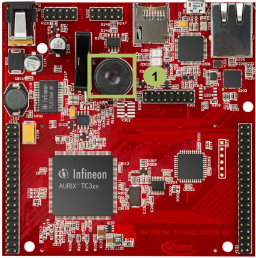
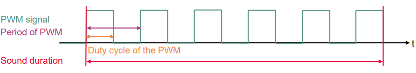

  

# PWM_Buzzer_1_KIT_TC397_TFT
The GTM unit is used to play a PWM-controlled song with a piezo buzzer.

## Device  
The device used in this example is AURIX&trade; TC39xTP_A-Step.

## Board  
The board used for testing is the AURIX&trade; TC397 TFT (KIT_A2G_TC397_5V_TFT).

## Scope of work  
The generated PWM (Pulse-Width Modulation) signal is controlled by timer TOM1 of the GTM block. The signal drives the piezo buzzer via the pin 0 of the port 33.

## Introduction  
The Generic Timer Module (GTM) is a modular timer unit designed to accommodate many timer applications.

The Timer Output Module (TOM), which is part of the GTM, offers sixteen independent channels to generate output signals.

The Clock Management Unit (CMU) is responsible for clock generation of the GTM. The Fixed Clock Generation (FXU), subunit of the CMU, provides five predefined non-configurable clocks for the TOM submodules.

## Hardware setup  
This code example has been developed for the board KIT_A2G_TC397_5V_TFT.

The piezo buzzer (1) is used for this example.

 

## Implementation

### Initialization of PWM Buzzer
The initialization of the PWM Buzzer is done once in the setup phase by calling the function *initPWMBuzzer()*, which contains the following steps:
- Initialize a time variable
- Enable the GTM by calling the function *IfxGtm_enable()*
- Enable the FXU clocks by calling the function *IfxGtm_Cmu_enableClocks()*
- Initialize the timer configuration with default values by calling the function *IfxGtm_Tom_Timer_initConfig()*
- Set the timer configuration variable *timerCfg* with the user defined values
- Initialize the timer through the iLLD function *IfxGtm_Tom_Timer_init()*
- Enable the GTM TOM channel 4 by calling the iLLD function *IfxGtm_Tom_Tgc_enableChannelsUpdate()*

All the functions used for the configuration of the PWM Buzzer are provided by the iLLD header *IfxGtm_Tom_Pwm.h*.

### Configuration of the variable timerCfg
Setting of the *timerCfg* variable is done once in the setup phase in the function *initPWMBuzzer()* with the following steps:
- Set TOM1 as the timer for generating the PWM signal *timerCfg.tom = IfxGtm_Tom_1*
- Set the channel 4 of TOM1 as the channel used for the timer *timerCfg.timerChannel = IfxGtm_Tom_Ch_4*
- Select the clock source *timerCfg.clock = IfxGtm_Tom_Ch_ClkSrc_cmuFxclk2*
- Set port and pin for PWM output *timerCfg.triggerOut = &IfxGtm_TOM1_4_TOUT22_P33_0_OUT*
- Enable TOM channel *timerCfg.base.trigger.enabled = TRUE*
- Enable TOM channel output *timerCfg.base.trigger.outputEnabled = TRUE*
- Starting PWM with rising edge *timerCfg.base.trigger.risingEdgeAtPeriod = TRUE*

### Playing song
The song is played by repeatedly calling the function *playTone()* for each note, which contains the following steps:
1. Set the PWM frequency (in Hz) through the iLLD function *IfxGtm_Tom_Timer_setFrequency()*
2. Set the volume level by calling the function *setVolume()*. This is done by setting the PWM duty cycle with the function *IfxGtm_Tom_Timer_setTrigger()*
3. Start the timer with the iLLD function *IfxGtm_Tom_Timer_run()*
4. Wait until the end of the note through the service function *waitTime()*
5. Stop the timer with the iLLD function *IfxGtm_Tom_Timer_stop()*

 

## Compiling and programming  
Before testing this code example:  
- Power the board through the dedicated power connector
- Connect the board to the PC through the USB interface  
- Build the project using the dedicated Build button  or by right-clicking the project name and selecting "Build Project"  
- To flash the device and immediately run the program, click on the dedicated Flash button 

## Run and Test
After code compilation and flashing the device, listen to the Buzzer (1) which should play the sound from the game Super Mario.

## References  

AURIX&trade; Development Studio is available online:  
- <https://www.infineon.com/aurixdevelopmentstudio>  
- Use the "Import..." function to get access to more code examples  

More code examples can be found on the GIT repository:  
- <https://github.com/Infineon/AURIX_code_examples>  

For additional trainings, visit our webpage:  
- <https://www.infineon.com/aurix-expert-training>  

For questions and support, use the AURIX&trade; Forum:  
- <https://community.infineon.com/t5/AURIX/bd-p/AURIX>  