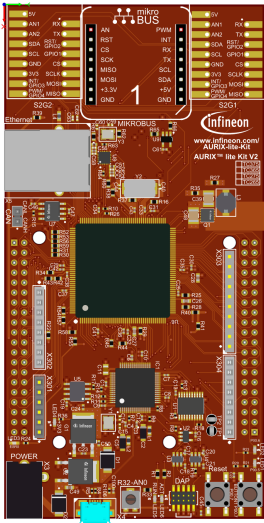
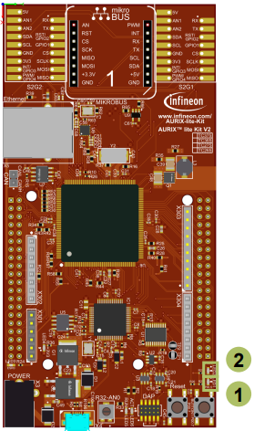
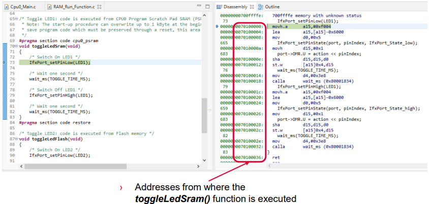

  

# RAM_Run_Function_1_KIT_TC375_LK
A function is stored and executed from SRAM.

## Device  
The device used in this example is AURIX&trade; TC37xTP_A-Step.

## Board  
The board used for testing is the AURIX&trade; TC375 LK (KIT_A2G_TC375_LK).

## Scope of work  
This example implements twice the same function which toggles an LED with a wait loop. One function is implemented to be executed from SRAM and the other one from Flash memory. 
The SRAM function is toggling LED1 (P00.5), while the flash function is toggling LED2 (P00.6).

## Introduction  
The TriCore&trade; architecture supports closely coupled program and data SRAM memory known as Program Scratch Pad RAM (PSPR) and Data Scratch Pad RAM (DSPR). 

Program & Data Scratch-Pad RAM (PSPR/DSPR): Allows the CPU to access code/data faster compared to the other RAMs and Flashes.

If a code is programmed to be executed from SRAM memory, it is copied from Flash to SRAM by the Start-up Software (SSW) code.

## Hardware setup  
This code example has been developed for the board KIT_A2G_TC375_LITE.

  

## Implementation  

### SRAM code section
The linker file “*Lcf_Tasking_Tricore_Tc.lsl*” contains the different memory sections used by the AURIX&trade; microcontroller. In this example, PSPR0 (*cpu0_psram*) is used. 

**Note**: The start-up procedure can overwrite up to 1 kByte at the beginning of CPU0 PSPR. If the application needs to save program code which must be preserved through a reset, this area (the first 1 kByte) should not be used.

### Locating function code in a specific memory section
The *pragma* compiler keyword with the attribute *section code “<section_identifier>”* is used to specify the memory section from which the implemented function code will be fetched and executed.

The *section code restore* attribute is used after the function implementation to ensure that next implemented functions will be located in the default code memory section (Flash memory).

### LED Toggling
Two functions are implemented, *toggleLedSram()* and *toggleLedFlash()*, to toggle two LEDs from different memory regions.

Using the previously mentioned *pragma* compiler keyword, the *toggleLedSram()* can be executed from PSPR memory.

Both functions are implemented as following:
- Switch On the LED by calling *IfxPort_setPinLow()*
- Wait for a one second delay
- Switch Off the LED by calling *IfxPort_setPinHigh()*
- Wait for a one second delay

The above Port functions can be found in the iLLD header *IfxPort.h*.

**Note**: The LEDs on the used board are low-level active.

## Compiling and programming  
Before testing this code example:  
- Power the board through the dedicated power connector
- Connect the board to the PC through the USB interface  
- Build the project using the dedicated Build button  or by right-clicking the project name and selecting "Build Project"  
- To flash the device and immediately run the program, click on the dedicated Flash button 

## Run and Test   
After code compilation and flashing the device, perform the following:
- Check that LED1 (1) and LED2 (2) are toggling 

  

Additionally, the execution from RAM can be checked by adding a breakpoint inside the *toggleLedSram()* function and verify in the disassembly window of the debugger that the CPU is executing it from PSPR (Addresses segment 7H).

 

## References  

AURIX&trade; Development Studio is available online:  
- <https://www.infineon.com/aurixdevelopmentstudio>  
- Use the "Import..." function to get access to more code examples  

More code examples can be found on the GIT repository:  
- <https://github.com/Infineon/AURIX_code_examples>  

For additional trainings, visit our webpage:  
- <https://www.infineon.com/aurix-expert-training>  

For questions and support, use the AURIX&trade; Forum:  
- <https://community.infineon.com/t5/AURIX/bd-p/AURIX>  