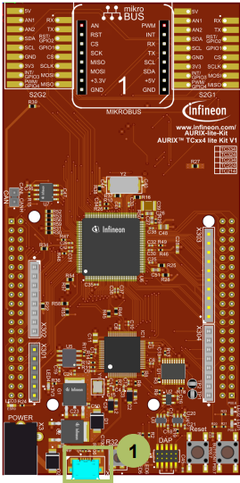
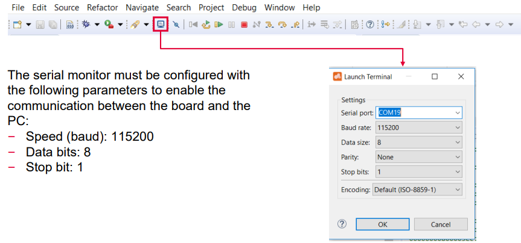
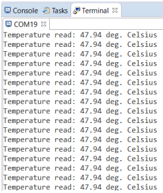

  

# SCU_Die_Temp_Sensor_1_KIT_TC334_LK
The die temperature is measured by an internal sensor and printed on a terminal program.

## Device  
The device used in this example is AURIX&trade; TC33xTP_A-Step.

## Board  
The board used for testing is the AURIX&trade; TC334 lite Kit (KIT_A2G_TC334_LITE).

## Scope of work  
The internal Die Temperature Sensor (DTS) is continuously read in an infinite loop. When a new temperature result is available, an interrupt service routine (ISR) is triggered. The ISR notifies the availability of a new die temperature value by setting a flag, which is used to start printing the temperature via UART communication using the ASCLIN module. The temperature value can be read by using a terminal program connected to the virtual COM port of the board/kit.

## Introduction  
The Die Temperature Sensor (DTS) is an internal sensor to measure the microcontroller’s chip temperature.
It generates a measurement value that indicates the current temperature of the die.

Among other features, the DTS has the capability to trigger an interrupt when a new measurement is available.

## Hardware setup  
This code example has been developed for the board KIT_A2G_TC334_LITE.

The board should be connected to the PC through the USB port (1).

 

## Implementation

### Configure the ASCLIN
Configuration of the ASCLIN module for UART communication is done in the setup phase by initializing an instance of the *IfxAsclin_Asc_Config* structure with the following parameters:
- *baudrate* – structure to set the actual communication speed in bit/s
- *interrupt* – structure to set: 
  - interrupt priorities for transmit, receive and error events (*txPriority*, *rxPriority* and *erPriority*)
  - *typeOfService* – defines which service provider is responsible for handling the interrupt, which can be any of the available CPUs, or the DMA 
- *pins* – structure to set which GPIOs port pins are used for the communication
- *rxBuffer*, *rxBufferSize*, *txBuffer*, *txBufferSize* – to configure the buffers that will hold the incoming/outgoing data

The function *IfxAsclin_Asc_initModuleConfig()* fills the configuration structure with default values and *IfxAsclin_Asc_initModule()* initializes the module with the user configuration. 
The standard interface is configured with the function *IfxAsclin_Asc_stdIfDPipeInit()*.

All the above functions can be found in the iLLD header *IfxAsclin_Asc.h*.

### Configure the DTS
Configuration of the DTS is done by initializing an instance of the *IfxDts_Dts_Config* structure, which contains the following fields:
- *isrPriority* – priority of the interrupt triggered by DTS when a new measurement is available (it can be a value from 0 to 255, with 0 meaning interrupt is disabled, and 255 is the highest priority) 
- *isrTypeOfService* – defines which service provider is responsible for handling the interrupt, which can be any of the available CPUs, or the DMA 
- *lowerTemperatureLimit* – to set the lower temperature limit for DTS measurements in Celsius
- *upperTemperatureLimit* – to set the upper temperature limit for DTS measurements in Celsius 

An SMU alarm will be triggered if the measurement result is outside these limits.

The function *IfxDts_Dts_initModuleConfig()* fills the configuration structure with default values and *IfxDts_Dts_initModule()* function initializes the module with the user configuration.

Both functions are used in the DTS code section, and can be found in the iLLD header *IfxDts_Dts.h*.

### Read measurements from the DTS
When a measurement is available, an interrupt service request is generated and the temperature can then be read with the function *IfxDts_Dts_getTemperatureCelsius()*.

All functions used for the DTS measurements can be found in the iLLD header *IfxDts_Dts.h*.

## Compiling and programming  
Before testing this code example:  
- Power the board through the dedicated power connector
- Connect the board to the PC through the USB interface  
- Build the project using the dedicated Build button  or by right-clicking the project name and selecting "Build Project"  
- To flash the device and immediately run the program, click on the dedicated Flash button 

## Run and Test
For this training, a serial monitor is required for visualizing the values of the DTS. The monitor can be opened inside the AURIX&trade; Development Studio using the following icon:

After code compilation and flashing the device, perform the following steps:
- Open the terminal program with the given configuration and connect
- Check the temperature measurements

## References  

AURIX&trade; Development Studio is available online:  
- <https://www.infineon.com/aurixdevelopmentstudio>  
- Use the "Import..." function to get access to more code examples  

More code examples can be found on the GIT repository:  
- <https://github.com/Infineon/AURIX_code_examples>  

For additional trainings, visit our webpage:  
- <https://www.infineon.com/aurix-expert-training>  

For questions and support, use the AURIX&trade; Forum:  
- <https://community.infineon.com/t5/AURIX/bd-p/AURIX>  