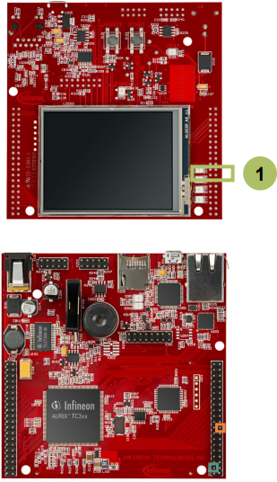

  

# SCU_Emergency_Stop_1_KIT_TC397_TFT
This example shows how to trigger an emergency stop via an external signal and how port pins can be set to a defined state in this case.

## Device  
The device used in this example is AURIX&trade; TC39xTP_A-Step.

## Board  
The board used for testing is the AURIX&trade; TC397 TFT (KIT_A2G_TC397_5V_TFT).

## Scope of work  
The LED D107, which is driven by the port pin P13.0, is blinking until an external signal triggers an emergency stop and sets the pin to emergency stop mode.

## Introduction  
The System Control Unit (SCU) contains miscellaneous control registers associated with other functions such as controlling Application Test Mode and chip identification.

The Emergency Stop (EMS) is one of these functions. It provides a fast reaction to an emergency without the intervention of the software.

An emergency stop can be triggered by a transition on the port pin state which is configured as the EMS input or by an alarm event.

The Emergency Stop control logic for the port pins can operate in two modes:
- Synchronous Mode: emergency case is activated by hardware and released by software (default and used in this training)
- Asynchronous Mode: emergency case is activated and released by hardware

## Hardware setup  
This code example has been developed for the board KIT_A2G_TC397_5V_TFT.
Connect the emergency stop port pin P33.8 to the ground via a jumper.

  

## Implementation  

### Configuring port pin
Configuration of the port pins for emergency stop input and for the LED are also done in the function *initScuEmergency()* with the following steps:
- Call the iLLD function *IfxPort_setPinMode()* with *IfxPort_Mode_inputPullDown* as parameter for the input to configure the pin as input.
- Call the iLLD function *IfxPort_setPinMode()* with *IfxPort_Mode_outputPushPullGeneral* as parameter for the input to configure the LED as output.
- Enable the emergency stop for the LED with the function *IfxPort_setESR()*.

### Toggling the LED
The LED is toggled in the function *toggleLED()*, which contains a call of the iLLD function *IfxPort_togglePin()*.

All of the above functions, called inside *initSCUEmergency()* and *toggleLED()*, are contained in the iLLD header *IfxPort.h*.

## Compiling and programming  
Before testing this code example:  
- Power the board through the dedicated power connector
- Connect the board to the PC through the USB interface  
- Build the project using the dedicated Build button  or by right-clicking the project name and selecting "Build Project"  
- To flash the device and immediately run the program, click on the dedicated Flash button 

## Run and Test
After code compilation and flashing the device, perform the following steps:
- Observe the LED D107 (1) which should be blinking
- Switch the emergency pin state P33.8 from low to high by connecting it to V_UC(+5V) via the jumper in order to trigger the emergency stop
- Observe the LED D107 (1), which should be off

  

## References  

AURIX&trade; Development Studio is available online:  
- <https://www.infineon.com/aurixdevelopmentstudio>  
- Use the "Import..." function to get access to more code examples  

More code examples can be found on the GIT repository:  
- <https://github.com/Infineon/AURIX_code_examples>  

For additional trainings, visit our webpage:  
- <https://www.infineon.com/aurix-expert-training>  

For questions and support, use the AURIX&trade; Forum:  
- <https://community.infineon.com/t5/AURIX/bd-p/AURIX>  