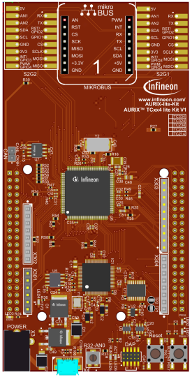
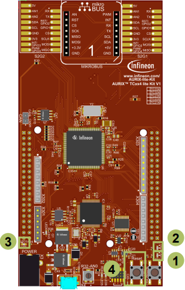

  

# SCU_Reset_Detection_1_KIT_TC334_LK
This example shows how to detect the source of the last reset (power-on reset, watchdog reset, etc.).

## Device  
The device used in this example is AURIX&trade; TC33xTP_A-Step.

## Board  
The board used for testing is the AURIX&trade; TC334 lite Kit (KIT_A2G_TC334_LITE).

## Scope of work  
The AURIX&trade; TC3xx devices can be reset by various reset sources. The application software is able to determine the source of the last reset based on a routine that evaluates the related reset special function registers. According to the type of reset, one or two LEDs are switched on.

## Introduction  
Resets can be configured and determined in the Reset Control Unit (RCU), belonging to the System Control Unit (SCU)
Various reset triggers are available, such as: 
- Supply Monitor
- Embedded Voltage Regulators (EVRs)
- Power-On Reset (PORST)
- External Service Request (ESRx)
- Debug interface
Consequently, different reset types can be derived, such as: 
- Cold-/Warm-Power-On Reset
- System Reset
- Application Reset
- Debug Reset
- Module Reset

## Hardware setup  
This code example has been developed for the board KIT_A2G_TC334_LITE.

  

## Implementation  

### Reset Detection
To get information about the last occurred reset, the function *IfxScuRcu_evaluateReset()* is called inside *detectResetSource()*. The returned value is a data structure comprising elements such as *resetType* and *resetTrigger*:
- The *resetType* specifies the type of the last reset (e.g. Cold Power-On Reset, System Reset, Application Reset or Warm Power-On Reset)
- The *resetTrigger* specifies the source of the last reset. For instance, the source can be a Power-On Reset (pressing the PORST-Button), a SW triggered reset or a reset triggered by the debugger or any voltage supervision monitor

The function *IfxScuRcu_evaluateReset()* evaluates both the *RSTSTAT* and *RSTCON* registers:
- The *RSTSTAT* register is evaluated with regard to which reset bits are set, respectively, cleared. Firstly, the warm reset status bits comprising *ESRx*, *SMU*, *SW*, *STMx* and *CBx* are evaluated. Secondly, the cold reset status bits comprising *EVRC*, *EVR33*, *SWD* and *STBYR* are evaluated if none of the warm reset status bits are set. Finally, the *PORST* bit is evaluated
- The *RSTCON* register is evaluated to determine the type of reset based on the trigger configuration

Based on the *resetType* of the *lastReset*, LED1, LED2 or both are switched on.

Furthermore, the function *detectResetSource()* clears the Cold Power-On sticky bits using the function *IfxScuRcu_clearColdResetStatus()*. Those bits are not cleared automatically and must be explicitly cleared by the application.

The functions *IfxScuRcu_evaluateReset()* and *IfxScuRcu_clearColdResetStatus()* can be found in the iLLD header *IfxScuRcu.h*.

### Reset Trigger
The function *triggerSwReset()* triggers either a software Application Reset or a software System Reset, depending on the macro *RESET_SRC* given as parameter.

To trigger a software reset, the request trigger in the Reset Configuration Register must be configured first. This is done through the function *IfxScuRcu_configureResetRequestTrigger()*.

Then, the CPU EndInit protection is cleared with the function *IfxScuWdt_clearCpuEndinit()* and the software reset is triggered calling *IfxCpu_triggerSwReset()*.

Finally, the CPU EndInit protection should be set again, but this instruction cannot be reached since a software reset is triggered right before.

The function *IfxScuRcu_configureResetRequestTrigger()* can be found in the iLLD header *IfxScuRcu.h*.  
The function *IfxScuWdt_clearCpuEndinit()* can be found in the iLLD header *IfxScuWdt.h*.  
The function *IfxCpu_triggerSwReset()* can be found in the iLLD header *IfxCpu.h*.

## Compiling and programming  
Before testing this code example:  
- Power the board through the dedicated power connector
- Connect the board to the PC through the USB interface  
- Build the project using the dedicated Build button  or by right-clicking the project name and selecting "Build Project"  
- To flash the device and immediately run the program, click on the dedicated Flash button 

## Run and Test
After code compilation and flashing the device, press the PORST button (4) and observe the following behavior:
- Both LED1 (1) and LED2 (2) are turned on for 500 ms because a Warm Power-On reset is detected
- Then, the board is reset by software, therefore the LED3 (3) is blinked once
- Finally, depending on the last occurred reset (given by the *RESET_SRC* macro) the LED1 (1) or the LED2 (2) is turned on

The *RESET_SRC* macro is firstly set to *APPLICATION_RESET*. To trigger a system reset, change it to *SYSTEM_RESET*, re-flash the code, press the PORST button (4) and check that LED2 (2) is switched on after both LED1 (1) and LED2 (2).

  

## References  

AURIX&trade; Development Studio is available online:  
- <https://www.infineon.com/aurixdevelopmentstudio>  
- Use the "Import..." function to get access to more code examples  

More code examples can be found on the GIT repository:  
- <https://github.com/Infineon/AURIX_code_examples>  

For additional trainings, visit our webpage:  
- <https://www.infineon.com/aurix-expert-training>  

For questions and support, use the AURIX&trade; Forum:  
- <https://community.infineon.com/t5/AURIX/bd-p/AURIX>  