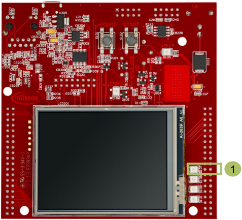
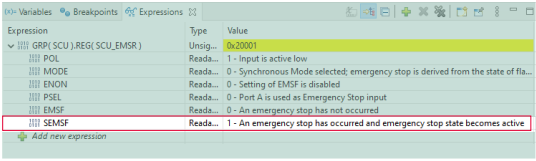

  

# SCU_Emergency_Stop_Alarm_1_KIT_TC397_TFT
The SMU triggers an alarm, which has, as preconfigured reaction, an interrupt and a port emergency stop. The interrupt turns on an LED.

## Device  
The device used in this example is AURIX™ TC39xTP_A-Step.

## Board  
The board used for testing is the AURIX™ TC397 TFT (KIT_A2G_TC397_5V_TFT).

## Scope of work  
The Safety Management Unit (SMU) is configured to trigger an interrupt if an internal software alarm occurs. In case of an alarm, an LED is turned on inside the Interrupt Service Routine and the port emergency stop is activated.

## Introduction  
The Safety Management Unit (SMU) is a central and modular component of the safety architecture providing a generic interface to manage the behavior of the microcontroller under the presence of faults.

The SMU centralizes all the alarm signals related to the different hardware and software-based safety mechanisms.

Each alarm can be individually configured to trigger internal or external actions.

The SMU, in combination with the embedded safety mechanisms, is able to detect and report more than 99% of the critical failure modes.

In this example, Software Alarm 0 is used to trigger the Port Emergency Stop (PES).

## Hardware setup  
This code example has been developed for the board KIT_A2G_TC397_5V_TFT.

LED D107 (1) is used for this example.

  

## Implementation  

### Configure the SMU module
The configuration of the SMU is done once with the function *config_SMU_Emergency_Stop()*, which contains the followings steps:
1. To modify the SMU registers, the SMU module has to be unlocked with the function *IfxSmu_unlockConfigRegisters()*. After modification, the SMU registers have to be locked again using the function *IfxSmu_lockConfigRegisters()*
2. To modify SMU configuration registers, it is required to clear and set the Safety ENDINIT protection. This is done with the functions *IfxScuWdt_clearSafetyEndinit()* and *IfxScuWdt_setSafetyEndinit()*
3. The Alarm Global Configuration register (*SMU_AGC*) provides the software interface to control how the SMU triggers interrupt requests to the interrupt router. By setting the *IGCS0* bit field to *1*, SMU Interrupt Request 0 is triggered
4. Enable and configure the PES in order to select IGCS0 for the activation of the PES
5. The function IfxSmu_setAlarmAction() configures the alarm’s behavior by writing a 3-bit code to the three Alarm Configuration Registers associated to the specific alarm and its group. In this example, the software alarm 0 (*IfxSmu_Alarm_Software_Alarm0*) and the Interrupt Generation Configuration Set 0 (*IfxSmu_InternalAlarmAction_igcs0*) are selected. The iLLD function itself selects the group based on the above mentioned parameters
6. Configure and enable the SMU Service Request 0 with the functions *IfxSrc_init()* and *IfxSrc_enable()*
7. Start the SMU State Machine (SSM) with the function *IfxSmu_activateRunState()*

The functions above are provided by the iLLD headers *IfxSmu.h* and *IfxSrc.h*.

### LED configuration
The port pin with the connected LED is configured to push-pull output mode by calling the function *IfxPort_setPinMode()* with the parameter *IfxPort_Mode_outputPushPullGeneral* (enumerated type value).

With the function *IfxPort_setPinState()*, using the enumerated type value *IfxPort_State_high*, the LED is turned off as default state.

All functions above are provided by the iLLD header *IfxPort.h*.

### Triggering of the alarm
The Software Alarm 0 can be triggered with the function *IfxSmu_setAlarmStatus()*, provided by the iLLD header *IfxSmu.h*.

### The Interrupt Service Routine (ISR)
The alarm status flag reset is implemented inside the ISR triggered by the function *IfxSmu_clearAlarmStatus()*. Furthermore, the bit relative to the executed alarm mechanism in the Alarm Executed Status (AEX) register needs to be cleared, which is done by the function *IfxSmu_clearAlarmExecutedStatus()*. These functions are provided by the iLLD header *IfxSmu.h*.

The LED is turned on inside the ISR to indicate the successful configuration of the SMU and the triggering of the interrupt. This is done by setting the port pin of the connected LED by using the function *IfxPort_setPinState()* from the iLLD header *IfxPort.h*.

The method implementing the ISR needs to be assigned a CPU core responsible for its execution done by the function *IfxSrc_init()*. The method implementing the ISR needs to be assigned a priority via the macro *IFX_INTERRUPT(isr, vectabNum, priority)*.

## Compiling and programming  
Before testing this code example:  
- Power the board through the dedicated power connector
- Connect the board to the PC through the USB interface  
- Build the project using the dedicated Build button  or by right-clicking the project name and selecting "Build Project"  
- To flash the device and immediately run the program, click on the dedicated Flash button 

## Run and Test
After code compilation and flashing the device, perform the following steps:
- The LED D107 (1) should be ON
- Suspend the program to watch the *SCU_EMSR* register
- The *SEMSF* shows that an emergency stop has occurred

  

## References  

AURIX™ Development Studio is available online:  
- <https://www.infineon.com/aurixdevelopmentstudio>  
- Use the "Import..." function to get access to more code examples  

More code examples can be found on the GIT repository:  
- <https://github.com/Infineon/AURIX_code_examples>  

For additional trainings, visit our webpage:  
- <https://www.infineon.com/aurix-expert-training>  

For questions and support, use the AURIX&trade; Forum:  
- <https://community.infineon.com/t5/AURIX/bd-p/AURIX>  