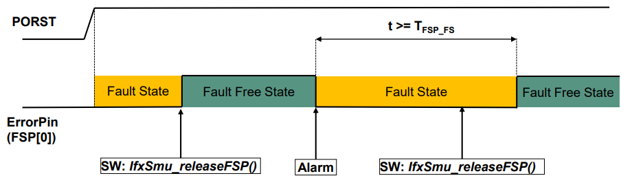
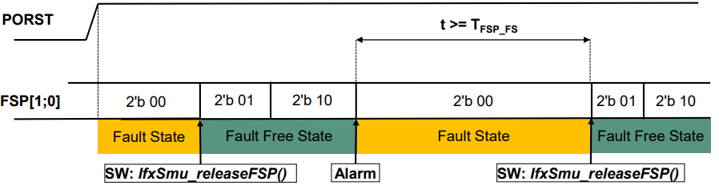
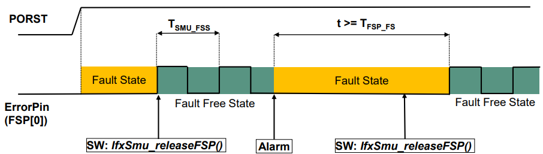
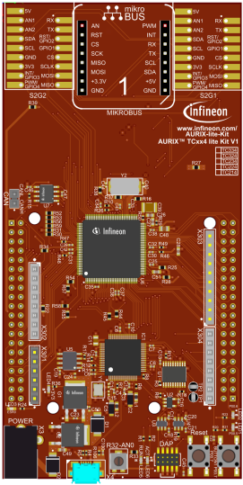
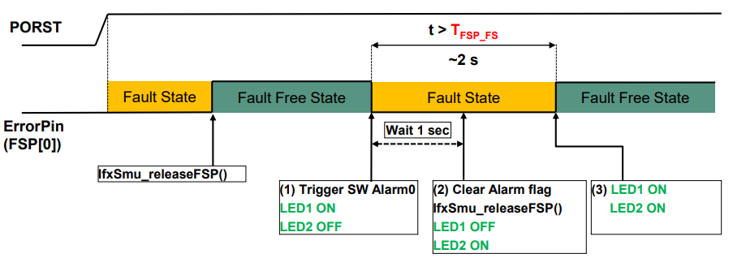
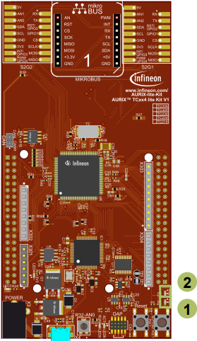
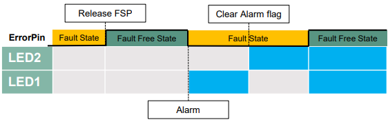
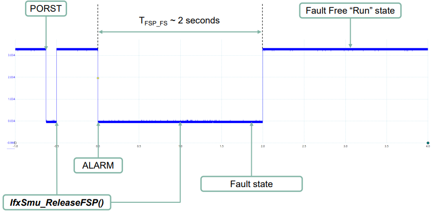

  

# SMU_Fault_Signaling_1_KIT_TC334_LK
The Fault Signaling Protocol (FSP) pin is configured by the SMU to signal a fault by changing the state of the port pin P33.8.

## Device  
The device used in this example is AURIX&trade; TC33xTP_A-Step.

## Board  
The board used for testing is the AURIX&trade; TC334 lite Kit (KIT_A2G_TC334_LITE).

## Scope of work  
During initialization the FSP is set to fault free state, indicated by a high level of the port pin P33.8. The software triggers an alarm that leads to the FSP fault state, thus the port pin P33.8 switches to low level state. After one second from triggering the alarm, the FSP release command is sent by software. The port pin P33.8 state switches to high level after the command is sent.

## Introduction  
The Safety Management Unit (SMU) is a central and modular component of the safety architecture providing a generic interface to manage the behavior of the microcontroller under the presence of faults.

The SMU centralizes all the alarm signals related to the different hardware- and software-based safety mechanisms.

The SMU implements a Fault Signaling Protocol (FSP) reporting internal faults to the external environment.

Each individual alarm can be configured to activate the fault signaling protocol.

Once configured, the FSP protocol drives the P33.8 port pin to signal the internal state.

The FSP has three states:
- The *Power-on Reset* state, after Power-on Reset the SMU is disconnected from the ports and the SMU FSP output shall be the Fault State
- The *Fault-free State*
- The *Fault State*

The FSP can be configured using the following modes:
- *Bi-stable fault signaling protocol*: single pin output (push-pull active low configuration using FSP[0]), also called Error Pin
- *Time dual rail protocol*: two signals to define a logical state
- *Time switching protocol*: single-bit timed protocol using FSP[0]

**Note**: FSP[0] is the bit 0 of the SMU_STS.FSP bit field, it reflects the state of the ErrorPin (port pin P33.8) driven to the external environment.

### Bi-stable fault signaling protocol
  

After Power-on Reset FSP[0] = 0, FSP is in the fault state.
After configuration, the SW must set the fault free state FSP[0] = 1.
If an alarm, which is configured to trigger the FSP, is detected, the FSP immediately enters the fault state, FSP[0] = 0, until SW calls *IfxSmu_releaseFSP()* and sets the fault free state.

**Notes**: 
After an Alarm, if an *IfxSmu_releaseFSP()* command is received within t < TFSP_FS, the command is logged and automatically executed when TFSP_FS is reached.  
The TFSP_FS is the minimum Fault state period (> 250 us), configured via the SMU_FSP register.

### Time dual rail fault signaling protocol
  

During Power-on Reset FSP[1;0] = 2’b 00, FSP is in the fault state.
After Power-on Reset FSP[1;0] = 2’b 00, FSP stays in the fault state.
After configuration, the SW must set the fault free state (*IfxSmu_releaseFSP()*).
If an alarm, which is configured to trigger the FSP, is detected, the FSP immediately enters the fault state, until SW calls *IfxSmu_releaseFSP()* and sets the fault free state.

**Notes**: 
After an Alarm, if an *IfxSmu_releaseFSP()* command is received within t < TFSP_FS, the command is logged and automatically executed when TFSP_FS is reached.
The TFSP_FS is the minimum Fault state period (> 250 us), configured via the SMU_FSP register.

### Time switching protocol
 

Same functionalities as the Bi-stable FSP (refer to previous section), with only one difference:
- In the fault free state, FSP[0] oscillates between logic level 0 and logic level 1 with the period TSMU_FSS (duty cycle 50%) configured via the SMU_FSP register

## Hardware setup  
This code example has been developed for the board KIT_A2G_TC334_LITE.

  

## Implementation  

### FSP and alarm configuration
The SMU configuration is protected against corruption. That is why, it is mandatory to unlock it before the configuration process using the *IfxSmu_unlockConfigRegisters()* function.

Call the iLLD function *IfxScuWdt_clearSafetyEndinit()* to disable the Safety Endinit protection in order to modify the SMU register.

To enable the software alarm 0 to trigger the FSP fault state set the register *SMU_AG10FSP.B.FE0* to 1.

To enable the SMU to control the PAD configuration set the register *SMU_PCTL.B.PCS* to 1.

To configure the minimum fault state time to two seconds, set the register bitfields *SMU_FSP.B.PRE1* and *SMU_FSP.B.TFSP_HIGH* with the values calculated by the function *get_FSP_timing_settings()*.

Call the iLLD function *IfxScuWdt_setSafetyEndinit()* to re-enable the Safety Endinit protection.

To enable the transition from fault state to run state call the iLLD function *IfxSmu_enableFaultToRunState()*.

The port control hardware is enabled and set by calling the iLLD function *IfxSmu_setPortControlHwEnableAndDir()*.

Then the SMU configuration is locked again using the *IfxSmu_lockConfigRegisters()* function.

The function *IfxSmu_releaseFsp()* switch the FSP state to fault free state.

**Note**: After Power-on-Reset (PORST) the FSP is in fault state.

The function *get_FSP_timing_settings()* is defined in the *SMU_Fault_Signaling.c* file while the other functions can be found in the iLLD headers *IfxSmu.h* and *IfxScuWdt.h*.

### Start the SMU state machine
The SMU state machine is launched by calling the *IfxSmu_activateRunState()* function.

The above functions can be found in the iLLD header *IfxSmu.h*.

### Configuring the LED 
The LEDs are configured and toggled by controlling the port pins to which they are connected. 

In the setup phase, the port pins are configured as output push-pull mode using the function *IfxPort_setPinMode()*.

### Configuring the FSP port pin
The FSP output port pin is configured by controlling the port pin to which it is connected.

In the setup phase, the port pin is configured as output push-pull mode using the function *IfxPort_setPinModeOutput()*. The PAD driver is configured as Automotive speed 1 using the function *IfxPort_setPinPadDriver()*.

The above functions can be found in the iLLD header *IfxPort.h*.

### Training scenario, after FSP and SMU initialization:
1. The Software Alarm 0 is triggered, using *IfxSmu_setAlarmStatus()* and the FSP enters the fault state
2. After one second:
   - The alarm flag is cleared using *IfxSmu_clearAlarmStatus()*
   - The FSP release command is sent using *IfxSmu_releaseFSP()*
3. The FSP enters the fault free state after the time TFSP_FS

**Note**: FSP mode is the Bi-stable mode (default FSP configuration)

## Compiling and programming  
Before testing this code example:  
- Power the board through the dedicated power connector
- Connect the board to the PC through the USB interface  
- Build the project using the dedicated Build button  or by right-clicking the project name and selecting "Build Project"  
- To flash the device and immediately run the program, click on the dedicated Flash button 

## Run and Test
After code compilation and flashing the device, check the behavior of LED1 (1) and LED2 (2):
- LED1 is ON when the Alarm is triggered
- LED2 is ON after one second, when the FSP release command is sent
- LED1 and LED2 are ON when the FSP enters the fault free state

  

Using an oscilloscope, it is possible to observe the ErrorPin (P33.8) status, which is driven by the FSP protocol:

## References  

AURIX&trade; Development Studio is available online:  
- <https://www.infineon.com/aurixdevelopmentstudio>  
- Use the "Import..." function to get access to more code examples  

More code examples can be found on the GIT repository:  
- <https://github.com/Infineon/AURIX_code_examples>  

For additional trainings, visit our webpage:  
- <https://www.infineon.com/aurix-expert-training>  

For questions and support, use the AURIX&trade; Forum:  
- <https://community.infineon.com/t5/AURIX/bd-p/AURIX>  