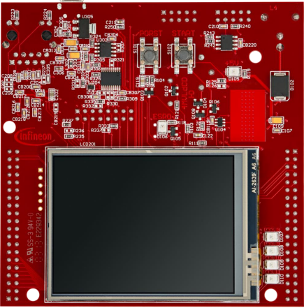
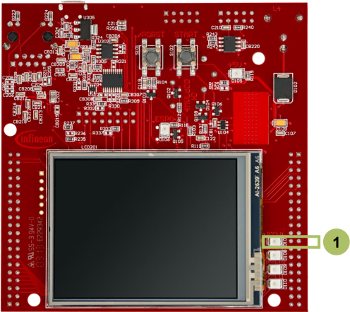

  

# SMU_Reset_Alarm_1_KIT_TC397_TFT
The SMU triggers an alarm, which resets the device as preconfigured reaction.

## Device  
The device used in this example is AURIX&trade; TC39xTP_A-Step.

## Board  
The board used for testing is the AURIX&trade; TC397 TFT (KIT_A2G_TC397_5V_TFT).

## Scope of work  
The Safety Management Unit (SMU) is configured to trigger a reset if an internal software alarm occurs.

## Introduction  
The Safety Memory Unit (SMU) is a central and modular component of the safety architecture providing a generic interface to manage the behavior of the microcontroller under the presence of faults.

The SMU centralizes all the alarm signals related to the different hardware- and software-based safety mechanisms.

Each alarm can be individually configured to trigger internal or external actions.

The SMU in combination with the embedded safety mechanisms, is able to detect and report more than 99% of the critical failure modes.

In this example, Software Alarm 0 is used to trigger a reset.

## Hardware setup  
This code example has been developed for the board KIT_A2G_TC397_5V_TFT.

  

## Implementation  

### Configure the SMU module
To trigger a reset with an SMU alarm, a few steps are required:
- The reset behavior is controlled by the reset configuration register of the System Control Unit (SCU). To modify this register, it is required to clear and set the Safety ENDINIT protection. This is done with the functions *IfxScuWdt_clearSafetyEndinitInline()* and *IfxScuWdt_setSafetyEndinitInline()*
- To enable the SMU reset, the SMU field of the Reset Configuration Register (*RSTCON*) has to be set to 0x1 for a system reset or 0x2 for an application reset (*SCU_RSTCON.B.SMU = 0x1*)
- To modify the SMU registers, the SMU module has to be unlocked with the function *IfxSmu_unlockConfigRegisters()*. After modification, the SMU registers have to be locked again using the function *IfxSmu_lockConfigRegisters()*
- The function *IfxSmu_setAlarmAction()* configures the alarm’s behavior by writing a 3-bit code to the three Alarm Configuration Registers associated to the specific alarm and its group. In this example, the software alarm 0 (*IfxSmu_Alarm_Software_Alarm0*) and the SCU reset (*IfxSmu_InternalAlarmAction_reset*) are selected. The iLLD function itself selects the group based on the above mentioned parameters
- Start the SMU State Machine (SSM) with the function *IfxSmu_activateRunState()*

The functions above are provided by the iLLD headers *IfxSmu.h* and *IfxSrc.h*.

### Triggering of the alarm
The Software Alarm 0 can be triggered with the function *IfxSmu_setAlarmStatus()* provided by the iLLD header *IfxSmu.h*.

## Compiling and programming  
Before testing this code example:  
- Power the board through the dedicated power connector
- Connect the board to the PC through the USB interface  
- Build the project using the dedicated Build button  or by right-clicking the project name and selecting "Build Project"  
- To flash the device and immediately run the program, click on the dedicated Flash button 

## Run and Test
After code compilation and flashing the device, check if LED D106 (1) is turned on.

**Note**: If the debugger is disconnected, the LED D106 will blink very fast (continuous reset).In the case the debugger is connected, the LED D106 will blink once, due to the fact that after the reset the connection to the board was re-established.

## References  

AURIX&trade; Development Studio is available online:  
- <https://www.infineon.com/aurixdevelopmentstudio>  
- Use the "Import..." function to get access to more code examples  

More code examples can be found on the GIT repository:  
- <https://github.com/Infineon/AURIX_code_examples>  

For additional trainings, visit our webpage:  
- <https://www.infineon.com/aurix-expert-training>  

For questions and support, use the AURIX&trade; Forum:  
- <https://community.infineon.com/t5/AURIX/bd-p/AURIX>  