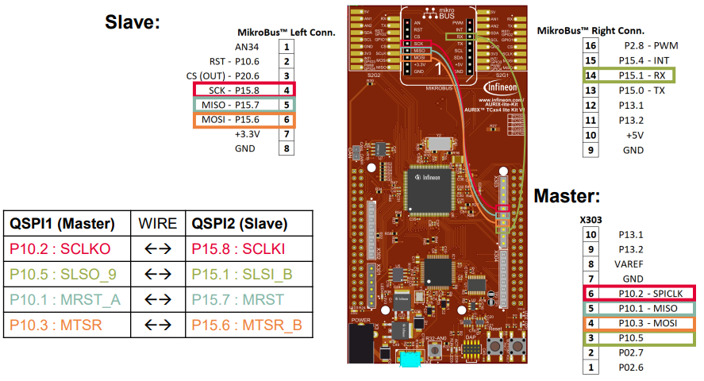
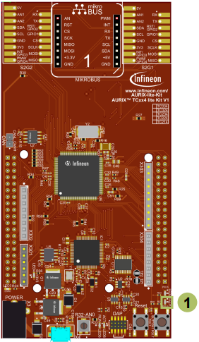

  

# SPI_CPU_1_KIT_TC334_LK
A QSPI module configured as SPI master sends five bytes to another QSPI module which is configured as SPI slave.

## Device  
The device used in this example is AURIX™ TC33xTP_A-Step.

## Board  
The board used for testing is the AURIX™ TC334 lite Kit (KIT_A2G_TC334_LITE).

## Scope of work  
QSPI2 is configured in master mode and used to send five bytes to QSPI4 configured in slave mode. The received data is read by the CPU and compared against the transmitted data. Port pin 00.5, to which LED1 is connected, indicates the successful transfer.

## Introduction  
The Queued Synchronous Peripheral Interface (QSPI) enables synchronous serial communication with external devices based on the standardized SPI-bus signals: clock, data-in, data-out and slave select.

The QSPI works in full duplex mode either as Master or Slave with up to 50 MBit/s.

## Hardware setup  
This code example has been developed for the board KIT_A2G_TC334_LITE.

  

Connect following pins as described and illustrated using wires.

 

## Implementation  

### Configuring the SPI communication
The configuration of the SPI communication is done once in the setup phase through the function *initQSPI()* in two different steps: 
- QSPI Slave initialization
- QSPI Master initialization

### QSPI Slave initialization
The initialization of the QSPI slave module is done by defining an instance of the *IfxQspi_SpiSlave_Config* structure.

The structure is filled with default values by the function *IfxQspi_SpiSlave_initModuleConfig()*.

Afterwards, the pins, ISR service provider and the priorities are set.

The function *IfxQspi_SpiSlave_initModule()* is used to initialize the QSPI slave module.

Additionally, the buffers used by the QSPI slave are initialized.

The above functions can be found in the iLLD header *IfxQspi_SpiSlave.h*.

### QSPI Master initialization
The initialization of the QSPI master module is done by defining an instance of the *IfxQspi_SpiMaster_Config* structure.

The structure is filled with default values by the function *IfxQspi_SpiMaster_initModuleConfig()*.

Afterwards, the interface operation mode, the pins, ISR service provider and the priorities are set.

The function *IfxQspi_SpiMaster_initModule()* is used to initialize the QSPI master module.

A QSPI module controls 16 communication channels, which are individually programmable. In this example, the function *initQSPI2MasterChannel()* initializes the channel 9 using an instance of the structure *IfxQspi_SpiMaster_ChannelConfig*. Afterwards, the slave select channel number is set through the parameter *sls.output* and the baud rate is modified via the parameter *base.baudrate*.

The function *IfxQspi_SpiMaster_initChannel()* is used to initialize the QSPI master channel.

Additionally, the buffers used by the QSPI master are initialized.

The above functions can be found in the iLLD header *IfxQspi_SpiMaster.h*.

### QSPI Master - Slave communication
The function *transferData()* triggers the data transfer between the SPI-Master and the SPI-Slave.

The functions *IfxQspi_SpiSlave_getStatus()* and *IfxQspi_SpiMaster_getStatus()* are used to check the status of the master and the slave in order to delay the transfer until both are free.

The function *IfxQspi_SpiSlave_exchange()* instructs the slave to receive a data stream of predefined length.

The function *IfxQspi_SpiMaster_exchange()* is called in order to instruct the master to send the data.

Finally, the function *verifyData()* checks if the data received by the Slave matches the data sent by the Master.

If no errors have occured during the communication, the LED1, connected to port pin 00.5, is turned on to signal that the transmission was successful.

### Configure and control the LEDs
The LED is turned on and off by controlling the port pin to which it is connected using methods from the iLLD headers *IfxPort.h*.

The LED port pin is configured to output push-pull mode using the function *IfxPort_setPinModeOutput()*.

During program execution, the LED is switched on and off using the functions *IfxPort_setPinLow()* and *IfxPort_setPinHigh()*.

## Compiling and programming  
Before testing this code example:  
- Power the board through the dedicated power connector
- Connect the board to the PC through the USB interface  
- Build the project using the dedicated Build button  or by right-clicking the project name and selecting "Build Project"  
- To flash the device and immediately run the program, click on the dedicated Flash button 

## Run and Test
After code compilation and programming the device, start a debug session and perform the following steps:
- Set a breakpoint to *transferData()* in the *Cpu0_main.c* and check the *spiMasterTxBuffer* and *spiSlaveRxBuffer* inside *spiBuffers* structure 
- Run the code example and check if the LED1 (1) is on (Data transmitted without errors)
- The *spiMasterTxBuffer* and *spiSlaveRxBuffer* should now show the same transmitted and received data
- Remove a cable (e.g. SCLKx), perform a Reset and re-run the application to see that the data transmission is interrupted and the LED1 (1) is off (Data transmission blocked)

**Note**: when checking the buffers’ data, the debug session must be paused.

## References  

AURIX™ Development Studio is available online:  
- <https://www.infineon.com/aurixdevelopmentstudio>  
- Use the "Import..." function to get access to more code examples  

More code examples can be found on the GIT repository:  
- <https://github.com/Infineon/AURIX_code_examples>  

For additional trainings, visit our webpage:  
- <https://www.infineon.com/aurix-expert-training>  

For questions and support, use the AURIX&trade; Forum:  
- <https://community.infineon.com/t5/AURIX/bd-p/AURIX>  