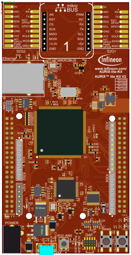
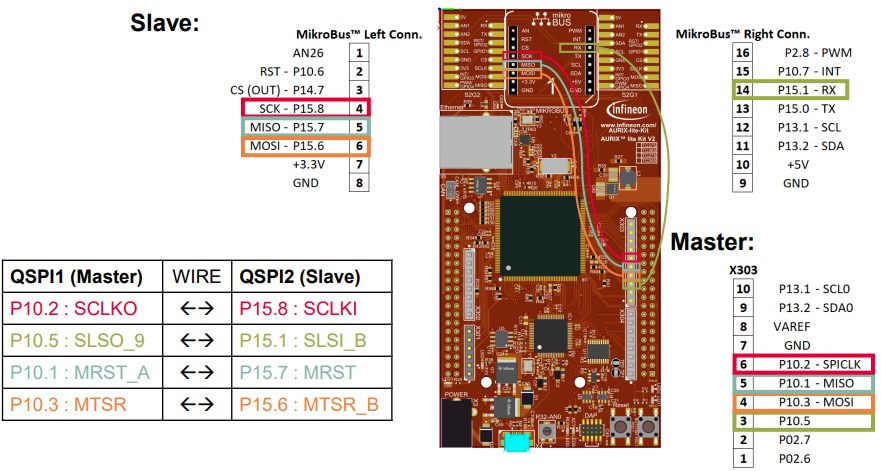
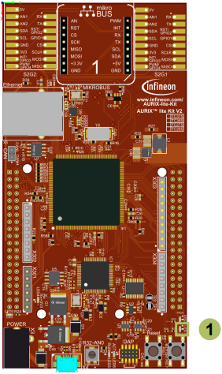

  

# SPI_DMA_1_KIT_TC375_LK
QSPI is used to conduct SPI Master Slave communication using the DMA module.

## Device  
The device used in this example is AURIX&trade; TC37xTP_A-Step.

## Board  
The board used for testing is the AURIX&trade; TC375 lite Kit (KIT_A2G_TC375_LITE).

## Scope of work  
This example implements an SPI full duplex communication. QSPI1 is configured as an SPI master and QSPI2 is configured as an SPI slave. Both master and slave exchange eight bytes of data. Four DMA channels are used to enable data transfer between RAM and QSPI FIFOs without CPU intervention:
- DMA channel 1 is configured as SPI master Tx
- DMA channel 2 is configured as SPI master Rx
- DMA channel 3 is configured as SPI slave Tx
- DMA channel 4 is configured as SPI slave Rx

An LED is used to signal the successful data communication.

## Introduction  
The Queued Synchronous Peripheral Interface (QSPI) enables any synchronous serial communication with external devices based on the standardized SPI-bus signals: clock, data-in, data-out and slave select.

The QSPI works in full duplex mode either as Master or Slave with up to 50 Mbit/s.

The DMA module channels can be configured to transfer data from/to QSPI FIFOs to/from internal RAM Memory without any CPU intervention.

This example is based on the Infineon Low Level Drivers to demonstrate SPI Master Slave Communication with minimum CPU intervention.

## Hardware setup  
This code example has been developed for the board KIT_A2G_TC375_LITE.

  

Connect following pins as described and illustrated using wires.

 

## Implementation  

### Configuring the SPI communication
The configuration of the SPI communication is done once in the setup phase through the function *initQSPI()* in two different steps: 
- QSPI Slave initialization
- QSPI Master initialization

### QSPI Slave initialization
The initialization of the QSPI slave module is done by defining an instance of the *IfxQspi_SpiSlave_Config* structure. 

The structure is filled with default values by the function *IfxQspi_SpiSlave_initModuleConfig()*.

Afterwards, the following parameters are modified to enable the DMA usage, set its channels, interrupt priorities and IO port pins:
- DMA configuration: *dma.useDma*, *dma.txDmaChannelId*, *dma.rxDmaChannelId*
- Interrupts configuration: *base.txPriority*, *base.rxPriority*, *base.erPriority*, *base.isrProvider*
- Pins configuration: *pins*

The function *IfxQspi_SpiSlave_initModule()* is used to initialize the QSPI slave module.

Finally, the buffers used by the QSPI slave are initialized. 

The functions needed to initialize the QSPI Slave can be found in the iLLD header *IfxQspi_SpiSlave.h*.

### QSPI Master initialization
The initialization of the QSPI master module is done by defining an instance of the *IfxQspi_SpiMaster_Config* structure.

The structure is filled with default values by the function *IfxQspi_SpiMaster_initModuleConfig()*.

Afterwards, the following parameters are modified to enable the DMA usage, set its channels, interrupt priorities and IO port pins:
- DMA configuration: *dma.useDma*, *dma.txDmaChannelId*, *dma.rxDmaChannelId*
- Interrupts configuration: *base.txPriority*, *base.rxPriority*, *base.erPriority*, *base.isrProvider*
- Pins configuration: *pins*

The function *IfxQspi_SpiMaster_initModule()* is used to initialize the QSPI master module.

A QSPI module controls 16 communication channels, which are individually programmable. In this example, the function *initQSPI2MasterChannel()* initializes the channel 9 using an instance of the structure *IfxQspi_SpiMaster_ChannelConfig*. Afterwards, the slave select channel number is set through the parameter *sls.output* and the baud rate is modified via the parameter *base.baudrate*.

The function *IfxQspi_SpiMaster_initChannel()* is used to initialize the QSPI master channel.

Finally, the buffers used by the QSPI master are initialized.

The functions needed to initialize the QSPI Master can be found in the iLLD header *IfxQspi_SpiMaster.h*.

### Interrupt Service Routines (ISR)
The following ISRs are implemented to ensure a proper SPI communication in DMA mode:
- SPI Master error interrupt *QSPI1ErrorISR()* ISR calls the function:
  - *IfxQspi_SpiMaster_isrError()*
- SPI Slave error interrupt *QSPI2ErrorISR()* ISR calls the function:
  - *IfxQspi_SpiSlave_isrError()*
- SPI Master transmit interrupt *DMAChn1ISR()* ISR calls the function:
  - *IfxQspi_SpiMaster_isrDmaTransmit()*
- SPI Master receive interrupt *DMAChn2ISR()* ISR calls the function:
  - *IfxQspi_SpiMaster_isrDmaReceive()*
- SPI Slave transmit interrupt *DMAChn3ISR()* ISR calls the function:
  - *IfxQspi_SpiSlave_isrDmaTransmit()*
- SPI Slave receive interrupt *DMAChn4ISR()* ISR calls the function:
  - *IfxQspi_SpiSlave_isrDmaReceive()*

The functions listed above can be found in the iLLD headers *IfxQspi_SpiMaster.h* and *IfxQspi_SpiSlave.h*.

### SPI Master - Slave Communication:
The SPI Master Slave communication is established through the following steps:
- Enable SPI Slave for data communication using the function:
  - *IfxQspi_SpiSlave_exchange()*
- Enable and Start SPI Master data communication using the function:
  - *IfxQspi_SpiMaster_exchange()*
- Poll for SPI slave data reception using the function:
  - *IfxQspi_SpiSlave_getStatus()*
- The received and transmitted data are compared byte by byte and the number of errors are counted

## Compiling and programming  
Before testing this code example:  
- Power the board through the dedicated power connector
- Connect the board to the PC through the USB interface  
- Build the project using the dedicated Build button  or by right-clicking the project name and selecting "Build Project"  
- To flash the device and immediately run the program, click on the dedicated Flash button 

## Run and Test
After code compilation and flashing the device, perform the following steps:
- Run the project and check if the LED1 (1) is on (Data transmitted without errors)
- Additionally, using the debugger, the behavior can be checked:
  - Add *g_qspiDma* to Watch window
  - Check if *g_qspiDma.qspiBuffer.spiSlaveRxBuffer* and *g_qspiDma.qspiBuffer.spiMasterRxBuffer* are the same as *g_qspiDma.qspiBuffer.spiMasterTxBuffer* and, respectively, *g_qspiDma.qspiBuffer.spiSlaveTxBuffer*

**Note**: when checking the buffers’ data, the debug session must be paused.

## References  

AURIX&trade; Development Studio is available online:  
- <https://www.infineon.com/aurixdevelopmentstudio>  
- Use the "Import..." function to get access to more code examples  

More code examples can be found on the GIT repository:  
- <https://github.com/Infineon/AURIX_code_examples>  

For additional trainings, visit our webpage:  
- <https://www.infineon.com/aurix-expert-training>  

For questions and support, use the AURIX&trade; Forum:  
- <https://community.infineon.com/t5/AURIX/bd-p/AURIX>  