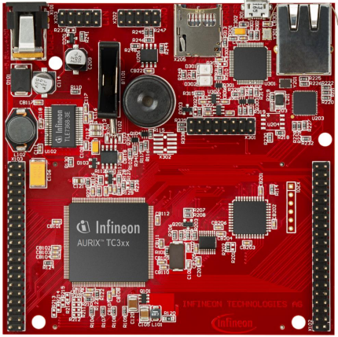
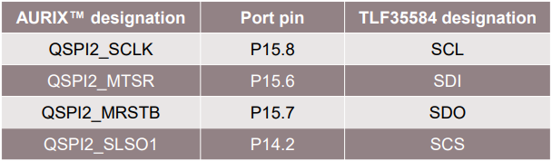
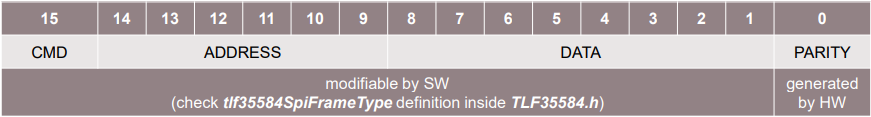
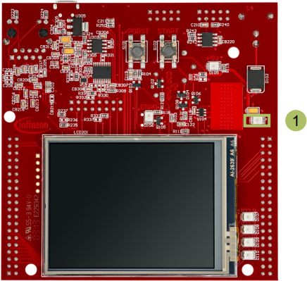

  

# SPI_TLF_1_KIT_TC397_TFT
A QSPI module configured as SPI master communicates with the TLF35584 device via SPI protocol.

## Device  
The device used in this example is AURIX&trade; TC39xTP_A-Step.

## Board  
The board used for testing is the AURIX&trade; TC397 TFT (KIT_A2G_TC397_5V_TFT).

## Scope of work  
QSPI2 is configured in master mode and used to send data frames to TLF35584 device via SPI protocol. The TLF35584 device is set to the NORMAL state and, in case of success, the LED D104 is turned on.
This training focuses on the SPI communication between QSPI module and TLF35548 device. Typical application use case and the features of the TLF35584 device are not covered by this training.

## Introduction  
The Queued Synchronous Peripheral Interface (QSPI) enables synchronous serial communication with external devices based on the standardized SPI-bus signals: clock, data-in, data-out and slave select.

The QSPI works in full duplex mode either as Master or Slave with up to 50 MBit/s.

The TLF35584 is a multiple output system-supply for safety-relevant applications supplying 5 V or 3.3 V microcontrollers, transceivers, and sensors by an efficient and flexible pre-/post-regulator concept over a wide input voltage range.

Multiple safety features enable easy realization of ASIL-D together with various µCs (e.g. AURIX™ TC2xx, TC3xx families).

## Hardware setup  
This code example has been developed for the board KIT_A2G_TC397_5V_TFT.

## Implementation  

### Configuring the SPI communication
The configuration of the SPI communication is done once in the setup phase through the function *initQSPI()*.

### QSPI Master initialization
The initialization of the QSPI master module is done by defining an instance of the *IfxQspi_SpiMaster_Config* structure.

The structure is filled with default values by the function *IfxQspi_SpiMaster_initModuleConfig()*.

Afterwards, the interface operation mode, the pins, ISR service provider and the priorities are set.

The function *IfxQspi_SpiMaster_initModule()* is used to initialize the QSPI master module.

A QSPI module controls 16 communication channels, which are individually programmable. 

In this training, the function *initQSPI2MasterChannel()* initializes the channel 1 using an instance of the structure *IfxQspi_SpiMaster_ChannelConfig*.

The following parameters reflect the SPI related parameters provided in the SPI-Serial Peripheral Interface chapter of the TLF35584´s Data Sheet:
- *spiMasterChannelConfig.base.baudrate = 5000000* – define the baud rate (set SCLK frequency to 5 MHz)
- *spiMasterChannelConfig.base.mode.dataWidth = 15* – define transfer data width (the total data width is 16 containing 15 bits of actual data plus 1 parity bit generated by hardware)
- *spiMasterChannelConfig.base.mode.csTrailDelay = 2* – define trailing delay
- *spiMasterChannelConfig.base.mode.csInactiveDelay = 2* – define inactive delay
- *spiMasterChannelConfig.base.mode.shiftClock = SpiIf_ShiftClock_shiftTransmitDataOnTrailingEdge* – define that the data is shifted out (transferred to the Tx pin) on the trailing edge

Additionally, automatic hardware parity generation/check is used in this example :
- *spiMasterChannelConfig.base.mode.parityCheck = TRUE* – define that automatic hardware parity generation/check is enabled
- *spiMasterChannelConfig.base.mode.parityMode = Ifx_ParityMode_even* – define usage of the even parity mode

The function *IfxQspi_SpiMaster_initChannel()* is used to initialize the QSPI master channel.

Additionally, the buffers used by the QSPI master are initialized.

The above functions can be found in the iLLD header *IfxQspi_SpiMaster.h*.

### QSPI Master – TLF35584 communication
The function *transferDataTLF35584()* triggers the data transfer between the SPI Master and the TLF35584 device.

Before data transfer, the SPI frame is assembled in the following format as defined in the SPI-Serial Peripheral Interface chapter of the TLF35584´s Data Sheet:

The function *IfxQspi_SpiMaster_getStatus()* is used to check the status of the master in order to wait until there is no ongoing transmission.

The function *IfxQspi_SpiMaster_exchange()* is called in order to instruct the master to send the data.

The above functions can be found in the iLLD header *IfxQspi_SpiMaster.h*.

### TLF35584 initialization
The initialization of the TLF35584 device is done once in the setup phase through the function *initTLF35584()*.

Certain TLF35584 internal registers need to be protected against being overwritten accidently. Write access to these registers is only possible after a dedicated 32 bit UNLOCK sequence has been sent via SPI.
Function *unlockRegisterTLF35584()* implements UNLOCK sequence that consists of a 32-bit sequence of 4 consecutive bytes (1: 0xAB; 2:0xEF; 3:0x56; 4:0x12) which are sent with no other SPI write access in between.

Functions *disableWindowWatchdogTLF35584()* and *disableErrPinMonitorTLF35584()* disable the window watchdog and error pin monitoring functionality of the TLF35584 device.
For more details, please refer to the State Machine, the Safe State Control Function and the Window Watchdog and Functional Watchdog chapters of the TLF35584´s Data Sheet.

All protected configuration request register values are captured by the respective functions only after a successful LOCK sequence has been performed.

Function *lockRegisterTLF35584()* implements LOCK sequence that consists of a 32-bit sequence of 4 consecutive bytes (1: 0xDF; 2:0x34; 3:0xBE; 4:0xCA) which have to be sent with no other SPI write access in between.

Upon detection of a successful LOCK sequence the configuration registers and all internal functions are updated with the values from the protected configuration request registers.

The function *enableVoltageSupplyRails()* is used to avoid the SMU alarm activation for the External Voltage Regulator (EVR) under-voltage by enabling the voltage supply rails.

The above functions can be found in the source and header files *TLF35584.c*, *TLF35584.h*.

### Application code
After QSPI module (*initQSPI()*) and TLF35584 device initialization (*initTLF35584()*), the following steps are performed:
- Check if any error flag has been raised during the TLF35584 device initialization (*getSystemStatusFlagsTLF35584()*) and if this is the case, clear the flag (*clearSystemStatusFlagsTLF35584()*)
- Wait (*IfxStm_waitTicks()*) the nominal delay time (60 μs) required by the device to be set to NORMAL state as defined in the TLF35584 Datasheet
- Set the TLF35584 device state to NORMAL (check the State Machine chapter of the TLF35584´s Data Sheet for the details) by using *setStateTransitionTLF35584()* function. The LED D104 that is connected to the safe state signal SS2 turns on
- Check if any error was triggered (*getSystemStatusFlagsTLF35584()*) and if the device state does not correspond to the NORMAL state (*getCurrentStateTLF35584()*)

The above functions can be found in the source and header files *TLF35584.c*, *TLF35584.h*.

## Compiling and programming  
Before testing this code example:  
- Power the board through the dedicated power connector
- Connect the board to the PC through the USB interface  
- Build the project using the dedicated Build button  or by right-clicking the project name and selecting "Build Project"  
- To flash the device and immediately run the program, click on the dedicated Flash button 

## Run and Test
fter code compilation and programming the device, perform the following steps:
- Check if the LED D104 (1) is on (TLF35584 device reached NORMAL state)
- Additionally, in an opened debug session, breakpoints can be set in *transferDataTLF35584()* function located in the *SPI_TLF.c* to check the *spiMasterTxBuffer* and *spiSlaveRxBuffer* inside *g_qspi.spiBuffers* structure
- To re-run the code example, the board should be power-cycled (power off / power on sequence)

## References  

AURIX&trade; Development Studio is available online:  
- <https://www.infineon.com/aurixdevelopmentstudio>  
- Use the "Import..." function to get access to more code examples  

More code examples can be found on the GIT repository:  
- <https://github.com/Infineon/AURIX_code_examples>  

For additional trainings, visit our webpage:  
- <https://www.infineon.com/aurix-expert-training>  

For questions and support, use the AURIX&trade; Forum:  
- <https://community.infineon.com/t5/AURIX/bd-p/AURIX>  