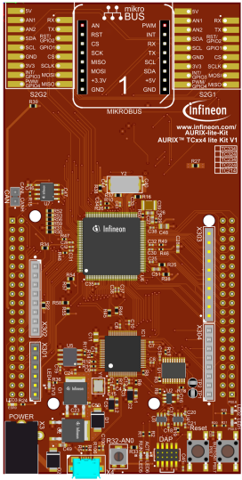
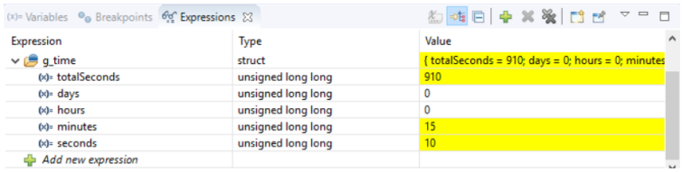

  

# STM_System_Time_1_KIT_TC334_LK
The STM module is used to get the current system time (days:hours:minutes:seconds). The time is stored in a structure.

## Device  
The device used in this example is AURIX&trade; TC33xTP_A-Step.

## Board  
The board used for testing is the AURIX&trade; TC334 lite Kit (KIT_A2G_TC334_LITE).

## Scope of work  
The System Timer (STM) module counts the number of ticks since the last Application Reset. This number is used to calculate the current system time in days, hours, minutes and seconds.

## Introduction  
The System Timer (STM) is a free running 64-bit counter that can be used for timing applications requiring both high precision and long period.

Among other features, the STM starts a counter automatically after any Application Reset (Application Reset is encapsulated in the System Reset and Power-On Reset).

This counter is used in this example to get the time since the application is running.

## Hardware setup  
This code example has been developed for the board KIT_A2G_TC334_LITE.

## Implementation  

### Get the system time
Getting the system time is done inside the function *getTime()* by the following steps:
- Get the system time in ticks by calling the iLLD function *IfxStm_get()* and divide it by the STM frequency (use the iLLD function *IfxStm_getFrequency()* to get the frequency) to convert it to seconds
- Calculate the numbers of days, hours, minutes and seconds and store them in an instance of the *systemTime* structure

The functions *IfxStm_getFrequency()* and *IfxStm_get()* can be found in the iLLD header *IfxStm.h*.

## Compiling and programming  
Before testing this code example:  
- Power the board through the dedicated power connector
- Connect the board to the PC through the USB interface  
- Build the project using the dedicated Build button  or by right-clicking the project name and selecting "Build Project"  
- To flash the device and immediately run the program, click on the dedicated Flash button 

## Run and Test
After code compilation and flashing the device, perform the following steps:
- Add the system time (*g_time*) to the Watch View of the debugger
- Check the time since the last reset by pausing the debugger and checking the values stored in the instance *g_time* displayed in the Watch View:
    - total 
    - days
    - hours 
    - minutes
    - seconds

## References  

AURIX&trade; Development Studio is available online:  
- <https://www.infineon.com/aurixdevelopmentstudio>  
- Use the "Import..." function to get access to more code examples  

More code examples can be found on the GIT repository:  
- <https://github.com/Infineon/AURIX_code_examples>  

For additional trainings, visit our webpage:  
- <https://www.infineon.com/aurix-expert-training>  

For questions and support, use the AURIX&trade; Forum:  
- <https://community.infineon.com/t5/AURIX/bd-p/AURIX>  