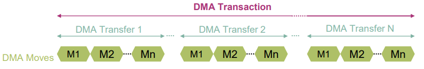
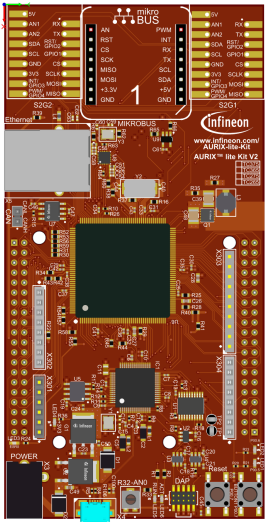
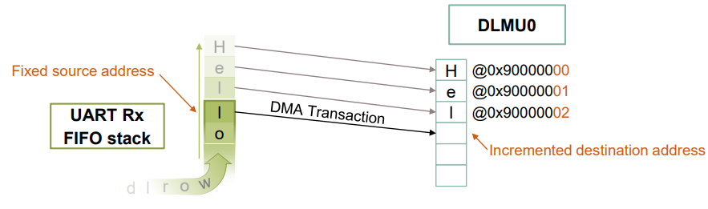
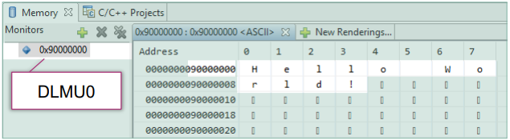
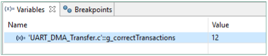

  

# UART_DMA_Transfer_1_KIT_TC375_LK
The DMA module is used to transfer data received from the UART to Distributed Local Memory Unit (DLMU) RAM of CPU0.

## Device  
The device used in this example is AURIX&trade; TC37xTP_A-Step.

## Board  
The board used for testing is the AURIX&trade; TC375 lite Kit (KIT_A2G_TC375_LITE).

## Scope of work  
The CPU sends a message via UART in loopback mode. When it receives the message back, it triggers an interrupt which starts the data transfer via DMA.

## Introduction  
The Direct Memory Access (DMA) transfers data from data source locations to data destination locations without intervention of the CPU or other on-chip devices. 

A DMA channel performs transactions. One transaction is made of transfers. One transfer is made of up to 16 moves. This structure divides the data into several parts and increases the application’s efficiency.

A transaction can be interrupted, however once a transfer is started, it cannot be interrupted.

Any DMA move engine can service a DMA request from any of the 128 DMA channels. Channel 127 has the highest priority.

DMA requests can be triggered by Hardware or Software.

The Asynchronous/Synchronous Interface (ASCLIN) module provides asynchronous serial communication with external devices, using data-in and data-out signals only.

For test purposes in this example, the transmit pin (TX) and receive pin (RX) can be shorted internally on-chip (loopback mode).

## Hardware setup  
This code example has been developed for the board KIT_A2G_TC375_LITE.

## Implementation
The example works as follows:
1. The CPU sends a character string (12-bytes) on the UART Tx: “Hello World!”
2. Via the loopback (Tx-Rx shorted internally), the Asclin Rx interrupt is triggered
3. The interrupt enables the reception of the data and therefore calls the DMA to transfer it to the DLMU0

### Configuration of the DMA
In this example, a 12-byte message, which is a sequence of twelve 8-bit characters, needs to be transferred. 
Twelve transactions composed of one transfer made of one 8-bit word move is then a possible solution. All this can be achieved with a single DMA channel, here channel 12.

The needed iLLD functions for DMA configuration are called from *init_dma()*:
1. *IfxDma_Dma_initModuleConfig()* generates the default module configuration 
2. *IfxDma_Dma_initModule()* initializes the DMA module with the defined parameters
3. *IfxDma_Dma_initChannelConfig()* generates the default channel configuration
The following parameters can be then defined at this point:
- *channelId*: 12
- *transferCount* (number of transfer per transaction): 1
- *moveSize*: 8-bit
- *blockMode* (number of move per transfer): 1
- *requestMode*: Complete a full transaction on request
- *source/destinationAddress*: Set the source and destination memory locations
- *source/destinationCircularBufferEnabled*: Define if the address is fixed or should be incremented (for more detailed information, please check the source code)
4. *IfxDma_Dma_initChannel()* initializes the channel with the defined parameters

### Configuration of the UART
The initialization of the UART communication is done via the function *init_asclin_uart()*, which contains:
1. The iLLDs function *IfxAsclin_Asc_initModuleConfig()* generates the default configuration. This configuration is then modified with the needed parameters:
- The priority levels of the Rx and Tx interrupts are defined through the *interrupt.txPriority* and *interrupt.rxPriority* parameters 
- The Rx and Tx pins are defined in this function
- The Interrupt Service Provider is defined by the *interrupt.typeOfService* parameter. The defined ISR is CPU0 for both Tx and Rx since the iLLD only has one parameter 
2. The *IfxAsclin_Asc_initModule()* function is called to initialize the module with the defined parameters 
3. The Service Provider is therefore manually modified for the Rx interrupt, in order to assign it to the DMA

The transmission of data is triggered by the function *send_data()*: calls the iLLDs function *IfxAsclin_Asc_write()* which sends the data, specified in the parameters, over the UART Tx.

**Note**: The *IfxAsclin_Asc_read()* iLLDs function is not used, because there is no need to copy the received data in a global variable. As soon as received, the data is directly transferred to the DLMU0 via DMA. 

## Compiling and programming  
Before testing this code example:  
- Power the board through the dedicated power connector
- Connect the board to the PC through the USB interface  
- Build the project using the dedicated Build button  or by right-clicking the project name and selecting "Build Project"  
- To flash the device and immediately run the program, click on the dedicated Flash button 

## Run and Test
After code compilation and flashing the device, perform the following steps:
- Connect the board to the PC
- Run the code 
- Add the DLMU0 address (0x90000000) to the memory window 
- Check using the debugger:
    - The message has been properly copied in the DLMU0  

    - As expected, 12 transactions were needed to transfer the message  

## References  

AURIX&trade; Development Studio is available online:  
- <https://www.infineon.com/aurixdevelopmentstudio>  
- Use the "Import..." function to get access to more code examples  

More code examples can be found on the GIT repository:  
- <https://github.com/Infineon/AURIX_code_examples>  

For additional trainings, visit our webpage:  
- <https://www.infineon.com/aurix-expert-training>  

For questions and support, use the AURIX&trade; Forum:  
- <https://community.infineon.com/t5/AURIX/bd-p/AURIX>  