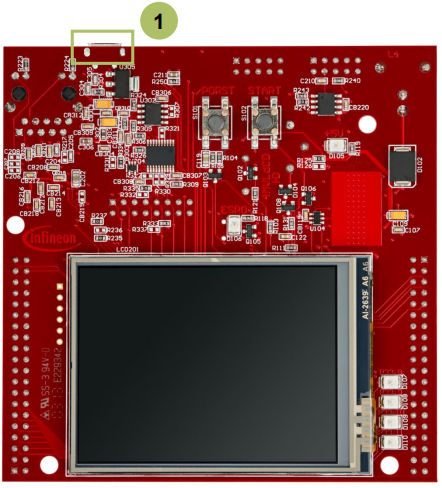
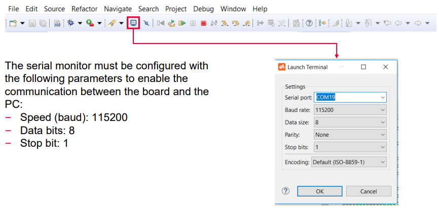
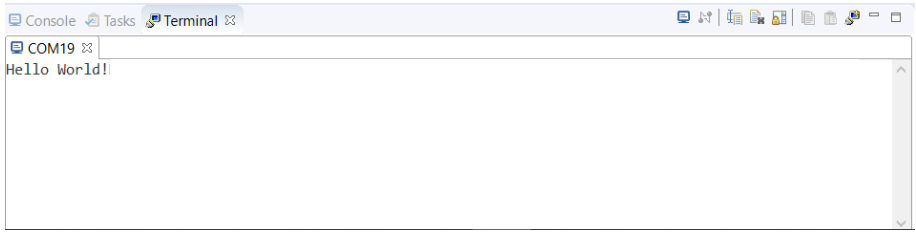

  

# UART_VCOM_1_KIT_TC397_TFT
UART communication via ASCLIN is used to send "Hello World!" from the device to the computer.

## Device  
The device used in this example is AURIX&trade; TC39xTP_A-Step.

## Board  
The board used for testing is the AURIX&trade; TC397 TFT (KIT_A2G_TC397_5V_TFT).

## Scope of work  
The string "Hello World!" is sent from the device to the PC via UART. The string is then visualized in a serial monitor.

## Introduction  
The Asynchronous/Synchronous Interface (ASCLIN) module enables asynchronous/synchronous serial communication with external devices. For this training, asynchronous reception/transmission (UART) is used for the communication between a PC and an AURIX&trade; device

## Hardware setup  
This code example has been developed for the board KIT_A2G_TC397_5V_TFT.

The board should be connected to the PC through the USB port (1).

## Implementation

### Configure the ASCLIN
Configuration of the ASCLIN module for UART communication is done in the setup phase by initializing an instance of the *IfxAsclin_Asc_Config* structure with default values through the function *IfxAsclin_Asc_initModuleConfig()*. 
The following parameters are then modified:
- *baudrate* – structure to set the actual communication speed in bit/s
- *interrupt* – structure to set: 
   - transmit interrupt priority (*txPriority*)
   - *typeOfService* – defines which service provider is responsible for handling the interrupt, which can be any of the available CPUs, or the DMA 
- *pins* – structure to set which GPIO port pins are used for the communication
- *txBuffer, txBufferSize* – to configure the buffer that holds the outgoing data

Finally, the configuration is applied via the function *IfxAsclin_Asc_initModule()*.

All the above functions can be found in the iLLD header *IfxAsclin_Asc.h*.

### The UART send function
Sending the string “Hello World!” is implemented inside the function *send_UART_message()* which is called once after initialization of the ASCLIN module.

This function calls *IfxAsclin_Asc_write()* which is provided by the iLLD header *IfxAsclin_Asc.h*.

## Compiling and programming  
Before testing this code example:  
- Power the board through the dedicated power connector
- Connect the board to the PC through the USB interface  
- Build the project using the dedicated Build button  or by right-clicking the project name and selecting "Build Project"  
- To flash the device and immediately run the program, click on the dedicated Flash button 

## Run and Test
For this training, a serial monitor is required for visualizing the text. The monitor can be opened inside the AURIX&trade; Development Studio using the following icon:

After code compilation and flashing the device, perform the following steps:
- The board must be connected to PC via the USB cable
- Open a serial monitor with the above configuration and connect
- The board has to be reset using the PORST button 
- The string can be observed on the serial monitor

## References  

AURIX&trade; Development Studio is available online:  
- <https://www.infineon.com/aurixdevelopmentstudio>  
- Use the "Import..." function to get access to more code examples  

More code examples can be found on the GIT repository:  
- <https://github.com/Infineon/AURIX_code_examples>  

For additional trainings, visit our webpage:  
- <https://www.infineon.com/aurix-expert-training>  

For questions and support, use the AURIX&trade; Forum:  
- <https://community.infineon.com/t5/AURIX/bd-p/AURIX>  