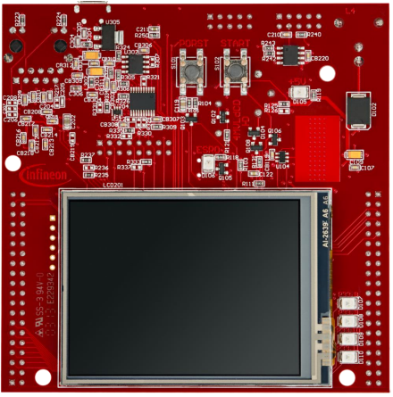
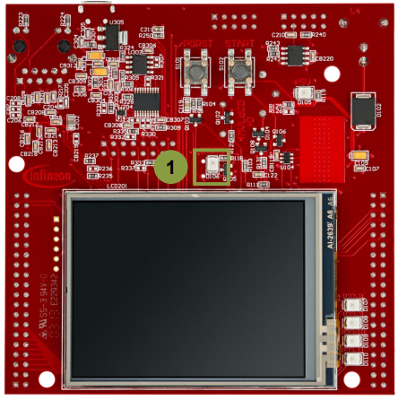

  

# Watchdog_1_KIT_TC397_TFT
The watchdog is serviced in order to prevent a reset.

## Device  
The device used in this example is AURIX&trade; TC39xTP_A-Step.

## Board  
The board used for testing is the AURIX&trade; TC397 TFT (KIT_A2G_TC397_5V_TFT).

## Scope of work  
This example is showing how to service the WatchDog Timer (WDT) periodically.

## Introduction  
The watchdog (WD) provides on the one hand a highly reliable and secure way to detect and recover from software or hardware failure and on the other hand a protection against unintended register write accesses. 

There are two types of Watchdogs:
- The Safety WD provides protection against unintended writes to critical system registers and memories. It consists of a timer that causes an SMU alarm request if it is not serviced within a certain time interval
- The individual CPU WDs have similar functionalities as the safety watchdog. They provide protection to CPU registers as well as to particular system registers. The CPU individual timers, if activated, offer the ability to monitor separate CPU execution threads. They have to be serviced similar to the safety watchdog timer within a certain time interval, otherwise a device reset is triggered

## Hardware setup  
This code example has been developed for the board KIT_A2G_TC397_5V_TFT.

## Implementation

### Configuring and servicing the CPU 0 watchdog timer
Comment out the instruction to disable the CPU watchdog (*IfxScuWdt_disableCpuWatchdog()*). Thus the CPU0 watchdog remains on and needs to be serviced.

Configure the reload value (REL) that specifies the timeout of the WD timer using the function *IfxScuWdt_changeCpuWatchdogReload()*. The default value is 0xFFFC and the timer counts up. The time window for servicing the WD is very short, therefore it is extended by using 0xE000 as REL.

The timeout can be calculated using this formula:
- timeout ≈ (0xFFFF - REL) / (fSPB / WDTSCON1.IRx) = (0xFFFF - 0xE000) / (100 MHz / 16384)

**Note**: The value 16384 is a constant, defined by IRx of register WDTSCON1.

A time variable is initialized to wait a fixed time inside the infinite loop.

Call the *IfxScuWdt_serviceCpuWatchdog()* function in order to service the watchdog timer.

The CPU0 watchdog is serviced periodically every second within the infinite while loop.

**Note**: The above related *ScuWdt* functions need a password in order to write into the CPU0 related watchdog registers. The password is retrieved using the function *IfxScuWdt_getCpuWatchdogPassword()*. The *ScuWdt* functions are part of the library *IfxScuWdt.h*.

## Compiling and programming  
Before testing this code example:  
- Power the board through the dedicated power connector
- Connect the board to the PC through the USB interface  
- Build the project using the dedicated Build button  or by right-clicking the project name and selecting "Build Project"  
- To flash the device and immediately run the program, click on the dedicated Flash button 

## Run and Test
After code compilation and flashing the device, perform the following steps:
- Check whether LED D106 (1) is off - No reset is signaled. Thus the CPU0 watchdog is well serviced periodically
- Comment out the instruction to service the CPU WD: *IfxScuWdt_serviceCpuWatchdog()*
- Compile, flash and run the code again
- Terminate the debug session if it is open. LED D106 (1) turns on after some time signaling a reset. Thus the WDT is not serviced anymore

**Note**: in order to use the debugger, OCDS is enabled. Whenever the OCDS is enabled, all watchdogs are disabled by default.  
**Note**: by default, if an SMU-induced Application Reset occurs twice (e.g. triggered by a watchdog), a severe system malfunction is assumed and the device is held in permanent Application Reset until a Power-On or System Reset occurs

## References  

AURIX&trade; Development Studio is available online:  
- <https://www.infineon.com/aurixdevelopmentstudio>  
- Use the "Import..." function to get access to more code examples  

More code examples can be found on the GIT repository:  
- <https://github.com/Infineon/AURIX_code_examples>  

For additional trainings, visit our webpage:  
- <https://www.infineon.com/aurix-expert-training>  

For questions and support, use the AURIX&trade; Forum:  
- <https://community.infineon.com/t5/AURIX/bd-p/AURIX>  