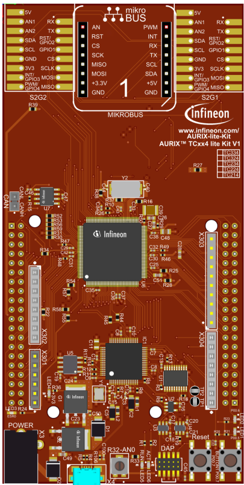
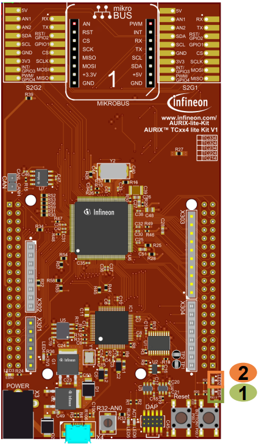

  

# iLLD_TC334_ADS_DSPR_MBIST
**This example shows how to inject an error in CPU0 DSPR memory and run an MBIST to detect it.**  

## Device  
The device used in this example is AURIX&trade; TC33xTP_A-Step. 

## Board  
The board used for testing is the AURIX&trade; TC334 lite Kit (KIT_A2G_TC334_LITE).  

## Scope of work   
This example handles the particular case of single core CPU microcontroller and how it's possible to test the CPU0 DSPR while respecting the condition of not accessing the memory during the test. 

## Introduction  
The Memory Test Unit (MTU) controls and monitors the initialization and data integrity checking functions of the various internal memories in the AURIX&trade; TC3xx family of microcontrollers.
Each SRAM is provided with digital logic, known as SRAM Support Hardware (SSH).
Each SSH block controls one or more internal memories, providing a unified interface for the control of ECC (Error Correction Code) and BIST (Built-in-Self-Test).
The SSH provides direct access to the memories, without involving the CPU.
The Memory Built-in-Self-Test (MBIST) is an MTU feature, which enables the verification of the integrity of internal SRAMs.

## Hardware setup  
This code example has been developed for the board KIT_A2G_TC334_LITE. 
 
  
  
  
## Implementation:  

###Requirements for memory testing in case of single core CPU
When the memory is put in test mode with MTU register MEMTEST (MEMTEST.CPU0_DMEM_EN = 1), it becomes functionally unavailable and must not be accessed, for that reason CPU0 memories tests are generally run from CPU1 (or another available core) and with the CPU0 idle.
This is not possible with a single core microcontroller like TC33x.
To workaround this constraint, it is possible for CPU0 to run its DSPR memory test but with the condition of not accessing it while its related bits in MTU MEMTEST registers are set.

This imply that CPU0 cannot use the CSA, ISTACK, USTACK and HEAP and as a result, the application must avoid any context switch like function calls, traps and interrupts handling and using global variables and buffers placed in DSPR.

Note: The Dcache is disabled to avoid all conflicts with cached accesses while the DSPR is in test mode.

###Error Injection
It is possible to change the type of the injected error from either a single bit error or a double bit error by changing the value of the variable "injected_error":
- For single bit error use the value 0x1
- For double bit error use the value 0x3

The error injection is run before testing the memory and is done by :
- Disabling the ECC functionality by writing 0x01 to ECCMAP bits of ECCS register
- Write a new value in the target address "mem_ptr" effectively changing the data bits without changing the ECC bits
- Enable again the ECC function by clearing ECCMAP bits

From now on any read targeting "mem_ptr" will trigger an ECC error:
- In case a single error injected: The error will be corrected
- In case a double error injected: The CPU will trap due to data integrity error (class 4, ID 6)

###Configuring and executing the MBIST
Putting the DSPR memory in test mode (enabling the SSH of DMEM and DMEM1) will make the DSPR unavailable and so all register configurations will be managed by direct writing instead of using iLLD library functions.
All the previous errors and alarms are cleared.
Test range remain the default value to cover all the memory.
A typical Non destructive test (NDT) configuration is used:
- CONFIG0   = 0x4005
- CONFIG1   = 0x5008
- MCONTROL  = 0x4009

The test mode and the MBISTs are separately run for DMEM and DMEM1.
After both MBISTs are done, the DSPR is available again to be accessed by the CPU0. 

###Test results
The ECCDs of DMEM and DMEM1 SSHs are checked for errors, then compared to correctable error flag and to uncorrectable error flag.

The test is pass if the error flag reported by the ECCDs is in line with the type of the injected error:
- Single bit error --> Correctable error flag
- Double bit error --> Uncorrectable error flag

## Compiling and programming
Before using this code example:  
- Power the board through the dedicated power connector 
- Connect the board to the PC through the USB interface
- Build the project using the dedicated Build button  or by right-clicking the project name and selecting "Build Project"
- To flash the device and immediately run the program, click on the dedicated Flash button   

## Run and Test   

After code compilation and flashing the device, observe the behavior of the LEDs.  

Check that **LED1** (1) and **LED2** (2) are turned on:  
- **LED1** is turned on to indicate that the test is pass
- **LED2** is turned on to indicate that the test is fail  

  
  
## References  

AURIX&trade; Development Studio is available online:  
- <https://www.infineon.com/aurixdevelopmentstudio>  
- Use the "Import..." function to get access to more code examples  

More code examples can be found on the GIT repository:  
- <https://github.com/Infineon/AURIX_code_examples>  

For additional trainings, visit our webpage:  
- <https://www.infineon.com/aurix-expert-training>  

For questions and support, use the AURIX&trade; Forum:  
- <https://community.infineon.com/t5/AURIX/bd-p/AURIX>  