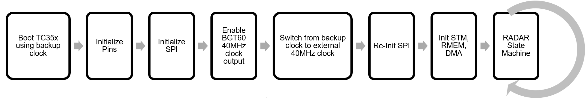

  

# iLLD_TC356TA_ICMS_BOARD_3_0_breathing_rate 
**This software project for the ICMS board v3.0 board (AURIX™ TC356 and BGT60 ATR24AIP) demonstrates the main radar signal processing steps to generate point cloud data from raw data recorded by the MMIC and to calculate the breathing rate of a detected target.**  

## Device  
The device used in this example is AURIX™ TC35xTA_A-Step. 

## Board  
The board used for testing is the ICMS AURIX™ 24 AiP (ICMS board v3.0) which includes AURIX™ TC35xTA_A-Step as well as XENSIV™ BGT60ATR24AIP.

## Scope of work   

This software project is intended as a starting point for the application of in cabin monitoring (ICMS) on the ICMS board v3.0. It demonstrates the main processing steps that need to be performed on AURIX™ TC356 signal processing unit (SPU) and Tricore CPUs to generate point cloud data from raw data recorded by the BGT60 ATR24AIP MMIC and to calculate the breathing rate of a detected target. 

Basic understanding of FMCW radar range-doppler signal processing is presumed to follow this code example.

## Introduction  
AURIX™ 2nd generation radar microcontrollers (TC3x) use a hardware accelerator called the Signal Processing Unit (SPU) to extract information from radar data. 
This example utilizes various functions offered by the SPU to implement a basic processing flow for point cloud generation and breathing rate detection consisting of the steps in below figure:

  

The radar data cube and both intermediate and final results are stored in the AURIX™ TC35xTA_A-Step Extension memory (EMEM). This is a dedicated memory for radar data.
Note that the processing steps as well as the configuration steps are explained in detail in Application note AN0047 - ICMS board v3.0: Point Cloud Generation and ICMS vital sign processing.

## Hardware setup  
This code example was developed for the ICMS AURIX™ 24 AiP (also called ICMS board v3.0), using a AURIX™ TC35xTA_A-Step microcontroller.

  

## Implementation  

**Configuration Settings **

The file *IfxRadar_cfg.h* contains the configuration parameters of the point cloud generation and breathing rate detections. Among others, parameters like radar frame repetition time, filter settings and number of radar frames to be combined in the micro doppler frame can be changed here.

**Initialization and configuration steps**

*Cpu0_main()* starts by initializing the necessary hardware as depicted in the figure below:

  

The main objective of this code is to establish SPI communication between the AURIX™ TC356 microcontroller and the BGT60ATR24EAIP, enable the BGT60’s 40MHz clock output and switch the TC356 clock to this external source as described in chapter 2.3. After switching to the external clock source, the SPI module needs to be re-initialized, and then also the STM, DMA and RMEM modules are initialized. Upon successful initialization of these hardware modules, CPU0 enters the RADAR State Machine which handles the main RADAR application flow. A detailed explanation of the steps performed is provided in Application note AN0047 - ICMS board v3.0: Point Cloud Generation and ICMS vital sign processing.

**RADAR State Machine**

The RADAR State Machine is depicted in the picture below:

A detailed explanation of the steps performed in the state machine is provided in Application note AN0047 - ICMS board v3.0: Point Cloud Generation and ICMS vital sign processing.

A debug instruction is added to the radar state machine at the point where one entire micro doppler frame is recorded and processed. Inspecting *g_rdr.rmem.x* and *g_rdr.det_targets* will show intermediate results of radar processing as well as the detected targets along with their position relative to the board and the calculated breathing rate.

## Compiling and programming
Before testing this code example:  
+ Power the board through the dedicated power connector 
+ Build the project using the dedicated Build button  or by right-clicking the project name and selecting "Build Project"
+ To flash the device and immediately run the program, click on the dedicated Flash button  

## Run and Test   

Flash and run the code example.
After processing, the results (and intermediate results) are stored in EMEM (see *g_rdr.rmem.x*) . The following figures show visualizations of the radar data cube during the different processing steps:

The following image shows the data after range-FFT processing (with clutter removal), with one breathing person being present in front of the sensor (*g_rdr.rmem.microDoppler_clutterremoved*, only data from first RX antenna shown). 

  

The range angle map calculated via Capon beamforming is shown below. The breathing person is central to the sensor (*g_rdr.rmem.PS*):

  

Detected targets are written to the target structure *g_rdr.det_targets* showing their detected range, angle bin and calculated breathing rate.
Clock cycles used to execute the described processing steps are written to g_rdr.clockcountsICMS.x*.

## References  

Application note AN0047 - ICMS board v3.0: Point Cloud Generation and ICMS vital sign processing, to be published

AURIX™ Development Studio is available online:  
- <https://www.infineon.com/aurixdevelopmentstudio>  
- Use the "Import..." function to get access to more code examples  

More code examples can be found on the GIT repository:  
- <https://github.com/Infineon/AURIX_code_examples>  

For additional trainings, visit our webpage:  
- <https://www.infineon.com/aurix-expert-training>  

For questions and support, use the AURIX™ Forum:  
- <https://community.infineon.com/t5/AURIX/bd-p/AURIX>  
