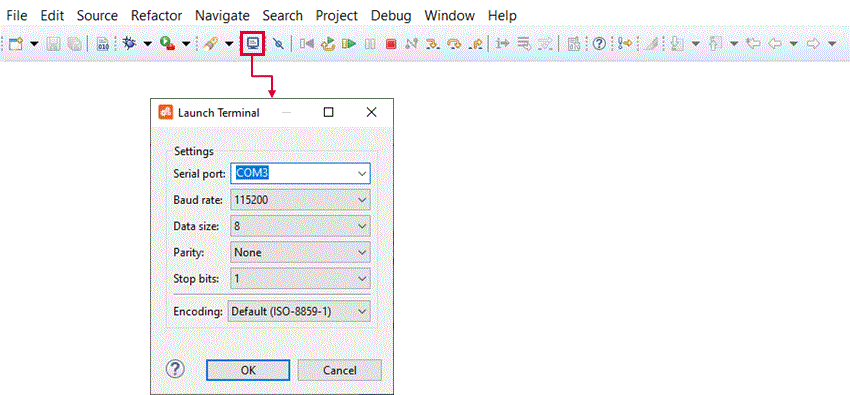
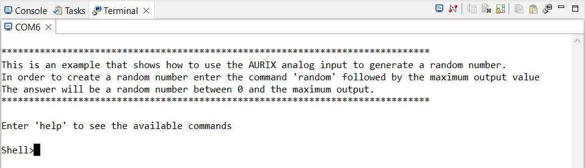
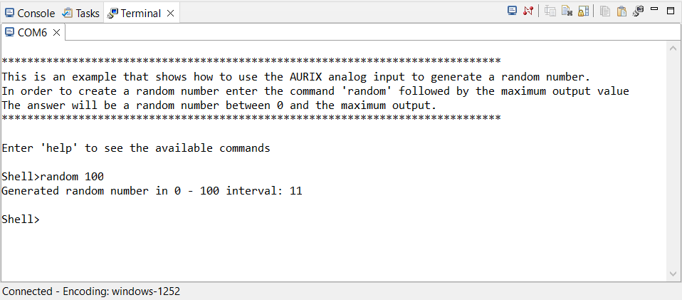

  

# iLLD_TC375_ADS_ADC_Random_Number_Generator
**Create a random number in the 0 to 255 range using the Enhanced Delta-Sigma Analog to Digital Converter (EDSADC) readings as generator**

## Device  
The device used in this example is AURIX™ TC37xTP_A-Step

## Board  
The board used for testing is the AURIX™ TC375 lite Kit (KIT_A2G_TC375_LITE)  

## Scope of work
The Enhanced Delta-Sigma Analog to Digital Converter (EDSADC) is used to read a value on channel 3, connected to port pin AN0.
The ASCLIN module is configured for UART communication. The Shell from Infineon low level drivers (iLLDs) exploits the Asynchronous/Synchronous Interface (ASCLIN) module to interpret and manage commands from the user like "info", "random" and "help" 
which have been developed and are easily expandable. Random command returns a random number between 0 and 255.
Using the EDSADC to select the less significant bit of 8 consecutive readings of the analog channel separated by a predefined wait time helps impoving the quality of the random number. The user restrict the range by predefining the value of n (e.g. random 10 will provide a random number between 0 and 10).

## Introduction  
- The *Asynchronous/Synchronous Interface* (ASCLIN) module provides serial communication with external devices. In this example it is used to interface the PC through the USB port via UART communication
- A *Shell* is a user interface for parsing commands and accessing devices
- The *Enhanced Delta-Sigma Analog-to-Digital Converter module* (EDSADC) of the AURIX™ TC37x provides a set of up to 6 analog input channels

## Hardware setup  
This code example has been developed for the AURIX™ TC375 Lite Kit (KIT_A2G_TC375_LITE). 
In this example, the pin AN0, which is connected to the board’s potentiometer, is used. 
The board should be connected to the PC via USB, in order to allow the UART connection. 

   

## Implementation  
**Configure the Project**  
This project needs two modules, one to configure the user interface via shell and one to configure the analog peripheral for reading.

**Configure the ASCLIN**  
The ASCLIN module is necessary to implement the serial communication with the terminal.

Configuration of the ASCLIN module for UART communication is done in the function `SERIALIO_Init()`, it takes the desired UART baudrate as parameter.  
The desired baudrate can be defined with the macro `UART_BAUDRATE`, whose default value is set to 115200 baud.

**Configuration of the EDSADC module**  
Configuration of the EDSADC module is done once in the setup phase by calling the initialization function `init_EDSADC()`, which contains the following steps:
- EDSADC module configuration
- EDSADC channel configuration

**The conversion function**  
The `run_EDSADC()` function is called in the while loop and continuously converts the analog voltage level on channel 3 to a digital value and returns the result in a 16 bit signed value.

**The creation of the random number**  
Once the user insert in the shell the string "random" followed  by a number between 0 and 255, eight readings of the analog channel are performed with an interval of a few milliseconds between each read. The less significant bit of each read is taken, shifted to the left and added to the partial random number created.

## Compiling and programming
Before testing this code example:
- Power the board through the dedicated power connector
- Connect the board to the PC through the USB interface
- Build the project using the dedicated Build button  or by right-clicking the project name and selecting "Build Project"
- To flash the device and immediately run the program, click on the dedicated Flash button   

## Run and Test  
For this example, a serial terminal is required for visualizing the text. The terminal can be opened inside the AURIX™ Development Studio using the following icon:  

  

The serial terminal must be configured with the following parameters to enable the communication between the board and the PC:  
- Speed (baud): 115200
- Data bits: 8
- Stop bit: 1

After code compilation and flashing the device, check the opened terminal window on AURIX™ Development Studio, which looks like the following:  

  

Typing "random n" where n defines a range between 1 and 255 a random number between 0 and n will be generated:

## References  

AURIX™ Development Studio is available online:  
- <https://www.infineon.com/aurixdevelopmentstudio>  
- Use the "Import..." function to get access to more code examples  

More code examples can be found on the GIT repository:  
- <https://github.com/Infineon/AURIX_code_examples>  

For additional trainings, visit our webpage:  
- <https://www.infineon.com/aurix-expert-training>  

For questions and support, use the AURIX™ Forum:  
- <https://community.infineon.com/t5/AURIX/bd-p/AURIX>  
