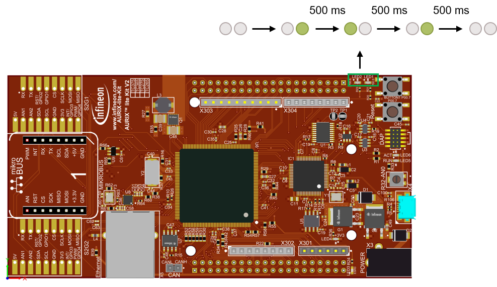

  

# iLLD_TC375_ADS_Blinky_LED_CPP  
**Two LEDs are turned on and off exploiting C++ Objects**  

## Device  
The device used in this example is AURIX&trade; TC37xTP_A-Step  

## Board  
The board used for testing is the AURIX&trade; TC375 lite Kit (KIT_A2G_TC375_LITE)  

## Scope of work   
This project is a simple example of how C++ objects can be used in AURIX&trade; projects.  
In this example, an LED object is used to control the port pins of the two LEDs on the AURIX&trade; TC375 Lite Kit.  
This example can be used as a template for creating and using methods in C++ for AURIX&trade;.

## Introduction  
- The individual control and data bits of each GPIO port are implemented in a number of registers. The registers are used to configure and use the port as general-purpose I/O
- The port input/output control registers configure the functionality and characteristics of the GPIO port pin such as port direction (input or output), pull-up, pull-down, push-pull or open-drain functionality
- Mixing C and C++ code in the same program requires the usage of a compatible compiler to build it

## Hardware setup  
This code example has been developed for the board KIT_A2G_TC375_LITE:  

  

## Implementation  
**C++ Objects wrapping**  
The C++ Objects and function calls need to be wrapped in C to make sure that they have the linkage conventions of C language.  

The *KIT_TC375_LK.cpp* and *KIT_TC375_LK.h* files wrap the usage of C++ Objects and function calls in methods defined as *extern "C"*, which specifies that the linkage conventions of C language are being used.    
In *KIT_TC375_LK.cpp* two global objects are defined: *g_led1* and *g_led2*, used to control the LED1 and LED2 connected on the port pins P00.5 and P00.6.  
Exploiting these objects, the functions *turnOnLED1()*, *turnOnLED2()*, *turnOffLED1()*, *turnOffLED2()*, *toggleLED1()* and *toggleLED2()* are used to control the port pins of the LEDs on the board.  

The object *LED* is defined in the *LED.h* file, containing both private variables and public methods to work with the object.  

**C++ Objects usage**  
In the *Cpu0_Main.c* file, the prototypes of the functions wrapping the usage of C++ objects and functions are visible thanks to the include of the *KIT_TC375_LK.h*.  

Finally, the infinite while loop in *core0_main()* was deleted and the macro *IFX_CFG_SSW_RETURN_FROM_MAIN* defined in the *Ifx_Cfg.h* file, to let the function return and the SSW call the destructors for the C++ objects initialized in the code.  

**Initialization of the LED**  
The LEDs are initialized in the constructor function inside the *LED.cpp* file:
- The port, pin and a flag to indicate whether the LED is low-level active or not are saved into private variables inside the object  
- The LED is switched off with the function *IfxPort_setPinState()* from the iLLD *IfxPort.h*  
- The LED is initialized with the function *IfxPort_setPinModeOutput()* from the iLLD *IfxPort.h*  

**Changing status of the LED**
- The state of the LED is set or toggled with the functions *IfxPort_setPinState()* or *IfxPort_togglePin()* from the iLLD *IfxPort.h*

## Compiling and programming
Before testing this code example:  
- Connect the board to the PC through the USB interface
- Build the project using the dedicated Build button  or by right-clicking the project name and selecting "Build Project"
- To flash the device and immediately run the program, click on the dedicated Flash button   

## Run and Test   
After code compilation and flashing the device, observe the LED1 and LED2 on the board, which turn on in sequence with a delay of approximately 500 ms.  

  

## References  

AURIX&trade; Development Studio is available online:  
- <https://www.infineon.com/aurixdevelopmentstudio>  
- Use the "Import..." function to get access to more code examples  

More code examples can be found on the GIT repository:  
- <https://github.com/Infineon/AURIX_code_examples>  

For additional trainings, visit our webpage:  
- <https://www.infineon.com/aurix-expert-training>  

For questions and support, use the AURIX&trade; Forum:  
- <https://community.infineon.com/t5/AURIX/bd-p/AURIX>  
