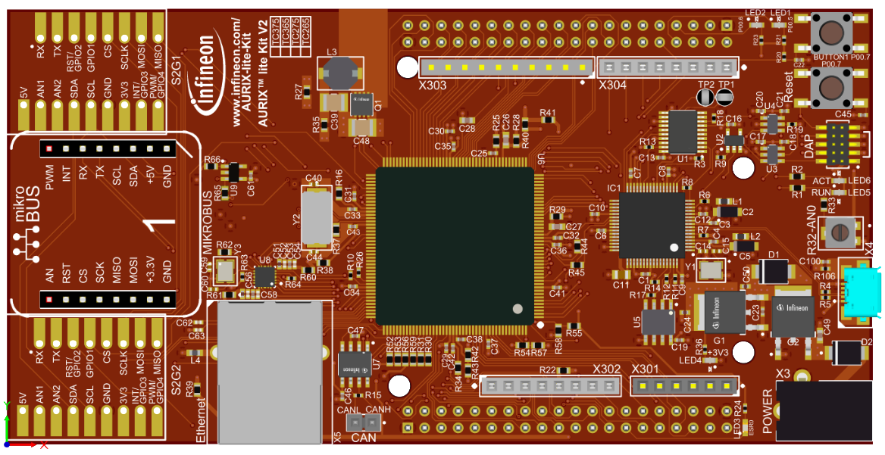
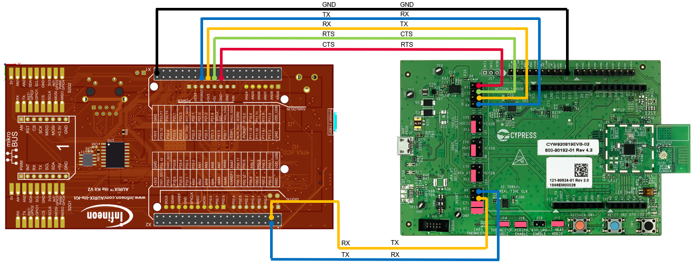
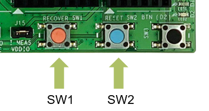
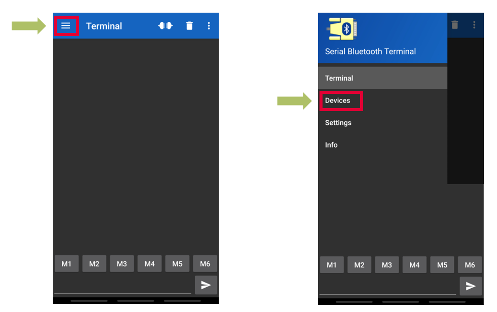
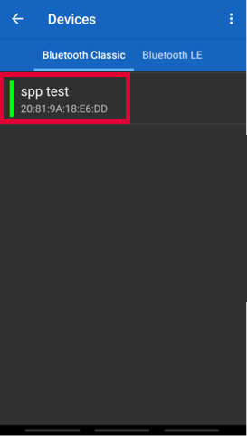
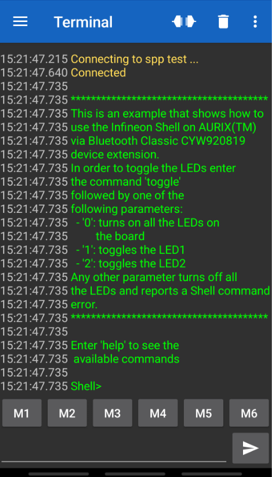
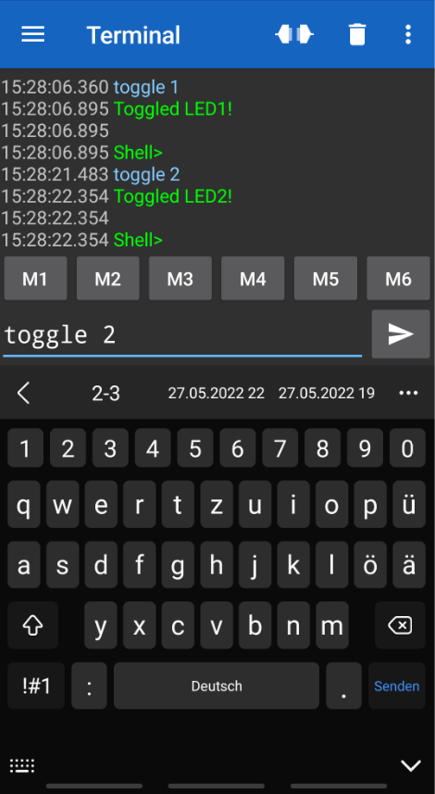
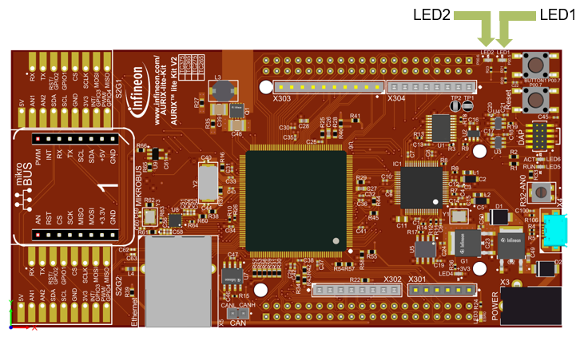

  

# iLLD_TC375_ADS_Bluetooth_RFCOMM
**Demonstrate the download of an application firmware to Infineon's CYW20819 device family by applying the AIROC™ HCI UART Control Protocol on AURIX™**  

## Device  
The device used in this example is AURIX™ TC37xTP_A-Step  

## Board  
The board used for testing is the AURIX™ TC375 Lite Kit (KIT_A2G_TC375_LITE)  
Beside the AURIX™ evaluation kit, also a CYW920819EVB-02 evaluation kit is needed

## Scope of work   
The example enables the extension of AURIX™ devices with the BLE (Bluetooth Low Energy) and classic bluetooth capability which is provided by Infineon's CYW20819 device. The application firmware binary which is distributed within this example implements a RFCOMM (Radio Frequency Communication) bluetooth classic profile for the CYW20819 device. This application binary is downloaded by AURIX™ to the CYW20819 device. During execution of the application binary, the data received/transmitted on the RFCOMM bluetooth interface by the CYW20819 device is bridged to a UART (Universal Asynchronous Receiver Transmitter), which is connected to AURIX™ and processed on AURIX™ within a shell. A shell is a user interface for parsing commands and accessing services. By this, a RFCOMM bluetooth application on a remote device (i.e. smartphone) can be used as a terminal application to communicate with AURIX™.

## Introduction  
Inside this example, the AURIX™ TC375 Lite Kit is connected to the CYW920819EVB-02 evaluation kit. The CYW20819 device comes with two UART interfaces. These interfaces are the HCI (Host Controller interface) UART interface, which is used to download application firmware and the PUART (Peripheral UART) interface, which can be used for general application purpose.

* The ASCLIN (Asynchronous/Synchronous Interface) instance number 5 (called ASCLIN5 throughout the further description) of AURIX™ (P22.3/RX and P22.2/TX) is configured for UART communication and connected to HCI UART interface of the CYW20819 device. This connection is used to download the application firmware from AURIX™ to CYW20819.  

* The ASCLIN instance number 3 (called ASCLIN3 throughout the further description) of AURIX™ (P00.1/RX and P00.0/TX) is configured for UART communication and connected to PUART of CYW20819 device. The RFCOMM application binary executed on the CYW20819 device is forwarding the bi-directional traffic of the RFCOMM bluetooth profile to its PUART. On AURIX™ side a shell application is executed on ASCLIN3.

During startup, before the shell is executed on AURIX™, first it is confirmed the correct application firmware is programmed into CYW20819.

The RFCOMM terminal can be connected from remote to the bluetooth RFCOMM profile of the CYW20819 and interact with the shell, which is executed on AURIX™.

To download the application binary, an Infineon vendor specific AIROC™ HCI firmware download protocol is used.

As of writing, this protocol is valid for the following chip families:
CYW20706, CYW20719, CYW20721, CYW20735, CYW20819, CYW20820, CYW20835, or CYW43012.  

So even this example is demonstrated on CYW920819EVB-02 evaluation kit within the example here, the scope of this example is broader. 

## Hardware setup  
This code example is developed for the board AURIX™ TC375 Lite Kit (KIT_A2G_TC375_LITE)  
  

The AURIX™ TC375 Lite Kit is connected to the PC through a USB port to support download and debug.  
The CYW920819EVB-02 evaluation kit needs to be powered by another USB port or a USB power supply.  

Make sure, the UART interfaces of both kits are interconnected as shown in the following figure.  
The jumpers of the CYW920819EVB-02 kit needs to be placed as indicated to support 3.3V operation mode:  
  

<table>
    <tbody>
        <tr>
            <td>&emsp;<b>AURIX™ TC375 Lite Kit</b></td>
            <td>&emsp;<b>CYW920819EVB-02 Kit</b></td>
        </tr>
        <tr>
            <td>&emsp;GND</td>
            <td>&emsp;GND</td>
        </tr>
        <tr>
            <td>&emsp;P22.2 ASCLIN5/TX</td>
            <td>&emsp;HCI UART/RX</td>
        </tr>
        <tr>
            <td>&emsp;P22.3 ASCLIN5/RX</td>
            <td>&emsp;HCI UART/TX</td>
        </tr>
        <tr>
            <td>&emsp;P21.2 RTS</td>
            <td>&emsp;HCI UART/CTS</td>
        </tr>
        <tr>
            <td>&emsp;P21.4 CTS</td>
            <td>&emsp;HCI UART/RTS</td>
        </tr>
        <tr>
            <td>&emsp;P00.1 ASCLIN3/RX</td>
            <td>&emsp;PUART/TX</td>
        </tr>
        <tr>
            <td>&emsp;P00.0 ASCLIN3/TX</td>
            <td>&emsp;PUART/RX</td>
        </tr>
    </tbody>
</table>

To make sure, CYW920819EVB-02 is in a well pre-defined state, execute the following sequence before programming the kit for the very first time:
1. Supply the kit with power
2. Push Recovery Button (SW1) for at least one second
3. While still keeping pushed the Recovery Button (SW1), also push the Reset Button (SW2) for at least one second
4. Release Reset Button (SW2) and after one second later the Recovery Button (SW1)
5. Execute a power cycle of the kit  

  

## Implementation  
**Overview - Source files and structure**  
This examples comes with the following software modules:
- BT_HCI_Protocol_Download.c/BT_HCI_Protocol_Download.c 
    - Within these files an API is implemented to configure and use the ASCLIN5 peripheral of AURIX™ to interconnect with the HCI UART peripheral of CYW20819.
    It implements the sending of commands and receiving of events of the AIROC™ HCI firmware download protocol. By using this API, the application binaries can be programmed into CYW20819.
- BT_Minidriver_Binary.c/BT_Minidriver_Binary.c 
    - These files provide the binary data of the minidriver for the CYW20819 device. The minidriver needs to be downloaded to RAM and its execution has to be started, before the subsequent download of the application binary to the flash can follow.
- BT_RFCOMM_Binary.c/BT_RFCOMM_Binary.c 
    - These files provide the binary data of the RFCOMM application executable for the CYW20819 device. Thereby the CYW20819 is enabled as a bluetooth classic device supporting the implementation of RFCOMM profile and it is functioning as a bridge of this profile to its PUART interface.
- BTShell.c/BT_Shell.h
    - Within these files the shell application executed on top the ASCLIN3 peripheral of AURIX™ is implemented. Incoming shell commands are parsed, executed and responded.
    
**Details - Software modules and structure**  

**Initialize the ASCLIN5 peripheral for HCI UART communication**  
The function *void init_hci_protocol_UART(void)* inside file *BT_HCI_Protocol_Download.c* implements the configuration of the ASCLIN5 peripheral.  
An instance of a *IfxAsclin_Asc_Config* structure, which contains the following fields, is initialized:  
- *baudrate* - a structure that allows to set
    - *baudrate* - the communication speed in bit/second
    - *oversampling* - the division ratio of the baud rate for reaching higher frequencies to ensure oversampling
- *bitTiming* - a structure that allows to set the sampling mode with
    - *medianFilter* - the number of samples per bit
    - *samplePointPosition* - the first sample point position
- *interrupt* - a structure that allows to set   
    - *txPriority*, *rxPriority* and *erPriority* - the interrupt priorities for transmission, reception and error events
    - *typeOfService* - the service provider responsible for handling the interrupt, which can be any of the available CPUs, the CSRM, the DMA, the GTM or the PPU
- *pins* - a structure that allows to set which port pins are used for the communication  
- *rxBuffer*, *rxBufferSize*, *txBuffer*, *txBufferSize* - parameters that allow to configure the buffers that will hold the incoming/outgoing data  

First the function *IfxAsclin_Asc_initModuleConfig(...)* is used to fill config structure *IfxAsclin_Asc_Config* with default values matching the ASCLIN5 peripheral.

Then the following custom parameters are set inside the *IfxAsclin_Asc_Config* structure:  

- A baudrate of 115200 baud (*ASC_HCI_PROTOCOL_BAUDRATE*), oversampling factor of *IfxAsclin_OversamplingFactor_16*, enabled median filtering *IfxAsclin_SamplesPerBit_three* and sampling position *IfxAsclin_SamplePointPosition_8*.
- An instance of *IfxAsclin_Asc_Pins* is configured and filled with the example specific custom pin parameters *ASC_HCI_PROTOCOL_RX_PORT*(P22.3) and *ASC_HCI_PROTOCOL_TX_PORT*(P22.2) and assigned to the *pins* field of the *ascConf* config structure.  
**Note:** AURIX™ provides a hardware controlled operation of the ASCLIN UART RTS/CTS pin. This feature is not used inside this example here, because CYW20819 has a second functionality assigned to its CTS pin: Only if the CTS is actively driven high during reset, the firmware download through HCI UART is enabled. To implement this behaviour, the RTS pin output, and the CTS input of AURIX™ is controlled by software using standard GPIO.
- Receive and transmission buffers can be allocated to the ASCLIN interface. For this purpose, the two global arrays *g_uartTxHCIFifo* and *g_uartRxHCIFifo* are allocated to support two FIFOs with a size of *ASC_TX_HCI_FIFO_SIZE* and *ASC_RX_HCI_FIFO_SIZE*. Those buffers are assigned to the fields *txBuffer*, *txBufferSize*, *rxBuffer* and *rxBufferSize* of the *IfxAsclin_Asc_Config* config structure.  
**Note:** For the allocation size of the arrays, beside the pure FIFO size *ASC_TX_HCI_FIFO_SIZE* and *ASC_RX_HCI_FIFO_SIZE*, also the size of the structure type *Ifx_Fifo* + 8 Bytes needs to be taken into account.    
- The interrupt-handlers for send-, receive- and error-events of the ASCLIN peripheral are implemented inside the file *BT_HCI_Protocol_Download.c*: *asc5_tx_ISR(...)*, *asc5_rx_ISR(...)* and *asc5_err_ISR(...)*. The interrupt handlers are assigned to the following interrupt priorities within the interrupt router: *ISR_PRIORITY_ASCLIN_HCI_PROTOCOL_TX*, *ISR_PRIORITY_ASCLIN_HCI_PROTOCOL_TX* and *ISR_PRIORITY_ASCLIN_HCI_PROTOCOL_ER*. Those interrupt priorities need to be configured inside field *interrupt* of the *IfxAsclin_Asc_Config* config structure.

With all these example specific settings within *IfxAsclin_Asc_Config* config structure, the structure is used to initialize the ASCLIN5 interface by calling the iLLD (Infineon Low Level Driver) function *IfxAsclin_Asc_initModule(...)*. This function returns a structure of type *IfxAsclin_Asc* which is stored inside the global variable *g_asclinModuleHCIProtocolInterface* for later access to ASCLIN5 interface.

After ASCLIN5 is initialized, the standard interface pipe, referenced by *g_asclinPipeHCIProtocol*, is initialized and associated with the ASCLIN5 peripheral by calling *IfxAsclin_Asc_stdIfDPipeInit(...)* and passing the reference *g_asclinModuleHCIProtocolInterface* of ASCLIN5. Accordingly the interrupt handler implementations of *asc5_tx_ISR(...)*, *asc5_rx_ISR(...)* and *asc5_err_ISR(...)* are calling the standard interface pipe functions with a reference to *g_asclinPipeHCIProtocol*:  
*IfxStdIf_DPipe_onTransmit*, *IfxStdIf_DPipe_onReceive* and *IfxStdIf_DPipe_onError*

As explained before, inside this example RTS is operated under software control. For this, the pin *ASC_HCI_PROTOCOL_RTS_PORT* (P21.3) is set to high by calling iLLD function *IfxPort_setPinHigh* before enabling it as an output by calling iLLD function *IfxPort_setPinModeOutput*.  
Afterwards, before proceeding with the firmware download, AURIX™ monitors the CTS input and waits until a reset cycle is executed while RTS was set to high. Only then it is possible to download firmware on the HCI UART of CYW20819.     
 
**Implement sending of commands by AIROC™ HCI UART Control Protocol**
- The generic implementation of *void send_command_generic(const uint8 data[], Ifx_SizeT noOfBytes)* inside file *BT_HCI_Protocol_Download.c* is used by all other, more specific command sending functions.
Inside this function, before a command is sent, the RTS port signal is set to high. The command's bit pattern inside *data* with the size of *noOfBytes* is then sent on ASCLIN5 by the iLLD function *IfxStdIf_DPipe_write(...)*. The pipe is flushed by calling the iLLD function *IfxStdIf_DPipe_flushTx(...)*, to make sure, the complete command is sent before returning.  
- Based on this generic implementation of *void send_command_generic(...)* the following specific commands are implemented:  
    - DOWNLOAD_MINIDRIVER
       - Function name: *void send_command_download_minidriver(void)*  
       - Purpose: Initiates the download of the minidriver for CYW20819 device 
    - LAUNCH_RAM
       - Function name: *void send_command_launch_ram(uint32 launchAddress)*  
       - Purpose: Start execution of the binary located at *launchAddress* 
       **Note:** The LAUNCH_RAM command's name is misleading, because it is not limited to actual RAM address ranges. The same command can be used for non-volatile-storage like serial flash.
    - UPDATE_BAUDRATE
       - Function name: *void send_command_update_baudrate(uint32 baudrate)*  
       - Purpose: Specify new baudrate to be used for HCI UART communication   
    - CHIP_ERASE
       - Function name: *void send_command_chip_erase(void)*  
       - Purpose: Erase the serial flash to prepare for new programming   
    - WRITE_RAM
       - Function name: *void send_command_write_ram(Ifx_SizeT payloadSize, uint32 destinationAddress, const uint8 payloadData[])*  
       - Purpose: Write the data provided inside array *payloadData* of size *payloadSize* to the *destinationAddress* 
       **Note:** The WRITE_RAM command's name is misleading, because it is not limited to actual RAM address ranges. The same command can be used for non-volatile-storage like serial flash.
    - VERIFY_CRC
       - Function name: *void send_command_verify_crc(uint32 startAddress, uint32 size)*  
       - Purpose: Request CRC calculation of the data inside array *startAddress* of size *payloadSize* to the *destinationAddress*
    - HCI_RESET
       - Function name: *void send_command_hci_reset(void)*  
       - Purpose: Request CYW20819 device to activate HCI mode with the used baudrate as default baudrate
- All the specific command's sending implementations are implemented by applying the following pattern:
    - Define specific bit pattern of the command
    - Get size of the command's bit pattern
    - If needed, patch parameters (like *baudrate*, *launchAddress*,...) into the specific command's bit pattern
    - Call *void send_command_generic(...)* to actually send the command on ASCLIN

**Implement receiving events by AIROC™ HCI UART Control Protocol**  
- The generic implementation of *boolean wait_event_generic(const uint8 expectedResponse[], Ifx_SizeT count)* inside file *BT_HCI_Protocol_Download.c* is used by all other, more specific event receiving functions.
Inside this function, before an event can be received, the RTS port signal is set to low. It is then waited for the event response of the size of *count* by calling the iLLD function *IfxStdIf_DPipe_read(...)*. To make *IfxStdIf_DPipe_read(...)* function call timeout, the number of ticks, which equal one second is provided inside parameter *timeout*. The number of ticks are calculated, based on the system frequency which is retrieved by a call to the system timer function *IfxStm_getFrequency(...)*. In case of timeout, the function *boolean wait_event_generic(...)* returns with *FALSE*. In case of success, the received event's bit pattern is compared to *expectedResponse*. In case of mismatch of *expectedResponse* the function still returns with *FALSE*, otherwise *TRUE*. Before leaving *boolean wait_event_generic(...)*, the RTS port signal is set back to high.
- Based on this generic implementation of *boolean wait_event_generic(...)* the following specific event receive commands are implemented:  
    - DOWNLOAD_MINIDRIVER
       - Function name: *boolean wait_event_download_minidriver(void)*  
       - Purpose: Receive event of DOWNLOAD_MINIDRIVER command. Confirms readiness for download of the minidriver for CYW20819 device. 
    - LAUNCH_RAM
       - Function name: *boolean wait_event_launch_ram(void)*  
       - Purpose: Receive event of LAUNCH_RAM command. Confirms execution of the binary started. 
       **Note:** The LAUNCH_RAM command's name is misleading, because is not limited to actual RAM address ranges. The same command can be used for non-volatile-storage like serial flash.
    - UPDATE_BAUDRATE
       - Function name: *boolean wait_event_update_baudrate(void)*  
       - Purpose: Receive event of UPDATE_BAUDRATE command. Confirms the new baudrate will be used for further communication.
    - CHIP_ERASE
       - Function name: *boolean wait_event_chip_erase(void)*  
       - Purpose: Receive event of CHIP_ERASE command. Confirms the serial flash is erased and device ready for new programming.   
    - WRITE_RAM
       - Function name: *boolean wait_event_write_ram(void)*  
       - Purpose: Receive event of WRITE_RAM command. Confirms the data has been programmed to the memory. 
       **Note:** The WRITE_RAM command's name is misleading, because it is not limited to actual RAM address ranges. The same command can be used for non-volatile-storage like serial flash.
    - VERIFY_CRC
       - Function name: *boolean wait_event_verify_crc(uint32 expectedCRC)*  
       - Purpose: Receive event of VERIFY_CRC command. Checks if the calculated CRC is matching.
    - HCI_RESET
       - Function name: *boolean wait_event_hci_reset(void)*  
       - Purpose: Receive event of HCI_RESET command. Confirms CYW20819 device is in HCI mode.
- All the specific event's receive implementations are implemented by applying the following pattern:
    - Define specific expected bit pattern of the event
    - Get size of the event's bit pattern
    - If needed, patch expected event response parameters (like *expectedCRC*) into the event's bit pattern
    - Call *boolean wait_event_generic(const uint8 expectedResponse[], Ifx_SizeT noOfBytes)* to wait for the event response and check response for correctness. Return FALSE in case of timeout or mismatch, otherwise return TRUE.

**Implement reset and linkup to remote side by AIROC™ HCI UART Control Protocol**  
The function *boolean reset_HCI(uint8 trials)*, implemented inside file *BT_HCI_Protocol_Download.c*, is used to probe the remote side for responsiveness by sending *HCI_RESET* commands using the function *void send_command_hci_reset(void)*. By calling *boolean wait_event_hci_reset(void)* it is checked, if any of these commands are responded from remote by *HCI_RESET* event. If yes, the function returns with *TRUE*, otherwise with *FALSE*.

**Validate binary for correctness by AIROC™ HCI UART Control Protocol**  
The function *boolean validate_binary(...)*, implemented inside file *BT_HCI_Protocol_Download.c*, is used to validate the RFCOMM application binary (see *BT_RFCOMM_Binary.c/BT_RFCOMM_Binary.h*) for correctness. The RFCOMM binary is split into two flash regions with two different sizes and two different expected CRCs as defined inside macros within *BT_RFCOMM_Binary.h*:  
*FLASH_RANGE_1_STARTADDRESS, FLASH_RANGE_1_SIZE, FLASH_RANGE_1_CRC, FLASH_RANGE_2_STARTADDRESS, FLASH_RANGE_2_SIZE, FLASH_RANGE_2_CRC*

Both flash ranges are checked for correctness by sending VERIFY_CRC command calling *void send_command_verify_crc(...)* and checking the expected CRC inside the event response by calling *boolean wait_event_verify_crc(...)*. If the both flash ranges respond with the matching CRC, the function *boolean validate_binary(...)* returns *TRUE*, otherwise *FALSE*.

**Download binary by AIROC™ HCI UART Control Protocol**  
The function *boolean download_binary(const uint8 binary[][PAYLOAD_PACKET_MAX_SIZE], uint32 packetCount)* inside file *BT_HCI_Protocol_Download.c* is implemented to download a binary to CYW20819. The binaries are defined inside *BT_Minidriver_Binary.c/.h* and *BT_RFCOMM_Binary.c/.h*. Inside the function *boolean download_binary(...)* for each data packet within the binary, its size, destination address and payload is retrieved and written to CYW20819 by calling *void send_command_write_ram(...)*. Successfull writing is confirmed, by calling *boolean wait_event_write_ram(...)* for every packet.
In case a packet is not confirmed, the function returns with *FALSE*, otherwise with *TRUE*.

**RFCOMM application binary**  
The RFCOMM application binary is defined within the global array *g_rfcommBinary* inside the files *BT_RFCOMM_Binary.c* and *BT_RFCOMM_Binary.h*.
The global array *g_rfcommBinary* is organized in packets, each carrying a max binary data of *RFCOMM_BINARY_MAX_PACKETSIZE* bytes.
Inside every packet the first byte is carrying the valid payload size within this packet. The following four bytes carry the 32bit destination address inside the target. Starting with the next byte, the actual payload is provided.  

**Minidriver binary**  
The minidriver binary is required to be downloaded to CYW20819, to make all other AIROC™ HCI UART Control Protocol commands for serial flash programming functional (like VERIFY_CRC, UPDATE_BAUDRATE,...). The minidriver is programmed into RAM.  
The minidriver binary is defined within the global array *g_minidriverBinary* inside the files *BT_Minidriver_Binary.c* and *BT_Minidriver_Binary.h*.
The global array *g_minidriverBinary* is organized in packets, each carrying a max binary data of *MINIDRIVER_BINARY_MAX_PACKETSIZE* bytes.
Inside every packet the first byte is carrying the valid payload size within this packet. The following four bytes carry the 32bit destination address inside the target. Starting with the next byte the actual payload is provided.

**Initialize the ASCLIN3 peripheral to communicate with PUART on CYW20819**  
The function *void init_shell_UART(void)* inside file *BT_Shell.c* implements the configuration of the ASCLIN3 peripheral.  
The application binary distributed within *BT_RFCOMM_Binary.c* of this example implements a bridge between the RFCOMM profile and the PUART interface of CYW20819. On AURIX™ side ASCLIN3 peripheral is used for this interconnect.

An instance of a *IfxAsclin_Asc_Config* structure, which contains the following fields, is initialized:  
- *baudrate* - a structure that allows to set
    - *baudrate* - the communication speed in bit/second
    - *oversampling* - the division ratio of the baud rate for reaching higher frequencies to ensure oversampling
- *bitTiming* - a structure that allows to set the sampling mode with
    - *medianFilter* - the number of samples per bit
    - *samplePointPosition* - the first sample point position
- *interrupt* - a structure that allows to set   
    - *txPriority*, *rxPriority* and *erPriority* - the interrupt priorities for transmission, reception and error events
    - *typeOfService* - the service provider responsible for handling the interrupt, which can be any of the available CPUs, the CSRM, the DMA, the GTM or the PPU
- *pins* - a structure that allows to set which port pins are used for the communication  
- *rxBuffer*, *rxBufferSize*, *txBuffer*, *txBufferSize* - parameters that allow to configure the buffers that will hold the incoming/outgoing data  

First the function *IfxAsclin_Asc_initModuleConfig(...)* is used to fill the configuration structure *IfxAsclin_Asc_Config* with default values matching the ASCLIN3 peripheral.

The following custom parameters need to be set inside the *IfxAsclin_Asc_Config* structure:  
- A baudrate of 9600 baud (*ASC_BAUDRATE*), oversampling factor of *IfxAsclin_OversamplingFactor_16*, enabled median filtering *IfxAsclin_SamplesPerBit_three* and sampling position *IfxAsclin_SamplePointPosition_8*.

- An instance of *IfxAsclin_Asc_Pins* is configured and filled with the example specific custom pin parameters *IfxAsclin3_RXE_P00_1_IN*(P00.1) and *IfxAsclin3_TX_P00_0_OUT*(P00.0) and assigned to the *pins* field of the *IfxAsclin_Asc_Config* config structure. Hardware control flow CTS/RTS is not needed.

- Receive and transmission buffers can be allocated to the ASCLIN interface. For this purpose, the two global arrays *g_uartTxShellFifo* and *g_uartRxShellFifo* are allocated to support two FIFO with size *ASC_TX_SHELL_FIFO_SIZE* and *ASC_RX_SHELL_FIFO_SIZE*. Those buffers are assigned to the fields *txBuffer*, *txBufferSize*, *rxBuffer* and *rxBufferSize* of the *IfxAsclin_Asc_Config* config structure.  
**Note:** For the allocation size of the arrays, beside the pure FIFO size *ASC_TX_SHELL_FIFO_SIZE* and *ASC_RX_SHELL_FIFO_SIZE*, also the size of the structure type *Ifx_Fifo* + 8 Bytes needs to be taken into account.    

- The interrupt-handlers for send-, receive- and error-events of the ASCLIN3 peripheral are implemented inside the file *BT_Shell.c*:  
*asc3_tx_ISR(...)*, *asc3_rx_ISR(...)* and *asc3_err_ISR(...)*  
The interrupt handlers are assigned to the following interrupt priorities within the interrupt router:  
*ISR_PRIORITY_ASCLIN_SHELL_TX*, *ISR_PRIORITY_ASCLIN_SHELL_TX* and *ISR_PRIORITY_ASCLIN_SHELL_ER*  
Those interrupt priorities need to be configured inside field *interrupt* of the *IfxAsclin_Asc_Config* config structure.

With all these example specific settings within *IfxAsclin_Asc_Config* config structure, the structure is used to initialize the ASCLIN3 interface by calling the iLLD function *IfxAsclin_Asc_initModule*.
This function fills a structure of type *IfxAsclin_Asc* which is stored inside the global variable *g_asclinShellInterface* for later access to ASCLIN3 interface.

After ASCLIN3 is initialized, the standard interface pipe, referenced by *g_asclinPipeShell*, is initialized and associated with the ASCLIN3 peripheral by calling *IfxAsclin_Asc_stdIfDPipeInit(...)* and passing the reference *g_asclinShellInterface* of ASCLIN3. Accordingly the interrupt handler implementations of *asc3_tx_ISR(...)*, *asc3_rx_ISR(...)* and *asc3_err_ISR(...)* are calling the standard interface pipe functions with a reference to *g_asclinShellInterface*:  
*IfxStdIf_DPipe_onTransmit(...)*, *IfxStdIf_DPipe_onReceive(...)* and *IfxStdIf_DPipe_onError(...)*

**Initialize the shell**  
The function *void init_shell(void)* implemented inside file *BT_Shell.c* initializes the shell functionality.  
First hardware peripherals used by the shell implementation are initialized:
- Call *void init_shell_UART(void)* to initialize ASCLIN3 as described above. The reference *g_asclinPipeShell* to the ASCLIN3 pipe can then be used for accessing the ASCLIN3 peripheral.  
- Call *void init_leds(void)* to configure the low active ports of LED1(P00.5) and LED2(P00.6) as output and turn the LEDs off. The function *void init_leds(void)* implicitly uses the iLLD functions *IfxPort_setPinMode(...)* and *IfxPort_setPinState(...)*. LED1 and LED2 are than ready to be controlled by shell commands.

To implement the shell, this example makes use of a library functionality of the file *Ifx_Shell.c*, which is provided inside folder "\Libraries\Service\CpuGeneric\SysSe\Comm".

To initialize the shell, a configuration structure *shellConf* of type *Ifx_Shell_Config* is initialized to its default parameters, by calling the function *void Ifx_Shell_initConfig(...)*.

Some fields of the configuration structure *shellConf* need to be configured with example specific settings:
- *standardIo* - The reference to the pipe *g_asclinPipeShell* which is associated with ASCLIN3 peripheral
- *commandList* -  A global array *g_shellCommands* of type *Ifx_Shell_Command* specifying the shell's commands, their help text and callback functions to process the command

There are three commands configured for this shell implementation as defined inside the global variable *g_shellCommands* in file *BT_Shell.c*:  

<table>
    <tbody>
        <tr>
            <td>&emsp;<b>MACRO of command string</b></td>
            <td>&emsp;<b>command string</b></td>
            <td>&emsp;<b>callback function</b></td>
            <td>&emsp;<b>purpose</b></td>
        </tr>
        <tr>
            <td>&emsp;COMMAND_INFO</td>
            <td>&emsp;info</td>
            <td>&emsp;print_shellinfo</td>
            <td>&emsp;Show the example's info </td>
        </tr>
        <tr>
            <td>&emsp;COMMAND_TOGGLE</td>
            <td>&emsp;toggle</td>
            <td>&emsp;toggle_leds</td>
            <td>&emsp;Command to toggle LEDs</td>
        </tr>
        <tr>
            <td>&emsp;COMMAND_HELP</td>
            <td>&emsp;help</td>
            <td>&emsp;Ifx_Shell_showHelp</td>
            <td>&emsp;Show the help list of all commands</td>
        </tr>
    </tbody>
</table>

The commands callback functions are implemented inside the file *BT_Shell.c* as follows:
- *print_shellinfo(...)* - Output info about the shell to the user by implicitly using the function *IfxStdIf_DPipe_print(...)* passing the reference *g_asclinPipeShell* which is associated with ASCLIN3
- *toggle_leds(...)* - Toggle LED1/LED2 by implicitly using the iLLD function *IfxPort_setPinState(...)* and send feedback to the user by calling the function *IfxStdIf_DPipe_print(...)* 
- *Ifx_Shell_showHelp(...)* - This function is already provided as part of the shell library within the file *Ifx_Shell.c*

Finally, the shell is initialized by calling *Ifx_Shell_init(...)* to which
- the reference of configuration structure *shellConf* is passed
- the reference *g_shellInterface* of type *Ifx_Shell* is passed to return the initialized shell   

**Run the shell**  
The function *run_shell(void)* is implemented inside the file *Ifx_Shell.c* in library folder "\Libraries\Service\CpuGeneric\SysSe\Comm".
This function is executed continuously inside the infinite while-loop of *Cpu0_Main.c* to parse incoming commands and execute the shell's commands callbacks.
The reference *g_shellInterface* is passed to the function *run_shell(void)*.

**Example core0_main implementation**  
The examples execution finally is integrated into the following core0_main implementation:
1. Typically for examples and ADS project templates, the following functions are called:  
*IfxCpu_enableInterrupts(...)*, *IfxScuWdt_disableCpuWatchdog(...)*, *IfxScuWdt_disableSafetyWatchdog(...)*, *IfxCpu_emitEvent(...)* and *IfxCpu_waitEvent(...)*
2. Configure ASCLIN5 peripheral for HCI UART communication by calling *init_hci_protocol_UART(...)*.  
**Note:**  The function *init_hci_protocol_UART(...)* will only return, when CYW20819 is reset. This is, to make sure, CTS pin of CYW20819 was set to high during reset. Otherwise, firmware downloads cannot be executed via HCI UART.  
3. Before download can be started, according AIROC™ HCI UART Control Protocol, HCI_RESET command must be sent by AURIX™. AURIX™ probes the remote CYW20819 for responsiveness, by calling *reset_HCI(...)* from file *BT_HCI_Protocol_Download.c*. If your device unexpectedly does not respond, and because of step 2, it is made sure, that CTS pin is set to high during reset of CYW20819, the device needs to be recovered by the manual recovery procedure explained inside the section "Hardware setup".  
    - 3.1. Before downloading the RFCOMM application binary, first the minidriver needs to be downloaded. By calling the functions *void send_command_download_minidriver(...)* and waiting for the response, by calling the function *boolean wait_event_download_minidriver(...)* from file *BT_HCI_Protocol_Download.c* the CYW920819EVB-02 is prepared to download the minidriver binary.
    - 3.2. By calling the function *download_binary(...)* from file *BT_HCI_Protocol_Download.c*, the minidriver binary data from *g_minidriverBinary* of file *BT_Minidriver_Binary.c* is downloaded to CYW920819EVB-02.   
    - 3.4. The minidriver on CYW920819EVB-02 is started by calling the function *void send_command_launch_ram(...)*. AURIX™ waits until minidriver is started by calling function *boolean wait_event_launch_ram(void)*.  
    - 3.5. Only if application binary was not already programmed into CYW920819EVB-02, AURIX™ proceeds with programming. To check this, the CRCs of the application binary are checked by calling *boolean validate_binary(...)*.
    - 3.6. Optional: For downloading the application binary the baudrate can optional be adapted to a higher speed grade. The functions *void send_command_update_baudrate(uint32 baudrate)* and *boolean wait_event_update_baudrate(...)* are used for this.
    - 3.7. Before the new application binary can be programmed, the flash needs to be erased by calling the functions *void send_command_chip_erase(...)* and *boolean wait_event_chip_erase(...)*.
    - 3.8. By calling the function *download_binary(...)* from file *BT_HCI_Protocol_Download.c*, the application binary data within *g_rfcommBinary* from file *BT_RFCOMM_Binary.c* is downloaded to CYW920819EVB-02.   
    - 3.9. The application binary's CRCs are checked by calling *boolean validate_binary(...)*. 
    **Note:** Because of the rarity of programming errors and to keep the example simple, programming errors are considered unexpected. Therefore, retry of programming in case of failure is not implemented.
    - 3.10. The RFCOMM application on CYW920819EVB-02 is started by calling the function *void send_command_launch_ram(...)*. AURIX™ waits until application binary is started by calling function *boolean wait_event_launch_ram(...)*.  
    - 3.11. Because of the rarity of link-loss while performing these steps and to keep the example simple, link-loss during programming is considered unexpected. Therefore, retry of programming in case of failure is not implemented.
4. Configure ASCLIN3 peripheral and shell by calling *init_shell* implemented inside file *BT_HCI_Protocol_Download.c*
5. Call *run_shell* within infinite while-loop to process the incoming data and trigger shell command execution

## Run and Test  
For this example, a remote device (like a smartphone) running a RFCOMM-profile bluetooth classic serial terminal is required. As of today, iOS does not support RFCOMM profile in general, while for Android devices several apps are available within Google Play Store.
In the following the "Serial Bluetooth Terminal" app (application) is used just as an example. Using this app is not mandatory. Other available terminal apps can equally be used:  

1.Install "Serial Bluetooth Terminal" App on your remote device  

2.Setup hardware as described above. Also supply CYW920819EVB-02 kit with power via USB and consider executing recovery sequence. 

3.Compile, download and start execution of this example on AURIX™ TC375 Lite Kit  

4.AURIX™ will wait for a reset-cycle of CYW920819EVB-02 Kit, before downloading the binary. For this reason push SW2 reset button on CYW920819EVB-02 Kit:  

  
  

5.Open the Serial Bluetooth Terminal App on your smartphone  

6.Open the App menu and select "Devices" to scan for available bluetooth devices:  

7.Connect to device "spp test" inside Bluetooth Classic tab:  

  

8.Once the device is connected, the info screen will show up:  

9.Enter command "toggle 1"/"toggle 2" and confirm toggling of LED1/LED2 on AURIX™ TC375 Lite Kit:  

## References  

AURIX™ Development Studio is available online:  
- <https://www.infineon.com/aurixdevelopmentstudio>  
- Use the "Import..." function to get access to more code examples  

More code examples can be found on the GIT repository:  
- <https://github.com/Infineon/AURIX_code_examples>  

For additional trainings, visit our webpage:  
- <https://www.infineon.com/aurix-expert-training>  

For questions and support, use the AURIX™ Forum:  
- <https://community.infineon.com/t5/AURIX/bd-p/AURIX>  
