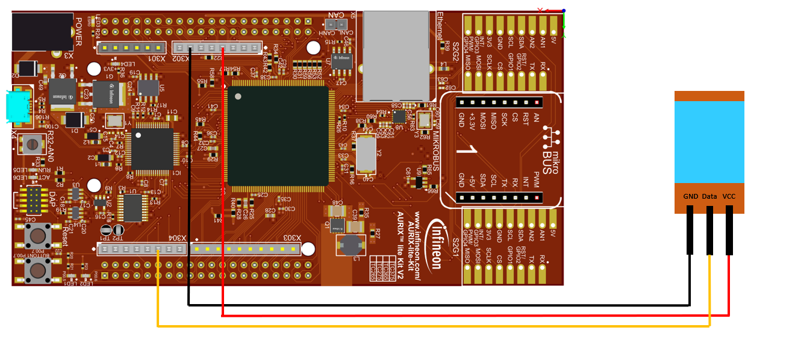
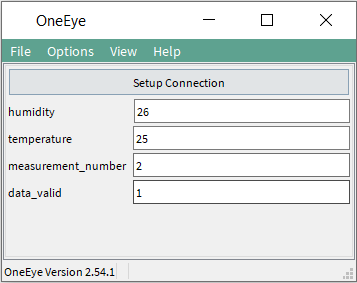

  

# iLLD_TC375_ADS_DHT11
**This project is a simple example of how to read the data from the temperature/humidity sensor DHT11 and visualize it using OneEye**

## Device  
The device used in this example is AURIX&trade; TC37xTP_A-Step

## Board  
The board used for testing is the AURIX&trade; TC375 lite Kit V2 (KIT_A2G_TC375_LITE)

## Scope of work 
This project is a simple example of how to read the data from the temperature/humidity sensor DHT11 and visualize it using OneEye

## Introduction
- The startup software is executed
- DHT11 communication is initialized
- Raw data from DHT11 is read, decoded and checked (checksum)
- Data is forwarded to OneEye

## Hardware setup
This code example has been developed for the board AURIX&trade; TC375 lite Kit V2 and the temperature/humidity sensor module DHT11.
 
 

Connect the sensor to the board according to the schematic:

## Implementation
**Startup software:**
- The code is initializing the device through the Startup software libraries provided by the iLLDs (Infineon Low Level Driver)
- Core0 executes the initialization of DHT11 communication
- Core1 and core2 are then running into an empty infinite while loop

**The example works as follows:**  

Every 5 seconds the following steps are executed:
1. Start the communication to sensor
2. Wait for the Acknowledgement signal from sensor
3. Read the raw data from sensor (5 bytes)
4. Decode the raw data (temperature, humidity, checksum)
5. Verify the data (checksum)

An error is detected if the sensor
- is not connected
- does not respond with the Acknowledgement signal after communication is started
- data is not valid

This is achieved by calling *DHT11_read_sensor()*.

## Compiling and programming
Before testing this code example:
- Power the board through the dedicated power connector
- Connect the board to the PC through the USB interface
- Build the project using the dedicated Build button  or by right-clicking the project name and selecting "Build Project"
- To flash the device and immediately run the program, click on the dedicated Flash button 
- Open OneEye - it can be opened either by double-clicking on the configuration file which is provided inside the Libraries folder (.../Libraries/iLLD_TC375_ADS_DHT11.OneEye) or by clicking on the dedicated button 

## Run and Test  
After code compilation and flashing the device, the following content can be observed in the OneEye GUI:

**humidity** value[%]  
**temperature** value[°C]  
**measurement_number** value is incremented with each new measurement     
**data_valid** 1: valid / 0: NOT valid

## References

AURIX&trade; Development Studio is available online:
- <https://www.infineon.com/aurixdevelopmentstudio>
- Use the "Import..." function to get access to more code examples

More code examples can be found on the GIT repository:
- <https://github.com/Infineon/AURIX_code_examples>

For additional trainings, visit our webpage:
- <https://www.infineon.com/aurix-expert-training>

For questions and support, use the AURIX&trade; Forum:
- <https://community.infineon.com/t5/AURIX/bd-p/AURIX>
