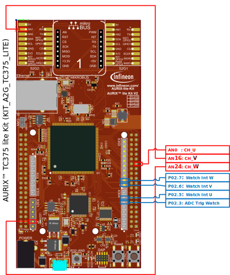
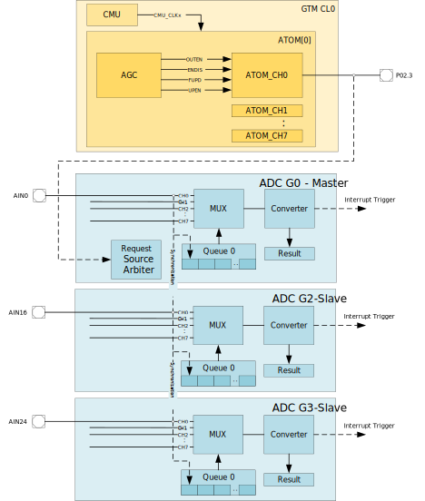
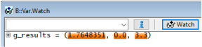

  

# iLLD_TC375_ADS_EVADC_Master_Slave_GTM_ATOM_Trig
**Example of EVADC Master Slave configuration for synchronous sampling of slave channels with master channel**  

## Device  
The device used in this example is AURIX™ TC37xTP_A-Step  

## Board  
The board used for testing is the AURIX™ TC375 lite Kit (KIT_A2G_TC375_LITE)  

## Scope of work   
**To whom this example is useful?**  
When multiple ADC inputs are to be sampled simultaneously, then normally the same trigger signal is used. It is possible that such trigger signal is not connected to all EVADC queues. This example is useful for such use-cases, where some of the EVADC queues are not connected to the same HW trigger.
With this example, three EVADC channels sample the analog input synchronously at the same time. Here the different groups are configured with master slave configuration, where only the master is triggered by GTM output.

## Introduction  
**Analog Inputs of EVADC**  
The Enhanced Versatile Analog-to-Digital Converter (EVADC) provides a series of analog input channels connected to several clusters of Analog/Digital Converters using the Successive Approximation Register (SAR) principle to convert analog input values (voltages) to discrete digital values.

**GTM ATOM Timers**  
The Generic Timer Module (GTM) is a modular timer unit designed to accommodate many timer applications. The ARU-connected Timer Output Module (ATOM), which is part of the GTM, is able to generate complex output signals. The Clock Management Unit (CMU) is responsible for clock generation of the GTM.  
In this example ATOM channel is used to produce the trigger signal for EVADC queue.

## Hardware setup  
This code example is developed for the board TC375 lite Kit (KIT_A2G_TC375_LITE).  
Following picture shows the connection points where the analog inputs are provided. The digital pins are needed as shown here only to observe the timing behavior.
 
  

## Implementation  
Below picture shows an overview of the implementation of connections between important blocks and other resources of the micro-controller to understand the example.

**Initialization of the EVADC**  
As detailed above, the purpose of this example is to show the EVADC groups connected as master and slave with synchronous trigger possibility.
- Group 0 (G0) is configured as master
    - AN0 (CH0 of G0) is connected to the analog signal U. This channel acts as trigger
    - This channel is configured to the Queue 0
    - G0 is triggered by GTM ATOM output (GTM ADC trigger 3: EVADC Trigger Source 11)
- Group 2 (G2) is configured as slave associated to master group G0
    - AN16 (CH0 of G2) is connected to the analog signal V. This channel synchronized to CH0 of G0
- Group 3 (G3) is configured as slave associated to master group G0
    - AN24 (CH0 of G2) is connected to the analog signal W. This channel synchronized to CH0 of G0
- All the above 3 ADC channels are configured with result interrupt. Upon the interrupt, the results from each of these channels is read to global array *g_results[x]*, where x= 0: Signal U, x= 1: Signal V and x= 2: Signal W

**Initialization of the Trigger Signal (PWM)**  
- GTM is enabled with default clock (200 MHz) and CMU0 is configured for 200MHz.
- CMU0 clocks the ATOM channels
- ATOM0.CH0 is configured to produce the PWM signal with 20kHz
- The output is connected to Trigger 3 and also to the pin P02.3  

## Compiling and programming
Before testing this code example:  
- Power the board through the dedicated power connector 
- Build the project using ADS
- Connect the debugger
- Flash the code on the device

## Run and Test   
Connect the AN0, AN16 and AN24 (Refer to the "Hardware setup" section for pin connections) with known voltage sources.
Run the program, observe the ADC conversions happening at the debugger watch via result array <b><i>g_results</i></b> as in the picture below.  

## References  

AURIX™ Development Studio is available online:  
- <https://www.infineon.com/aurixdevelopmentstudio>  
- Use the "Import..." function to get access to more code examples  

More code examples can be found on the GIT repository:  
- <https://github.com/Infineon/AURIX_code_examples>  

For additional trainings, visit our webpage:  
- <https://www.infineon.com/aurix-expert-training>  

For questions and support, use the AURIX™ Forum:  
- <https://community.infineon.com/t5/AURIX/bd-p/AURIX>  
