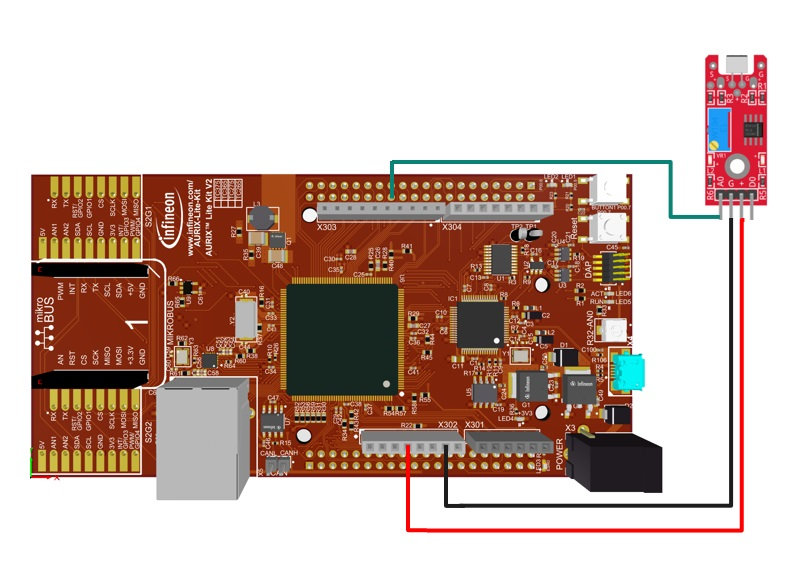

  

# iLLD_TC375_ADS_FFT_Frequency_Analyzer_Microphone
**CPU0 sets the analog input channel and reads the output of a microphone using CCU6 generated interrupts. Once the buffer is filled CPU1 computes the Fast Fourier Transform (FFT).**

## Device  
The device used in this example is AURIX™ TC37xTP_A-Step

## Board  
The board used for testing is the AURIX™ TC375 lite Kit (KIT_A2G_TC375_LITE)  

## Scope of work
This code example explains how to connect a microphone type KY-038 to the evaluation board, to collect analog sample and to apply a FFT to the data collected.
The microphone type KY-038 is connected to the board with GND, 3.3 V and Analog Out pins.
Capture/Compare Unit 6 (CCU6) is used to generate a timed interrupt.
The Enhanced Versatile Analog-to-Digital Converter (EVADC) group 0 is used to read a value on channel 1. This channel is connected to port pin AN1. The reading is performed by the interrupt routine triggered by CCU6.
Each analog reading is stored in a buffer, once it is filled, a flag is set and the FFT is performed.
 
## Introduction  
- The Enhanced Versatile Analog-to-Digital Converter (EVADC) provides analog inputs to acquire signals 
- A microphone type KY-038 is connected to GND, 3.3 V and EVADC Analog channel 1
- Capture/Compare Unit 6 is used to generate interrupts with a fixed timebase and inside interrupt service routine analog channel readings are performed
- Radix-2 FFT algorithm, provided by Infineon Low Level Drivers (iLLDs), is performed once the buffer is filled with analog samples

## Hardware setup  
This code example has been developed for the AURIX™ TC375 Lite Kit (KIT_A2G_TC375_LITE). 
In this example, the pin AN1 is connected to the analog output of KY-038 microphone. GND and 3.3 V pins of the board are connected to microphone power supply inputs. 
The board should be connected to the PC via USB to allow flashing and debugging.

 

## Implementation  
**Configure the project**  
This project needs: 
- CCU6 configuration to create interrupts with fixed frequency,
- ADC configuration to read the output of the microphone.
- A buffer to store the readings from analog input

**Configuration of the CCU6 module**  
Configuration of the CCU6 Timer is done in the <i>`init_CCU6()`</i> function by initializing an instance of the <i>*IfxCcu6_Timer_Config*</i> structure, which contains the following fields:
- <i>*timer*</i> – a parameter that allows to choose which of the two timers to configure. In this case, T13 is the master Timer and T12 is used as slave for its trigger.
- <i>*base*</i> – a structure that allows to set:
    - <i>*t12frequency*</i> – input clock frequency in Hz of the Timer T12
    - <i>*waitingTime*</i> – 16-bit register that determines the maximum count value for the Timer T12. It is used as value for the period register, which represents the waiting time in ticks before a new trigger event occurs for Timer T13
    - <i>*t13frequency*</i> – input clock frequency in Hz of the Timer T13
    - <i>*t13period*</i> – 16-bit register that determines the maximum count value for the Timer T13 
- <i>*trigger*</i> – a structure for configuring the triggers for both timers
      - <i>*t13InSyncWithT12*</i> – allows synchronous operations between the two timers
- <i>*timer13*</i> – a structure that allows to:
     - <i>*t12SyncEvent*</i> – set the Timer T12 event that represents the Timer T13 trigger
     - <i>*t12SyncDirection*</i> – define if a trigger event is to be considered valid based on the counting direction of the Timer T12

The functions used for CCU6 configuration are:
- <i>`IfxCcu6_Timer_initModuleConfig()`</i> – fills the configuration structure with default values 
- <i>`IfxCcu6_Timer_initModule()`</i> – initializes the timer module with the user configuration
- <i>`IfxCcu6_enableInterrupt()`</i> and <i>`IfxCcu6_routeInterruptNode()`</i> – indicate which event generates the Interrupt Service Request and on which Service Request line. This enables the CCU6 to trigger an ADC conversion without the CPU intervention
- <i>`IfxCcu6_enableSingleShotMode()`</i> – configures the timer to count in single shot mode
- <i>`IfxCcu6_Timer_start()`</i> – starts the timer

The above functions can be found in the iLLD headers <i>*IfxCcu6_Timer.h*</i> and <i>*IfxCcu6.h*</i>

**Configuration of the EVADC**  
The configuration of the EVADC is done in the <i>`init_EVADC()`</i> function in three different steps:
- Configuration of the EVADC module
- Configuration of the EVADC group
- Configuration of the EVADC channel

When both the CCU6 and EVADC modules are configured, a single scan sequence is triggered by the CCU6 timer T13 period match event.
All the functions used for configuring the EVADC module, group and channel can be found in the iLLD header <i>*IfxEvadc_Adc.h*</i>.

**Configuration of the EVADC module**  
The functions used for configuring the EVADC module are:
- <i>`IfxEvadc_Adc_initModuleConfig()`</i> – initializes the EVADC module configuration structure with the default values
- <i>`IfxEvadc_Adc_initModule()`</i> – initializes the EVADC module with the user configuration, which in this case is the default configuration

**The creation of the buffer and the call of FFT function**  
To perform a meaningful FFT a buffer needs to be filled with samples taken at a known sampling frequency keeping in mind Nyquist–Shannon sampling theorem. In this case only a part of audible spectrum (about 30 to 16 kHz) is analyzed so the sample rate is set to 20 kHz.
The function used to compute the FFT transform is <i>`Ifx_FftF32_radix2()`</i> that can be found in the iLLD header <i>*Ifx_FftF32.h*</i>, its input parameters are:
- <i>*R*</i> pointer to <i>*cfloat32*</i> array that contains the result of FFT
- <i>*X*</i> pointer to <i>*cfloat32*</i> array that contains measures
- <i>*nX*</i> size of array, which defines also the frequency resolution of FFT (fc/nX), must be power of 2 

To allow calculation and inspection of result a few variables are defined:
- <i>*g_AnalogSamplesBuffer*</i> containing measurements
- <i>*g_AnalogSamplesFFT*</i> containing result of transform, size of array must be power of 2;
- <i>*g_FFTAmplitude*</i> containing amplitude of frequency components (sqrt(Re^2+Im^2));

## Compiling and programming
Before testing this code example:
- Power the board through the dedicated power connector
- Connect the board to the PC through the USB interface
- Build the project using the dedicated Build button  or by right-clicking the project name and selecting "Build Project"
- To flash the device and immediately run the program, click on the dedicated Flash button   

## Run and Test  
Start a debug session and resume execution of all cores, samples coming from analog port connected to the microphone are stored in <i>*g_AnalogSamplesBuffer*</i> array until it is filled, at this point a flag is raised and the FFT computation starts.
After FFT calculation flag is reset and process begins again. 
To inspect result of calculation, add variables <i>*g_AnalogSamplesFFT*</i> and <i>*g_FFTAmplitude*</i> by dragging and dropping them in the Expression view.
Suspend the execution and read the results.
<i>*FFT_RESOLUTION*</i> must be a power of 2 and can be used to increase or decrease the FFT resolution. To validate result you can place a breakpoint on row 226 of <i>*FFT_CCU6.c*</i> start execution copy buffers <i>*g_AnalogSamplesBuffer*</i> and <i>*g_AnalogSamplesFFT*</i> content and compare calculation with an external FFT calculation tool (e.g. Excel or Matlab)

 

## References  

AURIX™ Development Studio is available online:  
- <https://www.infineon.com/aurixdevelopmentstudio>  
- Use the "Import..." function to get access to more code examples  

More code examples can be found on the GIT repository:  
- <https://github.com/Infineon/AURIX_code_examples>  

For additional trainings, visit our webpage:  
- <https://www.infineon.com/aurix-expert-training>  

For questions and support, use the AURIX™ Forum:  
- <https://community.infineon.com/t5/AURIX/bd-p/AURIX>  
