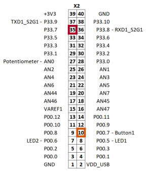
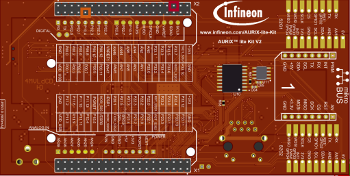
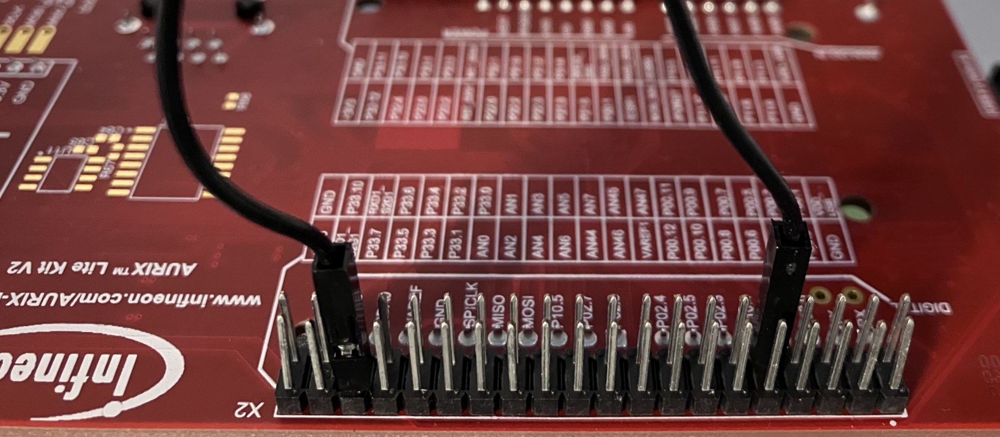

  

# iLLD_TC375_ADS_FreeRTOS_Basic  
**This example shows how to get started with using the AURIX™ FreeRTOS port**

## Device  
The device used in this example is AURIX™ TC37xTP_A-Step

## Board  
The board used for testing is the AURIX™ TC375 lite kit V2 (KIT_A2G_TC375_LITE)

## Scope of work
This example explores FreeRTOS usage on AURIX™ TC375 using two simple tasks and one interrupt

## Introduction  
- One task toggles LED1 every 250ms
- LED2 is toggled when a BUTTON1 is pressed
    - A task waits indefinitely for a notification and then toggles an LED2
    - BUTTON1 triggers an interrupt and the corresponding ISR then notifies the task

## Hardware setup 
This code example has been developed for the AURIX™ TC375 lite kit V2. 

The button (BUTTON1) is connected to P00.7, which cannot generate an external interrupt. So, on the X2 header on the bottom side of the lite kit, `P00.7` needs to be connected to `P33.7`, which *can* trigger an external interrupt. BUTTON1 can now be used to trigger an external interrupt when P33.7 is configured as the interrupt source.

For more details about ERU configuration, please refer to the **AURIX™ User Manual** or the "**ERU_Interrupt_1 for KIT_AURIX_TC375_LK**" code example; the corresponding links are provided in the *References* section. 

&nbsp;&nbsp;&nbsp;
  
 

## Implementation
**Startup software:**
- The code initializes the device through the Startup software libraries provided by the iLLDs (Infineon Low Level Driver)
- Core0 executes this code example, including FreeRTOS and the tasks for the "*app*" for each LED
- Core1 and core2 are then running into an empty infinite while loop

**The example works as follows...**

- The following FreeRTOS tasks and interrupts are used:
    1. **APP LED1**  
            - Task function: `task_app_led1(..)` in `App_Led1.c`  
            - The `app_init(..)` function is called before the task enters its infinite loop. Initialization of P00.5 as an output for driving LED1 is done here
            - Inside the infinite loop, LED1 is toggled once every 250ms
    2. **APP LED2**  
            - Task function: `task_app_led2` in `App_Led2.c`  
            - The `app_init(..)` function is called before the task enters its infinite loop. Initialization of P00.6 as an output for driving the LED2 is done here. Additionally, the initialization of an ERU interrupt for input P33.7 is also configured here. Only falling edge detection is enabled, so the interrupt will be triggered only when BUTTON1 is pressed (release has no effect)  
            - Inside the infinite loop, waits indefinitely for a task notification for ERU ISR
    3. **ERU Int0 ISR**  
            - `SCUERU_Int0_Handler` in `App_Led2.c`  
            - Triggered when BUTTON1 is pressed. Sends a task notification to the "APP LED2" task then yields from the ISR

## Run and Test
- Compile the code using the **Build Active Project** button () in the toolbar or by right-clicking the project name and selecting "Build Project" (this code example _has_ to be the active project)
- Connect the lite kit to the PC using a micro-USB cable
- Click the **Debug Active Project** button () to flash and debug the project

Once the debugger opens, the code will stop at a default startup breakpoint, click  or press F8 to continue. LED1 should start blinking with a period of 250ms and pressing BUTTON1 should toggle the state of LED2.

## References  

AURIX™ Development Studio is available online:  
- <https://www.infineon.com/aurixdevelopmentstudio>  
- Use the "Import..." function to get access to more code examples  

AURIX™ TC3xx User Manual:
- Part 1: <https://www.infineon.com/dgdl/Infineon-AURIX_TC3xx_Part1-UserManual-v02_00-EN.pdf?fileId=5546d462712ef9b701717d3605221d96>
- Part 2: <https://www.infineon.com/dgdl/Infineon-AURIX_TC3xx_Part2-UserManual-v02_00-EN.pdf?fileId=5546d462712ef9b701717d35f8541d94>

ERU_Interrupt_1 for KIT_AURIX_TC375_LK code example:
- <https://www.infineon.com/dgdl/Infineon-ERU_Interrupt_1_KIT_TC375_LK-Training-v01_00-EN.pdf?fileId=5546d4627883d7e00178a2b1b5053878>

FreeRTOS Quick Start Guide:
- <https://www.freertos.org/FreeRTOS-quick-start-guide.html>

More code examples can be found on the GIT repository:  
- <https://github.com/Infineon/AURIX_code_examples>  

For additional trainings, visit our webpage:  
- <https://www.infineon.com/aurix-expert-training>  

For questions and support, use the AURIX™ Forum:  
- <https://community.infineon.com/t5/AURIX/bd-p/AURIX>  

