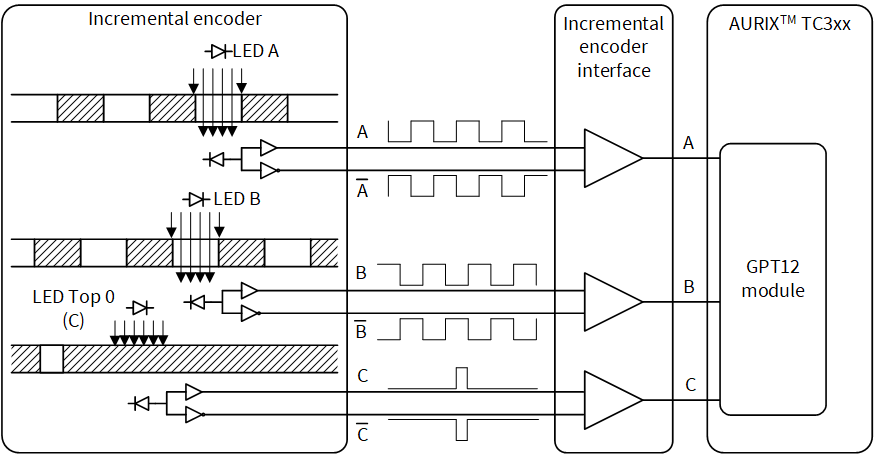
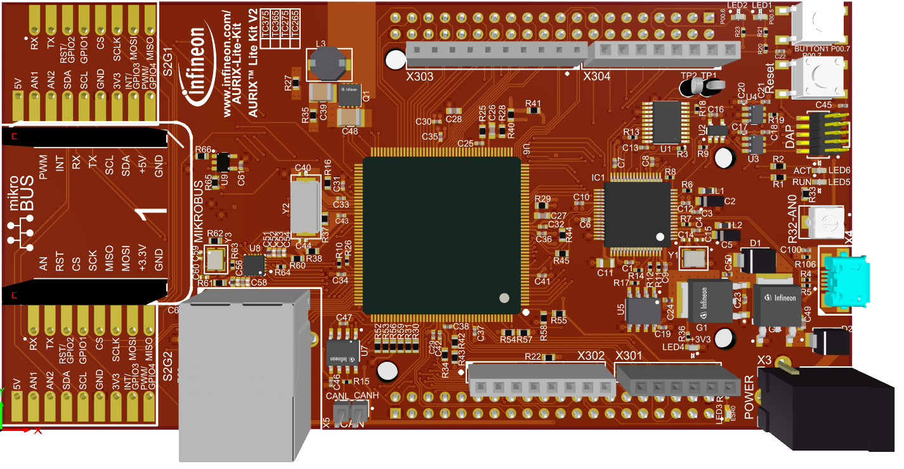
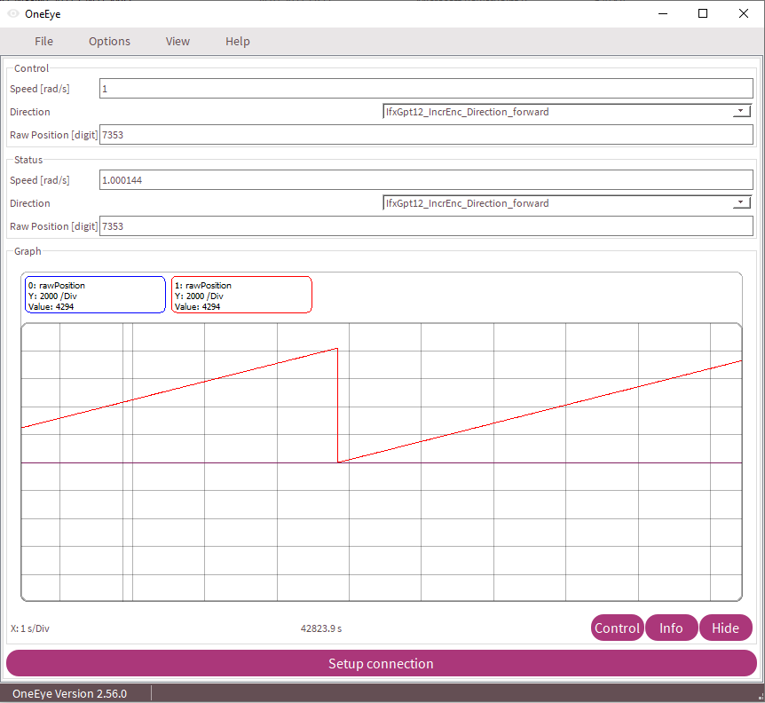

  

# iLLD_TC375_ADS_GPT12_Incremental_Encoder_1  
**The GPT12 is configured to support incremental encoder. The incremental encoder signals are emulated using GPIOs.**  

## Device  
The device used in this example is AURIX&trade; TC37xTP_A-Step

## Board  
The board used for testing is the AURIX&trade; TC375 Lite Kit (KIT_A2G_TC375_LITE)

## Scope of work  

The incremental encoder signals are emulated using GPIOs. Those signals are connected to GPT12 timer T3 and timer T4 inputs. Timer T3 capture encoder A and B signals, while timer T4 is used to capture encoder index signal.

## Introduction  

An incremental encoder contains LED emitters, integrated circuits with light detectors and output circuitry. A disk with a markings pattern on its surface rotates between the emitter and detector IC, thus allowing and blocking the light of the emitter from reaching the detector IC. The outputs of the detector IC could be single-ended and differential signals. There are three output signals. Two of them provide a square wave signal with a 90 degree phase shift. The third one generates once per revolution a short pulse for synchronization.

  

The General Purpose Timer Unit (GPT12) consists of two GPT blocks (GPT1 and GPT3). Each block has a multifunctional timer structure which incorporates several 16-bit timers.

Block GPT1 contains three timers: The core timer T3 and two auxiliary timers T2 and T4.Each timer of block GPT1 can run in one of four modes: Timer Mode, Gated Timer Mode, Counter Mode or Incremental Interface Mode. All timers can count up or down.

Block GPT2 contains two timers: The core timer T6 and auxiliary timer T5. Both timers T5 and T6 of block GPT2 can run in one of 3 basic modes: Timer Mode, Gated Timer Mode, or
Counter Mode. All timers can count up or down.

## Hardware setup  
This code example is developed for the board AURIX&trade; TC375 Lite Kit (KIT_A2G_TC375_LITE)

## Implementation  

** Configuring GPT12 Module**

Configuration of the GPT12 is done once in the function *initGpt12Timer()* by the following steps:
- Enable GPT12 module by calling the iLLD function *IfxGpt12_enableModule()*
- Set the GPT1 prescaler with the iLLD function *IfxGpt12_setGpt1BlockPrescaler()*
- Set the GPT2 prescaler with the iLLD function *IfxGpt12_setGpt2BlockPrescaler()*
- Initialize an instance of the structure *IfxGpt12_IncrEnc_Config* with the iLLD function *IfxGpt12_IncrEnc_initConfig()*
- Modify *IfxGpt12_IncrEnc_Config* acording to application needs
- Initialize the Incremental Encoder handle with the iLLD function *IfxGpt12_IncrEnc_init()*
- Set the timer T2 mode of operation to reload mode with the iLLD function *IfxGpt12_T2_setMode()*
- Set an uint16 reload value with the iLLD function *IfxGpt12_T2_setTimerValue()* (the register has 16-bit length)
- Set the input edge selection for the reload mode of the T2 timer with the iLLD function *IfxGpt12_T2_setReloadInputMode()*

The above configuration functions are provided by the iLLD header *IfxGpt12_IncrEnc.h*.

**The GPT12 Interrupt Service Routine (ISR)**

The GPT12 ISR implemented in this example contains the following:
- Increment *g_intCount*
- Increment or decrement numbers of turns by calling the iLLD function *IfxGpt12_IncrEnc_onZeroIrq()* 

The above function is provided by the iLLD header *IfxGpt12_IncrEnc.h*.

## Compiling and programming
Before testing this code example:  
- Power the board through the dedicated power connector 
- Connect the board to the PC through the USB interface
- Build the project using the dedicated Build button  or by right-clicking the project name and selecting "Build Project"
- To flash the device and immediately run the program, click on the dedicated Flash button   

## Run and Test   

After code compilation and flashing the device open OneEye configuration by double clicking on: Libraries/ iLLD_TC375_ADS_GPT12_Incremental_Encoder_1.OneEye or click on OneEye button within Aurix Development Studio.

Change Speed [rad/s] in control part (requested speed) and observe aquired Speed [rad/s] in Status part. Requested raw position (blue) and acquired position (red) could be observed in Graph.

  

## References  

AURIX&trade; Development Studio is available online:  
- <https://www.infineon.com/aurixdevelopmentstudio>  
- Use the "Import..." function to get access to more code examples  

More code examples can be found on the GIT repository:  
- <https://github.com/Infineon/AURIX_code_examples>  

For additional trainings, visit our webpage:  
- <https://www.infineon.com/aurix-expert-training>  

For questions and support, use the AURIX&trade; Forum:  
- <https://community.infineon.com/t5/AURIX/bd-p/AURIX> 
