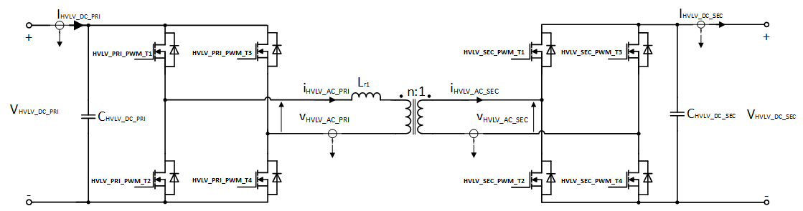

  

# iLLD_TC375_ADS_GTM_ATOM_Dual_Active_Bridge_PWM_1 
 
**The GTM ATOM is configured to generate a PWM signals for Dual Active Bridge (DAB) converter.**  

## Device  
The device used in this example is AURIX&trade; TC37xTP_A-Step

## Board  
The board used for testing is the AURIX&trade; TC375 Lite Kit (KIT_A2G_TC375_LITE)

## Scope of work  

The states of the 8 pins are controlled by the PWM signals generated by the Generic Timer Module (GTM) in-built ARU-Connected Timer Output Module (ATOM). All signals are synchronous to each other, edge aligned, phase shifted and with
dead-times (positive/negative) for the complementary pairs.

## Introduction  

The Generic Timer Module (GTM) is a modular timer unit designed to accommodate many timer applications.

The GTM module is capable of driving different kinds of pulse-width-modulation (PWM) with and without
dead time.

The GTM has an in-built Advanced Router Unit (ARU) that can be used to exchange specific data between sub-modules without CPU interactions.

The ARU-connected Timer Output Module (ATOM), which is part of the GTM, is able to generate complex output signals.

The Clock Management Unit (CMU) is responsible for clock generation of the GTM. The Configurable Clock Generation Subunit (CFGU) provides eight clock sources for the GTM submodules: Timer Input Module (TIM), Time Base Unit (TBU), Monitor Unit(MON) and ATOM.

**Dual Active Bridge**

 

The above shown figure depicts a typical Nonresonant Single-Phase Dual-Active-Bridge DC-DC Converter topology (SP-DAB-DC-DC).
The SP-DAB-DC-DC is a bidirectional DC-DC converter. In this example, the left side is considered as primary and the right side as secondary. The direction of charging (*IfxPrim2Sec*, *IfxSec2Prim*) is changed based on selected phase shift.

This example demonstrates Single Phase Shift (SPS) method of modulation. Inner phases of primary (HVLV_PRI_PWM_T1, HVLV_PRI_PWM_T3) and secondary (HVLV_SEC_PWM_T1, HVLV_SEC_PWM_T3) are 
shifted to each other with a fixed angle Pi, while the transformed current can be varied through shifting secondary phase (HVLV_SEC_PWM_T1) with respect to primary phase (HVLV_PRI_PWM_T1) with an
outer phase angle (within the range from -Pi to Pi). 

## Hardware setup  
This code example is developed for the board AURIX&trade; TC375 Lite Kit (KIT_A2G_TC375_LITE)

## Implementation  

When using iLLDs, the configuration of modules can be done using a structure storing the needed parameters. Such structures are provided by iLLDs together with APIs that can be used to fill them with default values. The user can then modify the configuration as needed and apply it.

**GTM configuration** 
   
The *IfxGtm_Pwm.h* iLLDs provide the GTM PWM driver to configure required peripheral resources and drive them to produce the PWM waveform.
PWM drivers are initialized and driven by the  TriCore&trade; core.
  
The *initGtmAtomDAB* configuration sequence is the following:
* Initialization of the GTM Module
* Configuration of the CMU-CLOCK0 for the ATOM usage
* Configuration of the PWM channel groups to produce 4 complementary pair signals and 1 master channel
* Initialization of the drivers  

Following PWM characteristics are enabled/configured with this example:

<table>
    <tbody>
        <tr>
            <td><b>PWM Type</b></td>
            <td>Edge Aligned</td>
        </tr>
        <tr>
            <td><b>Frequency</b></td>
            <td>100 kHz</td>
        </tr>
        <tr>
            <td><b>Polarity</b></td>
            <td>Duty-On High</td>
        </tr>
        <tr>
            <td><b>Complementary Output</b></td>
            <td>Enabled (opposite polarity)</td>
        </tr>
        <tr>
            <td><b>DTM enabled</b></td>
            <td>
                <table>
                    <tbody>
                        <tr>
                            <td><b>Channel</b></td>
                            <td><b>Rising Edge</b></td>
                            <td><b>Falling Edge</b></td>
                        </tr>
                        <tr>
                            <td>CH0</td>
                            <td>0.0uS</td>
                            <td>0.0uS</td>
                        </tr>
                        <tr>
                            <td>CH1</td>
                            <td>0.5uS</td>
                            <td>0.5uS</td>
                        </tr>
                        <tr>
                            <td>CH2</td>
                            <td>0.5uS</td>
                            <td>0.5uS</td>
                        </tr>
                          <tr>
                            <td>CH3</td>
                            <td>0.5uS</td>
                            <td>0.5uS</td>
                        </tr>
                         <tr>
                            <td>CH4</td>
                            <td>0.5uS</td>
                            <td>0.5uS</td>
                        </tr>
                    </tbody>
                </table>
            </td>
        </tr>
    </tbody>
</table>

The table below provides the mapping between the PWM signal and the Port Pins:  

<table>
    <tbody>
        <tr>
            <td><b>&emsp;PWM Signal</b></td>
            <td><b>&emsp;Pin Mapping</b></td>
        </tr>
         <tr>
            <td>&emsp;MASTER</td>
            <td>&emsp;P33.10</td>
        </tr>
        <tr>
            <td>&emsp;HVLV_PRI_PWM_T1</td>
            <td>&emsp;P33.05</td>
        </tr>
        <tr>
            <td>&emsp;HVLV_PRI_PWM_T2</td>
            <td>&emsp;P33.12</td>
        </tr>
        <tr>
            <td>&emsp;HVLV_PRI_PWM_T3</td>
            <td>&emsp;P33.06</td>
        </tr>
        <tr>
            <td>&emsp;HVLV_PRI_PWM_T4</td>
            <td>&emsp;P33.13</td>
        </tr>
        <tr>
            <td>&emsp;HVLV_SEC_PWM_T1</td>
            <td>&emsp;P00.12</td>
        </tr>
        <tr>
            <td>&emsp;HVLV_SEC_PWM_T2</td>
            <td>&emsp;P33.11</td>
        </tr>
          <tr>
            <td>&emsp;HVLV_SEC_PWM_T3</td>
            <td>&emsp;P33.08</td>
        </tr>
        <tr>
            <td>&emsp;HVLV_SEC_PWM_T4</td>
            <td>&emsp;P33.07</td>
        </tr>
    </tbody>
</table>

**GTM update**   
 
Once the GTM is configured and started, a duty cycle update is performed every PWM interrupt in the *updateEgtmAtomDABPhase()* function if *g_egtmAtomDAB.rtState* is equal to *IfxRun*.

## Compiling and programming
Before testing this code example:  
- Power the board through the dedicated power connector 
- Connect the board to the PC through the USB interface
- Build the project using the dedicated Build button  or by right-clicking the project name and selecting "Build Project"
- To flash the device and immediately run the program, click on the dedicated Flash button   

## Run and Test   
After code compilation and flashing the device, observe the PWM signals.

  

The PWM signals can be observed using a logic analyzer or an oscilloscope connected to the pins shown in the picture above.

The Parameters of the Modulation and charging direction can be varied via either OneEye Tool or Debugger. To open OneEye configuration double click on GTM_ATOM_Dual_Active_Bridge_PWM_1.OneEye or click on OneEye button within Aurix Development Studio.

The following video shows the generated PWM signals:

<video width="800" height="800" controls>
  <source src="./Images/DAB_PWMs.mp4" type="video/mp4"/>
</video> 

## References  

AURIX&trade; Development Studio is available online:  
- <https://www.infineon.com/aurixdevelopmentstudio>  
- Use the "Import..." function to get access to more code examples  

More code examples can be found on the GIT repository:  
- <https://github.com/Infineon/AURIX_code_examples>  

For additional trainings, visit our webpage:  
- <https://www.infineon.com/aurix-expert-training>  

For questions and support, use the AURIX&trade; Forum:  
- <https://community.infineon.com/t5/AURIX/bd-p/AURIX>  
