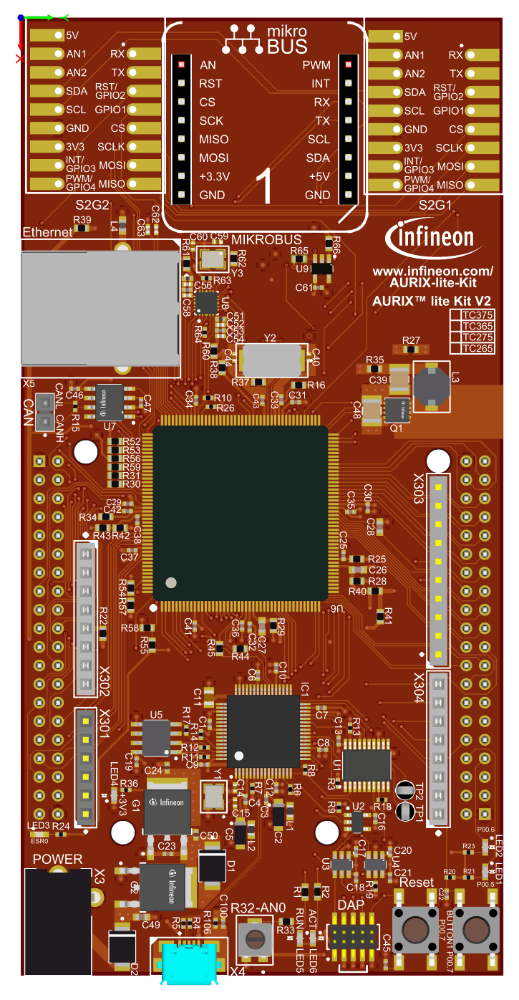
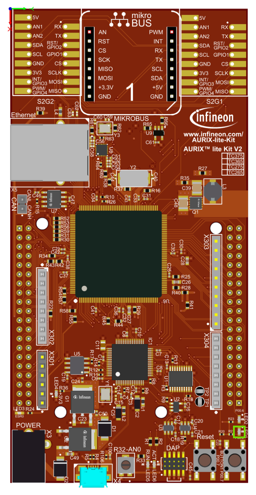

  

# iLLD_TC375_ADS_GTM_TOM_PWM_2  
**GTM TOM is used to generate a PWM signal, which is driving the intensity of an LED.**  

## Device  
The device used in this example is AURIX&trade; TC37xTP_A-Step

## Board  
The board used for testing is the AURIX&trade; TC375_LITE(KIT_A2G_TC375_LITE)

## Scope of work  
The LED is driven by pin 5 of the port 00. The state of the pin is controlled by the PWM signal generated by the Generic Timer Module (GTM) in-built Timer Output Module (TOM).

## Introduction  
The GTM is a modular timer unit designed to accommodate many timer applications.

It has an in-built TOM that can offer up to 16 independent channels to generate output signals.

The Clock Management Unit (CMU) is responsible for clock generation of the GTM. The Fixed Clock Generation (FXU) is one of its subunits and it provides five predefined non-configurable clocks for GTM modules, including the TOM.

## Hardware setup  
This code example has been developed for the board KIT_A2G_TC375LITE (AURIX&trade; TC375 LITE) :   
  
                             

## Implementation

When using iLLDs, the configuration of modules can be done using a structure storing the needed parameters. Such structures are provided by iLLDs together with APIs that can be used to fill them with default values. The user can then modify the configuration as needed and apply it.
 
**Configuring the TOM** 
 
The *IfxGtm_Pwm.h* iLLDs provide the GTM PWM driver to configure the required peripheral resources and drive them to produce the PWM waveform.
The drivers are initialized and driven by the TriCore&trade; core.
  
The *initGtmTomPwm()* configuration sequence is the following:
* Initialization of the GTM Module
* Configuration of the PWM channel groups to produce PWM signal (GTM Cluster 1, TOM Channel 4 )
* Configuration of the CMU-FXCLK0 for the TOM usage
* Initialization of the drivers  

Following PWM characteristics are enabled/configured with this example:

<table>
    <tbody>
        <tr>
            <td><b>PWM Type</b></td>
            <td>Edge Aligned</td>
        </tr>
        <tr>
            <td><b>Frequency</b></td>
            <td>20 kHz</td>
        </tr>
        <tr>
            <td><b>Polarity</b></td>
            <td>Duty-On High</td>
        </tr>
        <tr>
            <td><b>Complementary Output</b></td>
            <td>Disabled</td>
        </tr>
        <tr>
            <td><b>Dead-Time Module (DTM)</b></td>
            <td>Disabled</td>
        </tr>
        <tr>
            <td><b>Duty cycle</b></td>
            <td>Defined by <i>PWM_DUTY</i></td>
        </tr>
    </tbody>
</table>

**Fading the LED**

The fading of the LED is done in the function *fadeLED()* by repetitively adding or removing a step value to the duty cycle of the PWM.

**Setting the duty cycle**

The setting of the duty cycle is done by calling the function *setDutyCycle()*, which contains the following steps:
- Set the *dutyCycle* parameters of the configuration structure to set the duty cycle for the PWM signal to the desired value
- The duty cycle of the TOM channel is then updated using the iLLD function *IfxGtm_Pwm_updateChannelsDutyImmediate()*

The function *IfxGtm_Pwm_updateChannelsDutyImmediate()* is provided by the iLLD header *IfxGtm_Pwm.h*.

## Compiling and programming
Before testing this code example:  
- Power the board through the dedicated power connector 
- Connect the board to the PC through the USB interface
- Build the project using the dedicated Build button  or by right-clicking the project name and selecting "Build Project"
- To flash the device and immediately run the program, click on the dedicated Flash button   

## Run and Test   
After code compilation and flashing the device, observe the LED (P00.5), which starts fading.

  

## References  
AURIX&trade; Development Studio is available online:  
- <https://www.infineon.com/aurixdevelopmentstudio>  
- Use the "Import..." function to get access to more code examples  

More code examples can be found on the GIT repository:  
- <https://github.com/Infineon/AURIX_code_examples>  

For additional trainings, visit our webpage:  
- <https://www.infineon.com/aurix-expert-training>

For questions and support, use the AURIX&trade; Forum:  
- <https://community.infineon.com/t5/AURIX/bd-p/AURIX>  
