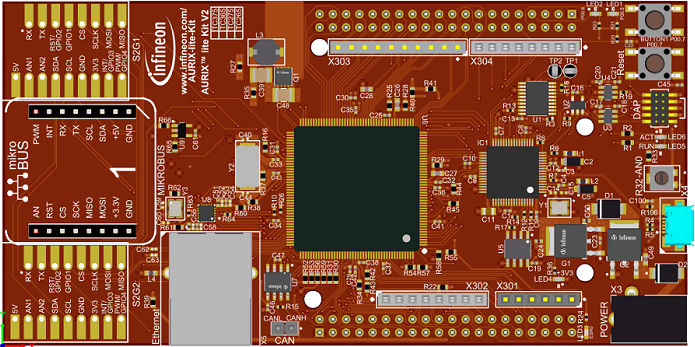
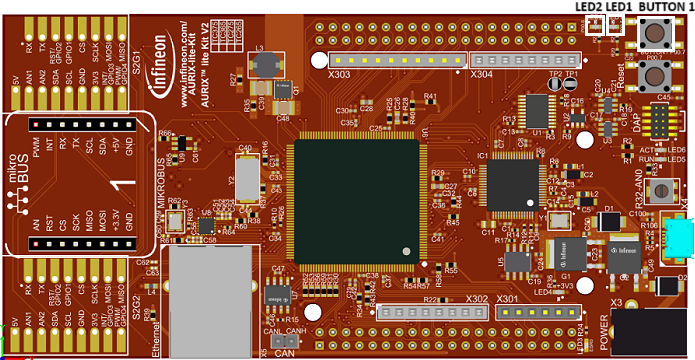

# iLLD_TC375_ADS_ISR_MONITOR
**The code example is about the implementation of ISR monitor safety mechanism**

## Device  
The device used in this example is AURIX&trade; TC37xTP_A-Step

## Board  
The board used in this example is the AURIX&trade; TC375 lite Kit V2 (KIT_A2G_TC375_LITE)

## Scope of work 
The code example explains how to monitor safety related interrupt service routine (ISR).

## Introduction
The Interrupt Router (IR) module schedules interrupts (here called “service requests”) from external resources, internal resources, and the software(SW) to the CPU and the DMA modules (here called “service provider”). For safety application, application software must monitor the missing or unintended service request and accordingly take appropriate action i.e. safety management unit (SMU) alarm etc.

**Note:** There is no legal binding or no Automotive Safety Integrity Level (ASIL) claim, it is just a code example.

## Hardware setup  
This code example has been developed for the board KIT_A2G_TC375_LITE.

## Implementation
This code example contains the implementation of the safety mechanism called *ISR MONITOR*, which is related to the Interrupt Router (IR) module. The application SW must detect the missed or unintended service request for safety related interrupts. When a missed or unintended safety-related interrupt is detected, the application SW must trigger the most appropriate action depending on the application. There are different ways to implement this SM, one of the recommended is a plausibility check on periodic interrupt: certain interrupts are expected periodically (e.g., ATOM 
generates interrupt of every falling or rising edge). Based on this expected rate (or for example, within each Fault Tolerance Time Interval (FTTI)), the application must implement periodic checks for the plausibility of this interrupt, i.e., if an expected interrupt is missing or unintended interrupts occur.

Therefore, Generic Timer Module (GTM) ATOM is used for this purpose, where GTM ATOM is configure to generate interrupt every 250 ms. The System Timer (STM) is used to for task scheduling where interrupt is generated every millisecond. Two failure modes, missing and unintended interrupt, are checked with lower limit and upper limit.

**1. Unintended Interrupt:** 

The unintended interrupt check is done when the ATOM interrupt occurs outside the lower and higher limit i.e. the interrupt comes earlier or later, it is considered as unintended interrupt. Therefore, an appropriate action shall be taken (in this code example LED1 will be ON).

Error can be injected at runtime by pressing **BUTTON 1**, which will generate an extra interrupt. Therefore, **LED1** will be ON accordingly as an alarm indication.

**Note:** 

   Code should be compiled with setting the macro i.e., *#define INJECT_UNINTENDED_INTERRUPT_ERROR to 1* and setting the macro *#define INJECT_MISSING_INTERRUPT_ERROR to 0*.

**2. Missing Interrupt:** 

The ATOM interrupt is check periodically with in lower and high limit i.e. 245 ms to 255 ms. If there is no interrupt occurred during this range, it shall be considered as missing interrupt and an appropriate action shall be perform (in this code example LED2 will be ON).

Error can be injected by pressing **BUTTON 1**, which will stop the ATOM timer and hence no interrupt is generated. Therefore, **LED2** will be ON accordingly as an alarm indication.

**Note:** 

   Code should be completed with setting the marco i.e., *#define INJECT_MISSING_INTERRUPT_ERROR to 1* and setting the macro *#define INJECT_UNINTENDED_INTERRUPT_ERROR to 0*.

## Compiling and programming

Before testing this code example: 
- Connect the board to the PC through the USB interface
- Build the project using the dedicated Build button  or by right-clicking the project name and selecting "Build Project"
- To flash the device and immediately run the program, click on the dedicated Flash button 

## Run and Test

After code compilation and flashing the device, The following attributes can be seen.

Two LEDs on AURIX&trade; TC375 lite Kit V2 board are used for periodic frame cycle time: 
- **LED1**, this LED is used to check the unintended interrupt.
- **LED2**, this LED is used to check the missing interrupt.

In ideal case, both LEDs will be OFF. If any fault occurred, the according LED will be ON. To inject error, press **BUTTON 1** and depending on the state of **Marcos** i.e. 

- *#define INJECT_UNINTENDED_INTERRUPT_ERROR to 1* and *#define INJECT_MISSING_INTERRUPT_ERROR to 0* which will inject a unintended interrupt error accordingly. 
- *#define INJECT_UNINTENDED_INTERRUPT_ERROR to 0* and *#define INJECT_MISSING_INTERRUPT_ERROR to 1* which will inject a missing interrupt error accordingly.

In all other combination of two marcos, there will be no error injection. 

## References 
AURIX&trade; TC375 Safety Lite Kit
- <https://www.infineon.com/aurixtc3xsafetylite> 

AURIX&trade; Application Kit - TC3xx Safety
- <https://www.infineon.com/aurixsafetykit> 

AURIX&trade; Development Studio is available online:  
- <https://www.infineon.com/aurixdevelopmentstudio>  
- Use the "Import..." function to get access to more code examples  

More code examples can be found on the GIT repository:  
- <https://github.com/Infineon/AURIX_code_examples>  

For additional trainings, visit our webpage:  
- <https://www.infineon.com/aurix-expert-training>  

For questions and support, use the AURIX&trade; Forum:  
- <https://community.infineon.com/t5/AURIX/bd-p/AURIX>  
