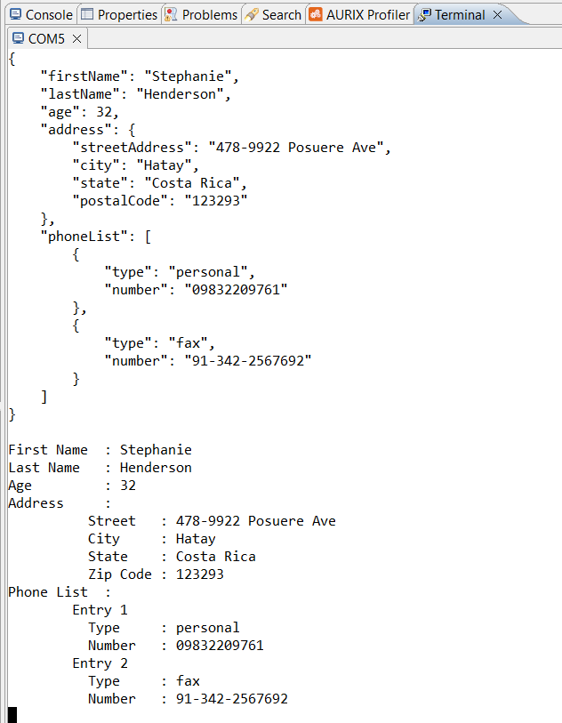

  

# iLLD_TC375_ADS_JSON_Parse_To_Serial
**A JavaScript Object Notation (JSON) document is parsed and the result is sent to the serial terminal.**

## Device  
The device used in this example is AURIX™ TC37xTP_A-Step

## Board  
The board used for testing is the AURIX™ TC375 lite Kit (KIT_A2G_TC375_LITE)  

## Scope of work
A JSON document with nested documents, saved in a global variable, is parsed and the values of its fields
are printed to the serial terminal in another format.

## Introduction  
- JSON is a standard format widely used for data interchange in different application, including Internet of Things (IoT)
- For this example, a simple, lightweight library is used for parsing a JSON document. This library consumes very little memory for the parsing process
- Specific serialio library to override printf behavior is provided for the scope
- The library used for parsing the JSON document is taken from <https://github.com/rafagafe/tiny-json>

## Hardware setup  
This code example has been developed for the AURIX™ TC375 Lite Kit (KIT_A2G_TC375_LITE).  
The board should be connected to the PC via USB, in order to allow the UART connection. 

   

## Implementation  
**Configure the Project**  
Two libraries are required, which can be found in the *Libraries* folder:
- *serialio*, which overrides the standard `printf` function to redirect the output to the serial terminal
- *tiny-json*, which contains the library to parse JSON documents

**Configure the ASCLIN**  
The ASCLIN module is necessary to implement the serial communication with the terminal.

Configuration of the ASCLIN module for UART communication is done in the function `SERIALIO_Init()`, it takes the desired UART baudrate as parameter.  
The desired baudrate can be defined with the macro `UART_BAUDRATE`, whose default value is set to 115200 baud.

**Parsing the JSON**  
When calling the `Process_JSON()` function the JSON document stored in the `JSON_Processing.c:g_JSONDocument` global variable is parsed
by calling the library function `json_create`.  
The function `json_create` takes three arguments in input:
1. The JSON document to be parsed
2. An array of JSON properties (`json_t`), which will store the information about parsed properties
3. The size of the previous array
From the list above, you can see you should always know the maximum number of JSON properties contained in the JSON documents your program need to parse.

**Parsing and validating JSON fields**  
To parse a single JSON field, use the function `json_getProperty`. The output of this function is a `json_t` object that points to the parsed field. 
If the function output is `0`, the field could not be found. 
To check the type of the field (String, numeric, etc), the function `json_getType` can be used.

**Reading JSON field values**  
Once a JSON field has been found, its value can be read using `json_getValue`. This function returns a string representation of the value. 
It is also possible to find a property and read its value at once calling the function `json_getPropertyValue`.

**Nested JSON documents**  
Nested JSON documents can be read by performing the following steps:
1. Obtain a reference to the field by calling `json_getProperty`
2. Optionally check if the type of the property is `JSON_OBJ`
3. Recursively call `json_getProperty` or directly `json_getPropertyValue` on the field reference

**List of JSON documents**  
A list of JSON documents can be read by performing the following steps:
1. Obtain a reference to the list field by calling `json_getProperty`
2. Optionally check if the type of the property is `JSON_ARRAY`
3. Obtain the first element in the list by calling the function `json_getChild`
4. Obtain following elements in the list by calling the function `json_getSibling`

## Run and Test  
For this example, a serial terminal is required for visualizing the text. The terminal can be opened inside the AURIX™ Development Studio using the following icon:  

  

The serial terminal must be configured with the following parameters to enable the communication between the board and the PC:  
- Speed (baud): 115200
- Data bits: 8
- Stop bit: 1

After code compilation and flashing the device, check the open terminal window on AURIX™ Development Studio, which looks like the following:  

  

## References  

AURIX™ Development Studio is available online:  
- <https://www.infineon.com/aurixdevelopmentstudio>  
- Use the "Import..." function to get access to more code examples  

More code examples can be found on the GIT repository:  
- <https://github.com/Infineon/AURIX_code_examples>  

For additional trainings, visit our webpage:  
- <https://www.infineon.com/aurix-expert-training>  

For questions and support, use the AURIX™ Forum:  
- <https://community.infineon.com/t5/AURIX/bd-p/AURIX>  
