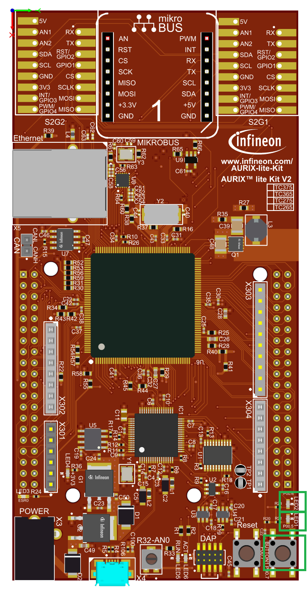

  

# iLLD_TC375_ADS_LED_DoubleClick_Button  
**LED1 and LED2 are controlled by a single button. A single click toggles the state of LED1, a double click toggles the state of LED2.**  

## Device  
The device used in this example is AURIX&trade; TC37xTP_A-Step.  

## Board  
The board used for testing is the AURIX&trade; TC375 lite Kit (KIT_A2G_TC375_LITE).  

## Scope of work  
The state of LED1 and LED2 is controlled by one button, so it is necessary to be able to detect when it is pressed once or twice.  
When the button is pressed, a 300ms timer starts to detect the double click.  
When the timer has expired, the state of the corresponding LED will changes according to the number of times the button has been pressed.  

## Introduction  
- The port of AURIX&trade; can individually be configured either as input or as output  
- When configured as input, the port pin has high impedance. Alternatively, an internal weak pull-up resistor or pull-down resistor can be selected  
- As output the port pin can be configured in push-pull output state or open-drain state  
- The state of a port pin can always be read back, independent whether a port pin is configured as input or output  

## Hardware setup     
This code example has been developed for the board AURIX&trade; KIT_A2G_TC375_LITE.  
 
  

## Implementation  
**Initialization of GPIO**  
The function *init_GPIOs()* configures two port pins to control the LEDs and one port pin to check the button's state:  
- The port pins with the connected LEDs are configured to push-pull output by calling the function *IfxPort_setPinMode()* with the function parameter *IfxPort_Mode_outputPushPullGeneral* (enumerated type value)  
- The LEDs port pin state is set on or off with the functions *IfxPort_setPinHigh()* or *IfxPort_setPinLow()* from the iLLD *IfxPort.h*  
- The Port pin connected to the push button is set to input direction with an internal weak pull-up by calling *IfxPort_setPinMode()* with the function parameter *IfxPort_Mode_inputPullUp*  

All functions above are provided by the iLLD header *IfxPort.h*.  

**Control LED**  
The *control_LED()* function checks if the button is pressed once or twice and toggles the state of the LEDs:  
- The variable *g_buttonPressNumber* is used to count the number of times the button is pressed, so that the program can check whether the button is pressed once or twice  
- The port pins where the LEDs are connected to change their status by using the function *IfxPort_togglePin()*  

All functions are provided by the iLLD header *IfxPort.h*.  

**Check timer**  
The *check_timer()* function controls whether the timer used to detect the double click event is started, and when it has finished it calls the *control_led()* function:  
- The *g_timerStarted* flag is used to check if the timer has already been started  
- The function *isDeadLine()*, which returns true when the timer reaches the deadline, is used to detect when the timer has expired  

The function is provided by the iLLD header *Bsp.h*  

**Control Button**  
The function *control_button()* checks if the button is pressed. To detect the double click a timer of 300ms is started:  
- The variable *g_buttonPressNumber* counts how many times the button is pressed during the 300ms timer  
- The *g_buttonIsAlreadyPressed* flag is used to avoid increasing the number of button clicks when the button is held down  
- The port pin state is read by calling the function *IfxPort_getPinState()*  

The function is provided by iLLD header *IfxPort.h*.  

## Compiling and programming  
Before testing this code example:  
- Connect the board to the PC through the USB interface  
- Build the project using the dedicated Build button  or by right-clicking the project name and selecting "Build Project"  
- To flash the device and immediately run the program, click on the dedicated Flash button   

## Run and Test  
After code compilation and flashing the device, you can observe the following behavior:  
- While the button is pressed once, the LED1 change the status  
- While the button is pressed twice, the LED2 change the status  

## References  
AURIX&trade; Development Studio is available online:  
- <https://www.infineon.com/aurixdevelopmentstudio>  
- Use the "Import..." function to get access to more code examples  

More code examples can be found on the GIT repository:  
- <https://github.com/Infineon/AURIX_code_examples>  

For additional trainings, visit our webpage:  
- <https://www.infineon.com/aurix-expert-training>  

For questions and support, use the AURIX&trade; Forum:  
- <https://community.infineon.com/t5/AURIX/bd-p/AURIX>  
