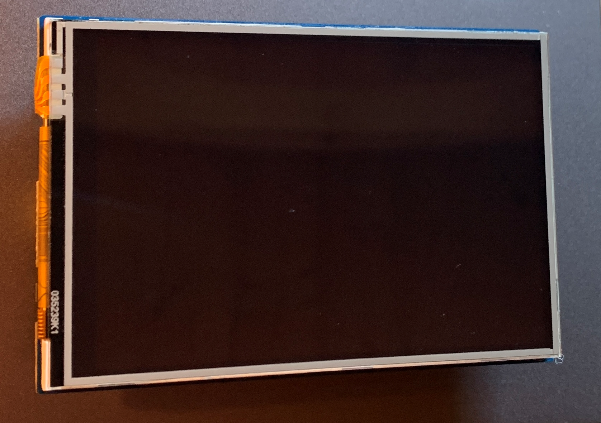
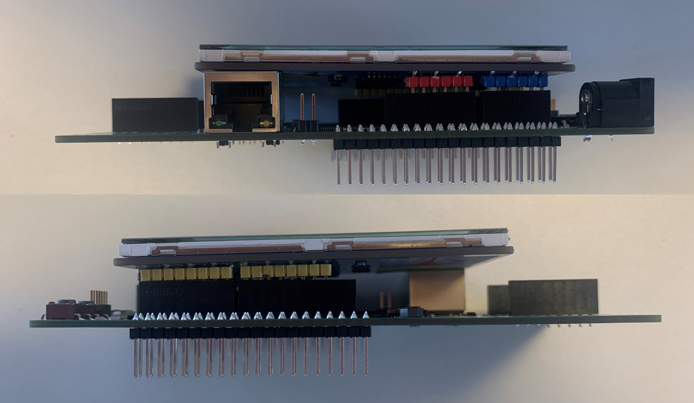

  

# iLLD_TC375_ADS_LVGL_Code_Example_1
**This project is a simple example of how a Thin Film Transistor (TFT) Touch display in combination with the Light and Versatile Graphics Library library (LVGL) can be used in AURIX&trade; projects.**  

## Device  
The device used in this example is AURIX&trade; TC37xTP_A-Step

## Board  
The board used for testing is the AURIX&trade; TC375 lite Kit (KIT_A2G_TC375_LITE)

## Scope of work 
This project is a simple example of how a TFT Touch display in combination with the LVGL library can be used in AURIX&trade; projects.
  
## Introduction  
- The startup software is executed
- System Timer (STM) module is initialized. It is needed to periodically trigger LVGL functions which update the screen content
- LVGL is initialized
- TFT Touch display is initialized. Communication, display size, etc. are configured
- The display content is loaded and periodically updated (if needed)

## Hardware setup  
This code example has been developed for the board AURIX&trade; TC375 lite Kit V2 and the Waveshare 3.5 inch TFT Touch Shield / 320x480 Pixel / XPT2046 Touch Controller. 
 
 

 

## Implementation    
**Startup software:**  
- The code is initializing the device through the startup software libraries provided by the Infineon Low Level Drivers (iLLDs)
- Core0 executes initialization of STM module, LVGL library and TFT Touch display
- The display content is loaded
- Core1 and core2 are then running into an empty infinite while loop    

**The example's display content is created as follows:**
- "Fonts" are assigned and "styles" are initialized. These are needed in order to configure text shown on display
- A "screen" is created and loaded. This is basically the area where content can be added to which is shown on the display
- Two "labels" are created as part of this "screen" in order to display text on the TFT Touch display. The labels are formatted using "fonts" and "styles"
- A "button" is created as part of this "screen". The "button" reacts to click events and counts them

This is achieved by calling *tft_lvgl_create_example()*. 

**Cpu0_Main.c while(1) loop**  
- Checks periodically if there is a TFT Touch display interrupt (e.g. display touched or released, movement detected)
- The X and Y coordinates of the touch event are stored/updated
- LVGL functions are called in order to process a touch event and update screen content (if needed)
 

## Compiling and programming
Before testing this code example:  
- Power the board through the dedicated power connector 
- Connect the board to the PC through the USB interface
- Build the project using the dedicated Build button  or by right-clicking the project name and selecting "Build Project"
- To flash the device and immediately run the program, click on the dedicated Flash button   

## Run and Test  
After code compilation and flashing the device, the following content can be observed on the TFT Touch display:

Verify the functionality of the button by touching it:

  

## References  

AURIX&trade; Development Studio is available online:  
- <https://www.infineon.com/aurixdevelopmentstudio>  
- Use the "Import..." function to get access to more code examples  

More code examples can be found on the GIT repository:  
- <https://github.com/Infineon/AURIX_code_examples>  

For additional trainings, visit our webpage:  
- <https://www.infineon.com/aurix-expert-training>  

For questions and support, use the AURIX&trade; Forum:  
- <https://community.infineon.com/t5/AURIX/bd-p/AURIX>

LVGL Light and Versatile Graphics Library:
- <https://lvgl.io>

Waveshare 3.5 inch TFT Touch Shield / 320x480 Pixel / XPT2046 Touch Controller:
- <https://www.waveshare.com/product/3.5inch-tft-touch-shield.htm>
