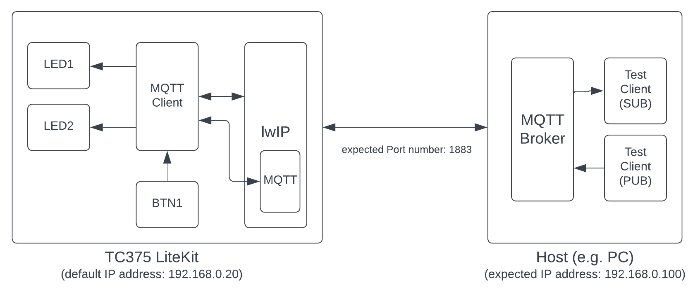
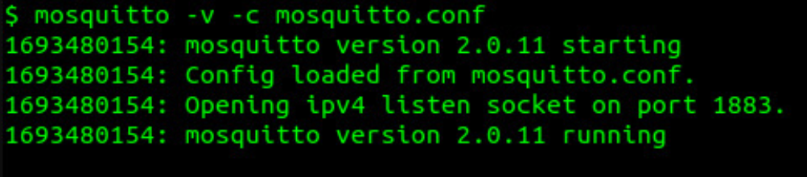
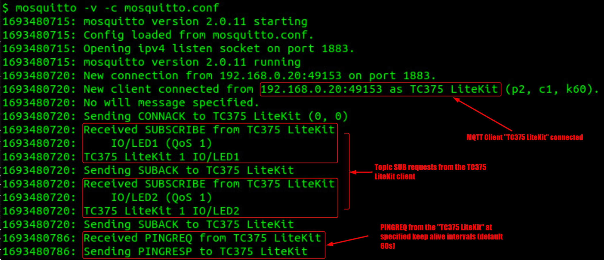
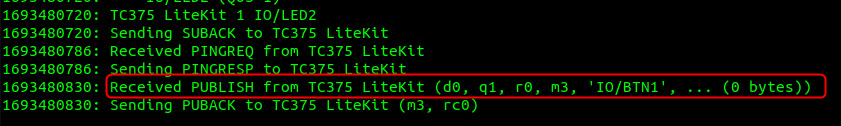
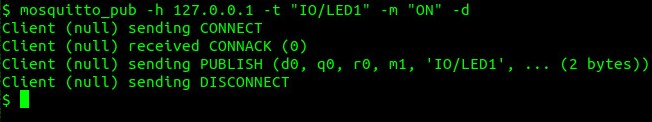
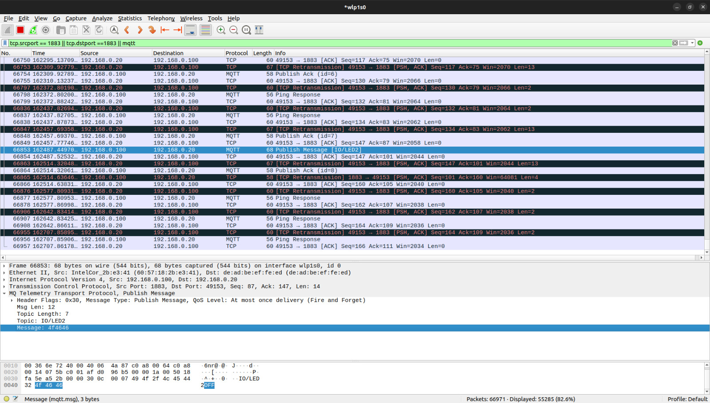

  

# iLLD_TC375_ADS_MQTT_Client_1  
**MQTT client example using the lwIP open source TCP/IP stack**

## Device  
The device used in this example is AURIX™ TC37xTP_A-Step

## Board  
The board used for testing is the AURIX™ TC375 lite kit V2 (KIT_A2G_TC375_LITE)

## Scope of work  
The AURIX™ TC375 Gigabit Ethernet (GETH) is used to run the **lwIP** open source TCP/IP stack. The MQTT client example runs on top of the lwIP MQTT "application". The client subscribes to "IO/LED1" and "IO/LED2" topics, which allow controlling the states of LED1 and LED2 on the TC375 LiteKit via MQTT messages, "ON" or "OFF", published to these topics. If BUTTON1 is pressed, the client publishes an empty message to the "IO/BTN1" topic to indicate that the button was pressed.

## Introduction  
- The Ethernet (GETH) provides connection to a standard IT network using a Realtek PHY and running a TCP/IP stack on the Lite Kit
- The basic MQTT client created in this example relies on anonymous access to the MQTT broker and also does not encrypt traffic and is meant to be run on the local network
- A detailed discussion of MQTT is beyond the scope of this tutorial, but a basic introduction is provided below:
    - An *MQTT Client* refers to publishers (sends messages) and subscribers (receives messages). A client can be both a subscriber and a publisher
    - An *MQTT Broker* is a central hub in the publish/subscribe messaging system; it receives messages from publishers and distributes them to subscribers
    - Messages are grouped by *topics*. Subscribers subscribe to topics and only receive messages for the topics they are subscribed to. Publishers publish messages to certain topics
- The MQTT client in this example identifies itself as <i>`TC375 LiteKit`</i>, uses anonymous access (no username/password), sets a keep alive interval of <i>`60`</i> seconds and doesn't use any LWT (Last Will and Testament) fields
- The TC375 LiteKit has 2 LEDs, LED1 and LED2, and 1 push button, BUTTON1. Topics for the LEDs and buttons are grouped under the "IO/xxx" top level i.e. <i>`IO/LED1`</i>, <i>`IO/LED2`</i> and <i>`IO/BTN1`</i>
- The button status is reported to an MQTT Broker by publishing an empty message to the <i>`IO/BTN1`</i> topic
- The client subscribes to <i>`IO/LED1`</i> and <i>`IO/LED2`</i> topics and sets the states of the LEDs based on contents of the messages, which it expects to be <i>`ON`</i> or <i>`OFF`</i>

**Third-party Packages**
- This code example includes the open source Light Weight TCP/IP (lwIP) package, version 2.1.2. The MQTT client is built using the MQTT API provided in the lwIP source tree.

## Hardware setup 
This code example has been developed for the AURIX™ TC375 Lite Kit (KIT_A2G_TC375_LITE).

  

## Implementation
**Architecture** 

**Configuration**
- The default IP addresses are as follows:
    - TC375 Lite Kit: <i>`192.168.0.20`</i>
    - MQTT Broker: <i>`192.168.0.100`</i>
    - These can be configured in <i>`Cpu0_Main.c`</i> at the top of the <i>`core0_main(...)`</i> function:  
     
    - The MQTT Client communicates with the MQTT Broker using the default MQTT port <i>`1883`</i>. This can be changed by modifying <i>`MQTT_Port`</i> in <i>`Libraries\Ethernet\lwip\src\include\lwip\apps\mqtt.h`</i>

**Startup software:**
- The code initializes the device through the Startup software libraries provided by the Infineon Low Level Drivers (iLLDs)
- Core0 executes this code example, including lwIP
- Core1 and core2 are then running into empty infinite while loops

**The example works as follows...**
- The main loop in <i>`core0_main(...)`</i> loop initializes the MQTT Client as soon as the link is up, which in turn triggers a connection request to the MQTT Broker. It is expected that the broker is already running on the remote host and is ready to accept connections
    - Topic subscription requests are sent after the client successfully establishes an MQTT connection with the broker
    - MQTT connection timeouts or disconnections are not automatically handled so the LiteKit should be reset if the connection needs to be re-established
    - The state machine in the main loop in <i>`core0_main(...)`</i> can be expanded to handle MQTT connection states using the <i>`mqtt_client_connection_status(...)`</i> API provided by the MQTT Client
- The MQTT Client subscribes to <i>`IO/LED1`</i> and <i>`IO/LED2`</i> MQTT topics and allows setting the states of the respective LEDs via messages published to these topics
    - The contents of the messages should be <i>`ON`</i> or <i>`OFF`</i>
- The MQTT Client reports a BUTTON1 press by publishing an empty message to the <i>`IO/BTN1`</i> topic
- MQTT Client parameters like the client name, QoS levels for messages, the keep alive interval, topics and messages can be configured in <i>`MQTT_Client.c`</i> and <i>`MQTT_Client.h`</i>

**Scheduling the lwIP Stack**
- For the stack to run the IP suite of protocols, the stack entry function <i>`Ifx_Lwip_onTimerTick()`</i> must be called periodically
- In this code example, it is called every 1ms via System Timer (STM) generated interrupt <i>`update_lwip_stack_isr()`</i> in <i>`Cpu0_Main.c`</i>

## Run and Test  
**Connection to the MQTT Broker**  
The AURIX™ TC375 LiteKit should be connected to the host running an MQTT Broker using an RJ45 Ethernet cable. Due to its simplicity, the **Eclipse Mosquitto** open source MQTT Broker running on Ubuntu was used for testing this code example, however, Mosquitto is available for multiple platforms including Windows, MAC and Raspberry Pi and is part of the Eclipse "Open Source for IoT" project.

- Download and install Mosquittto
    - For ease of use, add the Mosquitto installation path to the system environment
    - Create a file (e.g. mosquitto.conf) with the following 2 lines:  
        <i>`listener 1883 0.0.0.0`</i>  
        <i>`allow_anoynmous true`</i>  
    - Launch Mosquitto as follows  
        <i>`mosquitto -v -c <mosquitto config file>`</i>, i.e  
          

- Compile the code using the **Build Active Project** button () in the toolbar or by right-clicking the project name and selecting "Build Project" (this code example _has_ to be the active project)

- Connect the lite kit to the PC using a micro-USB cable

- Click the **Debug Active Project** button () to flash and debug the project

Once the debugger opens, the code will stop at a default startup breakpoint, click  or press F8 to continue.

Once the code is running, the following Mosquitto output should be visible: 

Pressing <i>`BUTTON1`</i> on the TC375 LiteKit should now show an <i>`IO/BTN`</i> message in the Mosquitto log: 

- Mosquitto also includes test PUB/SUB clients, namely, <i>`mosquitto_pub`</i> and <i>`mosquitto_sub`</i>
    - <i>`mosquitto_pub`</i> can be used to publish messages to an MQTT broker, which can then distribute these messages to all clients subscribed to these messages
    - For this code example, LED1 can be turned on by publishing <i>`ON`</i> to the <i>`IO/LED1`</i> topic as follows:  
        <i>`mosquitto_pub -h 127.0.0.1 -t "IO/LED1" -m "ON" -d`</i>, i.e.  
        
    - Replace <i>`ON`</i> with <i>`OFF`</i> in the arguments passed to <i>`mosquitto_pub`</i> to turn LED1 off
    - Replace the <i>`IO/LED1`</i> topic with <i>`IO/LED2`</i> to in the arguments passed to <i>`mosquitto_pub`</i> modify the state of LED2
    - Please note that <i>`mosquitto_pub`</i> is publishing messages to the Mosquitto MQTT Broker running on the same machine, so we can use the localhost IP address <i>`127.0.0.1`</i> as broker's address or skip this option entirely

WireShark, which also comes with built in MQTT support, can be used for additional debugging and troubleshooting:  

## References  

AURIX™ Development Studio is available online:  
- <https://www.infineon.com/aurixdevelopmentstudio>  
- Use the "Import..." function to get access to more code examples  

AURIX™ TC3xx User Manual:
- Part 1: <https://www.infineon.com/dgdl/Infineon-AURIX_TC3xx_Part1-UserManual-v02_00-EN.pdf?fileId=5546d462712ef9b701717d3605221d96>
- Part 2: <https://www.infineon.com/dgdl/Infineon-AURIX_TC3xx_Part2-UserManual-v02_00-EN.pdf?fileId=5546d462712ef9b701717d35f8541d94>

Eclipse Mosquitto Home Page:
- <https://mosquitto.org/>

More code examples can be found on the GIT repository:  
- <https://github.com/Infineon/AURIX_code_examples>  

For additional trainings, visit our webpage:  
- <https://www.infineon.com/aurix-expert-training>  

For questions and support, use the AURIX™ Forum:  
- <https://community.infineon.com/t5/AURIX/bd-p/AURIX>  
