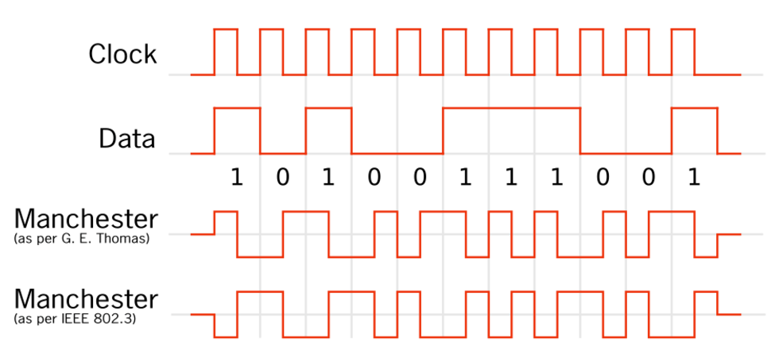

# iLLD_TC375_ADS_PSI5_SensorEmulator
**This project is an example of how to emulate a Manchester encoder using SPI and provide this as an input to the PSI interface**

## Device 
The device used in this example is AURIX™ TC37xTP_A-Step 

## Board 
The board used for testing is the AURIX™ TC375 lite Kit V2 (KIT_A2G_TC375_LITE) 

## Scope of work 
This project is a simple example of how to emulate the sensor data (Manchester encoded) using SPI MOSI and this encoded data is provided as an input to PSI5 interface.

## Introduction 
Manchester code (also known as phase encoding, or PE) is a line code in which the encoding of each data bit is either low then high, or high then low, for equal time. It always has a transition at the middle of each bit period and may (depending on the information to be transmitted) have a transition at the start of the period also. 
There are two opposing conventions for the representations of data.
- The first of these was first published by G. E. Thomas in 1949. It specifies that for a 0 bit the signal levels will be low–high and a 1 bit the signal levels will be high–low. This is also known as Manchester II or Biphase-L code.
- The second convention is also followed by numerous authors (e.g., William Stallings) [6] as well as by IEEE 802.4 (token bus) and lower speed versions of IEEE 802.3 (Ethernet) standards. It states that a logic 0 is represented by a high–low signal sequence and a logic 1 is represented by a low–high signal sequence.

## 

## 

In this project G. E. Thomas encoding method is used and it is as follows.
SPI MOSI outputs the Manchester encoded data. Bit '0' is encoded as '0x0F' and bit '1' is encoded as '0xF0' in **transferData()**.
example: bits data '0001110000' is "0x0F 0x0F 0x0F 0xF0 0xF0 0xF0 0xF0 0x0F 0x0F" in Manchester encoded format.

Manchester encode SPI data output on a Logic analyzer is as in the below image.
## 

note: first few bits sent on SPI MOSI are 0s in order SPI to detect the raising edge of the PSI5 frame's Start bit.
In the above image, first two bits are Start bits S0 and S1 followed by 10 bits data '0001110000' and last bit is parity bit 1. This information is presented in the Manchester encoded format '0x0F' and '0xF0'.

- The startup software is executed
- SPI and PSI5 communication are initialized
- Manchester encoded data is forwarded to PSI5 and validated.

## Hardware setup 
This code example has been developed for the board AURIX&trade; TC375 lite Kit V2.
Connect the MOSI pin P10.3 to PSI5 RX pin P02.3
## 

## Implementation 
**Startup software: **
- The code is initializing the device through the Startup software libraries provided by the iLLDs (Infineon Low Level Driver)
- Core0 executes the initialization and the main functions of SPI and PSI5 communication
- Core1 and core2 are then running into an empty infinite while loop

**Main software: **
- In a RAM Buffer store either 0xF0 or 0x0F corresponding to 0 or 1
- Use the SPI module - MOSI output
- The SPI port needs to transmit the above bit/symbol at 1Mbit/s to achieve PSI5 125kbps baudrate
- Ensure the number of data bits (PSI5 payload Length) initialized is same as the actual expected payload in bit. 
note: This mismatch in the bit results in CRCI error.
- In data can keep changed in **dataToBeEncoded()** as per user needs.

**The example works as follows: ** 

1. Manchester encoded data is sent on SPI MOSI Line
2. successful SPI transmission is indicated via LED1
2. PSI5 interface reads the data received from SPI
3. PSI5 successful data receive without error is indicated via LED2 . This is achieved by calling *IfxPsi5_Psi5_readChannelFrame()*.

## Compiling and programming
Before testing this code example: 
- Power the board through the dedicated power connector
- Connect the board to the PC through the USB interface
- Build the project using the dedicated Build button  or by right-clicking the project name and selecting "Build Project"
- To flash the device and immediately run the program, click on the dedicated Flash button  
- To start a debug session, click on the Debug button  and create a configuration for a debugger (double clicking on the debugger name, a default configuration is created)

## Run and Test 
After code compilation and flashing the device, the following content can be observed in PSI5 register:
-SFR -> PSI5 -> InterruptStatusRegisterA0 - RSI=1, RDI= 1, CRCI= 0 and all other fields are 0.
-SFR -> PSI5 -> ReceiveDataRegisterLow0 - CRCI=0, CRC =1 and RD = 0x38
##

##

##

## Limitation
This code example is only for 10 bits data with Parity bit and code example doesn't support data more than 10bits as it needs a CRC polynomial.

## References 

AURIX&trade; Development Studio is available online: 
- <https://www.infineon.com/aurixdevelopmentstudio> 
- Use the "Import..." function to get access to more code examples 

More code examples can be found on the GIT repository: 
- <https://github.com/Infineon/AURIX_code_examples> 

For additional trainings, visit our webpage: 
- <https://www.infineon.com/aurix-expert-training> 

For questions and support, use the AURIX&trade; Forum: 
- <https://community.infineon.com/t5/AURIX/bd-p/AURIX> 

