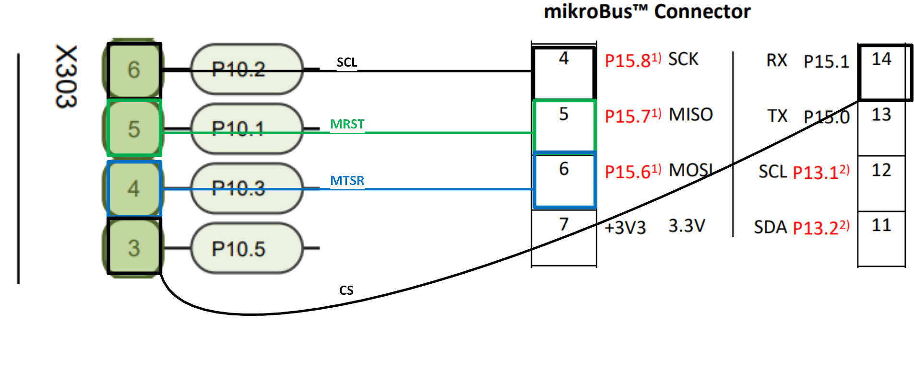

# iLLD_TC375_ADS_QSPI_SAFE_COMMUNICATION
**The example code is about the implementation of QSPI safe communication safety mechanism**

## Device  
The device used in this example is AURIX&trade; TC37xTP_A-Step

## Board  
The board used in this example is the AURIX&trade; TC375 lite Kit V2 (KIT_A2G_TC375_LITE)

## Scope of work 
The code example explains how to ensure the safety and integrity of data transmitted through Queued 
Synchronous Peripheral Interface (QSPI)

## Introduction
The main purpose of the QSPI module is to provide synchronous serial communication with external devices using clock, data-in, data-out and slave select signals. The focus of the module is to enable fast and flexible communication: either point-to-point or master-to-many slaves communication.

The Queued Synchronous peripheral Interface (QSPI) is not protected by any specific built-in safety mechanisms present in AURIX&trade; TC3xx. Therefore, to ensure the safety and integrity of the data transmitted over QSPI, the system integrator is responsible to implement a safe communication safety mechanism (SM). The safety mechanism consists of appending the payload data, data ID, a frame counter, and the CRC (which is based on the payload data of the frame). These frames are sent regularly by the QSPI master and received independently by the QSPI slaves. Once a frame is received, the safety mechanism is activated to ensure the integrity of the data, a timeout and a time checking mechanism.

## Hardware setup  
This code example has been developed for the board KIT_A2G_TC375_LITE.

## Implementation
To implement this SM, it is required to connect two different QSPI instances with each other using the loopback concept. The QSPI1 instance works as a master, while the QSPI2 module is in slave mode. In the initialization function, data is filled into the master buffer. The communication is based on sending data from the master to the slave. This communication, frame length, and pin used are shown in the figure below.

The frame size for this implementation is seven 32-bit elements. Four of these elements correspond to the payload data, while the remaining three are data ID, a frame counter, and a CRC value. The CRC value is calculated based on the payload data and the TriCore&trade; CPU instruction CRC32 is used for this purpose. The CRC calculation is performed at runtime on both the master and slave sides.

The QSPI master running on core0 transmits one frame to the slave side every 100 ms using the *masterTransmitDataSafeCommQSPI()* function. On the slave side which is running on core1, a slave Rx interrupt occurs with each 32-bit data received, leading to safety checks on the complete frame which is received from the master. If errors such as timestamp or CRC mismatches, frame counter or frame cycle time discrepancies occur, the corresponding error notification is activated. 

The detection of incorrect timeout is managed by another independent function (see the *timeoutSlaveQspiSafeCommunication* ) that is executed every 100 ms to check timeout for frame cycle.

The pin which are required to be connected to each other on the AURIX&trade; TC375 lite Kit V2 to test this safety mechanism are shown in the figure below. The master pin are present on **X303** connector and the slave pins are present on **mikroBus&trade;** Connector of AURIX™ TC375 lite Kit V2 .

 

**Note:** The System Timer (STM) module is used for basic task scheduling (see *Task_scheduler_STM.c and Task_scheduler_STM.h*). 

### OneEye Interface
Infineon OneEye Graphical User Interface (GUI) is used to create a custom GUI for this code example which is shown in figure below. The GUI file is located in *Libraries* folder. 

The real time data transmit as shown on left side of figure, belongs to QSPI master running on core0. While the real time receive data is shown on the right side of figure which belongs to QSPI slave running on core1. There is also possibility to inject the error and according reaction can be observed on simulated LEDs i.e. Timeout error etc.

An error can be injected either by disconnecting the cable connection or via the OneEye GUI by selecting either early frame or late frame error, as shown red highlighted in figure below. There is also possibility to perform system reset which is running on core 2.

## Compiling and programming

Before testing this code example: 
- Connect the board to the PC through the USB interface
- Build the project using the dedicated Build button  or by right-clicking the project name and selecting "Build Project"
- To flash the device and immediately run the program, click on the dedicated Flash button 

## Run and Test

After code compilation and flashing the device, The following attributes can be seen.

Two LEDs on AURIX&trade; TC375 lite Kit V2 board are used for periodic frame cycle time: 
- **LED1**, LED is blinking with rate of QSPI master data transfer cycle time.
- **LED2**, LED is blinking with rate of QSPI slave data receive cycle time.

The LEDs will be blinking synchronously at 100ms cycle time when there is no error injected or occurred. 

There are four simulated LEDs on OneEye GUI which are used as alarm LEDs when any error occur.

**Early Frame Error:** 

On QSPI master side at error injection tab, if Early frame error is selected, then it will inject early frame error which mean the frame arrive earlier than the expected time which 100ms

**Late Frame error:** On QSPI master side at error injection tab, if late frame error is selected, then it will inject late frame error which mean the frame arrive later than the expected time i.e. 100ms

**TimeOut Error:** When the clock pin (SLK) is disconnect and the data from master side will not reach slave side and once the timeout value is passed, the time out error LED will be on.

**Data Mismatch error:** this alarm error injection can be observed when the clock pin (SLK) is again connected and the data mismatch will occur and according LED will be on. 

## References 
AURIX&trade; TC375 Safety Lite Kit
- <https://www.infineon.com/aurixtc3xsafetylite> 

AURIX&trade; Application Kit - TC3xx Safety
- <https://www.infineon.com/aurixsafetykit> 

AURIX&trade; Development Studio is available online:  
- <https://www.infineon.com/aurixdevelopmentstudio>  
- Use the "Import..." function to get access to more code examples  

More code examples can be found on the GIT repository:  
- <https://github.com/Infineon/AURIX_code_examples>  

For additional trainings, visit our webpage:  
- <https://www.infineon.com/aurix-expert-training>  

For questions and support, use the AURIX&trade; Forum:  
- <https://community.infineon.com/t5/AURIX/bd-p/AURIX>  