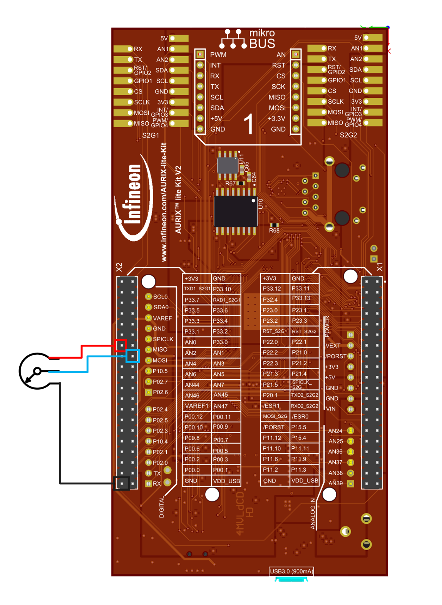
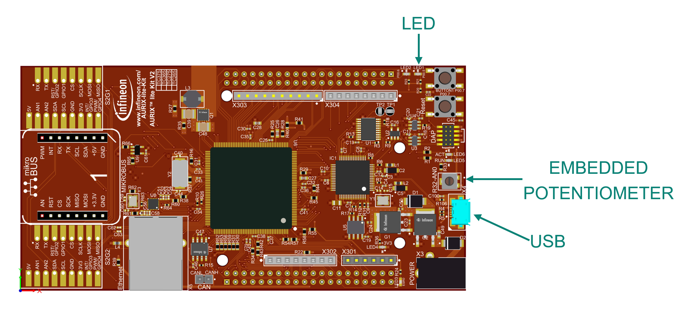
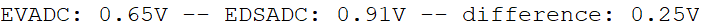

  

# iLLD_TC375_ADS_REDUNDANT_ADC_STM_SMU

**A VADC and a DSADC channel read analog values out of the embedded potentiometer. When the mean value of the difference bewteen the two ADCs samples is over a certain threshold, an alarm is activated**  

## Device  

The device used in this example is AURIX&trade; TC37xTP_A-Step

## Board  

The board used for testing is the AURIX&trade; TC375 lite Kit (KIT_A2G_TC375_LITE)

## Scope of work  

This project uses a EVADC channel and a DSADC channel to periodically sense the voltage at the output of a potentiometer, using STM (System Timer) to trigger the conversions. The difference between the two voltages is then saved in an array where the mean value is calculated. Whenever the mean value of the differences array is over a certain treshold an alarm is activated and an interrupt is triggered as reaction from SMU (Safety Management Unit). The interrupt routine in turn activates one of the LEDs on the board. The voltages sensed by the ADCs are also printed into the Console using UART.

## Introduction  
The Safety Management Unit main characteristics are:
 - The SMU is a central and modular component of the safety architecture providing a generic interface to manage the behavior of the microcontroller under the presence of faults
 - The SMU centralizes all the alarm signals related to the different hardware safety mechanisms
 - Software Alarms can be triggered by software but behave in the same way as hardware alarms
 - Each alarm can be individually configured to trigger internal or external actions
 - In this example, the Software alarm 0 is used to trigger an interrupt request to CPU0
 
The Enhanced Versatile Analog-to-Digital main characteristics are:
 - Programmable arbitrary conversion sequence (single or repeated)
 - Request source chaining to generate extended conversion sequences
 - Conversions triggered by software, timer events, or external events
 - Cancel-inject-restart mode for reduced conversion delay on priority channels
 - External analog multiplexer control, including adjusted sample time and scan support
 - Conversion speed and sample time adjustable to adapt to sensors and 
 - Storage of conversion results to user-configurable registers reference

The Enhanced Delta-Sigma Analog-to-Digital Converter has higher accuracy and is 
widely used in e.g. engine pressure measurement, fuel injection control etc. Its main features are:
 - ENoB accuracy up to 13 bit
 - Over sampling and filtering by hardware
 - Carrier generator included. Rectification, delay compensation by hardware
 - Sampling Rate up to 40 Mhz
 - Filter chain composed of Cyclic Integrating Comb (CIC) filter, Finite Impulse Response (FIR) filters and high-pass filter
 
The System Timer STM is used to generate a time base e.g. for an OS, as well as to generate trigger events
There are as many STM modules as there are CPUs in the system. Thus each CPU can use one STM for its time base.
The STM has a 64-bit counter which can be read via 7 registers, each selecting a 32-bit range of the system timer value.
Each of these can be used as counters with different resolution and range
The flexible interrupt service request generation capabilities allow for the STM counter to be compared against 
the values in two comparison registers.If the values match, a compare match event is generated from either of the comparisons

## Hardware setup  
This code example has been developed for the board TC375 lite Kit.

An external potentiometer has to be connected to the board in order to vary the voltage read by one of the two ADCs.

The connections have to be implemented according to the following schematic:

  

## Implementation  

**ASCLIN Configuration**  
Configuration of the ASCLIN module for UART communication is done in the setup phase by 
initializing an instance of the IfxAsclin_Asc_Config structure with the following parameters:
 - baudrate structure to set the actual communication speed in bit/s
 - interrupt structure to set interrupt priorities for transmit, receive and error events (txPriority, rxPriority and erPriority) and typeOfService that defines which service provider is responsible for handling the interrupt, which can be any of the available CPUs, or the DMA 
 - pins structure to set which GPIOs port pins are used for the communication
 - rxBuffer, rxBufferSize, txBuffer, txBufferSize to configure the buffers that will hold the incoming/outgoing data
The function IfxAsclin_Asc_initModuleConfig() fills the configuration structure with default values and IfxAsclin_Asc_initModule() initializes the module with the user configuration.

The standard interface is configured with the function IfxAsclin_Asc_stdIfDPipeInit().
All the above functions can be found in the iLLD header IfxAsclin_Asc.h.

**SMU configuration**  
To trigger an interrupt with an SMU alarm, a few steps are required:
 - To modify the SMU registers, the SMU module has to be unlocked with the function IfxSmu_unlockConfigRegisters(). After the modification is finished, the SMU registers should be locked again using the function IfxSmu_lockConfigRegisters()
 - Additionally, it is required to clear and set the Safety ENDINIT protection before and after the modification of the SMU configuration registers. This is done with the functions IfxScuWdt_clearSafetyEndinit() and IfxScuWdt_setSafetyEndinit()
 - The Alarm Global Configuration register (SMU_AGC) provides the software interface to control how the SMU triggers interrupt requests to the interrupt router. By setting the IGCS0 bitfield to 1, SMU Interrupt Request 0 is triggered
 - The function IfxSmu_setAlarmAction() configures the alarm’s behavior by writing a 3-bit code to the three Alarm Configuration Registers associated to the specific alarm and its group. In this example, the software alarm 0 (IfxSmu_Alarm_Software_Alarm0) and the Interrupt Generation Configuration Set 0 (IfxSmu_InternalAlarmAction_igcs0) are selected. The iLLD function itself selects the group based on the above mentioned parameters
 - Configure and enable the SMU Service Request 0 with the functions IfxSrc_init() andIfxSrc_enable()
 - Start the SMU state machine (SSM) with the function IfxSmu_activateRunState()
 
The functions above are provided by the iLLD headers IfxSmu.h and IfxSrc.h.

**LED configuration**
 - The port pin with the connected LED is configured to push-pull output mode by calling the function *IfxPort_setPinMode()* with the parameter *IfxPort_Mode_outputPushPullGeneral* (enumerated 
type value)
 - With the function *IfxPort_setPinState()*, using the enumerated type value *IfxPort_State_high*, the LED is turned off as default state
All functions above are provided by the iLLD header *IfxPort.h*.

**Triggering the Alarm**
 - The Software Alarm 0 can be triggered with the function *IfxSmu_setAlarmStatus()* provided by the iLLD header *IfxSmu.h*.
 
**STM Configuration**

Configuration of the STM is done inside the function *initSTM()* by initializing an instance of the IfxStm_CompareConfig structure with default values through the function *IfxStm_initCompareConfig()*. 
The following parameters are modified:
 - ticks – the total amount of ticks to count before the interrupt generation
 - triggerPriority – priority of the interrupt generated by the STM on compare match. 
It can be a value from 0 to 255, with 0 meaning interrupt is disabled and 255 is the highest priority
 - typeOfService – to define which service provider is responsible for handling the interrupt. This can be any of the available CPUs or the DMA
The configuration is then applied to the STM via the function *IfxStm_initCompare()*.

The above functions can be found in the iLLD header *IfxStm.h*.

**EDSADC configuration**

Configuration of the EDSADC module is done once in the setup phase by calling the initialization function init_EDSADC(), which contains the following steps:
 - EDSADC module configuration
 - EDSADC channel configuration

**EDSADC module configuration**

To configure the EDSADC module, the following steps are done:
 - The module configuration is filled with default values using an instance of the structure *IfxEdsadc_Edsadc_Config* and the function *IfxEdsadc_Edsadc_initModuleConfig()*
 - The modulator clock is set to be generated independently of the Phase Synchronizer signal
 - The EDSADC module is then initialized with the function *IfxEdsadc_Edsadc_initModule()*
 
**EDSADC channel configuration**

To configure the EDSADC channel, the following steps are done:
 -  The channel configuration is created with an instance of the structure *IfxEdsadc_Edsadc_ChannelConfig* and filled with default values using the function *IfxEdsadc_Edsadc_initChannelConfig()*
 - The comb filter decimation factor and start value are set
 - The FIR filters in the filter chain are enabled and the trigger for starting the calibration during the initialization phase is set
 -  The modulator is configured by setting its frequency and internally connecting the negative input to the ground, in order to configure the conversion in single-ended mode
 - The channel ID is selected and the calculated Cascaded Integrator Comb (CIC) filter‘s shift and gain factor are set
 - The intended full-scale value is set (by default, it is set to 25000 after reset)
 - Finally, the channel is initialized with the function *IfxEdsadc_Edsadc_initChannel()* and the conversion is started using the function *IfxEdsadc_Edsadc_startScan()*
 
All the previous functions are provided by the iLLD header *IfxEdsadc_Edsadc.h.*

**EVADC configuration**

The configuration of the EVADC is done in the *initEVADC()* function in four different steps:
 - Configuration of the EVADC module
 - Configuration of the EVADC group
 - Configuration of the EVADC channels
 - Filling the queue
 
Configuration of the EVADC module with the function *initEVADCModule()*
The default configuration of the EVADC module, given by the iLLDs, can be used for this example.
This is done by initializing an instance of the IfxEvadc_Adc_Config structure and applying default values to its fields through the function *IfxEvadc_Adc_initModuleConfig()*.
Then, the configuration can be applied to the EVADC module with the function *IfxEvadc_Adc_initModule()*.

**EVADC Group configuration**

Configuration of the EVADC group with the function *initEVADCGroup()*
The configuration of the EVADC group is done by initializing an instance of the *IfxEvadc_Adc_GroupConfig*
structure with default values through the function *IfxEvadc_Adc_initGroupConfig()* and modifying the following fields:
 - groupId – to select which converters to configure
 - master – to indicate which converter is the master. In this example, only one converter is used, therefore it is also the master
 - arbiter – a structure that represents the enabled request sources. In this example, it is set to arbiter.requestSlotQueue0Enabled
 
Then, the user configuration is applied through the function *IfxEvadc_Adc_initGroup()*.

**EVADC Channel configuration**

Configuration of the EVADC channels with the function *initEVADCChannels()*
The configuration of each channel is done by initializing a separate instance of the *IfxEvadc_Adc_ChannelConfig* structure with default values through the function *IfxEvadc_Adc_initChannelConfig()* and modifying the following fields:
 -  channelId – to select the channel to configure
 - resultRegister – to indicate the register where the A/D conversion value is stored
Then, the configuration is applied to the channel with the function IfxEvadc_Adc_initChannel(). 

Each channel is added to the queue through the function *IfxEvadc_Adc_addToQueue()*. 
When the EVADC configuration is done and the queue is filled, the conversion is started with the function *IfxEvadc_Adc_startQueue()*.
Finally, to read a conversion, the function IfxEvadc_Adc_getResult() from iLLDs is used inside the function *readEVADC()*.
All the functions used for configuring the EVADC module, its groups and channels together with reading the conversion results can be found in the iLLD header *IfxEvadc_Adc.h*.

**Periodic volage sensing using STM**

The System timer is set up to trigger an interrupt periodically.
The Interrupt Service Routine is *isrSTM()*, where the function *printDTSMeasurement()* is called. In this function the 2 ADC values are read and the difference is calculated, then stored in a position of the array *filter_data*.
The mean value of all the array elements is then computed in order to check if the mean of the differences is higher than the threshold (effectively filtering any glitch in the voltage measurements).
If the mean value of the array is higher than the threshold an alarm is activated, triggering an interrupt to the CPU0 which in turn will turn on a LED.

## Compiling and programming

Before testing this code example:  
- Connect the board to the PC through the USB interface
- Build the project using the dedicated Build button  or by right-clicking the project name and selecting "Build Project"
- To flash the device and immediately run the program, click on the dedicated Flash button   

## Run and Test  

A mismatch between the measurements can be injected acting on the external potentiometer. This will vary one of the two measurements effectively addding more resistance to the embedded potentiometer which represents the positive end of the external potentiometer.
Doing so the two measurements will be different and so the values saved in the array of differences will be higher. Once the mean value will be higher than the threshold, an alarm is activated.
The ADC values and difference can be monitored on the Console thanks to the UART communication with the host PC. 

  

Once the code is flashed a Terminal can be opened clicking on  to check the measurements of EVADC and DSADC when varying the voltage with the embedded potentiometer. The difference is also reported as a result of the mismatch added with the external potentiometer.
An ooutput similar to the one reported below should be reported.

 

## References  

AURIX™ Development Studio is available online:  
- <https://www.infineon.com/aurixdevelopmentstudio>  
- Use the „Import...“ function to get access to more code examples  

More code examples can be found on the GIT repository:  
- <https://github.com/Infineon/AURIX_code_examples>  

For additional trainings, visit our webpage:  
- <https://www.infineon.com/aurix-expert-training>  

For questions and support, use the AURIX™ Forum:  
- <https://community.infineon.com/t5/AURIX/bd-p/AURIX>  
