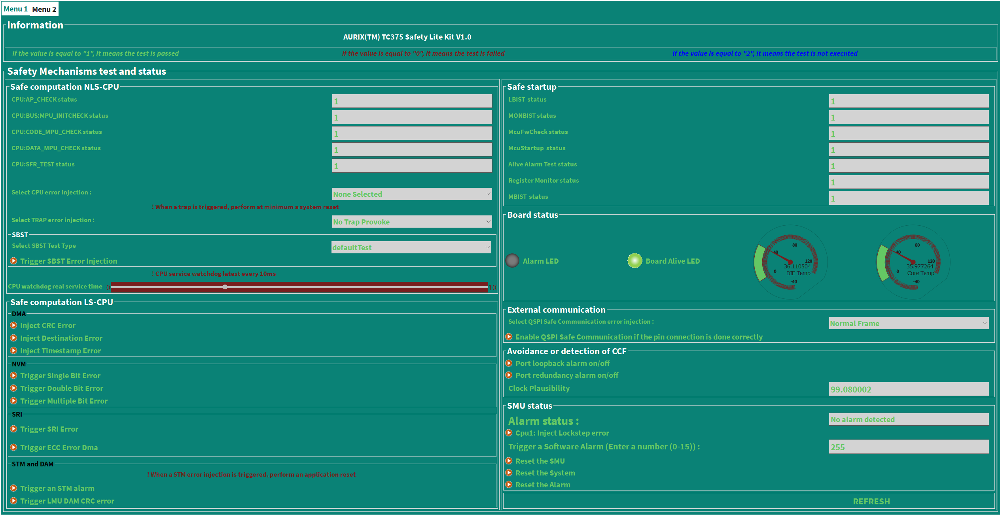

# iLLD_TC375_ADS_SAFETY_LITE_KIT 
**This source code is an easy step to start and understand the functional safety aspects**

## Device  
The device used in this example is AURIX&trade; TC37xTP_A-Step

## Board  
The board used for testing is the AURIX&trade; TC375 lite Kit V2 (KIT_A2G_TC375_LITE) 

## Scope of work  
This project is written for system and software engineers and functional safety managers involved in the design or development of a safety-related system who are considering integrating the AURIX&trade; TC3xx micro-controller hardware as a safety element out of context (SEooC) into their system.

## Introduction  
The development of a safe application can be a challenge when it comes to following strict safety rules. In order 
to ease the development of such applications, Infineon provides the AURIX&trade; TC3xx Safety Manual. The Safety Manual 
defines so called safety mechanisms as an activity or a technical solution to avoid or control systematic failures 
and to detect or control random hardware failures. Safety mechanisms are classified in two main types:

   - The technical solution internal to the MCU by hardware (HW) or software (SW)
   - The technical solution either in HW or SW, implemented at System level by the system integrator.
    
During the design phase of AURIX&trade; MCU, most common use cases have been taken and from these safety requirements have been derived. For the implementation of these specific safety related functions different SMs shall to be implemented according to the specification in the Safety Manual. Which specific SM is required depends on the used modules and the required safety level. 

Hence, the intention of this project is to provide implementation hints and code examples for many of 
these safety related functions. This example software optimized for the AURIX&trade; TC375 safety lite kit which is composed of an AURIX&trade; TC375 Lite Kit (KIT_A2G_TC375_LITE) hardware board plus safety software (this code example) from Infineon. The AURIX&trade; TC375 safety lite kit is demonstrating the implementation of various SMs and many other diagnostics features. Additionally, a OneEye user interface is used to trigger the injection of faults- into system and observe diagnostics status. For detail description of the kit and how to use it, please have a look to application note AN0029 on <https://www.infineon.com/aurixtc3xsafetylite>

**Note:** 

This code is provided for demonstration purpose only and acts as training example. It is not intended to be used for legally binding, functional safety classified (ASIL/SIL) code development and for productive systems.

## Hardware setup 
The board used in this project is the existing AURIX&trade; TC375 lite Kit V2 (KIT_A2G_TC375_LITE).

The combination of AURIX&trade; TC375 lite Kit plus the safety software project (this code example) is called AURIX&trade; TC375 Safety Lite Kit (KIT_A2G_TC375_SAFETY_LITE). 

### OneEye Graphical User Interface (GUI)
The graphical user interface (GUI) used for this project is called OneEye GUI. OneEye is a front-end software used to create custom GUI for embedded application. This GUI interface is integrated and developed for the AURIX&trade; Development Studio (ADS). The system operates in real-time and communicate through various interfaces such as UART, Ethernet, CAN, or DAS. 

The custom GUI design for AURIX&trade; TC375 safety lite kit shows the output of global variables that are linked to the implemented safety measures. The real time data and status of various safety mechanism is display. Additionally, errors can be injected and observe the corresponding safety safe reactions. 

This AURIX&trade; TC375 safety lite kit GUI consists of two menus

**Menu 1:** 

* Status of different safety mechanisms of the safe startup sequence
* Status of safe computation NLS-CPU safety mechanisms and error injection
* Status of safe computation LS-CPU safety mechanisms and error injection
* Status of SMU and user interaction as reset alarm, reset SMU and reset system
* Status of the board i.e. temperature, board alive LED and alarm detection LED
* Status of external communication and avoidance or detection of common cause failure safety mechanisms
    
    
    
**Menu 2:**
 
* Digital acquisition and actuation function use cases
* Analog acquisition function use cases
* SMU status and user interaction to reset alarm, reset SMU and reset the complete system
* Show the status of detailed safe startup sequence i.e., LBIST, MBIST, etc.

   

## Implementation
The software is developed in the free of charge Integrated Development Environment (IDE) AURIX™ Development Studio (ADS). The project structure as the three *CpuX_Main.c* (x=0...2) files, the relevant application software is stored in the *SafetyLiteKit* folder which  includes all the code of the safety features of AURIX™ TC3xx. All the files related to the OneEye interface are the */SafetyLiteKit/OneEye* folder and JavaScript files in */Libraries*. 

### Key Features
The key features implemented and supported are listed in the following list:
- Boot and startup procedure including all safety mechanisms involved
- Full safety management unit (SMU) driver implementation including 
    - SMU core and SMU standby 
    - Fault Signaling Protocol (FSP)   
- Safe Computation on non-lockstep CPU i.e. support SBST
- Safe Computation on lockstep CPU
- Analog acquisition
- Digital acquisition
- Digital actuation
- Safe state support
- External communication
- Avoidance or detection of common cause failure (CCF)
- Coexistence of HW/SW elements
- Register monitor test
- Fault injection for testing of various safety mechanisms
    - PFlash ECC error injection
    - DMA error injection 
    - Single, Double, Multiple bit error injection
    - SBST error injection
    - Trap injection
    - Non-lockstep CPU SMs error injection
    - SRI error injection
    - LMU DAM CRC error injection
    
**Note:** 

*DUMMY_CPU_SBST implementation is a DUMMY version of CPU_SBST in this project and it is replaceable with complaint version of CPU_SBST. Please contact your IFX SALES representative to get an inquiry for a certified and compliant version of the SBST_CPU.*

### Supported SM

The following safety mechanism are implemented in AURIX&trade; TC375 safety lite kit. Remember, in some the safety mechanism, special pin connections are need. Please read application note *AN0029* (<https://www.infineon.com/aurixtc3xsafetylite>) for detail description.

**Safe Startup**
*  SM:MCU:LBIST_MONITOR

*  SM:MCU:LBIST_RESULT

*  SM:PMS:MONBIST_RESULT

*  SM:SMU:ALIVE_ALARM_TEST

*  SM:SMU:REG_MONITOR_TEST

*  SM:SYS:MCU_FW_CHECK

*  SM:SYS:MCU_STARTUP

*  SM:VMT:MBIST

**Safe Computation Non-Lockstep CPU**

*  SM:CPU:AP_CHECK

*  SM:CPU:BUS_MPU_INITCHECK

*  SM:CPU:CODE_MPU_CHECK

*  SM:CPU:DATA_MPU_CHECK

*  SM:CPU:INTERNAL_BUS_MONITOR

*  SM:CPU:SBST

*  SM:CPU:SFR_TEST

*  SM:CPU:SOFTERR_MONITOR

**Safe Computation Lockstep CPU**

*  SM:DMA:ADDRESS_CRC

*  SM:DMA:DATA_CRC

*  SM:DMA:ERROR_HANDLING

*  SM:DMA:SUPERVISION

*  SM:DMA:TIMESTAMP

*  SM:NVM.PFLASH:INTEGRITY_CHECK

*  SM:NVM.PFLASH:UPDATE_CHECK

*  SM:NVM.PFLASH:WL_FAIL_DETECT

*  SM:SRI:ERROR_HANDLING

*  SM:STM:MONITOR

**Analog Acquisition**

*  SM:CONVCTRL:CONFIG_CHECK

*  SM:EDSADC:DIVERSE_REDUNDANCY

*  SM:EDSADC:PLAUSIBILITY

*  SM:EDSADC:VAREF_PLAUSIBILITY

*  SM:EVADC:CONFIG_CHECK

*  SM:EVADC:DIVERSE_REDUNDANCY

*  SM:EVADC:PLAUSIBILITY

*  SM:EVADC:VAREF_PLAUSIBILITY

**Digital Acquisition**

*  SM:CCU6:CCU6_CAPTURE_MON_BY_GPT12

*  SM:GTM:GTM_CCU6_REDUNDANCY

*  SM:GTM:GTM_TIM_REDUNDANCY

*  SM:GTM:TIM_CLOCK_MONITORING

**Digital Actuation**

*  SM:CCU6:CCU6_GPT12_MONITORING

*  SM:GTM:IOM_ALARM_CHECK

*  SM:GTM:TIM_CLOCK_MONITORING

*  SM:GTM:TOM_TIM_MONITORING

**External Communication**

*  SM:QSPI:SAFE_COMMUNICATION

**Avoidance or Detection of Common Cause Failures**
*  SM:DTS:DTS_RESULT

*  SM:PMS:MONBIST_RESULT

*  SM:SYS:SW_SUPERVISION

*  SM:PORT:LOOPBACK

*  SM:PORT:REDUNDANCY

**Coexistence of HW/SW elements**

*  SM:IR:ISR_MONITOR

**General** 
* SM:SMU:APPLICATION_SW_ALARM 

## Compiling and programming

Before testing this code example:  
- Power the board through the dedicated power connector 
- Connect the board to the PC through the USB interface
- Build the project using the dedicated Build button  or by right-clicking the project name and selecting "Build Project"
- To flash the device and immediately run the program, click on the dedicated Flash button 
- To open the OneEye interface, click on the dedicated OneEye button 

## Run and Test
The detail description can be found in a dedicated Application note *AN0029* for this specific project.
After code compilation, successfully build and flashing the device, The following attributes can be seen

**Status LEDs**

The AURIX&trade; TC375 Lite Kit offers LEDs which can be used by the application software and for the AURIX&trade; TC375 Safety Lite Kit these LEDS are used for following purposes:

   - **LED1 :** This blinking LED is used to signal that the software is running.
   - **LED2 :** This LED is used to signal that an alarm is detected by the SMU.

**Debugger View**

To use the debugger option , please follow the steps below

- Once the project is build successfully, go to debug icon  and create new debug configuration (if it is not already created) by following the three step described in the following picture.

- Now start debugging

- and then pause debugging (or apply breakpoint) to see the update value of the add global variables

- To watch the content of global variable right click on them and select : "Add watch Expression"

## References  
AURIX&trade; TC375 Safety Lite Kit
- <https://www.infineon.com/aurixtc3xsafetylite> 

AURIX&trade; Application Kit - TC3xx Safety
- <https://www.infineon.com/aurixsafetykit> 

AURIX&trade; Development Studio is available online:  
- <https://www.infineon.com/aurixdevelopmentstudio>  
- Use the "Import..." function to get access to more code examples  

More code examples can be found on the GIT repository:  
- <https://github.com/Infineon/AURIX_code_examples>  

For additional trainings, visit our webpage:  
- <https://www.infineon.com/aurix-expert-training>  

For questions and support, use the AURIX&trade; Forum:  
- <https://community.infineon.com/t5/AURIX/bd-p/AURIX>
