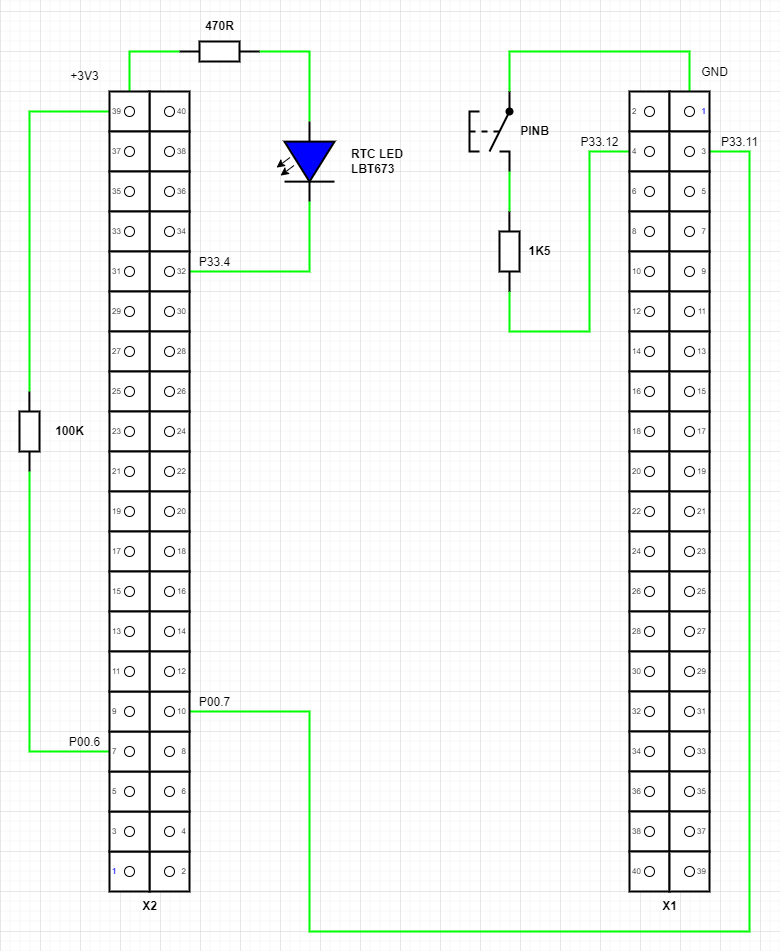

  

# iLLD_TC375_ADS_SCR_RTC_70kHz_trimming_LK

**This code example demonstrates Standby Controller Real-Time Clock calibration using Wake-up Timer and Capture-Compare Unit.**

## Device

The device used in this example is AURIX™ TC37xTP_A-Step.

## Board

The board used for testing is the AURIX™ TC375 lite Kit V2 (KIT_A2G_TC375_LITE).

## Scope of work

This is a minimal code example presenting a solution to application scenario 3 from Application Note AP32465.
The goal is to periodically trim the low power 70kHz low frequency (LF) oscillator. This oscillator is specially for low power application but naturally very imprecise and usually used by the Wake-up Timer (WUT) and Standby Controller (SCR) Real-Time Clock (RTC) timers.
Using the WUT and the Capture/Compare Unit 6 (CCU6) a calibration coefficient is calculated and transferred to the SCR domain.

## Introduction

### SCR

The Standby Controller (SCR) is intended to perform basic operation while the rest of the system is in standby, effectively reducing standby-power consumption while still supporting requested standby features. The SCR is based on an 8-bit XC800-core with a limited list of peripherals.

### RTC

One of the SCR peripherals is the Real-Time Clock (RTC) that, once started, can work independently of the state of the rest of the microcontroller.

The real-time clock consists of an up-counting 32-bit timer register (Real-Time Clock Counter) with an upstream 9-bit prescaler. It contains a set of 4 (8-bit) count registers that shows the current count value or the current time of the real-time clock. Another set of registers (RTC compare registers) that consists of 4 (8-bit) registers can be used for interrupt generation. It can also be used to wake-up the device from *Standby Mode*.

### WUT

The Wake-up Timer is a basic low power counter which may be used to wake-up the system periodically from *Standby Mode*. The timer may also be used during RUN, IDLE or SLEEP modes.

The Wake-up Timer consists of an 24 bit counter running on 70 kHz clock source with programmable reload value. It has a 24 bit counter status register providing the current count value and can be programmed for either *Auto Reload* mode (WUT is started and stopped via Software. Automatic reload on counter underflow and triggers a system wake-up) or *Standby Auto Stop* mode (Counter starts counting down from reload value on Standby entry. Counter stops on underflow and triggers a system wake-up). The capture trigger on counter underflow can be routed to CCU60_CC60IND, CU61_CC60IND and GTM (TIM 0.7) for trimming purpose.

### CCU6

The CCU6 is a high-resolution 16-bit capture and compare unit with application-specific modes, mainly for AC drive control. Special operating modes support the control of Brushless DC-motors using Hall sensors or Back EMF detection. Furthermore, block commutation and control mechanisms for multi-phase machines are supported. It also supports inputs to start several timers synchronously, an important feature in devices with several CCU6 kernels. The CCU6 module consists of two identical kernels CCU60 and CCU61.

The CCU6 may use the PLL output as the accurate clock source for measuring the time between WUT overflow events. The resulting ratio may be used as the calibration coefficient for the WUT and RTC.

## Hardware setup

This code example has been developed for the AURIX™ TC375 lite Kit V2 (KIT_A2G_TC375_LITE).

### Top view

Top view of the AURIX™ TC375 lite Kit V2. Used button and LEDs are marked with a green frame.

- **BUTTON1 (P00.7)** is the button on the top right.
- **LED1 (P00.5)** is the right LED on the top right, near BUTTON1.
- **LED2 (P00.6)** is the left LED on the top right.

### Bottom view

Bottom view of the AURIX™ lite Kit TC3X7. Used Pins are marked with a green frame.

- **X1** is the 40-pin connector on the top. Pin 1 marking is on the top left.
- **X2** is the 40-pin connector in the bottom, near the Infineon logo. Pin 1 marking is on the bottom right.

### Additional hardware

For the example some additional external hardware is needed as shown in the below schematic.

- To see SCR RTC activity a LED shall be connected between X2-32 (P33.4) and X2-39 (+3V3).
- To see CCU6/WUT activity a 100 kOhm pull-up shall be connected between X2-07 (P00.6) and X2-39 (+3V3).
- For triggering the state change from *Run Mode* to *Standby Mode* and vice versa a connection between X2-10 (P00.7) and X1-03 (P33.11) is needed to generate a falling edge.
- For triggering the *PINB Wake-up* a switch shall be connected to X1-04 (P33.12) and X1-01 (GND) to generate a falling edge.

### Available I/O signals

<table>
<tr><th>   SCR I/O   </th><th>   TC3 I/O   </th><th>   AURIX™ lite Kit V2.0    </th><th>   Code Example    </th></tr>
<tr><td>    P00.0    </td><td>   P33.0     </td><td>   X2-28 (free)            </td><td>                   </td></tr>
<tr><td>    P00.1    </td><td>   P33.1     </td><td>   X2-29 (free)            </td><td>                   </td></tr>
<tr><td>    P00.2    </td><td>   P33.2     </td><td>   X2-30 (free)            </td><td>                   </td></tr>
<tr><td>    P00.3    </td><td>   P33.3     </td><td>   X2-31 (free)            </td><td>                   </td></tr>
<tr><td>    P00.4    </td><td>   P33.4     </td><td>   X2-32 (free)            </td><td> RTC status LED    </td></tr>
<tr><td>    P00.5    </td><td>   P33.5     </td><td>   X2-33 (free)            </td><td>                   </td></tr>
<tr><td>    P00.6    </td><td>   P33.6     </td><td>   X2-34 (free)            </td><td>                   </td></tr>
<tr><td>    P00.7    </td><td>   P33.7     </td><td>   X2-35 (see [^1])        </td><td>                   </td></tr>
<tr><td>             </td><td>             </td><td>                           </td><td>                   </td></tr>
<tr><td>    P01.0    </td><td>   P34.1     </td><td>   n. a. (not connected)   </td><td>                   </td></tr>
<tr><td>    P01.1    </td><td>   P33.9     </td><td>   X2-37 (free)            </td><td>                   </td></tr>
<tr><td>    P01.2    </td><td>   P33.10    </td><td>   X2-38 (free)            </td><td>                   </td></tr>
<tr><td>    P01.3    </td><td>   P33.11    </td><td>   X1-03 (free)            </td><td> Trigger button    </td></tr>
<tr><td>    P01.4    </td><td>   P33.12    </td><td>   X1-04 (free)            </td><td> PINB wake-up      </td></tr>
<tr><td>    P01.5    </td><td>   P33.13    </td><td>   X1-25 (free)            </td><td>                   </td></tr>
<tr><td>    P01.6    </td><td>   P33.14    </td><td>   n. a. (not connected)   </td><td>                   </td></tr>
<tr><td>    P01.7    </td><td>   P33.15    </td><td>   n. a. (not connected)   </td><td>                   </td></tr>
<tr><td>             </td><td>             </td><td>                           </td><td>                   </td></tr>
<tr><td>             </td><td>   P00.5     </td><td>   X2-08 (LED D1)          </td><td> TC activity LED   </td></tr>
<tr><td>             </td><td>   P00.6     </td><td>   X2-07 (LED D2)          </td><td> Wake-up LED       </td></tr>
<tr><td>             </td><td>   P00.7     </td><td>   X2-10 (BUTTON1)         </td><td> Connect to X1-03  </td></tr>
<tr><td>             </td><td>   AN0       </td><td>   X2-27 (POTI10k)         </td><td>                   </td></tr>
</table>

- [^1]: Output for Power Down Input of DP83825

## Implementation

### Embedding of the SCR code into the TriCore™ project

While the build process, the SCR code is compiled to a binary output which is translated into SCR_AURIX_TC3x.h and SCR_AURIX_TC3x.c files. These two files are generated and included into the TriCore™ project automatically. The file SCR_AURIX_TC3x.c contains the binary SCR code and is loaded by code execution of Cpu0 to the SCR XRAM memory.

### CPU0 code

After startup the first part of the code is responsible to turn off *WATCHDOG0* and *SAFETY WATCHDOG* to ensure they won't affect the example code.

For proper SCR handling, the user software must take care to reset *SCU_RSTSTAT.STBYR* flag via *SCU_RSTCON2.CLRC* according to the application - e.g. after the initial system power-on, if SCR usage during stand-by mode is intended.

Wake-up from SCR via register *STDBYWKP.SCRWKP* in turn caused by following events. *PMSWSTAT2.SCRWKP* set on wake-up. *PMSWSTAT2.SCROVRUN* set to indicate overrun behavior in case of multiple un-serviced wake-ups. *PMSWSTAT2.SCROVRUN* needs to be cleared to avoid immediate wake-up on next time entering *Standby mode*.

The function `configureAppBspStatusLeds()` configures all output pins of the available status LEDs (D1 and D2).
The function `configureWUT()` configures the WUT with the expected SCR RTC timer period.
The WUT module uses the same 70 kHz clock source as the SCR RTC, and it provides a direct interface for the CCU6 module to capture overflow events. At the same time CCU6 may use the PLL output as the accurate clock source for measuring the time between WUT overflow events. The resulting ratio may be used as the calibration coefficient for the WUT and RTC.
The CCU6 is configured and started using the functions `init_CCU6()`, `start_CCU60_T12()` and `enable_CCU6_service_request()`.

Next step is to check the wake-up cause to be one of the following:

1. ESR1 edge transition (NMI trap): *PMSWSTAT2.ESR1WKP*

   If ESR1 edge wake-up trigger has occurred the ESR1 wake-up status LED (D2) blinks 4 times. The code ends in an endless loop. If SCR code is already loaded and active the TC status LED (D1) will blink at the same frequency as port P33.4 which is mirrored to P00.5 (D1).

2. Pin B edge transition (P33.12): *PMSWSTAT2.PINBWKP*

   If PINB edge wake-up trigger has occurred the PINB wake-up status LED (D2) blinks 3 times and turns on permanently. The code ends in an endless loop. If SCR code is already loaded and active the TC status LED (D1) will blink at the same frequency as port P33.4 which is mirrored to P00.5 (D1).

3. Wake-up from SCR via register *STDBYWKP.SCRWKP*: *PMSWSTAT2.SCRWKP*

   If SCR wake-up trigger has occurred the SCR wake-up status LED (D2) turns on and the wake-up reason provided by the SCR code is read from the shared XRAM memory location.
   If the wake-up reason is `WAKEUP_REASON_TRIM` a new trimming cycle of the 70 kHz clock source in the application can be achieved with the use of the integrated mechanism, which involves the WUT and CCU6. After `NUMBER_CALIBRATION_CYCLES` the function `IfxScr_setRTCperiodOn70kHz()` is used to calculate the new SCR RTC compare value using the expected SCR RTC period and the calibration coefficient provided by the CCU6 measurement and writes it back to the shared XRAM memory location.
   If the wake-up reason is `WAKEUP_REASON_EXTI` the software waits for a button press event to occur (falling edge on P33.11/SCR P01.3) which can be triggered by pressing BUTTON1.
   Now the counter to specify the interval until next trimming wake-up is reset to `SCR_TRIM_COUNT` and written to the shared XRAM memory location. After this status LED (D2) turns off and the TriCore™ enters *Standby Mode* again.

4. No wake-up trigger

   If no wake-up trigger has occurred the PowerOn status LED (D2) blinks 5 times and turns on permanently. The function `configureAppBspScrPorts()` configures all shared pins to be under control of SCR.

   The TriCore™ Cpu0 is now initializing the SCR. While compiling the SCR code is added as a C-array to the TriCore™ project and copied while initialization to the SCR XRAM (SCR code/data memory).

   First the SCR is reset and disabled by setting the SCR Boot Mode to *User Mode 0* (XRAM not programmed). The function `IfxScr_copySCRprogram()` is copying the binary SCR program from the NVM Flash to the SCR XRAM. The copying begins at the XRAM start address (*0xF0240000*) until the length of `SIZE_scr_xram`. In addition, the magic pattern (*0xAA55AA55*) at the end of the XRAM (*0xF0241FF8*) is written to validate the stored code. 
   The function `IfxScr_initSCR()` now configures the SCR Boot Mode either to *User Mode 1* or *OCDS boot* which can be selected during compile time via define `DEBUG_SCR_DAP`.
   To debug the SCR firmware (which is not possible during *Standby Mode*) another compile time switch (`DEBUG_SCR_NO_STBY`) can be used to prevent entering *Standby Mode*.

   Finally, via register *PMS_PMSWCR0* the wake-up triggers are configured and the software waits for a button press event to occur (falling edge on P33.11/SCR P01.3) which can be triggered by pressing BUTTON1. The toggling SCR port P00.4 can't directly be observed on the used AURIX™ lite Kit TC3X7, just by using an oscilloscope or an LED connecting to the port. The SCR port P00 is equivalent to port P33 of the TriCore™ CPU. To observe the SCR P00.4 (P33.4) line the TriCore™ Cpu0 is mirroring the P33.4 state to the port line P00.5 which is connected to LED D1 on the AURIX™ lite Kit TC3X7.

   After the button press event the TriCore™ Cpu0 enters *Standby Mode* and gives further control to SCR.

### SCR code

First the global SCR data structures (status flags, SCR/TC data exchange, ...) are initialized with default values.

Second step is the configuration of the used I/O interface. Pins P00.0 to P00.6 and P01.1 to P01.5 are enabled by writing to the *SCR_IO_P00_PDISC* and *SCR_IO_P01_PDISC* registers. Set SCR_P00.4 to high (LED off) by writing to the *SCR_IO_P00_OUT* register and finally P00.4 is set as push-pull output and P01.3 and P01.4 are configured as input writing to the *SCR_IO_P00_IOCR4*, *SCR_IO_P01_IOCR3* and *SCR_IO_P01_IOCR4* registers.

Third step is to enable the high frequency (HF) system clock (20 MHz) by setting *DIV5=0*, *OSCWAKE=1* and *OSPD=0* in *SCR_SCU_CMCON* register and waiting for the TriCore™ to enter *Standby Mode*.

During the fourth step the used SCR modules like RTC and for debug purpose the OCDS (On-Chip Debug Support) module are enabled by clearing the corresponding bit in the register *SCR_SCU_PMCON1* (Note: *The OCDS module is not required for the SCR code execution.*).

In the fifth step the interrupt system is configured and the interrupt nodes for RTC and external interrupts 3 to 6 are enabled.
For the external interrupts *XINTR9* is used and a falling edge trigger for SCR_P01.3 (P33.11) is configured (External interrupt 6).
For the RTC module *XINTR13* is used. And following the RTC module itself is set up by predefining the RTC counter registers according to the values set in the global SCR/TC data exchange structure (default period is 200 milliseconds).

The next step is to enable the low frequency system clock (70 kHz) by setting *OSCWAKE=0* and *OSPD=1* in *SCR_SCU_CMCON* register and the register *SCR_RTC_CON* is modified to select 70 kHz clock as clock source, disable the 9-bit prescaler, enable the clock compare interrupt and start the RTC.

Finally, the code enters an endless loop where the global status flags `g_RTCtick`, `g_trimRTC` and `g_extTrigger` are monitored. 
If flag `g_RTCtick` is *TRUE* it is reset, the SCR_P00.4 LED is toggled to show RTC activity and *SCR_RTC_CRx* registers are updated with the latest value set by TriCore™ Cpu0.
If flag `g_trimRTC` is *TRUE* it is reset, the `g_wakeUpReason` is set to *WAKEUP_REASON_TRIM* to start the next RTC trimming cycle and an SCRWKP event is generated to wake-up the TriCore™ domain from *Standby Mode*.
If flag `g_extTrigger` is *TRUE* it is reset, the `g_wakeUpReason` is set to *WAKEUP_REASON_EXTI* and an SCRWKP event is generated to wake-up the TriCore™ domain from *Standby Mode*.

### RTC interrupt code

An interrupt will be generated when the contents of *SCR_RTC_CRx* and *SCR_RTC_CNTx* are equal and *ECRTC* is set to 1 and the bit *CFRTC* in register *SCR_RTC_CON* will be set. The *CFRTC* flag has to be cleared to 0 by user software. In such situation, the real-time clock counter is reset and starts counting from zero again.

The flag `g_RTCtick` is set to *TRUE* to signal the next RTC event has occurred. If the TriCore™ domain is in *Standby Mode* the global `g_nextTrimCounter` is decremented to delay the next trimming cycle. If the counter reaches *0* the flag `g_trimRTC` is to *TRUE* to start the next trimming cycle.

### External interrupt code

An external interrupt will be generated when the configured event (falling edge trigger on SCR_P01.3) has occurred and the bit *EXINT6* in register *SCR_IRCON0* will be set. However, the status flag of the associated interrupt source is not automatically cleared and must be cleared by software (preferably in the service routine). Finally, the global flag `g_extTrigger` is to *TRUE* to trigger a wake-up of the TriCore™ domain from *Standby Mode*.

## Compiling and programming

Before testing this code example:  
- Power the board through the dedicated power connector 
- Connect the board to the PC through the USB interface
- Build the project using the dedicated Build button  or by right-clicking the project name and selecting "Build Project"
- To flash the device and immediately run the program, click on the dedicated Flash button   

## Run and Test

- After powering the board LED2 flashes 5 times and turns on permanently.
  This is the indication that the software has started successfully and is now waiting for user interaction.
- By pressing BUTTON1 the TriCore™ Cpu0 enters *Standby Mode* and gives further control to SCR.
  Now LED1 and LED2 stop blinking and RTC activity can only be seen on the external LED connected to P33.4 (X2-32).
- The external LED connected to P33.4 (X2-32) flashes slowly (interval 1s) 3 times before the first trimming cycle is started.
- For this the TriCore™ domain exits *Standby Mode*, starts the trimming cycle, updates the RTC compare value and
  the counter for next trimming cycle in shared XRAM memory and returns to *Standby Mode* which can be observed by LED2 turning on for a short time.
- After the first trimming cycle the RTC interval is changed to ~0.2s and the *Standby Mode* should last for approximately 5s
  before the next periodic trimming cycle is started.
- A short press of BUTTON1 causes a wake-up of the TriCore™ domain from *Standby Mode* via external interrupt.
  This is shown by LED2 turning on permanently and LED1 blinking in RTC interval (same interval as external LED connected to P33.4).
  Now the software is now waiting for user interaction.
- Another short press of BUTTON1 causes a reset of the counter for next trimming cycle in shared XRAM memory, the return to *Standby Mode*
  and a restart of the periodic trimming approximately every 5s.
- Pressing the external button connected to P33.12 (X1-04) triggers the *PINB Wake-up* event which causes the TriCore™ domain
  to exit *Standby Mode*. This is indicated by LED2 flashing 3 times and turn on permanently.
- Now LED1 starts to blink in RTC interval indicating that the software has entered the final endless loop.

## References

AURIX&trade; Development Studio is available online:  
- <https://www.infineon.com/aurixdevelopmentstudio>  
- Use the "Import..." function to get access to more code examples  

More code examples can be found on the GIT repository:  
- <https://github.com/Infineon/AURIX_code_examples>  

For additional trainings, visit our webpage:  
- <https://www.infineon.com/aurix-expert-training>  

For questions and support, use the AURIX&trade; Forum:  
- <https://community.infineon.com/t5/AURIX/bd-p/AURIX>  
