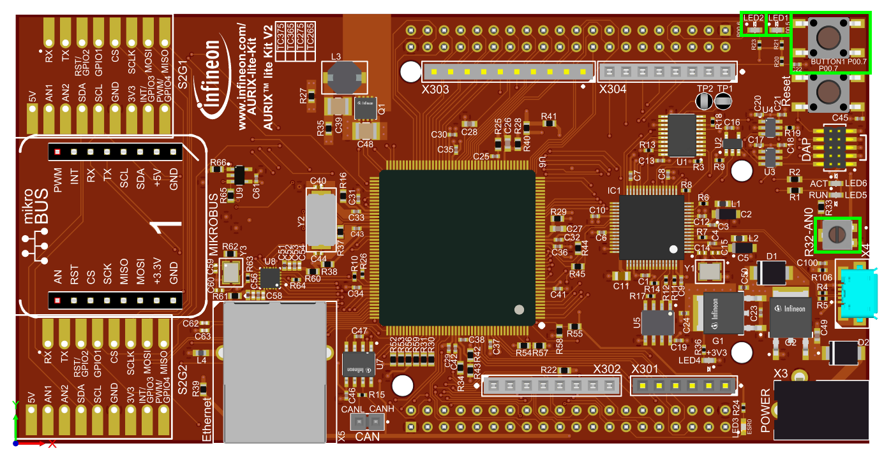
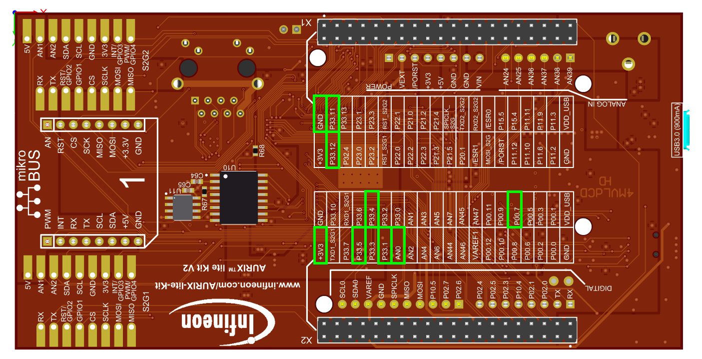
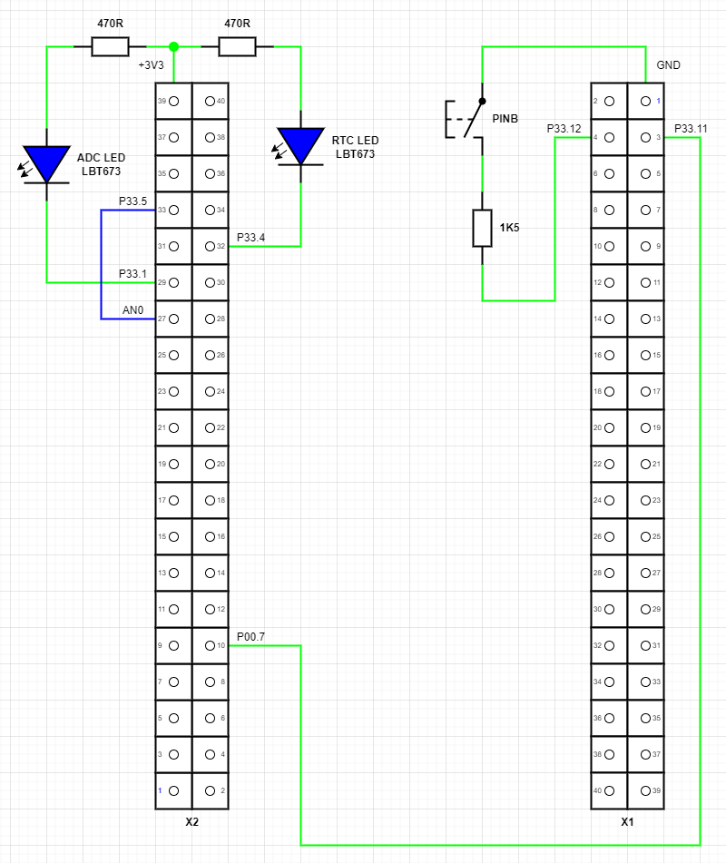

  

# iLLD_TC375_ADS_SCR_RTC_ADCOMP_wakeup_LK

**This code example demonstrates periodic ADC (Analog Digital Converter) measurement in standby mode using SCR (Standby Controller).**

## Device

The device used in this example is AURIX™ TC37xTP_A-Step.

## Board

The board used for testing is the AURIX™ TC375 lite Kit V2 (KIT_A2G_TC375_LITE).

## Scope of work

This is a minimal code example presenting a solution to application scenario 2 from Application Note AP32465.
The goal is to perform a periodic evaluation of a few analog channels and trigger a wake-up if threshold crossing is detected.
High ADC resolution is not required (LSB = 25 mV or better) in this mode.

## Introduction

### SCR

The Standby Controller (SCR) is intended to perform basic operation while the rest of the system is in standby, effectively reducing standby-power consumption while still supporting requested standby features. The SCR is based on an 8-bit XC800-core with a limited list of peripherals.

### RTC

One of the SCR peripherals is the Real-Time Clock (RTC) that, once started, can work independently of the state of the rest of the microcontroller.

The real-time clock consists of an up-counting 32-bit timer register (Real-Time Clock Counter) with an upstream 9-bit prescaler. It contains a set of 4 (8-bit) count registers that shows the current count value or the current time of the real-time clock. Another set of registers (RTC compare registers) that consists of 4 (8-bit) registers can be used for interrupt generation. It can also be used to wake-up the device from *Standby Mode*.

### ADC Comparator

Another SCR peripheral is the ADC Comparator Unit (ADCOMP) which is shared with the TriCore™ CPU where it is used for voltage monitoring during *Run Mode*. The ADCOMP constitutes an 8-bit successive approximation Analog-to-Digital converter (ADC) supporting up to 4 channels connected to SCR Pins P00.4 (P33.4) to P00.7 (P33.7). If the TriCore™ CPU is in *Standby Mode* the SCR may enable the ADCOMP unit but only if operating at 100 MHz back-up clock.

## Hardware setup

This code example has been developed for the AURIX™ TC375 lite Kit V2 (KIT_A2G_TC375_LITE).

### Top view

Top view of the AURIX™ TC375 lite Kit V2. Used button and LEDs are marked with a green frame.

- **BUTTON1 (P00.7)** is the button on the top right.
- **R32-AN0 (AN0)** is the potentiometer near the USB connector.
- **LED1 (P00.5)** is the right LED on the top right, near BUTTON1.
- **LED2 (P00.6)** is the left LED on the top right.

### Bottom view

Bottom view of the AURIX™ TC375 lite Kit V2. Used Pins are marked with a green frame.

- **X1** is the 40-pin connector on the top. Pin 1 marking is on the top left.
- **X2** is the 40-pin connector in the bottom, near the Infineon logo. Pin 1 marking is on the bottom right.

### Additional hardware

For the example some additional external hardware is needed as shown in the below schematic.

- To see SCR RTC activity a LED shall be connected between X2-32 (P33.4) and X2-39 (+3V3).
- To see SCR ADCOMP activity a LED shall be connected between X2-29 (P33.1) and X2-39 (+3V3).
- To simulate analog measurements and trigger a wake-up from *Standby Mode* a connection between X2-27 (AN0) and X2-33 (P33.5) is needed.
- For triggering the state change from *Run Mode* to *Standby Mode* a connection between X2-10 (P00.7) and X1-03 (P33.11) is needed to generate a falling edge.
- For triggering the *PINB Wake-up* a switch shall be connected to X1-04 (P33.12) and X1-01 (GND) to generate a falling edge.

### Available I/O signals

<table border="1px" cellpadding="5px" width="600">
<tr><th>   SCR I/O   </th><th>   TC3 I/O   </th><th>   AURIX™ lite Kit V2.0    </th><th>   Code Example    </th></tr>
<tr><td>    P00.0    </td><td>   P33.0     </td><td>   X2-28 (free)            </td><td>                   </td></tr>
<tr><td>    P00.1    </td><td>   P33.1     </td><td>   X2-29 (free)            </td><td> ADCOMP status LED </td></tr>
<tr><td>    P00.2    </td><td>   P33.2     </td><td>   X2-30 (free)            </td><td>                   </td></tr>
<tr><td>    P00.3    </td><td>   P33.3     </td><td>   X2-31 (free)            </td><td>                   </td></tr>
<tr><td>    P00.4    </td><td>   P33.4     </td><td>   X2-32 (free)            </td><td> RTC status LED    </td></tr>
<tr><td>    P00.5    </td><td>   P33.5     </td><td>   X2-33 (free)            </td><td> ADCOMP analog IN  </td></tr>
<tr><td>    P00.6    </td><td>   P33.6     </td><td>   X2-34 (free)            </td><td>                   </td></tr>
<tr><td>    P00.7    </td><td>   P33.7     </td><td>   X2-35 (see [^1])        </td><td>                   </td></tr>
<tr><td>             </td><td>             </td><td>                           </td><td>                   </td></tr>
<tr><td>    P01.0    </td><td>   P34.1     </td><td>   n. a. (not connected)   </td><td>                   </td></tr>
<tr><td>    P01.1    </td><td>   P33.9     </td><td>   X2-37 (free)            </td><td>                   </td></tr>
<tr><td>    P01.2    </td><td>   P33.10    </td><td>   X2-38 (free)            </td><td>                   </td></tr>
<tr><td>    P01.3    </td><td>   P33.11    </td><td>   X1-03 (free)            </td><td> Trigger button    </td></tr>
<tr><td>    P01.4    </td><td>   P33.12    </td><td>   X1-04 (free)            </td><td> PINB wake-up      </td></tr>
<tr><td>    P01.5    </td><td>   P33.13    </td><td>   X1-25 (free)            </td><td>                   </td></tr>
<tr><td>    P01.6    </td><td>   P33.14    </td><td>   n. a. (not connected)   </td><td>                   </td></tr>
<tr><td>    P01.7    </td><td>   P33.15    </td><td>   n. a. (not connected)   </td><td>                   </td></tr>
<tr><td>             </td><td>             </td><td>                           </td><td>                   </td></tr>
<tr><td>             </td><td>   P00.5     </td><td>   X2-08 (LED D1)          </td><td> TC activity LED   </td></tr>
<tr><td>             </td><td>   P00.6     </td><td>   X2-07 (LED D2)          </td><td> Wake-up LED       </td></tr>
<tr><td>             </td><td>   P00.7     </td><td>   X2-10 (BUTTON1)         </td><td> Connect to X1-03  </td></tr>
<tr><td>             </td><td>   AN0       </td><td>   X2-27 (POTI10k)         </td><td> Connect to X2-33  </td></tr>
</table>

- [^1]: Output for Power Down Input of DP83825

## Implementation

### Embedding of the SCR code into the TriCore™ project

While the build process, the SCR code is compiled to a binary output which is translated into SCR_AURIX_TC3x.h and SCR_AURIX_TC3x.c files.
These two files are generated and included into the TriCore™ project automatically.
The file SCR_AURIX_TC3x.c contains the binary SCR code and is loaded by code execution of CPU0 to the SCR XRAM memory.

### CPU0 code

After startup the first part of the code is responsible to turn off *WATCHDOG0* and *SAFETY WATCHDOG* to ensure they won't affect the example code.

For proper SCR handling, the user software must take care to reset *SCU_RSTSTAT.STBYR* flag via *SCU_RSTCON2.CLRC* according to the application - e.g. after the initial system power-on, if SCR usage during stand-by mode is intended.

Wake-up from SCR via register *STDBYWKP.SCRWKP* in turn caused by following events. *PMSWSTAT2.SCRWKP* set on wake-up. *PMSWSTAT2.SCROVRUN* set to indicate overrun behavior in case of multiple un-serviced wake-ups. *PMSWSTAT2.SCROVRUN* needs to be cleared to avoid immediate wake-up on next time entering *Standby mode*.

The function `configureAppBspStatusLeds()` configures all output pins of the available status LEDs (D1 and D2).

Next step is to check the wake-up cause to be one of the following:

1. ESR1 edge transition (NMI trap): *PMSWSTAT2.ESR1WKP*

   If ESR1 edge wake-up trigger has occurred the ESR1 wake-up status LED (D2) blinks 4 times. The code ends in an endless loop. If SCR code is already loaded and active the TC status LED (D1) will blink at the same frequency as port P33.4 which is mirrored to P00.5 (D1).

2. Pin B edge transition (P33.12): *PMSWSTAT2.PINBWKP*

   If PINB edge wake-up trigger has occurred the PINB wake-up status LED (D2) blinks 3 times and turns on permanently. The code ends in an endless loop. If SCR code is already loaded and active the TC status LED (D1) will blink at the same frequency as port P33.4 which is mirrored to P00.5 (D1).

3. Wake-up from SCR via register *STDBYWKP.SCRWKP*: *PMSWSTAT2.SCRWKP*

   If SCR wake-up trigger has occurred the SCR wake-up status LED (D2) turns on and the software waits for a button press event to occur (falling edge on P33.11/SCR P01.3) which can be triggered by pressing BUTTON1.
   After the button press event the TriCore™ Cpu0 reenters *Standby Mode* again.

4. No wake-up trigger

   If no wake-up trigger has occurred the PowerOn status LED (D2) blinks 5 times and turns on permanently. The function `configureAppBspScrPorts()` configures all shared pins to be under control of SCR.

   The TriCore™ Cpu0 is now initializing the SCR. While compiling the SCR code is added as a C-array to the TriCore™ project and copied while initialization to the SCR XRAM (SCR code/data memory).

   First the SCR is reset and disabled by setting the SCR Boot Mode to *User Mode 0* (XRAM not programmed). The function `IfxScr_copySCRprogram()` is copying the binary SCR program from the NVM Flash to the SCR XRAM. The copying begins at the XRAM start address (*0xF0240000*) until the length of `SIZE_scr_xram`. In addition, the magic pattern (*0xAA55AA55*) at the end of the XRAM (*0xF0241FF8*) is written to validate the stored code. 
   The function `IfxScr_initSCR()` now configures the SCR Boot Mode either to *User Mode 1* or *OCDS boot* which can be selected during compile time via define `DEBUG_SCR_DAP`.
   To debug the SCR firmware (which is not possible during *Standby Mode*) another compile time switch (`DEBUG_SCR_NO_STBY`) can be used to prevent entering *Standby Mode*.
   If `DEBUG_SCR_NO_STBY` is set to *FALSE* a region of shared XRAM is programmed with the desired RTC wake-up period `SCR_RTC_PERIOD_MS` (default 200 ms).

   Finally, via register *PMS_PMSWCR0* the wake-up triggers are configured and the software waits for a button press event to occur (falling edge on P33.11/SCR P01.3) which can be triggered by pressing BUTTON1. The toggling SCR port P00.4 can't directly be observed on the used AURIX™ TC375 lite Kit V2, just by using an oscilloscope or an LED connecting to the port. The SCR port P00 is equivalent to port P33 of the TriCore™ CPU. To observe the SCR P00.4 (P33.4) line the TriCore™ Cpu0 is mirroring the P33.4 state to the port line P00.5 which is connected to LED D1 on the AURIX™ TC375 lite Kit V2.

   After the button press event the TriCore™ Cpu0 enters *Standby Mode* and gives further control to SCR.

### SCR code

At the beginning all global SCR data structures (HF active flag, SCR/TC data exchange, ADC data and flags, ...) are initialized with default values.

Second step is the configuration of the used I/O interface. Pins P00.0 to P00.6 and P01.1 to P01.5 are enabled by writing to the *SCR_IO_P00_PDISC* and *SCR_IO_P01_PDISC* registers. Set SCR_P00.1 and SCR_P00.4 to high (LED off) by writing to the *SCR_IO_P00_OUT* register and finally P00.1 and P00.4 are set as push-pull output and P01.3 and P01.4 are configured as input writing to the *SCR_IO_P00_IOCR1*, *SCR_IO_P00_IOCR4*, *SCR_IO_P01_IOCR3* and *SCR_IO_P01_IOCR4* registers.

Third step is to enable the high frequency (HF) system clock (20 MHz) by setting *DIV5=0*, *OSCWAKE=1* and *OSPD=0* in *SCR_SCU_CMCON* register and wait for the TriCore™ CPU to be in *Standby Mode*. This is done as the AD converter is primarily used as a secondary voltage monitor during normal *Run Mode* of the TriCore™ CPU and cannot be used in SCR during this time.

In the fourth step the used SCR modules like RTC and for debug purpose the OCDS (On-Chip Debug Support) module are enabled by clearing the corresponding bit in the register *SCR_SCU_PMCON1* (Note: *The OCDS module is not required for the SCR code execution.*). Then the interrupt system is configured and the RTC and ADCOMP interrupts are enabled. For the RTC module *XINTR13* and for the ADCOMP module *XINTR7* is used. And following the RTC module itself is set up by predefining the RTC counter registers according to the values set in the global SCR/TC data exchange structure (default period is 200 milliseconds).
Now the low frequency system clock (70 kHz) is enabled by setting *OSCWAKE=0* and *OSPD=1* in *SCR_SCU_CMCON* register, the global HF active flag is set to disabled and the register *SCR_RTC_CON* is modified to select 70 kHz clock as clock source, disable the 9-bit prescaler, enable the clock compare interrupt and start the RTC.

Finally, the code enters an endless loop where the global HF active flag is monitored. If the HF is enabled the software checks if the ADCOMP unit is already enabled.
If not, the *SCR_RTC_CRx* registers are updated with the latest value set by TriCore™ Cpu0 and the start of measurement cycle is shown by setting pin P00.1 to low. The ADCOMP unit is enabled by writing bit *ADCENREQ* and *ADCIEN* in register *SCR_ADCOMP_CON*. Now a dummy conversion is triggered by writing bit *SOC* in register *SCR_ADCOMP_CON*.
If ADCOMP is enabled, it is checked if a conversion phase is completed via monitoring the `g_newADCtrigger` flag.
Next step is to check if more samples need to be taken. If so and the last result is valid, the result is read from the register *SCR_ADCOMP_RES* into the variable `g_newADCresult` and the next conversion is triggered for the next channel (in this example only channel 1 is acquired) by writing bit *SOC* in register *SCR_ADCOMP_CON*.
The first sample from the initial dummy conversion after startup is discarded, all other values are fed into a simple moving average filter (the previous average value is divided by two and half of the current value is added) and the global conversion counter is incremented. The start of next sampling phase is shown by toggling pin P00.1.
If the required number of samples (`ADC_MAX_CONVERSIONS`) have been taken, the ADCOMP unit is disabled, the last value is fed into the moving average filter and the global conversion counter is reset.
The low frequency system clock (70 kHz) is enabled by setting *OSCWAKE=0* and *OSPD=1* in *SCR_SCU_CMCON* register, the global HF active flag is set to disabled and the register *SCR_RTC_CON* is modified to select 70 kHz clock as clock source, disable the 9-bit prescaler, enable the clock compare interrupt and start the RTC.
If `ADC_THRESHOLD_WAKE_UP` is configured the averaged ADC result (`g_adcAverage`) is compared against the predefined threshold value `ADC_WAKE_THRESHOLD` and if the threshold value is exceeded the SCRWKP event is generated to wake-up the TriCore™ domain from *Standby Mode*.

### RTC interrupt code

An interrupt will be generated when the contents of *SCR_RTC_CRx* and *SCR_RTC_CNTx* are equal and *ECRTC* is set to 1 and the bit *CFRTC* in register *SCR_RTC_CON* will be set. The *CFRTC* flag has to be cleared to 0 by user software. In such situation, the real-time clock counter is reset and starts counting from zero again. The SCR_P00.4 LED is toggled to show RTC activity.

If the TriCore™ domain is in *Standby Mode* and HF is disabled the register *SCR_RTC_CON* is modified to select 70 kHz clock as clock source, disable the 9-bit prescaler, disable the clock compare interrupt and stop the RTC. Then the high frequency system clock (20 MHz) is enabled and the global HF active flag is set to enabled.

### ADCOMP interrupt code

An interrupt will be generated after the conversion phase is completed and bit *EOCSAMPLE* in register *SCR_ADCOMP_CON* is set. The *ADCIR* flag of register *SCR_IRCON1* has to be cleared to 0 by user software. Now the end of conversion is signaled by setting the flag `g_newADCtrigger` to TRUE.  The end of conversion is shown by toggling pin P00.1.

## Compiling and programming

Before testing this code example:  
- Power the board through the dedicated power connector 
- Connect the board to the PC through the USB interface
- Build the project using the dedicated Build button  or by right-clicking the project name and selecting "Build Project"
- To flash the device and immediately run the program, click on the dedicated Flash button   

## Run and Test

- Ensure the potentiometer (R32-AN0) near the USB connector is in it's rightmost position.
  Use a small screw driver and turn it slowly right to the limit.
- After powering the board LED2 flashes 5 times and turns on permanently.
  This is the indication that the software has started successfully and is now waiting for user interaction.
- By pressing BUTTON1 the TriCore™ Cpu0 enters *Standby Mode* and gives further control to SCR.
  Now LED1 and LED2 turn off and RTC activity can only be seen on the external LED connected to P33.4 (X2-32).
  The periodic short HF activations to take the ADC samples in *Standby Mode* can be seen on the external LED connected to P33.1 (X2-29) (if define *ADC_MONITOR_ACTIVE_TIME* is set to *TRUE*). 
- Use a small screw driver and turn the potentiometer slowly to the left, to increase the voltage level on P33.5.
- If the configured threshold value `ADC_WAKE_THRESHOLD` is exceeded, a wake-up of the TriCore™ domain from *Standby Mode* is triggered,
  which is indicated by LED1 turning permanently on and LED1 blinking in RTC interval (same interval as external LED connected to P33.4).
  As the TriCore™ Cpu0 is now in *Run Mode* the ADCOMP unit is not usable by the SCR the external LED connected to P33.1 (X2-29) stops flashing.
- A short press of BUTTON1 causes the TriCore™ Cpu0 to enter *Standby Mode* again, which can be observed by LED1 and LED2 turning off.
  After the next ADC measurement cycle, shown by flashing the external LED connected to P33.1 (X2-29), the TriCore™ Cpu0 returns to *Run Mode* again
  as the voltage level on P33.5 is still above the threshold.
- Now turn the potentiometer slowly to the right (~45°) to decrease the voltage level on P33.5 and press BUTTON1 again.
- This causes the TriCore™ Cpu0 to enter *Standby Mode* and gives further control back to SCR.
  Now LED1 and LED2 turn off and RTC activity can only be seen on the external LED connected to P33.4 (X2-32).
  The periodic short HF activations to take the ADC samples in *Standby Mode* can be seen on the external LED connected to P33.1 (X2-29) (if define *ADC_MONITOR_ACTIVE_TIME* is set to *TRUE*). 
- Pressing the external button connected to P33.12 (X1-04) triggers the *PINB Wake-up* event which causes the TriCore™ domain
  to exit *Standby Mode*. This is indicated by LED2 flashing 3 times and turn on permanently.
- Now LED1 starts to blink in RTC interval (default 0.2s or 1s if define *RTC_INTERVAL_1S* is set to *TRUE*).
  This is the indication that the software has entered the final endless loop.

## References

AURIX&trade; Development Studio is available online:  
- <https://www.infineon.com/aurixdevelopmentstudio>  
- Use the "Import..." function to get access to more code examples  

More code examples can be found on the GIT repository:  
- <https://github.com/Infineon/AURIX_code_examples>  

For additional trainings, visit our webpage:  
- <https://www.infineon.com/aurix-expert-training>  

For questions and support, use the AURIX&trade; Forum:  
- <https://community.infineon.com/t5/AURIX/bd-p/AURIX>  
