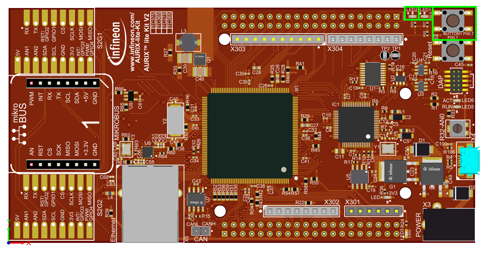
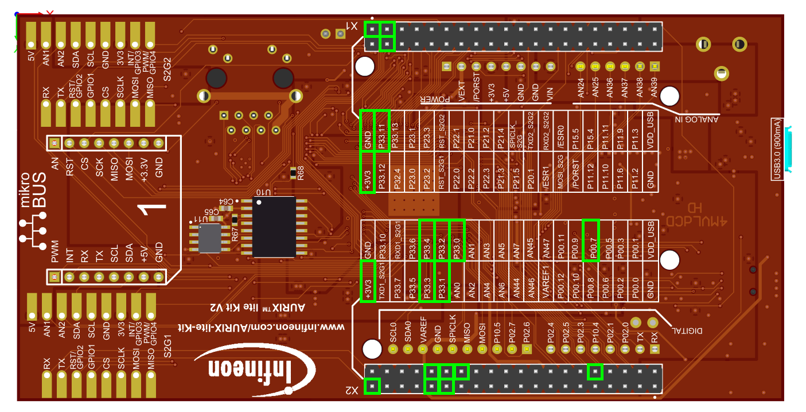
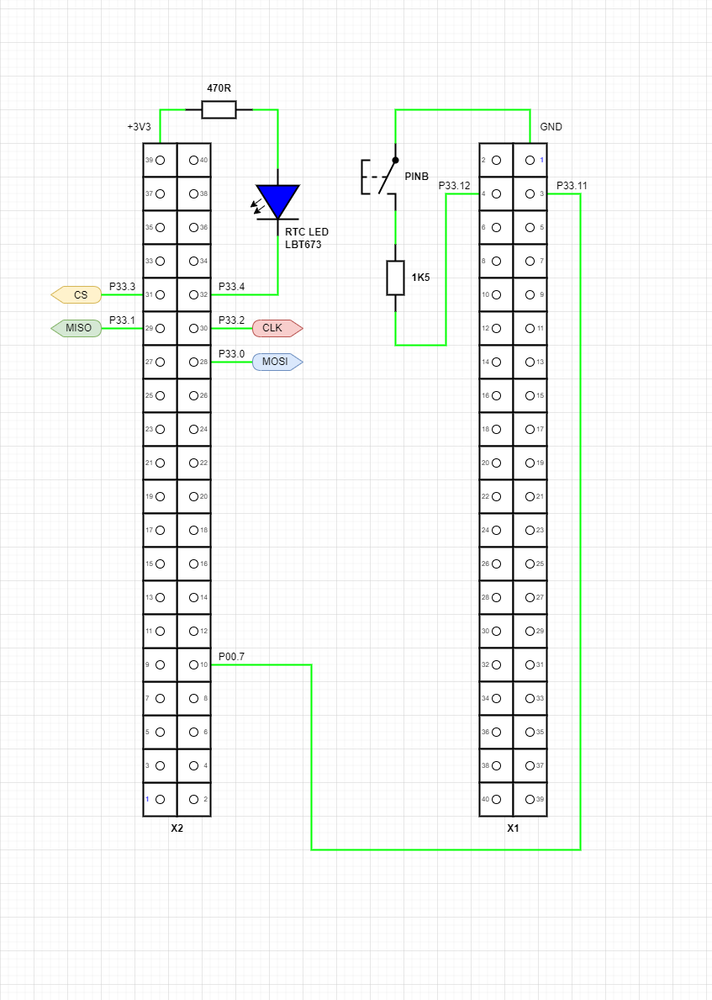

# iLLD_TC375_ADS_SCR_SPI-32bit-controller_LK

**This repository is an SCR example demonstrating the SCR-SPI initialization and SW for an 32-bit SPI controller (master). **

## Device

The device used in this example is AURIX™ TC37xTP_A-Step.

## Board

The board used for testing is the AURIX™ TC375 lite Kit V2 (KIT_A2G_TC375_LITE).

## Scope of work

This code example gives an overview how to configure the SCR SSC module as SPI master device and transfer 32-bit data from/to a slave device.
The configuration is encapsulated in the files `spi.h` and `spi.c` and provides all possible configurations for all available MOSI, MISO and SCLK lines.
The optional CS lines are limited to a subset of four available pins.

## Introduction

### SCR

The standby controller (SCR) is intended to perform basic operation while the rest of the system is in standby, effectively reducing standby-power consumption while still supporting requested standby features.
The SCR is based on an 8-bit XC800-core with a limited list of peripherals.

### SSC

The Synchronous Serial Channel (SSC) supports both full-duplex and half-duplex serial synchronous communication. The serial clock signal can be generated by the SSC itself (master mode) through its own 16-bit baud-rate generator, or can be received from an external master (slave mode). Data width, shift direction, clock polarity, and phase are programmable.
This allows communication with SPI-compatible devices using another synchronous serial channel.

## Hardware setup

This code example has been developed for the AURIX™ TC375 lite Kit V2 (KIT_A2G_TC375_LITE).

It can also be used on the AURIX™ TriBoard TC3X7 TH V2.0(1) with minor modifications in the file `AppBsp_Conf.h`.
Change the defines `USE_KIT_A2G_TC397_5V_TFT` and `USE_KIT_A2G_TC375_LITE` to `FALSE` and `USE_KIT_TC397_TRB` to `TRUE` to run the example code on the TriBoard TC3X7 TH V2.0(1).

### Top view

Top view of the AURIX™ TC375 lite Kit V2. Used button and LEDs are marked with a green frame.

- **BUTTON1 (P00.7)** is the button on the top right.
- **LED1 (P00.5)** is the right LED on the top right, near BUTTON1.
- **LED2 (P00.6)** is the left LED on the top right.

### Bottom view

Bottom view of the AURIX™ TC375 lite Kit V2. Used Pins are marked with a green frame.

- **X1** is the 40-pin connector on the top. Pin 1 marking is on the top left.
- **X2** is the 40-pin connector on the bottom, near the Infineon logo. Pin 1 marking is on the bottom right.

### Additional hardware

For the example some additional external hardware is needed as shown in the below schematic.

- To see SCR RTC activity a LED shall be connected between X2-32 (P33.4) and X2-39 (+3V3).
- For triggering the state change from *run mode* to *standby mode* a connection between X2-10 (P00.7) and X1-03 (P33.11) is needed.
- For triggering the *PINB wake-up* a switch shall be connected between X1-04 (P33.12) and X1-01 (GND) to generate a falling edge.
- Master board *SPI_CLK* X2-30 (P33.2) needs to be connected to slave board *SPI_CLK*.
- Master board *SPI_MOSI* X2-28 (P33.0) needs to be connected to slave board *SPI_MOSI*.
- Master board *SPI_MISO* X2-29 (P33.1) needs to be connected to slave board *SPI_MISO*.
- Master board *SPI_CS* X2-31 (P33.3) needs to be connected to slave board *SPI_CS*.

### Available I/O signals

<table border="1px" cellpadding="5px" width="600">
<tr><th>   SCR I/O   </th><th>   TC3 I/O   </th><th>   AURIX™ lite Kit V2.0    </th><th>   Code Example    </th></tr>
<tr><td>    P00.0    </td><td>   P33.0     </td><td>   X2-28 (free)            </td><td> SPI MOSI          </td></tr>
<tr><td>    P00.1    </td><td>   P33.1     </td><td>   X2-29 (free)            </td><td> SPI MISO          </td></tr>
<tr><td>    P00.2    </td><td>   P33.2     </td><td>   X2-30 (free)            </td><td> SPI CLK           </td></tr>
<tr><td>    P00.3    </td><td>   P33.3     </td><td>   X2-31 (free)            </td><td> SPI CS            </td></tr>
<tr><td>    P00.4    </td><td>   P33.4     </td><td>   X2-32 (free)            </td><td> RTC status LED    </td></tr>
<tr><td>    P00.5    </td><td>   P33.5     </td><td>   X2-33 (free)            </td><td>                   </td></tr>
<tr><td>    P00.6    </td><td>   P33.6     </td><td>   X2-34 (free)            </td><td>                   </td></tr>
<tr><td>    P00.7    </td><td>   P33.7     </td><td>   X2-35 (see [^1])        </td><td>                   </td></tr>
<tr><td>             </td><td>             </td><td>                           </td><td>                   </td></tr>
<tr><td>    P01.0    </td><td>   P34.1     </td><td>   n. a. (not connected)   </td><td>                   </td></tr>
<tr><td>    P01.1    </td><td>   P33.9     </td><td>   X2-37 (free)            </td><td>                   </td></tr>
<tr><td>    P01.2    </td><td>   P33.10    </td><td>   X2-38 (free)            </td><td>                   </td></tr>
<tr><td>    P01.3    </td><td>   P33.11    </td><td>   X1-03 (free)            </td><td> Trigger button    </td></tr>
<tr><td>    P01.4    </td><td>   P33.12    </td><td>   X1-04 (free)            </td><td> PINB wake-up      </td></tr>
<tr><td>    P01.5    </td><td>   P33.13    </td><td>   X1-25 (free)            </td><td>                   </td></tr>
<tr><td>    P01.6    </td><td>   P33.14    </td><td>   n. a. (not connected)   </td><td>                   </td></tr>
<tr><td>    P01.7    </td><td>   P33.15    </td><td>   n. a. (not connected)   </td><td>                   </td></tr>
<tr><td>             </td><td>             </td><td>                           </td><td>                   </td></tr>
<tr><td>             </td><td>   P00.5     </td><td>   X2-08 (LED1)            </td><td> TC activity LED   </td></tr>
<tr><td>             </td><td>   P00.6     </td><td>   X2-07 (LED2)            </td><td> PWRON status LED  </td></tr>
<tr><td>             </td><td>   P00.7     </td><td>   X2-10 (BUTTON1)         </td><td> Connect to X1-03  </td></tr>
<tr><td>             </td><td>   AN0       </td><td>   X2-27 (POTI10k)         </td><td>                   </td></tr>
</table>

- [^1]: Output for Power Down Input of DP83825

## Implementation

### Embedding of the SCR code into the TriCore™ project

While the build process, the SCR code is compiled to a binary output which is translated into SCR_AURIX_TC3x.h and SCR_AURIX_TC3x.c files.
These two files are generated and included into the TriCore™ project automatically.
The file SCR_AURIX_TC3x.c contains the binary SCR code and is loaded by code execution of CPU0 to the SCR XRAM memory.

### CPU0 code

After startup the first part of the code is responsible to turn off *WATCHDOG0* and *SAFETY WATCHDOG* to ensure they won't affect the example code.

For proper SCR handling, the user software must take care to reset *SCU_RSTSTAT.STBYR* flag via *SCU_RSTCON2.CLRC* according to the application - e.g. after the initial system power-on, if SCR usage during *standby mode* is intended.

The function `configureAppBspStatusLeds()` configures all output pins of the available status LEDs (LED1 and LED2).

Next step is to check the wake-up cause to be one of the following:

1. Pin B edge transition (P33.12): *PMSWSTAT2.PINBWKP*

    - If PINB edge wake-up trigger has occurred the PowerOn status LED (LED2) blinks 3 times and turns on permanently.
    - The code ends in an endless loop and the TC activity LED (LED1) will blink at the same frequency as port P33.4 which is mirrored to P00.5 (D1).

2. No wake-up trigger

    - If no wake-up trigger has occurred the PowerOn status LED (LED2) blinks 5 times and turns on permanently.
    - The TC activity LED (LED1) turns on permanently, which is the indication that the software waits for user input.
    - The function `configureAppBspScrPorts()` configures all shared pins to be under control of SCR.
    - The TriCore™ Cpu0 is now initializing the SCR. While compiling the SCR code is added as a C-array to the TriCore™ project and copied while initialization to the SCR XRAM (SCR code/data memory).
        - First the SCR is reset and disabled by setting the SCR Boot Mode to *User Mode 0* (XRAM not programmed).
        - The function `IfxScr_copySCRprogram()` is copying the binary SCR program from the NVM Flash to the SCR XRAM. The copying begins at the XRAM start address (*0xF0240000*) until the length of `SIZE_scr_xram`. In addition, the magic pattern (*0xAA55AA55*) at the end of the XRAM (*0xF0241FF8*) is written to validate the stored code. 
        - The function `IfxScr_initSCR()` now configures the SCR Boot Mode either to *User Mode 1* or *OCDS boot* which can be selected during compile-time via define `DEBUG_SCR_DAP`.
        - To debug the SCR firmware (which is not possible during *standby mode*) another compile-time switch (`DEBUG_SCR_NO_STBY`) can be used to prevent entering *standby mode*.
        - If `DEBUG_SCR_NO_STBY` is set to *FALSE* a region of shared XRAM is programmed with the desired RTC wake-up period `SCR_RTC_PERIOD_MS` (default 200 ms).
    - Finally, via register *PMS_PMSWCR0* the wake-up triggers are configured and the software waits for a button press event to occur (falling edge on P33.11/SCR P01.3) which can be triggered by pressing BUTTON1.
    - After the button press event the TriCore™ Cpu0 enters *standby mode* and gives further control to SCR.

### SCR code

First all generated resets are cleared, the SCR core clock is set to HF mode (default 20MHz) and the global flags are set to default values.

Second step is the configuration of the used I/O interface. Pins SCR_P00.0 to SCR_P00.6 and SCR_P01.1 to SCR_P01.5 are enabled by writing to the *SCR_IO_P00_PDISC* and *SCR_IO_P01_PDISC* registers. Set SCR_P00.4 to high by writing to the *SCR_IO_P00_OUT* register and finally SCR_P00.4 is set as push-pull output and P01.3 and P01.4 are configured as input writing to the *SCR_IO_P00_IOCR4*, *SCR_IO_P01_IOCR3* and *SCR_IO_P01_IOCR4* registers.

Pin SCR_P00.0 is set to low, to indicate that SCR is in active mode.
If `WAIT_TC_STANDBY_MODE` is set to `TRUE` the SCR waits for the TriCore™ to enter *standby mode*.
If `WAIT_TC_STANDBY_MODE` is set to `FALSE` the SCR waits for a button press event to occur (falling edge on P33.11/SCR P01.3) which can be triggered by pressing BUTTON1.
(Note: This is not mandatory but is used here to generate a defined starting point for the code example.)

During the fourth step the used SCR modules like SSC, RTC and for debug purpose the OCDS (On-Chip Debug Support) module are enabled by clearing the corresponding bit in the register *SCR_SCU_PMCON1* (Note: *The OCDS module is not required for the SCR code execution.*).

In the fifth step the interrupt system is configured and the SSC interrupts are enabled. For the SSC module *XINTR7* and for the RTC module *XINTR13* are used. And following the SSC and RTC modules are set up:
- Set the SSC/SPI clock to 100 kilobauds
- Set the pin configuration for MISO, MOSI, SCLK and CS
- Configure SSC module as SPI master
- Fill RX/TX buffers with default values
- Enable the RTC interrupt, bypass the 9-bit prescaler, select 20 MHz RTC input clock
- Start the RTC

Finally, the global bitmask for data is set to th initial value and the endless loop is entered.
- If `g_rtcTrigger` is set to `TRUE` the pin SCR_P00.4 is toggled to show RTC activity
- If `g_runSpi` is set to `TRUE`:
    - If `g_bitMask` is `0` the bit mas is reset to 0x00000001
    - The inverted bitmask is set es next byte to transmit having only one bit be 0
    - The bitmask is shifted left to see a moving zero on each SPI transfer
    - The next SPI transfer is started and the flag `g_runSpi` is set to `FALSE`

### RTC interrupt code

An interrupt will be generated when the contents of *SCR_RTC_CRx* and *SCR_RTC_CNTx* are equal and *ECRTC* is set to 1 and the bit *CFRTC* in register *SCR_RTC_CON* will be set. The *CFRTC* flag has to be cleared to 0 by user software. In such situation, the real-time clock counter is reset and starts counting from zero again.
The global flag `g_rtcTrigger` is set to `TRUE` and if the TriCore™ is in standby mode the global flag `g_runSpi` is set to `TRUE`.

## Compiling and programming

Before testing this code example:
- Power the board through the dedicated power connector
- Connect the board to the PC through the USB interface
- Build the project using the dedicated Build button  or by right-clicking the project name and selecting "Build Project"
- To flash the device and immediately run the program, click on the dedicated Flash button 

**Note:**
    Tested with AURIX™ Development Studio Version 1.10.6

## Run and Test

Note:   Ensure an oscilloscope or logic analyzer is connected to P33.0, P33.1, P33.2 and P33.3 to observe SPI activity.

- After powering the board LED2 flashes 5 times and turns on permanently.
- Now LED1 turns on permanently and P33.0, P33.1, P33.2 and P33.3 show a low level.
  This is the indication that the software has started successfully and is now waiting for user interaction.
- By pressing BUTTON1 the TriCore™ Cpu0 enters *standby mode* and gives further control to SCR.
  Now LED1 and LED2 turn off and SCR activity can be seen only via P33.4 (RTC) and P33.0, P33.1, P33.2 and P33.3 (SPI).
- After pressing BUTTON1, P33.0, P33.1, P33.2 and P33.3 turn from low to high, which is the SPI idle mode value.
- On the each RTC interrupt the value of P33.4 is toggled and an SPI transfer is started.
    - This can be observed by P33.4 (CS) turning from high to low.
    - Followed by 8 clock pulses on P33.3 (CLK) and the next pattern (initial value 0xFE) with only one bit set to 0 on P33.0 (MOSI).
    - If no slave is connected P33.1 (MISO) should be stuck to high (reading back 32 times 1).
    - The transfer is ended if P33.4 (CS) turns from low to high.
- On the each consecutive RTC interrupt the single 0 bit is moving one step left, with a roll over on the thirty-third transfer.

## References

AURIX&trade; Development Studio is available online:  
- <https://www.infineon.com/aurixdevelopmentstudio>  
- Use the "Import..." function to get access to more code examples  

More code examples can be found on the GIT repository:  
- <https://github.com/Infineon/AURIX_code_examples>  

For additional trainings, visit our webpage:  
- <https://www.infineon.com/aurix-expert-training>  

For questions and support, use the AURIX&trade; Forum:  
- <https://community.infineon.com/t5/AURIX/bd-p/AURIX>  
