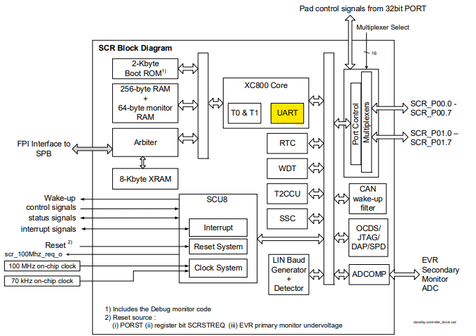
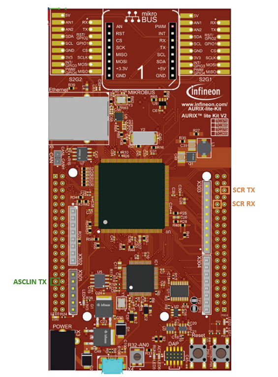
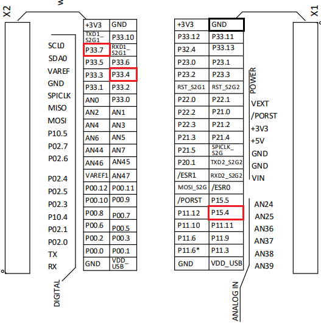
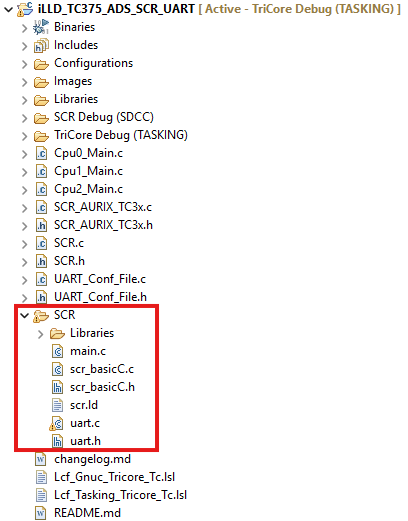
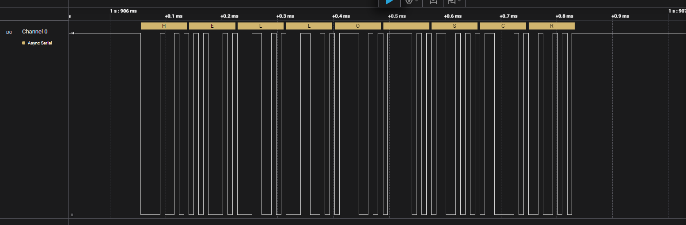

  

# iLLD_TC375_ADS_SCR_UART
**The SCR UART module is used to receive message from Tricore ASCLIN Module.**

## Device  
The device used in this example is AURIX&trade; TC37xTP_A-Step.

## Board  
The board used for testing is the AURIX&trade; TC375 lite Kit (KIT_A2G_TC375_LITE).

## Scope of work  
The UART module of the StandBy Controller (SCR) is used to received the message "HELLO_SCR" from ASCLIN 1 module and send it back.

## Introduction  
The Universal Asynchronous Receiver-Transmitter (UART) communication protocol is provided by the Asynchronous/Synchronous Interface (ASCLIN) module on the AURIX&trade; microcontroller. It allowed the transmission and reception of data bits simultaneously. 

The SCR is an 8-bit microcontroller, which works independently from AURIX&trade; and is able to runs during standby mode and wake up AURIX&trade;. The SCR has its own peripherals and can control up to 16 shared pins (P33 and P34 pins of the tricore). The SCR provide a Full duplex asynchronous interface for UART communication.

## Hardware setup  
This code example has been developed for the board KIT_A2G_TC375_LITE.

The port pin P15.4 (ASCLIN1 TX) should be connected to port pin P33.4 (SCR RX) and port pin P33.7 should be connected to an oscilloscope probe.

  
## Implementation  

### Configuration of the ASCLIN module
The function *init_ASCLIN1()* called in CPU0 is used to configure the ASCLIN module. It contains the following steps: 

1. The module configuration is created with the structure *IfxAsclin_Asc_Config* and filled in with default values using the function *IfxAsclin_Asc_initModuleConfig()*
2. The UART interrupt is enabled and the priority is set
3. The desired baudrate is selected with the parameter *baudrate.baudrate*
4. The pin configuration is set using the predefined structure *IfxAsclin_Asc_Pins*
5. The ASCLIN module is initialized with *IfxAsclin_Asc_initModule()*

To send data through the TX pin the function *send_UART_message()* is used. This function will send the message "HELLO_SCR" by using the illd function IfxAsclin_Asc_write();

### Configuration of the SCR

#### SCR: Code implementation in the SCR XRAM
Before running the SCR, the SCR code need to be transferred by CPU0 to its XRAM. The SCR can be controlled by the register PMSWCR4 in the Power Management System (PMS). The following step should be done in order to correctly enable the SCR.

1. The SCR clock is restart by disabling and enabling the SCR module (PMSWCR4.SCREN) 
2. The SCR is configured in boot mode 0 using *IfxScr_init()* function. In this mode the XRAM is not programmed and the SCR will not execute is code
3. The SCR code stored in the Tricore flash memory is copied inside the SCR XRAM using *IfxScr_copyProgram()* function
4. The SCR is configured in boot mode 1 using *IfxScr_init()* function. In this mode the SCR will execute the code inside the XRAM

Furthermore, it is important to enable the port pin control of the SCR by setting the pins in register P33_PCSR or P34_PCSR. The SCR is now able to control Pin P33.0-P33.7, P33.9-P33.15 and P34.1.

#### SCR: main code
The SCR code is located inside the SCR folder in the project. The code inside the *main.c* file will be executed.

In *main.c* file the function *scr_basic_conf()*:

- Enable the system clock with a clock divider of 5 (20MHz).
- Enable All the SCR Pins (P00-P01).
- Disable is unused Module in PMCON1 register.
- Clear all the non-maskable interrupt (NMI) while the *scr_enable_int()* function clear all the interrupt register and enable pending interrupt.

#### SCR: Configuration of the UART module
The function *scr_uart_config()* is called in SCR main from the *uart.c* file to configure the UART module. With the structure *IfxScrUART_Handler* the Pin ports, the baudrate and the prescaler can be modified. The function *scr_init_uartPin()*  is used to configure the UART TX and RX pin. SCR_BCON register is used to configure baudrate generator and enable the writing of the baudrate inside SCR_BG register. SCR_SCON is used to enable the UART module.

The *scr_uart_transmit()* and *scr_uart_receive()* are blocking functions used to transmit and receive data bytes. If more than 1 byte is send or received, the interrupt function *uartIsrHandler* will increment the index of the RX and TX buffer to handel the next data byte. The number of bytes should not exceed *Max_Buffer_Size* or the receive and transmit function will be ignored.

## Compiling and programming  
Before testing this code example:  
- Power the board through the dedicated power connector
- Connect the board to the PC through the USB interface  
- Build the project using the dedicated Build button  or by right-clicking the project name and selecting "Build Project"  
- To flash the device and immediately run the program, click on the dedicated Flash button 

## Run and Test
After code compilation and flashing the device, perform the following steps:
- Connect the oscilloscope probe to the SCR UART pin (P33.7) 
- Reset and run the program by pressing the PORST push button
- Check the oscilloscope for the UART signal with 115200 baudrate:

## References  

AURIX&trade; Development Studio is available online:  
- <https://www.infineon.com/aurixdevelopmentstudio>  
- Use the "Import..." function to get access to more code examples  

More code examples can be found on the GIT repository:  
- <https://github.com/Infineon/AURIX_code_examples>  

For additional trainings, visit our webpage:  
- <https://www.infineon.com/aurix-expert-training>  

For questions and support, use the AURIX&trade; Forum:  
- <https://community.infineon.com/t5/AURIX/bd-p/AURIX>  