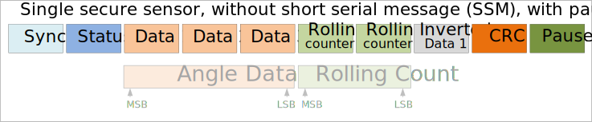
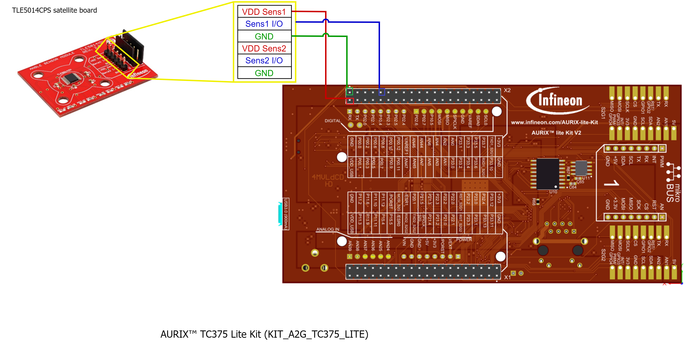
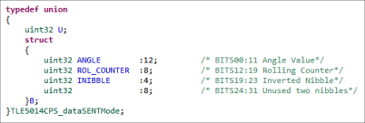
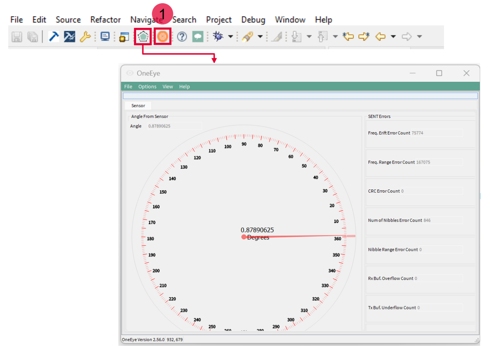

  

# iLLD_TC375_ADS_TLE5014_Interface_SENT_Simple
**Example of simple SENT communication to interface TLE5014 GMR angle sensor.**  

## Device  
The device used in this example is AURIX&trade; TC37xTP_A-Step

## Board  
The board used for testing is the AURIX&trade; TC375_LITE(KIT_A2G_TC375_LITE)

## Scope of work   
With this example, SENT interfacing using AURIX&trade; TC3x Device with TLE5014 angle sensor is demonstrated.

## Introduction  
**SENT**  
The SAE J2716 SENT (**S**ingle **E**dge **N**ibble **T**ransmission) protocol is a point-to-point scheme for transmitting signal values from a sensor to a controller. It is intended to allow transmission of high resolution data with a low system cost. The SENT interface provides a serial communication link typically used to connect sensors or other off-board devices with ECU(**E**lectronic **C**ontrol **U**nit). SENT protocol allows transmission of up to 6 nibbles (1 Nibble= 4 bits) of payload data together with other protocol package data within a single fast channel frame. Each of such fast channel frame also contains one bit of slow serial data. Scope of this  example is to demonstrate SENT interfacing using the Fast Channel. In this example Slow Serial Data is disabled.
  
**TLE5014**  
Infineon XENSIV&trade;  offers TLE5014 digital GMR (**G**iant **M**agneto **R**esistance) angle sensors. TLE5014 GMR sensor comes in four different interface variants SPC, PWM, SENT as well as SPI. To enable fast and easy evaluation of TLE5014 with different communication interfaces, set of different Evalkits and boards are also made available. With this example, TLE5014CPS satellite board, which is featuring the SPC, PWM and SENT interface is used.

Ordering code: SP005410381, please refer to: <https://www.infineon.com/cms/en/product/evaluation-boards/tle5014cps-board>. 

The TLE5014CPS satellite board equips a TLE5014F16D device. The TLE5014F16D is a dual-die sensor with a top/bottom configuration.

Both of TLE5014F16D sensors on the board (with above part number) is configured, by default, with following configurations:
- SENT single secure sensor (incl. rolling counter and inverted nibble)
- Unit time (UT) of 3us
- Pause pulse enable
- No short serial message

Following picture shows the message format from the sensor:  
  

  
**AURIX&trade; TC3x SENT Peripheral**  
AURIX&trade;  TC3x Devices offer SENT functionality with SENT peripherals, implemented with one or more instances. Each SENT module instances implement up to 15 channels. Each SENT channel is capable of performing SENT. Please note that SENT channels also support SPC (**S**hort **P**WM **C**ode) protocol. In this example, SPC is also not enabled.

With this example one SENT channel of AURIX&trade;  TC3x is configured to interface with one sensor (of the two) of TLE5014F16D.
  
With this example, all the functionalities required to interface with the sensor are implemented with the files *TLE5014CPS_Interface_SentSimple.c* and *TLE5014CPS_Interface_SentSimple.h*. List of functionalities are:
- Initialization of SENT Module and SENT Channel
- Receive interrupt for the SENT channel
- Processing of Angle Data from sensor
- Processing of Errors

This example also provides the GUI to observe the angle information through One-Eye Interface.

## Hardware setup  
This code example has been developed for the board KIT_A2G_TC375_LITE (AURIX&trade; TC375_LITE). 

    

## Implementation  
**Initialization of the SENT module and Channel**  
Initialization of SENT is called at *Cpu0_Main.c*::core0_main. The initialization is done with following resources and parameters.  
Resources:  
- SENT Module: 0, channel: 7
- Pin: P00.8 (connected to SENT0 input B) 
Parameters:  
- Unit Tick Time: 3.0 micro seconds
- Pause Pulse Enabled
- CRC check Enabled
- Slow Serial Data processing Disabled
- SPC Mode Disabled
- Nibble Swapping as:
    - Out Nibble 0 : In Nibble 2
    - Out Nibble 1 : In Nibble 1
    - Out Nibble 2 : In Nibble 0
    - Out Nibble 3 : In Nibble 4
    - Out Nibble 4 : In Nibble 3
    - Out Nibble 5 : In Nibble 5
  
Above Nibble swapping arrangement is necessary because Data and Rolling counter nibbles are with Most Significant Nibble First. With such configuration the message could be interpreted with below bitfield structure:

## Compiling and programming
Before testing this code example:  
- Power the board through the dedicated power connector 
- Connect the board to the PC through the USB interface
- Build the project using the dedicated Build button  or by right-clicking the project name and selecting "Build Project"
- To flash the device and immediately run the program, click on the dedicated Flash button   

## Run and Test   
With HW setup as explained earlier and the SW is deployed and run on the system, user could observe the behavior with One Eye tool as in the below video. To vary the angle, user must turn the knob attached to the sensor board.

<video width="600" controls>
  <source src="Images/iLLD_TC375_ADS_TLE5014_Interface_SENT_Simple.mp4" type="video/mp4" />
</video>

**How to open OneEye Tool**

After code compilation ,flash the device using the Flash button(1) to ensure that the program is running on the device and then you can click on the One Eye icon as mentioned in the figure and automatically opens the configuration for the active project.

 

## References  

AURIX™ Development Studio is available online:  
- <https://www.infineon.com/aurixdevelopmentstudio>  
- Use the "Import..." function to get access to more code examples  

More code examples can be found on the GIT repository:  
- <https://github.com/Infineon/AURIX_code_examples>  

For additional trainings, visit our webpage:  
- <https://www.infineon.com/aurix-expert-training>  

For questions and support, use the AURIX™ Forum:  
- <https://community.infineon.com/t5/AURIX/bd-p/AURIX>  
