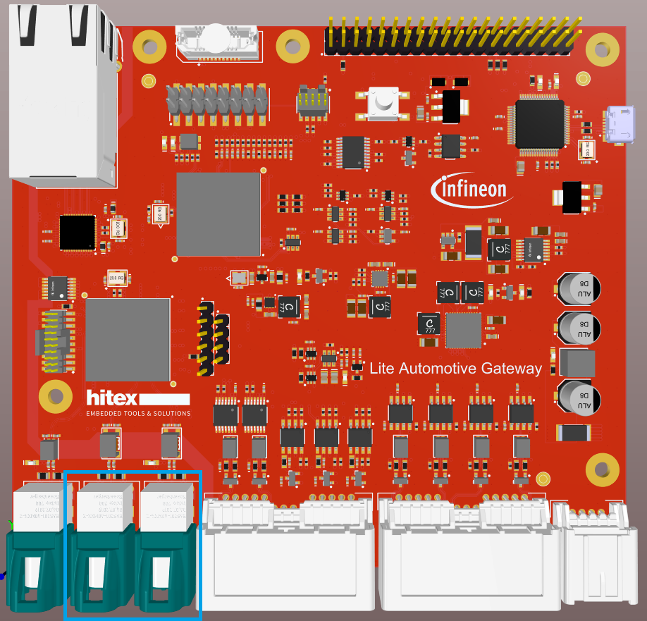
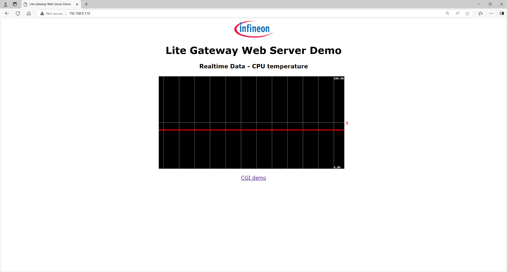
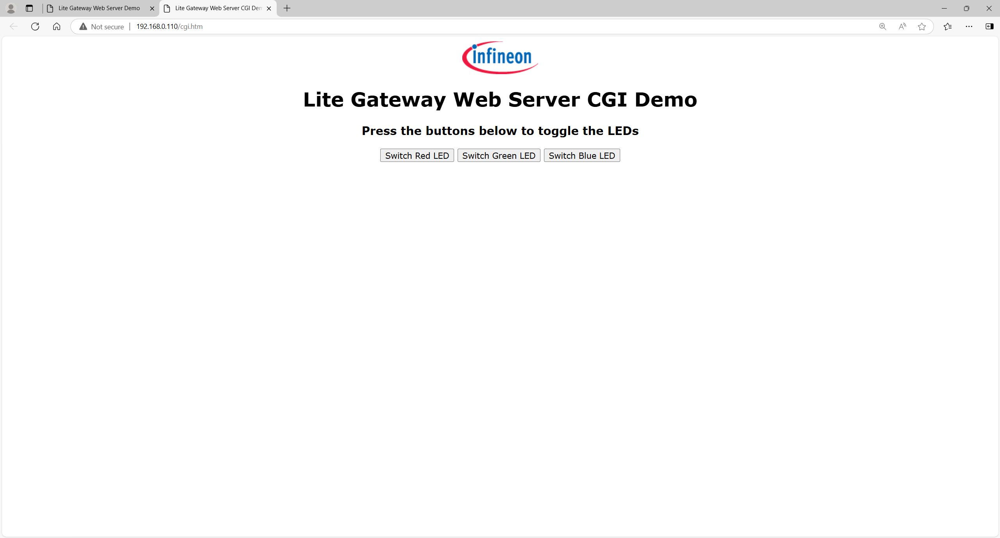

  

# iLLD_TC377TP_ADS_LWIP-HTTP-Server
**This code example demonstrates the TC377 peripheral capabilities by implementing a CAN and LIN node together with an HTTP server using the LWIP 2.2.0 stack. The server reads the die temperature and it can manipulate LEDs. Also, this code example demonstrates how to enable the MCU's IEEE 1588 capabilities.**

## Device  
The device used in this example is AURIX™ TC377TP_A-Step. 

## Board  
   
The board used for testing is the KIT_A2G_TC377_LITE_GTW board (KIT_A2G_TC377_LITE_GTW).  

## Scope of work   

The die temperature is read from an HTTP server implemented in the LWIP 2.2.0 stack. LED manipulation is done via the HTTP server.
A CAN node and a LIN master node are also implemented. The CAN implementation can be configured to be used in loop-back mode or with an external CAN node. The LIN implementation configures a LIN Master node that sends a header and a data block on the LIN bus. 
The MCU's IEEE 1588 capabilities are also enabled.

## Introduction  

This code example demonstrates the TC377 peripheral capabilities by implementing a CAN and LIN node together with an HTTP server using the LWIP 2.2.0 stack. The server reads the die temperature and it can manipulate LEDs. Also, this code example demonstrates how to enable the MCU's IEEE 1588 capabilities.

## Hardware setup  
 
This code example has been developed for the KIT_A2G_TC377_LITE_GTW board.

The board schematics and its PCB data can be provided by Infineon only with a valid Broadcom NDA. For any information related to Broadcom products, please reach out to Broadcom directly.

As a prerequisite to the code example, a 100Base-T1 to RJ45 converter board together with a Rosenberger H-MTD cable are required. The media converter board has to be configured as "Slave". Connect the gateway board to the PC via the media converter board using any of the highlighted connectors. 
Connect the KIT_A2G_GWEXT_FR_LIN and the KIT_A2G_GWEXT_CAN boards for a better pin reachability. The LIN Master node is implemented on LIN3 and the CAN node is implemented on CAN0. 

## Implementation  

In order to support the peripherals configuration, additional software libraries have been added to the project.
They can be found in the components folder, and are grouped as follows:

*can* : contains the source and header files to configure and control the CAN0 module;

*eth* : contains the mac folder;

*mac* : contains the source and header files to configure and control the TC377 GETH module;

*led* : contains functions to control the on-board LEDs;

*lin* : contains the source and header files to configure and control the LIN3 interface;

*power_supply* : contains the source and header files related to the die temperature measurement; 

*serialio* : contains functions to use the virtual COM interface through the on-board USB interface.

In addition to the components library, an evaluation board specific C-module has been added, which can be found in the boards folder.

In the Cpu0_Main.c file, STM0, LED0, DTS, CAN and LIN modules are being configured and initialized. After each second, the board power supply is verified, the die temperature is measured and LED0 toggles. In the same source file, the LIN and CAN messages are being sent.

In the Cpu1_Main.c file, GETH, PHY, LED1 and RGB LED modules are being configured and initialized. In the same source file, the LWIP stack is initialized, and the HTTP server’s Ip, Subnet mask, and Gateway addresses are being statically set.

## Compiling and programming

Before testing this code example:  
- Power the board through the dedicated power connector 
- Build the project using the dedicated Build button  or by right-clicking the project name and selecting "Build Project" and flash it using the Flash button 

## Run and Test   

- Connect the PC to the Lite Gateway board via the media converter board. Configure the PC Ethernet interface as follows: 

Ip address: 192.168.0.99

Subnet mask: 255.255.255.0

- Using a browser, access the http server with the following link: http://192.168.0.110/

- In this website, the die temperature can be observed.

- By pressing the CGI demo button, another website will open giving the user the possibility to manipulate the RGB LED.

After code compilation and flashing the device, the correct functionality of the example can be proven by checking the die temperature and on board RGB LED manipulation via the HTTP application.

## References  

AURIX™ Development Studio is available online:  
- <https://www.infineon.com/aurixdevelopmentstudio>  
- Use the „Import...“ function to get access to more code examples  

More code examples can be found on the GIT repository:  
- <https://github.com/Infineon/AURIX_code_examples>  

For additional trainings, visit our webpage:  
- <https://www.infineon.com/aurix-expert-training>  

For questions and support, use the AURIX™ Forum:  
- <https://community.infineon.com/t5/AURIX/bd-p/AURIX>  

The LWIP (Light Weight Internet Protocol) stack is an Open source component where BSD 3 Clause license applies.