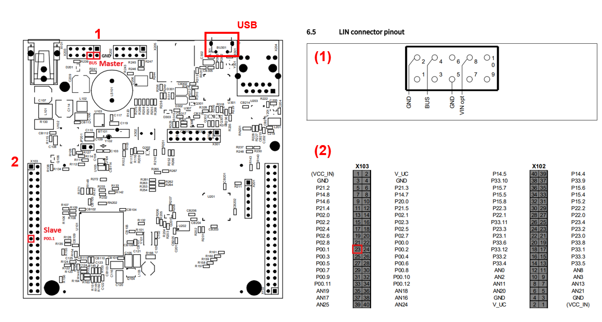
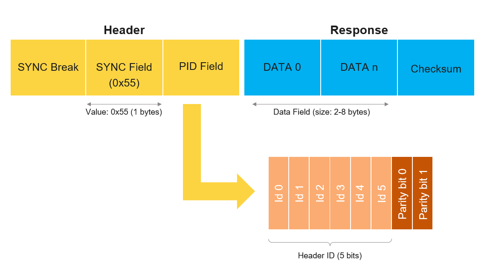
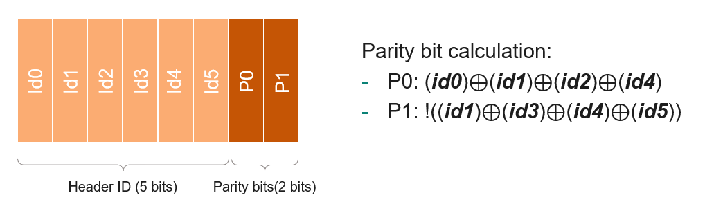
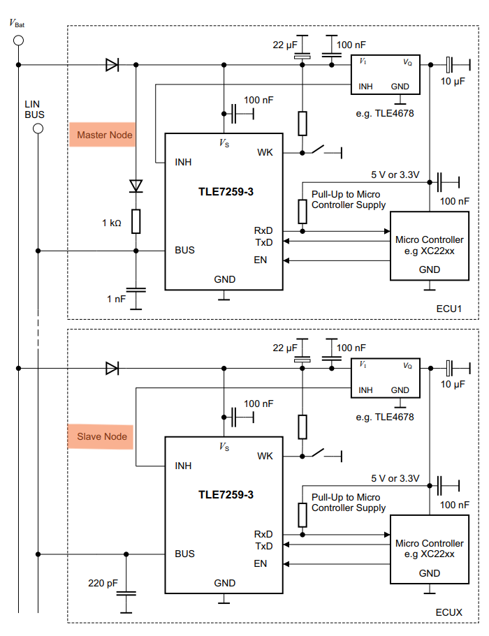
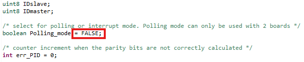
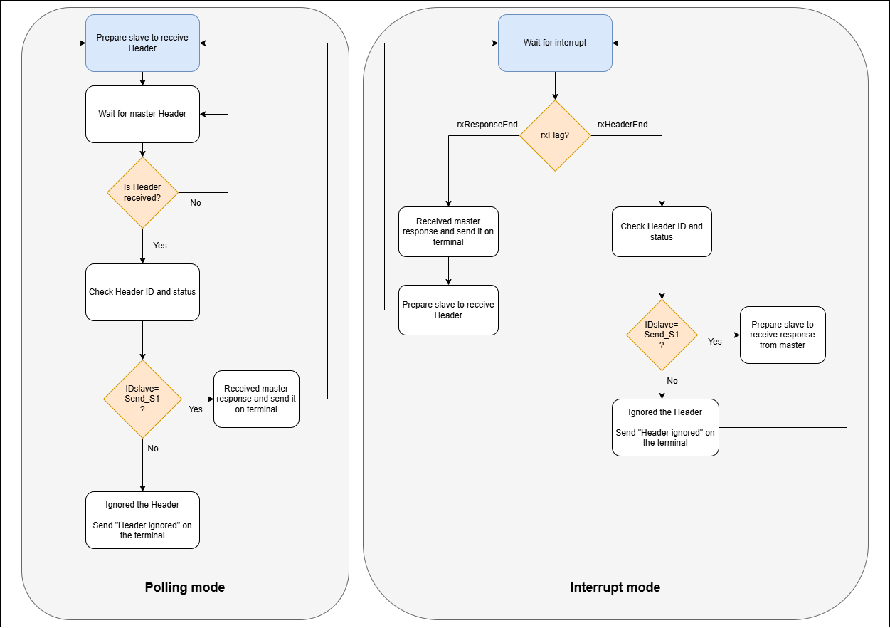
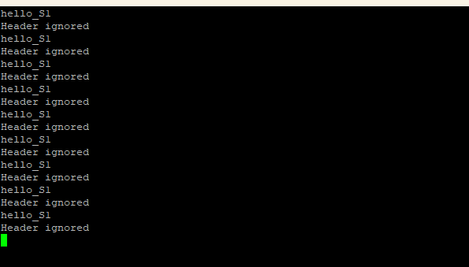
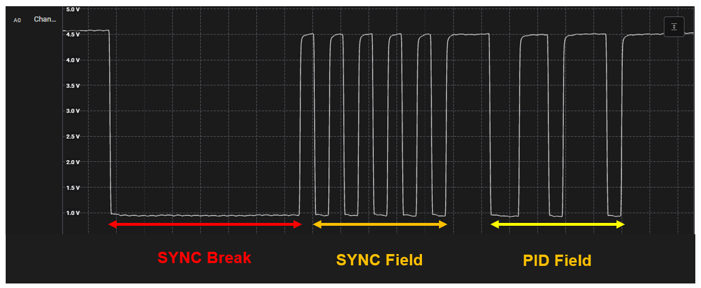
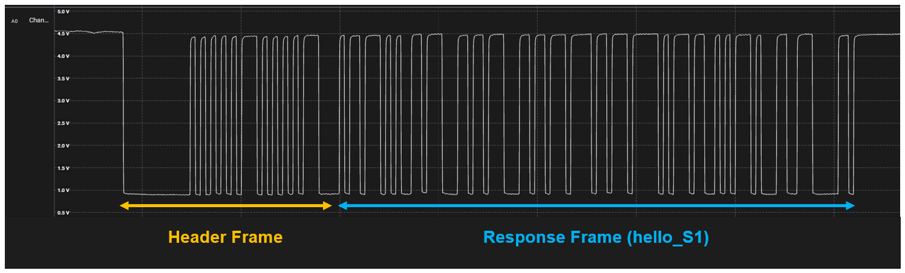

  

# iLLD_TC377_ADS_ASCLIN_LIN_SLAVE
**An ASCLIN module configured as slave for LIN communication to receive message from a LIN master device.**

## Device  
The device used in this example is AURIX&trade; TC37xTP_A-Step.

## Board  
The board used for testing is the AURIX&trade; TC377 Application Kit (KIT_A2G_TC377_5V_TFT).

## Scope of work  
ASCLIN3 is configured in slave mode to receive LIN frames from ASCLIN2 configured as master. Depending on the ID sent, the slave will either ignore the header or wait for master response. The result of the communication is displayed on the terminal using UART communication with ASCLIN0.

## Introduction  
The Asynchronous/Synchronous Interface (ASCLIN) module enables asynchronous/synchronous serial communication with external devices.
Among others, it supports Local Interconnect Network (LIN) communication protocol as master or slave configuration.

LIN communication is based on sending all data on the LIN bus, which means TX and RX Pins of the slave and the master are connected to the same bus. To do so, the RX and TX pins of each device should be connect to the same LIN bus. The TC377 Application Kit has a preinstalled LIN Transceiver, which is connected to PIN P10.5 and P10.6. However, it is only configured for master mode. For the slave, only the RX pin (P00.1) is used for receiving the LIN Frame.

## Hardware setup  
This code example has been developed for the board KIT_A2G_TC377_5V_TFT.

The board should be connected to the PC via USB, in order to allow UART connection. The bus pin of the LIN transceiver (Master) has to be connected to the pin P00.1 (Slave).

## LIN protocol
The frame format of LIN bus message consists of a header from the master and a response from the master or the slave:

  

When the slave receives a Header from the master it will read the ID from the PID Field and react by doing one of the following actions:
- Send a response to the master.
- Receive a response from the master.
- Ignore header.

To protect the PID bitfield, two parity bits are added (P0 and P1). The following schematic shows the parity bits calculation:

## LIN Transceiver
On the TC377 Application Kit, only one LIN transceiver can be used (TLE7259-3), this transceiver can only be used for master node. In order to have a transceiver for the slave, an external transceiver should be used according to the datasheet configuration.

*TLE7259-3 topology for slave and master node.* 

## Implementation  

### Configuration of the ASCLIN UART module
The initialization of the ASCLIN module for UART communication is done by calling the *init_ASCLIN_UART()* in the main.c file. ASCLIN module 0 is used along with pin P14.1 and P14.0, directly connected to the USB port of the board. The function *send_ASCLIN_UART_message()* in the  ASCLIN_UART_Conf.C file is used for sending message directly to the PC on the terminal, with a Baudrate of 115200. 

More information regarding ASCLIN UART implementation is provided in the related code examples.

### Configuration of the ASCLIN LIN module
The initialization of the ASCLIN module for LIN is done by calling the *init_ASCLIN_LIN_master()* and *init_ASCLIN_LIN_slave()* function in the main.c file. These functions use the illd *IfxAsclin_Lin_initModule()* with a baud rate of 19200. 

For the **master** configuration *IfxAsclin_LinMode_master* is called and the *receiveIdEnable* parameter should be set in order to let the master receive his own Header frame in the *init_ASCLIN_LIN_master()* function. 

For the **slave** configuration *IfxAsclin_LinMode_slave* is called, the idle delay should be set to 0 and the autobaudrate detection is disabled in the *init_ASCLIN_LIN_slave()* function.

The slave can be used in **Polling mode** or **Interrupt mode** to communicate with the LIN bus. The **Polling mode** is activated by setting the *Polling_mode* variable in the *ASCLIN_Conf.c* file and the interrupts are disabled. The **Polling mode** should only be used with 2 boards, one configured as master and one configured as slave. In this case, the output of the LIN transceiver of the master board should be connected to the receive pin of the slave board (P00.1).

By default the device is in **Interrupt mode** (*Polling mode*=FALSE).

### The slave receive function:
As explained previously, the slave has two operating mode to communicate with the LIn bus, a *Polling mode* and an *Interrupt mode*. For each mode, the slave is waiting for a Header to be received. When received, the ID is stored in the *IDslave* variable and depending on the ID value (Send_S1 or Send_Null), the slave will either ignore the Header or wait for the master response to store the answer into *rxData_slave*. Then it will send a message to the terminal using *send_ASCLIN_UART_message()* function and wait for a new Header.

- For the *Polling mode* the *slaveRX_POLLING_process()* is called in the main.c file. It uses the *IfxAsclin_Lin_receiveHeader()* which waits for incoming header and stores the slave ID in *ID_slave* upon receive. Then *IfxAsclin_Lin_receiveResponse()* and *IfxAsclin_Lin_ignoreHeader()* functions prepare the slave to either receive data or ignore it.

- For the *Interrupt mode* the *slaveRX_ISR_process()* is called every time an receive interrupt occurs. It reads the active flag of the interrupt and reacts in consequence, depending if the interrupt is a Header or a master response.

### Main loop:
To correctly send a message on the LIN bus master, the *send_ASCLIN_LIN_message()* function is used. This function will send a Header and, depending on the ID, it will do nothing or send a response to the slave. In the main.c file, the LIN master will send a new frame every 2 seconds to the slave, alternating between two different IDs each time (Send_S1 or Send_Null). For each frame received by the slave, a feedback is sent on the terminal with ASCLIN0. In Polling mode, if the board is configured as master, the *slaveRX_POLLING_process()* function should not be called in the main.c. If the board is configured as slave, the *slaveRX_POLLING_process()* function should be the only function called in the main.c.

## Compiling and programming  
Before testing this code example:  
- Power the board through the dedicated power connector
- Connect the board to the PC through the USB interface  
- Build the project using the dedicated Build button  or by right-clicking the project name and selecting "Build Project"  
- To flash the device and immediately run the program, click on the dedicated Flash button 

## Run and Test
After code compilation and flashing the device, perform the following steps:
- Connect P00.1 to the pin of the LIN bus and the USB port to the PC.
- Open a terminal using the USB port COM with a baudrate of 115200. A continuous succession of the following message should appear:

An oscilloscope can be connected to the LIN bus to observe the LIN signal.

**Header:**

**Response:**

## References  

AURIX&trade; Development Studio is available online:  
- <https://www.infineon.com/aurixdevelopmentstudio>  
- Use the "Import..." function to get access to more code examples  

More code examples can be found on the GIT repository:  
- <https://github.com/Infineon/AURIX_code_examples>  

For additional trainings, visit our webpage:  
- <https://www.infineon.com/aurix-expert-training>  

For questions and support, use the AURIX&trade; Forum:  
- <https://community.infineon.com/t5/AURIX/bd-p/AURIX>  