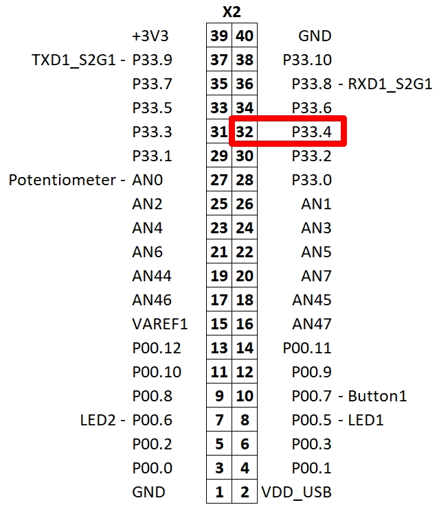
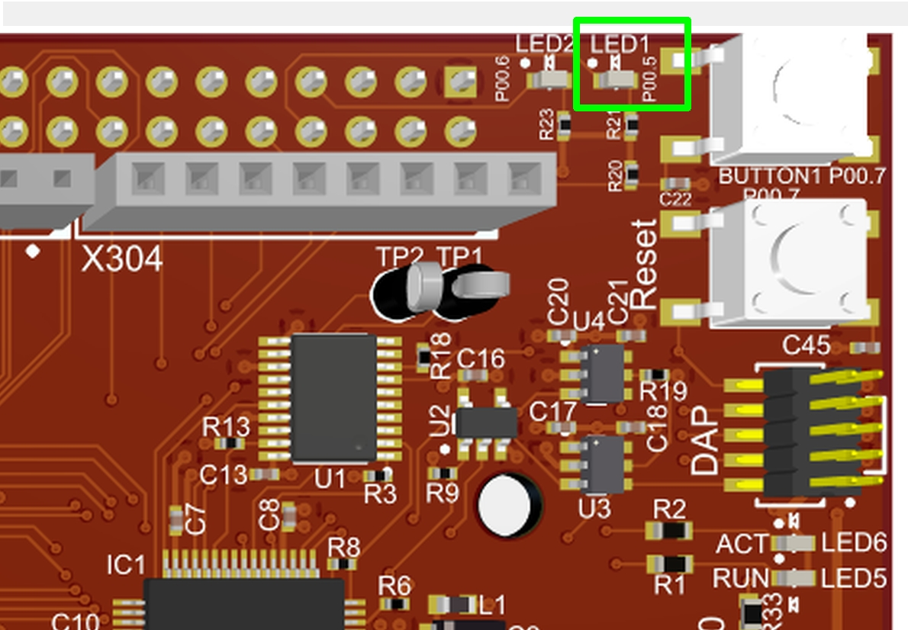

  

# iLLD_TC37x_ADS_SCR_Blinky_LED_LK_1
**This code example generates a periodic interrupt using the SCR RTC Module.**  

## Device  
The device used in this example is AURIX™ TC37xTP_A-Step.

## Board  
The board used for testing is the AURIX™ TC375 lite Kit V2 (KIT_A2G_TC375_LITE).

## Scope of work   
This is a simple SCR (Standby Controller) example code using LED1 on the TC375 lite Kit to show a successfully working code. The SCR RTC (Real-Time Clock) module is used to generate a periodic interrupt to toggle the port SCR_P00.4 (P33.4) output. The TriCore™ CPU is used to mirror the port line P33.4 to P00.5 which has LED1 connected on the TC375 lite Kit.

## Introduction  
**SCR**  
The standby controller is intended to perform basic operation while the rest of the system is in standby,
effectively reducing standby-power consumption while still supporting requested standby features. The SCR is
based on an 8-bit XC800-core with a limited list of peripherals.
  
**RTC**  
One of the SCR’s peripherals is the Real-Time Clock (RTC) that, once started, can work independently of the
state of the rest of the microcontroller.

The real-time clock consists of an up-counting 32-bit timer register (Real-Time Clock Counter) with an upstream 9-bit prescaler. 
It contains a set of 4 (8-bit) count registers that shows the current count value or the current time of the real-time clock. 
Another set of registers (RTC compare registers) that consists of 4 (8-bit) registers can be used for interrupt generation. It can also be used to wake-up the device from standby mode.

## Hardware setup  
This code example has been developed for the board KIT_A2G_TC375_LITE (AURIX™ TC375 lite Kit V2) 

    

## Implementation 
**Embedding of the SCR code into the TriCore™ project**  
While the build process, the SCR code is compiled to a binary output which is translated into scr_a2g.c and .h files.
These two files are generated and included into the TriCore™ project automatically.
The file scr_a2g.c contains the binary SCR code and is loaded by code execution of Cpu0 to the SCR XRAM memory.

**Initialization of the SCR module and loading of the SCR code to the SCR XRAM**  
TriCore™ Cpu0_Main is copying the SCR code into the SCR XRAM memory.

The function *IfxScr_copyProgram()* is copying the binary SCR program from the NVM Flash to the SCR XRAM.
The copying is started at the start address of the XRAM (0xF0241FF8) until the length of *SIZE_scr_xram*.
In addition the magic pattern (0xAA55AA55) at the end of the XRAM is written to validate the stored code.
The Cpu0 code ends in an endless loop where port P33.4 is mirrored to P00.5.

**SCR code**  
First the used SCR modules like RTC and for debug purpose the OCDS (On-Chip Debug Support) module are enabled by setting the corresponding bit in the register *SCR_PMCON1*. 
The OCDS module is not required for the SCR code execution.

Second the RTC interrupt is configured. For the RTC module *XINTR13* is used.
And following the RTC module itself is set up by predefining the RTC counter registers for a period of 1 second (SCR_RTCCR0-3).

Finally writing to the *SCR_RTC_RTCON* register PCLK (peripheral clock) is selected as clock source, the 9-bit prescaler is not used, the clock compare interrupt is enabled and the RTC is started.

Last step is the configuration of the used I/O port. 
All pins of SCR_P00 are enabled by writing to the *SCR_P00_PDIS* register. Set SCR_P00.4 to high (LED off) by writing to the *SCR_P00_OUT* register. Finally the P00.4 is set as output. 

The code ends in an endless loop.

**RTC interrupt code**  
The interrupt handler defined in *rtc_interrupt()* toggles the port SCR_P00.4.

**CPU0 code**  
The TriCore™ Cpu0 is initializing the SCR. While compiling the SCR code is added as a C-array to the TriCore™ project and copied while initialization to the SCR XRAM (SCR code/data memory).

The toggling SCR_P00.4 port can't directly be observed on the used AURIX™ TC375 lite Kit, just by using an oscilloscope or an LED connecting to the port. There is a dedicated pin connector on the bottom site of the AURIX™ TC375 lite Kit to connect to the port line. The SCR_P00 port is equivalent to P33 of the TriCore™ CPU.
To observe the SCR_P00.4 (P33.4) line the TriCore™ Cpu0 is mirroring the P33.4 state to the port line P00.5 which is connected to LED1 on the AURIX™ TC375 lite Kit V2.

  

## Compiling and programming
Before testing this code example:  
- Power the board through the dedicated power connector 
- Connect the board to the PC through the USB interface
- Build the project using the dedicated Build button  or by right-clicking the project name and selecting "Build Project"
- To flash the device and immediately run the program, click on the dedicated Flash button   

## Run and Test   
After code compilation and flashing the device, you can see LED1 on the AURIX™ TC375 lite Kit V2 blinking.

  

## References  

AURIX™ Development Studio is available online:  
- <https://www.infineon.com/aurixdevelopmentstudio>  
- Use the "Import..." function to get access to more code examples  

More code examples can be found on the GIT repository:  
- <https://github.com/Infineon/AURIX_code_examples>  

For additional trainings, visit our webpage:  
- <https://www.infineon.com/aurix-expert-training>  

For questions and support, use the AURIX™ Forum:  
- <https://community.infineon.com/t5/AURIX/bd-p/AURIX>  
