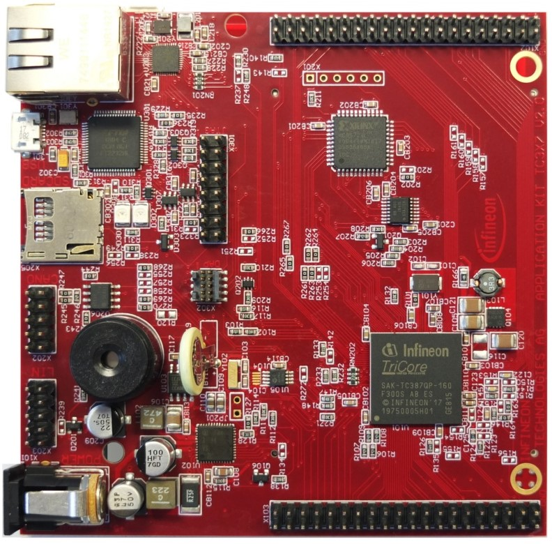
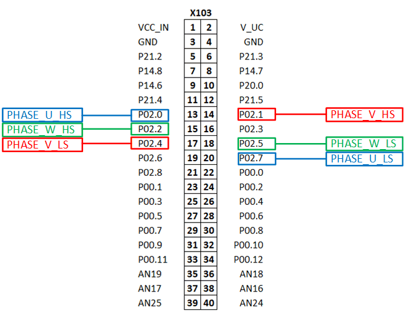

  

# iLLD_TC387_ADS_GTM_ATOM_3_Phase_Inverter_PWM_1 
 
**The GTM ATOM is configured to generate a PWM signals for two-level three phase inverter.**  

## Device  
The device used in this example is AURIX&trade; TC38xQP_A-Step

## Board  
The board used for testing is the AURIX&trade; Application Kit TC3X7 (KIT_A2G_TC387_5V_TFT)

## Scope of work  
The states of the 6 pins are controlled by the PWM signals generated by the Generic Timer
Module (GTM) in-built ARU-Connected Timer Output Module (ATOM). All signals are synchronous to each
other, center-aligned and with dead-times (positive/negative) for the complementary pairs.

## Introduction
  
The Generic Timer Module (GTM) is a modular timer unit designed to accommodate many timer applications.

It has an in-built Advanced Router Unit (ARU) that can be used to exchange specific data between sub-modules without CPU interaction.

The ATOM, which is part of the GTM, is able to generate complex output signals.

The Clock Management Unit (CMU) is responsible for clock generation of the GTM. The Configurable Clock Generation Subunit (CFGU) provides eight clock sources for the GTM submodules: Timer Input Module (TIM), Time Base Unit (TBU), Monitor Unit(MON) and ATOM.

## Hardware setup  
This code example has been developed for the board KIT_A2G_TC387_5V_TFT

  

## Implementation  

**GTM configuration** 
   
The *IfxGtm_Pwm.h* iLLDs provide the GTM PWM driver to configure required peripheral resources and drive them to produce the PWM waveform.
PWM drivers are initialized and driven by the  TriCore&trade; core.
  
The *initGtmAtom3phInv()* configuration sequence is the following: 
* Initialization of the GTM Module 
* Configuration of the CMU-CLOCK0 for the ATOM usage 
* Configuration of the PWM channel groups to produce 3 complementary pair signals 
* Initialization of the drivers 

Following PWM characteristics are enabled/configured with this example:

<table>
    <tbody>
        <tr>
            <td><b>PWM Type</b></td>
            <td>Center Aligned</td>
        </tr>
        <tr>
            <td><b>Frequency</b></td>
            <td>20 kHz</td>
        </tr>
        <tr>
            <td><b>Polarity</b></td>
            <td>Duty-On High</td>
        </tr>
        <tr>
            <td><b>Complementary Output</b></td>
            <td>Enabled (opposite polarity)</td>
        </tr>
        <tr>
            <td><b>DTM enabled</b></td>
            <td>
                <table>
                    <tbody>
                        <tr>
                            <td><b>Channel</b></td>
                            <td><b>Rising Edge</b></td>
                            <td><b>Falling Edge</b></td>
                        </tr>
                        <tr>
                            <td>CH0</td>
                            <td>1uS</td>
                            <td>1uS</td>
                        </tr>
                        <tr>
                            <td>CH1</td>
                            <td>1uS</td>
                            <td>1uS</td>
                        </tr>
                        <tr>
                            <td>CH2</td>
                            <td>1uS</td>
                            <td>1uS</td>
                        </tr>
                    </tbody>
                </table>
            </td>
        </tr>
    </tbody>
</table>

The table below provides the mapping between the PWM signal and the Port Pins:  

<table>
    <tbody>
        <tr>
            <td><b>&emsp;PWM Signal</b></td>
            <td><b>&emsp;Pin Mapping</b></td>
        </tr>
        <tr>
            <td>&emsp;PHASE_U_HS</td>
            <td>&emsp;P02.0</td>
        </tr>
        <tr>
            <td>&emsp;PHASE_U_LS</td>
            <td>&emsp;P02.7</td>
        </tr>
        <tr>
            <td>&emsp;PHASE_V_HS</td>
            <td>&emsp;P02.1</td>
        </tr>
        <tr>
            <td>&emsp;PHASE_V_LS</td>
            <td>&emsp;P02.4</td>
        </tr>
        <tr>
            <td>&emsp;PHASE_W_HS</td>
            <td>&emsp;P02.2</td>
        </tr>
        <tr>
            <td>&emsp;PHASE_W_LS</td>
            <td>&emsp;P02.5</td>
        </tr>
    </tbody>
</table>

**GTM update**   
 
Once the GTM is configured and started, a duty cycle update is performed every 500ms in the *updateGtmAtom3phInvDuty()* function:

1. Each channel **x** is cyclically modified with 10% increment duty cycle from 0% till 100% using the variable *g_gtmAtom3phInv.dutyCycles[***x***]* 
2. The duty cycle of all channels is then updated at once using the iLLD function *IfxGtm_Pwm_updateChannelsDutyImmediate()*
3. To indicate the correct functionning of the application, the LED (P13.0) is toggled once in a second using the iLLD function *IfxPort_togglePin()*

## Compiling and programming
Before testing this code example:  
- Power the board through the dedicated power connector 
- Connect the board to the PC through the USB interface
- Build the project using the dedicated Build button  or by right-clicking the project name and selecting "Build Project"
- To flash the device and immediately run the program, click on the dedicated Flash button   

## Run and Test   

After code compilation and flashing the device, observe the LED (P13.0), which should be toggling with the PWM_FREQUENCY.

  

The PWM signals can be observed using a logic analyzer or an oscilloscope connected to the pins shown in the picture above.  
The following video shows the generated PWM signals:

<video width="800" height="321" controls>
  <source src="./Images/PWM_Signals.mp4" type="video/mp4"/>
</video>  

Legend:  
D0: PHASE_U_HS  
D1: PHASE_U_LS  
D2: PHASE_V_HS  
D3: PHASE_V_LS  
D4: PHASE_W_HS  
D5: PHASE_W_LS  

## References  

AURIX&trade; Development Studio is available online:  
- <https://www.infineon.com/aurixdevelopmentstudio>  
- Use the "Import..." function to get access to more code examples   

More code examples can be found on the GIT repository:  
- <https://github.com/Infineon/AURIX_code_examples>  

For additional trainings, visit our webpage:  
- <https://www.infineon.com/aurix-expert-training>  

For questions and support, use the AURIX™ Forum:  
- <https://community.infineon.com/t5/AURIX/bd-p/AURIX>  
