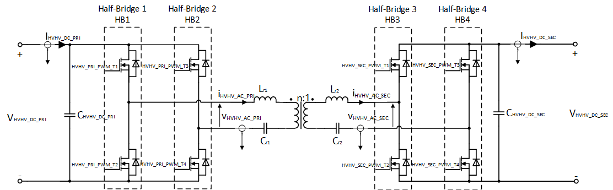
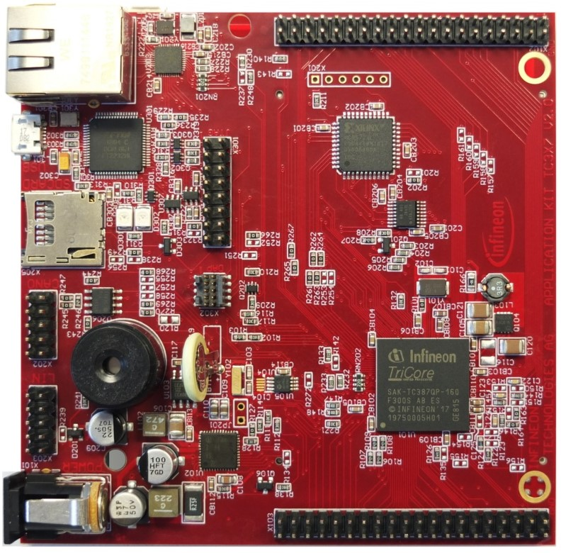
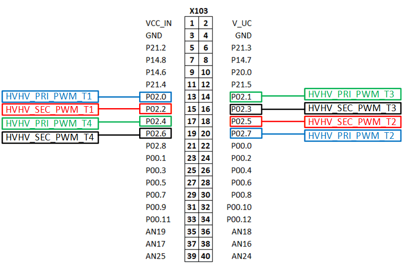

  

# iLLD_TC387_ADS_GTM_ATOM_CLLC_Converter_PWM_1 
 
**The GTM ATOM is configured to generate a PWM signals for CLLC DC-DC converter.**  

## Device  
The device used in this example is AURIX™ TC38xQP_A-Step

## Board  
The board used for testing is the AURIX™ Application Kit TC3X7 (KIT_A2G_TC387_5V_TFT)

## Scope of work  
This example is intended to show, how to configure the iLLD framework (GTM ATOM) to generate PWM signals
for CLLC DC-DC converter.
The states of the 8 pins are controlled by the PWM signals generated by the Generic Timer Module (GTM)
in-built ARU-Connected Timer Output Module (ATOM). All signals are synchronous to each other, edge aligned,
phase shifted and with dead times (positive/negative) for the complementary pairs.

## Introduction

The Generic Timer Module (GTM) is a modular timer unit designed to accommodate many timer applications.

The GTM module is capable of driving different kinds of pulse-width-modulation (PWM) with and without
dead time.

The GTM has an in-built Advanced Router Unit (ARU) that can be used to exchange specific data between sub-modules without CPU interactions.

The ARU-connected Timer Output Module (ATOM), which is part of the GTM, is able to generate complex output signals.

The Clock Management Unit (CMU) is responsible for clock generation of the GTM. The Configurable Clock Generation Subunit (CFGU) provides eight clock sources for the GTM submodules: Timer Input Module (TIM), Time Base Unit (TBU), Monitor Unit(MON) and ATOM.

**CLLC Topology**

 

The above shown figure depicts a typical CLLC DC-DC Converter Topology. Following features are implemented to facilitate PWM generation for CLLC DC-DC converter:

+ Duty Cycles of all channels are 50%
+ Initial phase shift between Half-Bridge 1 and Half-Bridge 2 is PI (radian)
+ Initial phase shift between Half-Bridge 1 and Half-Bridge 3 is 0 (radian)
+ Phase shift between Half-Bridge 3 and Half-Bridge 4 is PI (radian)
+ Initial switching frequency is set at 100kHz
+ Additionally, phase shift between the Half-Bridge 1 and the Half-Bridge 2 can be varied through the variable *primaryDisplacementRatio* (Inner Displacement Ratio). Admissible parameter range is between 0.0 and 1.0. The total phase shift is then PI + (PI * primaryDisplacementRatio) (radian)
+ Additionally, phase shift between the Half-Bridge 1 and the Half-Bridge 3 can be varied through the variable *secondaryDisplacementRatio* (Outer Displacement Ratio). Admissible parameter range is between 0.0 and 1.0. The total phase shift is then PI + (PI * secondaryDisplacementRatio) (radian)
+ Additionally, the switching frequency can be also varied between 50kHz and 250kHz

## Hardware setup  
This code example has been developed for the board KIT_A2G_TC387_5V_TFT

  

## Implementation  

When using iLLDs, the configuration of modules can be done using a structure storing the needed parameters. Such structures are provided by iLLDs together with APIs that can be used to fill them with default values. The user can then modify the configuration as needed and apply it.

**GTM configuration** 

The *IfxGtm_Pwm.h* iLLDs provide the GTM PWM driver to configure required peripheral resources and drive them to produce the PWM waveform.
PWM drivers are initialized and driven by the TriCore™ core.
  
The initial CLLC example configuration is executed in the function *initGtmAtomCLLC()*. Following sequence is used:
* Initialize the control structure with default values
* Configure PWM outputs
* Configure Dead Time of PWM Channels
* Configure ATOM_CH0 to facilitate the control-loop ISR
* Configure PWM Channels (frequency, duty cycle, shift)
* Enable GTM Module, enable CMU CLK0
* Initialize the GTM Framework
* Store the configuration values for runtime calls

Following PWM characteristics are enabled / configured with this example:

<table>
    <tbody>
        <tr>
            <td><b>PWM Type</b></td>
            <td>Edge Aligned</td>
        </tr>
        <tr>
            <td><b>Frequency</b></td>
            <td>Varies between 50kHz and 250kHz</td>
        </tr>
        <tr>
            <td><b>Polarity</b></td>
            <td>Duty-On High</td>
        </tr>
        <tr>
            <td><b>Complementary Output</b></td>
            <td>Enabled (opposite polarity)</td>
        </tr>
        <tr>
            <td><b>DTM enabled</b></td>
            <td>
                <table>
                    <tbody>
                        <tr>
                            <td><b>Channel</b></td>
                            <td><b>Rising Edge</b></td>
                            <td><b>Falling Edge</b></td>
                        </tr>
                        <tr>
                            <td>CH0</td>
                            <td>200ns</td>
                            <td>200ns</td>
                        </tr>
                        <tr>
                            <td>CH1</td>
                            <td>200ns</td>
                            <td>200ns</td>
                        </tr>
                        <tr>
                            <td>CH2</td>
                            <td>200ns</td>
                            <td>200ns</td>
                        </tr>
                          <tr>
                            <td>CH3</td>
                            <td>200ns</td>
                            <td>200ns</td>
                        </tr>
                    </tbody>
                </table>
            </td>
        </tr>
    </tbody>
</table>

The table below provides the mapping between the PWM signal and the port pins:  

<table>
    <tbody>
        <tr>
            <td><b>&emsp;PWM Signal</b></td>
            <td><b>&emsp;Pin Mapping</b></td>
        </tr>
        <tr>
            <td>&emsp;HVHV_PRI_PWM_T1</td>
            <td>&emsp;P02.00</td>
        </tr>
        <tr>
            <td>&emsp;HVHV_PRI_PWM_T2</td>
            <td>&emsp;P02.07</td>
        </tr>
        <tr>
            <td>&emsp;HVHV_PRI_PWM_T3</td>
            <td>&emsp;P02.01</td>
        </tr>
        <tr>
            <td>&emsp;HVHV_PRI_PWM_T4</td>
            <td>&emsp;P02.04</td>
        </tr>
        <tr>
            <td>&emsp;HVHV_SEC_PWM_T1</td>
            <td>&emsp;P02.02</td>
        </tr>
        <tr>
            <td>&emsp;HVHV_SEC_PWM_T2</td>
            <td>&emsp;P02.05</td>
        </tr>
          <tr>
            <td>&emsp;HVHV_SEC_PWM_T3</td>
            <td>&emsp;P02.03</td>
        </tr>
        <tr>
            <td>&emsp;HVHV_SEC_PWM_T4</td>
            <td>&emsp;P02.06</td>
        </tr>
    </tbody>
</table>

**GTM update**

 Once the GTM is configured and started, the control loop *controlLoopISR()* will update the frequency and phases of PWM Channels using *dutyEvent()* function. Following sequence is used:
 * Validate the admissible parameter range of the switching frequency and shifting phases. If these values violate admissible range, assign default values to parameters
 * Calculate the phase angles from shifting ratio primaryDisplacementRatio and secondaryDisplacementRatio 
 * Update the GTM configuration with updated values

## Compiling and programming
Before testing this code example:  
- Power the board through the dedicated power connector 
- Connect the board to the PC through the USB interface
- Build the project using the dedicated Build button  or by right-clicking the project name and selecting "Build Project"
- To flash the device and immediately run the program, click on the dedicated Flash button   

## Run and Test   

  

The PWM signals can be observed using a logic analyzer or an oscilloscope connected to the pins shown in the picture above.

The conversion parameters can be varied via either OneEye tool or debugger. To open OneEye configuration double click on GTM_ATOM_CLLC_Converter_PWM_1.OneEye or click on OneEye button within Aurix Development Studio.

The following observation can be made:
<ol>
  <li>Inner phase shift of the primary bridge (HB1, HB2) can be observed by the leading edges of HVHV_PRI_PWM_T1 (P02.00) and HVHV_PRI_PWM_T4 (P02.04), Parameter: *primaryDisplacementRatio* </li>
  <li>Outer phase shift between primary (HB1) and secondary (HB3) bridges can be observed by the leading edges of HVHV_PRI_PWM_T1 (P02.02) and HVHV_SEC_PWM_T3 (P02.03), Parameter: *secondaryDisplacementRatio* </li>
  <li> Observe the frequency of PWM channels by varying the frequency </li>
</ol>

The following video shows the generated PWM signals:

<video width="800" height="800" controls>
  <source src="./Images/CLLC_PWMs.mp4" type="video/mp4"/>
</video> 

## References  

AURIX™ Development Studio is available online:  
- <https://www.infineon.com/aurixdevelopmentstudio>  
- Use the „Import...“ function to get access to more code examples  

More code examples can be found on the GIT repository:  
- <https://github.com/Infineon/AURIX_code_examples>  

For additional trainings, visit our webpage:  
- <https://www.infineon.com/aurix-expert-training>  

For questions and support, use the AURIX™ Forum:  
- <https://community.infineon.com/t5/AURIX/bd-p/AURIX>  
