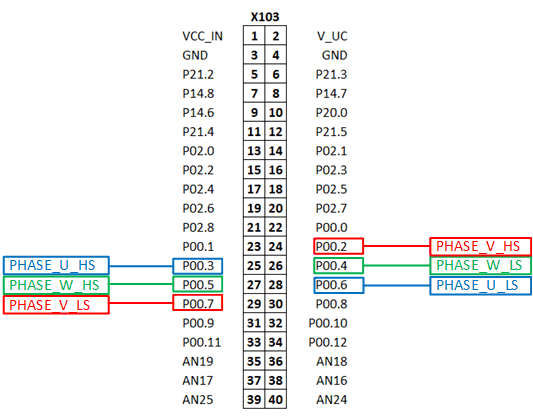
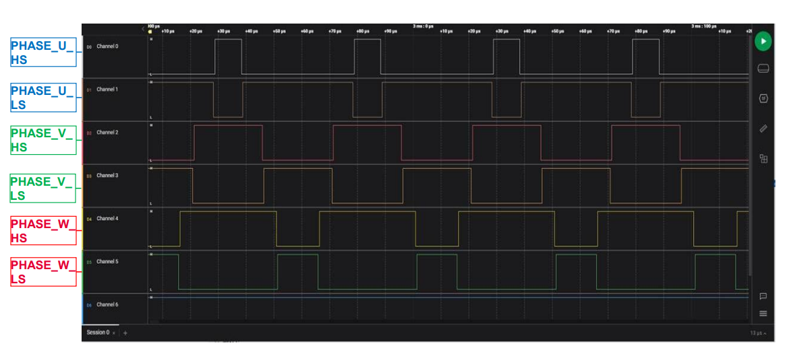

  

# iLLD_TC387_ADS_GTM_TOM_3_Phase_Inverter_PWM_2 
 
**The GTM TOM is configured to generate a PWM signals for two-level three phase inverter. The TriCore&trade; is used as a host for the driver.**  

## Device  
The device used in this example is AURIX&trade; TC38xQP_A-Step.  

## Board  
The board used for testing is the AURIX&trade; Application Kit TC3X7 (KIT_A2G_TC387_5V_TFT).  

## Scope of work  
The GTM TOM is configured to generate PWM signals for two-level three phase inverter.The states of 6 pins are controlled by the PWM signals generated by the Generic Timer Module (GTM) in-built Timer Output Module (TOM). All signals are synchronous to each other, center-aligned and with dead-times 
(positive/negative) for the complementary pairs.
## Introduction  
The GTM is a modular timer unit designed to accommodate many timer applications.

It has an in-built TOM that can offer up to 16 independent channels to generate output signals.

The Clock Management Unit (CMU) is responsible for clock generation of the GTM. The Fixed Clock Generation (FXU) is one of its subunits and it provides five predefined non-configurable clocks for GTM modules, including the TOM.

## Hardware setup  
This code example has been developed for the board KIT_A2G_TC387_5V_TFT:

  

## Implementation  

**GTM configuration** 

The *IfxGtm_Tom_PwmHl.h* iLLDs provide the GTM PWM driver to configure the required peripheral resources and drive them to produce the PWM waveform.
PWM drivers are initialized and driven by the TriCor&trade; core.

The *initGtmTomPwm()* configuration sequence is the following:
* Configuration of the GTM frequencies
* Configuration of the PWM master channel 
* Configuration of the PWM channels used to produce 3 complementary pair signals
* Initialization and run of the PWM signals

**Configuration of the GTM frequencies**

* First of all, the GTM module is enabled with the function *IfxGtm_enable()*
* The GTM global clock frequency is then set with the function *IfxGtm_Cmu_setGclkFrequency()*
* The GTM configurable clock frequency is set with the function *IfxGtm_Cmu_setClkFrequency()*
* Finally, the FXU clocks are enabled by calling the function *IfxGtm_Cmu_enableClocks()*

**Configuration of the PWM master channel**

* To configure the PWM master channel the function IfxGtm_Tom_Timer_initConfig() initializes an instance of the structure *IfxGtm_Tom_Timer_Config* with its default values
* Finally, the function *IfxGtm_Tom_Timer_init()* initializes the TOM with the user configuration

**Configuration of the PWM channels**

* To configure the PWM channels to produce three complementary pair signals, an instance of the structure *IfxGtm_Tom_PwmHl_Config* is created and initialized with its default values by the function *IfxGtm_Tom_PwmHl_initConfig()*
* The function *IfxGtm_Tom_Timer_init()* initializes the TOM with the user configuration
* The PWM mode is then configured to be center aligned with the function *IfxGtm_Tom_PwmHl_setMode()*
* Finally, the input frequency of the TOM is updated by calling *IfxGtm_Tom_Timer_updateInputFrequency()*

**Initialization and run of the PWM signals**

* The timer starts running after calling the function *IfxGtm_Tom_Timer_run()*
*  The initial values of the PWM signals are calculated and set calling:
     * *IfxGtm_Tom_Timer_disableUpdate()* – to stop the update of the TOM (In order to update all signals at the same time)
     * *IfxGtm_Tom_PwmHl_setOnTime()* – to set the calculated duty cycle
     * *IfxGtm_Tom_Timer_applyUpdate()* – to apply the changes by re-starting the update of the TOM channels

Following PWM characteristics are enabled/configured with this example:

<table>
    <tbody>
        <tr>
            <td><b>PWM Type</b></td>
            <td>Center Aligned</td>
        </tr>
        <tr>
            <td><b>Frequency</b></td>
            <td>20 kHz</td>
        </tr>
        <tr>
            <td><b>Polarity</b></td>
            <td>Duty-On High</td>
        </tr>
        <tr>
            <td><b>Complementary Output</b></td>
            <td>Enabled (opposite polarity)</td>
        </tr>
        <tr>
            <td><b>Dead Times</b></td>
            <td>0,5uS</td>
        </tr>
        </tr>
            <td><b>Minimum use time</b></td>
            <td>1uS</td>
    </tbody>
</table>

The table below provides the mapping between the PWM signal and the Port Pins:  

<table>
    <tbody>
        <tr>
            <td><b>&emsp;PWM Signal</b></td>
            <td><b>&emsp;Pin Mapping</b></td>
        </tr>
        <tr>
            <td>&emsp;PHASE_U_HS</td>
            <td>&emsp;P00.3</td>
        </tr>
        <tr>
            <td>&emsp;PHASE_U_LS</td>
            <td>&emsp;P00.2</td>
        </tr>
        <tr>
            <td>&emsp;PHASE_V_HS</td>
            <td>&emsp;P00.5</td>
        </tr>
        <tr>
            <td>&emsp;PHASE_V_LS</td>
            <td>&emsp;P00.4</td>
        </tr>
        <tr>
            <td>&emsp;PHASE_W_HS</td>
            <td>&emsp;P00.7</td>
        </tr>
        <tr>
            <td>&emsp;PHASE_W_LS</td>
            <td>&emsp;P00.6</td>
        </tr>
    </tbody>
</table>

**GTM update**   
 
Once the GTM is configured and started, a duty cycle update is performed every 10ms in the *updateGtmTomPwmDutyCycles()* function:

1. Each channel **x** is cyclically modified with 10% increment duty cycle from 10% till 90% using the variable * g_pwm3PhaseOutput[***x***]* 
2. The duty cycle of all channels is then updated at once using the iLLD functions:
      * *IfxGtm_Tom_Timer_disableUpdate()*
      * *IfxGtm_Tom_PwmHl_setOnTime()*
      * *IfxGtm_Tom_Timer_applyUpdate()*
3. All the functions used for the configuration of the TOM are provided by the iLLD header *IfxGtm_Tom_PwmHl.h*.

## Compiling and programming
Before testing this code example:  
- Power the board through the dedicated power connector 
- Connect the board to the PC through the USB interface
- Build the project using the dedicated Build button  or by right-clicking the project name and selecting "Build Project"
- To flash the device and start a debug session, click on the Debug button  and create a configuration for a debugger (double clicking on the debugger name, a default configuration is created)

## Run and Test   

After code compilation and flashing the device, the PWM signals can be observed using a logic analyser or an oscilloscope connected to the following pins:

  
  
The following image shows the generated PWM signals:

  

Legend:  
D0: PHASE_U_HS  
D1: PHASE_U_LS  
D2: PHASE_V_HS  
D3: PHASE_V_LS  
D4: PHASE_W_HS  
D5: PHASE_W_LS  

## References  

AURIX&trade; Development Studio is available online:  
- <https://www.infineon.com/aurixdevelopmentstudio>  
- Use the "Import..." function to get access to more code examples  

More code examples can be found on the GIT repository:  
- <https://github.com/Infineon/AURIX_code_examples>  

For additional trainings, visit our webpage:  
- <https://www.infineon.com/aurix-expert-training>  

For questions and support, use the AURIX&trade; Forum:  
- <https://community.infineon.com/t5/AURIX/bd-p/AURIX> 
