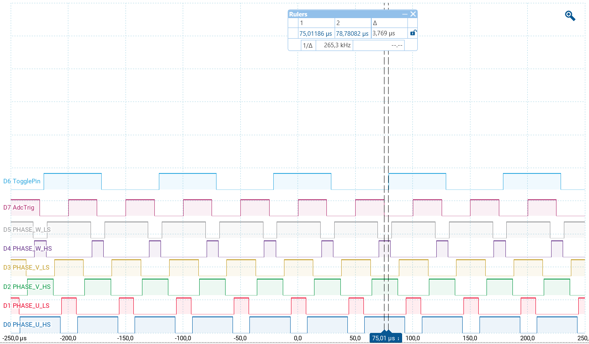
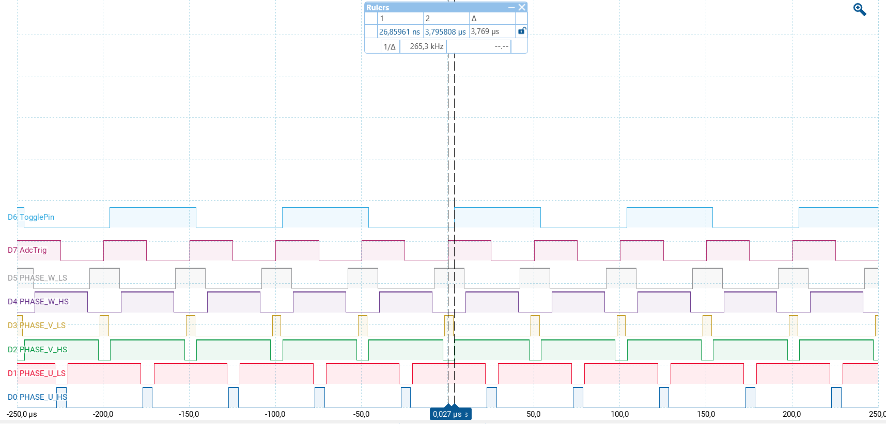

  

# iLLD_TC387_ADS_GTM_TOM_EVADC_3_Phase_Inverter_PWM_Multiple_Adc_Channels_1 
 
**The EVADC synchronous sampling support on multiple input channels with a single trigger source from GTM TOM.**  

## Device  
The device used in this example is AURIX&trade; TC38xQP_A-Step

## Board  
The board used for testing is the AURIX&trade; Application Kit TC3X7 (KIT_A2G_TC387_5V_TFT)

## Scope of work  
The Enhanced Versatile Analog-to-Digital Converter (EVADC) synchronous sampling on multiple input channels
is triggered with single source from Generic Timer Module (GTM) in-built Timer Output Module (TOM).
In addition, The states of the 6 pins are controlled by the PWM signals generated by the TOM. All
signals are synchronous to each other, center-aligned and with dead-times (positive/negative) for the
complementary pairs.

## Introduction

**GTM TOM Timers**  

The GTM is a modular timer unit designed to accommodate many timer applications.

It has an in-built TOM that can offer up to 16 independent channels to generate output signals.

The Clock Management Unit (CMU) is responsible for clock generation of the GTM. The Fixed Clock Generation (FXU) is one of its subunits and it provides five predefined non-configurable clocks for GTM modules, including the TOM.

**Analog Inputs of EVADC**  

The Enhanced Versatile Analog-to-Digital Converter (EVADC) provides a series of analog input channels connected to several clusters of Analog/Digital Converters using the Successive Approximation Register (SAR) principle to convert analog input values (voltages) to discrete digital values.

## Hardware setup  
This code example has been developed for the board KIT_A2G_TC387_5V_TFT

  

## Implementation  

**GTM configuration** 
   
The *IfxGtm_Pwm.h* iLLDs provide the GTM PWM driver to configure required peripheral resources and drive them to produce the PWM waveform.
PWM drivers are initialized and driven by the  TriCore&trade; core.
  
The *initGtmTom3phInv()* configuration sequence is the following:
* Initialization of the GTM Module
* Configuration of the PWM channel groups to produce PWM signal (GTM Cluster 1, TOM Channel 5-7 )
* Configuration of the CMU-FXCLK0 and CMU-CLK0 for the TOM usage
* Initialization of the Trigger Signal (PWM) for all used EVADC groups:
    - GTM Cluster 1, TOM Channel 11 is configured to produce the PWM signal with 20kHz, edge-aligned
    - The output is connected to Trigger 2 and also to the pin **P02.3**  
* Initialization of the drivers

Following PWM characteristics are enabled/configured with this example for the 3 phase inverter PWM generation:

<table>
    <tbody>
        <tr>
            <td><b>PWM Type</b></td>
            <td>Center Aligned</td>
        </tr>
        <tr>
            <td><b>Frequency</b></td>
            <td>20 kHz</td>
        </tr>
        <tr>
            <td><b>Polarity</b></td>
            <td>Duty-On High</td>
        </tr>
        <tr>
            <td><b>Complementary Output</b></td>
            <td>Enabled (opposite polarity)</td>
        </tr>
        <tr>
            <td><b>DTM enabled</b></td>
            <td>
                <table>
                    <tbody>
                        <tr>
                            <td><b>Channel</b></td>
                            <td><b>Rising Edge</b></td>
                            <td><b>Falling Edge</b></td>
                        </tr>
                        <tr>
                            <td>CH0</td>
                            <td>1uS</td>
                            <td>1uS</td>
                        </tr>
                        <tr>
                            <td>CH1</td>
                            <td>1uS</td>
                            <td>1uS</td>
                        </tr>
                        <tr>
                            <td>CH2</td>
                            <td>1uS</td>
                            <td>1uS</td>
                        </tr>
                    </tbody>
                </table>
            </td>
        </tr>
    </tbody>
</table>

The table below provides the mapping between the PWM signal and the Port Pins:  

<table>
    <tbody>
        <tr>
            <td><b>&emsp;PWM Signal</b></td>
            <td><b>&emsp;Pin Mapping</b></td>
        </tr>
        <tr>
            <td>&emsp;PHASE_U_HS</td>
            <td>&emsp;P00.3</td>
        </tr>
        <tr>
            <td>&emsp;PHASE_U_LS</td>
            <td>&emsp;P00.2</td>
        </tr>
        <tr>
            <td>&emsp;PHASE_V_HS</td>
            <td>&emsp;P00.5</td>
        </tr>
        <tr>
            <td>&emsp;PHASE_V_LS</td>
            <td>&emsp;P00.4</td>
        </tr>
        <tr>
            <td>&emsp;PHASE_W_HS</td>
            <td>&emsp;P00.7</td>
        </tr>
        <tr>
            <td>&emsp;PHASE_W_LS</td>
            <td>&emsp;P00.6</td>
        </tr>
    </tbody>
</table>

**Initialization of the EVADC**  
As detailed above, the purpose of this example is to show the EVADC groups with synchronous trigger possibility:
- Group 0 (G0) is configured as:
    - AN0 (CH0 of G0) is connected to the analog signal U
    - This channel is configured to the Queue 0
    - G0 is triggered by GTM ATOM output (GTM ADC trigger 2: EVADC Trigger Source 10)
- Group 1 (G1) is configured as:
    - AN8 (CH0 of G1) is connected to the analog signal voltage reference from gate driver (e.g. TLE9810)
    - This channel is configured to the Queue 0
    - G1 is triggered by GTM ATOM output (GTM ADC trigger 2: EVADC Trigger Source 10)
 - Group 2 (G2) is configured as:
    - AN16 (CH0 of G2) is connected to the analog signal W
    - This channel is configured to the Queue 0
    - G2 is triggered by GTM ATOM output (GTM ADC trigger 2: EVADC Trigger Source 10)
- Group 3 (G3) is configured as:
    - AN24 (CH0 of G3) is connected to the analog signal V
    - This channel is configured to the Queue 0
    - G3 is triggered by GTM ATOM output (GTM ADC trigger 2: EVADC Trigger Source 10)
       
- Only one ADC channel is configured with result interrupt. Upon the interrupt, the results from each of these channels is read to global result variables which are part of the structure *g_phaseCurrentSense*.

**GTM update**   
 
Once the GTM is configured and started, a duty cycle update is performed every ADC interrupt in the *updateGtmTom3phInvDuty()* function:

1. Each channel **x** is cyclically modified with predefined increment duty cycle from 0% till 100% using the variable *g_dutyCycles[***x***]* as input parameter 
2. The duty cycle of all channels is then updated at once using the iLLD function *IfxGtm_Pwm_updateChannelsDutyImmediate()*

**Indication that ISR is executed**

To indicate the correct functioning of the application, the ADC_ISR_TOGGLE_PIN (**P00.8**) is toggled once in a ADC interrupt using the iLLD function *IfxPort_togglePin()*

## Compiling and programming
Before testing this code example:  
- Power the board through the dedicated power connector 
- Connect the board to the PC through the USB interface
- Build the project using the dedicated Build button  or by right-clicking the project name and selecting "Build Project"
- To flash the device and immediately run the program, click on the dedicated Flash button   

## Run and Test   

After code compilation and flashing the device, observe the PWM signals, ADC trigger signal and pin which is toggled in every ISR.

User can modify the ADC trigger mode in *User_Cfg.h*

If ADC_TRIG_MODE is equal to *IfxEvadc_TriggerMode_uponFallingEdge* following signals can be observed:

  

If ADC_TRIG_MODE is equalt to *IfxEvadc_TriggerMode_uponRisingEdge* following signals can be observed:

  

## References  

AURIX&trade; Development Studio is available online:  
- <https://www.infineon.com/aurixdevelopmentstudio>  
- Use the "Import..." function to get access to more code examples   

More code examples can be found on the GIT repository:  
- <https://github.com/Infineon/AURIX_code_examples>  

For additional trainings, visit our webpage:  
- <https://www.infineon.com/aurix-expert-training>  

For questions and support, use the AURIX™ Forum:  
- <https://community.infineon.com/t5/AURIX/bd-p/AURIX>  
